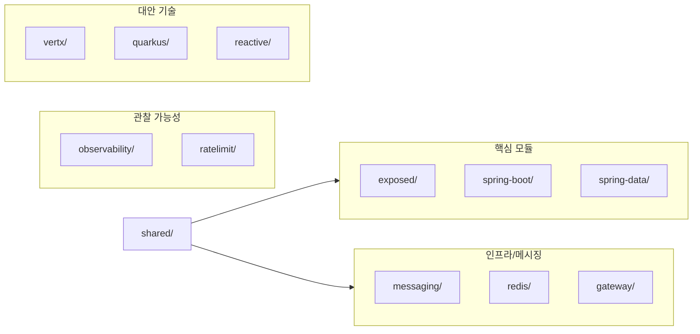

# bluetape4k-workshop

Bluetape4k 라이브러리를 활용한 백엔드 예제 모음입니다.

## 기술 스택

| 항목          | 버전               |
|-------------|------------------|
| Kotlin      | 2.3.20           |
| Java        | 25               |
| Spring Boot | 4.0.3            |
| bluetape4k  | 1.5.0-SNAPSHOT   |
| Gradle      | Kotlin DSL, 멀티모듈 |

## 빌드

```bash
./gradlew build                          # 전체 빌드
./gradlew :exposed-domain:build          # 특정 모듈 빌드
./gradlew :exposed-domain:test           # 특정 모듈 테스트
./gradlew detekt                         # 정적 분석
```

## 전체 모듈 구성



## 모듈 구조

| 디렉토리               | 내용                                                |
|--------------------|---------------------------------------------------|
| `aws/`             | S3 Spring Cloud 연동                                |
| `exposed/`         | JetBrains Exposed ORM (DAO/SQL DSL, 연관관계, 커스텀 컬럼) |
| `gateway/`         | API Gateway + Customers/Orders 마이크로서비스            |
| `gatling/`         | Gatling 성능 테스트                                    |
| `io/`              | Okio 예제                                           |
| `json/`            | Jackson, JsonView 예제                              |
| `kotlin/`          | 코루틴, 디자인 패턴, 워크숍                                  |
| `mapping/`         | MapStruct 매핑                                      |
| `messaging/`       | Kafka, Kafka Reply                                |
| `observability/`   | Micrometer Observation/Tracing                    |
| `quarkus/`         | Hibernate Reactive Panache, REST 코루틴 *(빌드 비활성)*   |
| `ratelimit/`       | Bucket4j Rate Limiting (Caffeine, Redis, WebFlux) |
| `reactive/`        | Mutiny 리액티브 스트림                                   |
| `redis/`           | Redisson, 클러스터                                    |
| `spring-boot/`     | WebFlux, Cache, Resilience4j 등 Spring Boot 기능 예제  |
| `spring-cloud/`    | Gateway *(빌드 비활성 — Spring Boot 4 호환 대기)*          |
| `spring-data/`     | R2DBC, JPA/QueryDSL, MongoDB, Elasticsearch       |
| `spring-modulith/` | Events, JPA 데모                                    |
| `spring-security/` | MVC/WebFlux 보안 예제                                 |
| `vertx/`           | Vert.x 코루틴, SQL Client, WebClient                 |
| `virtualthreads/`  | Virtual Threads + MVC/WebFlux                     |
| `shared/`          | 테스트 공통 유틸리티                                       |

## 테스트

- JUnit 5 + Kluent + MockK
- Testcontainers (MariaDB, MySQL, PostgreSQL, CockroachDB)
- JVM: ZGC, `-Xms2G -Xmx4G`, `--enable-preview`
