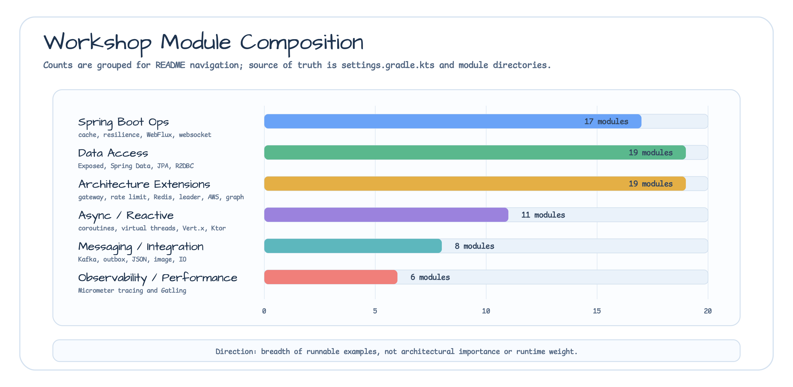
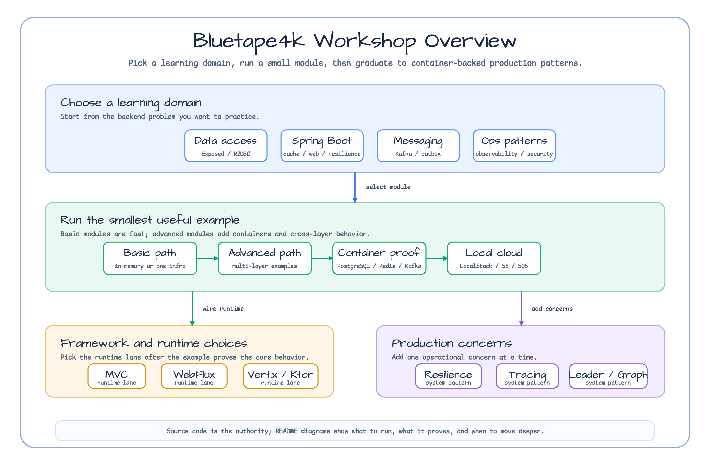

# bluetape4k-workshop

[](https://kotlinlang.org)
[](https://openjdk.org)
[](https://spring.io/projects/spring-boot)
[](https://github.com/bluetape4k)
[](LICENSE)

[한국어](README.ko.md) | English

This repository is a runnable backend workshop for learning how [bluetape4k](https://github.com/bluetape4k)
libraries behave in practical Spring Boot 4, Exposed, Redis, Kafka, observability,
virtual-thread, Vert.x, and cloud-native workloads.






---

## Getting Started

```bash
# Build everything
./gradlew build

# Build and test a single module
./gradlew :exposed-mvc-jdbc:build
./gradlew :exposed-mvc-jdbc:test

# Static analysis
./gradlew detekt
```

**Requirements**: JDK 21+, Docker (Testcontainers)

Use this repository as a runnable cookbook:

1. Pick the domain closest to your current backend problem.
2. Run one focused module test before building the whole repository.
3. Move from Basic modules to Advanced modules when you need Testcontainers or cross-layer behavior.
4. Read the module README beside the source; source code is the final contract.

When you are deciding where to start, read the module map first and choose a domain
path where **Basic** modules are enough for exploration, then switch to
**Advanced** examples when distributed/integration behavior becomes your target.

---

## Domain Catalog

Modules are organized into eight learning domains.
Each domain lists **Basic** (self-contained, minimal infra) and **Advanced** (multi-layer, Testcontainers) modules.


### 1. Data Access

> Exposed ORM, R2DBC, JPA/QueryDSL, MongoDB, Elasticsearch, Redis

| Level | Module | bluetape4k libs | Infra | Learning outcome |
|-------|--------|-----------------|-------|-----------------|
| Basic | [`exposed-mvc-jdbc`](exposed/mvc-jdbc/) | `logging`, `junit5`, `testcontainers` | PostgreSQL (TC) | Exposed DAO/SQL DSL with Spring MVC JDBC |
| Basic | [`exposed-webflux-r2dbc`](exposed/webflux-r2dbc/) | `logging`, `coroutines`, `testcontainers` | PostgreSQL (TC) | Exposed R2DBC + WebFlux coroutine handlers |
| Advanced | [`exposed-mvc-virtualthread`](exposed/mvc-virtualthread/) | `logging`, `coroutines`, `testcontainers` | PostgreSQL (TC) | Exposed JDBC with Spring MVC virtual threads |
| Basic | [`exposed-javers-approval-workflow`](exposed/javers-approval-workflow/) | `javers-core` | H2 | JaVers pre-commit diff review with approval/rejection decisions |
| Advanced | [`exposed-javers-persistence-audit`](exposed/javers-persistence-audit/) | `javers-core`, `javers-persistence-redis`, `testcontainers` | Redis (TC) + H2 | Redis-backed JaVers audit history with Exposed current-row persistence |
| Advanced | [`ktor-exposed-rest`](ktor/exposed-rest/) | `ktor-core`, `exposed-ktor`, `exposed-jdbc`, `testcontainers` | PostgreSQL (TC) | Ktor routes with Exposed JDBC transactions and safe database error mapping |
| Basic | [`spring-data-r2dbc-coroutines`](spring-data/r2dbc-coroutines/) | `coroutines`, `testcontainers` | PostgreSQL (TC) | R2DBC repositories with coroutines |
| Basic | [`spring-data-r2dbc-examples`](spring-data/r2dbc-examples/) | `coroutines`, `testcontainers` | PostgreSQL (TC) | R2DBC raw examples and DSL |
| Advanced | [`spring-data-r2dbc-webflux`](spring-data/r2dbc-webflux/) | `coroutines`, `testcontainers` | PostgreSQL (TC) | R2DBC + WebFlux REST API |
| Advanced | [`spring-data-r2dbc-webflux-exposed`](spring-data/r2dbc-webflux-exposed/) | `logging`, `coroutines`, `testcontainers` | PostgreSQL (TC) | R2DBC + WebFlux + Exposed combined |
| Basic | [`spring-data-jpa-querydsl`](spring-data/jpa-querydsl/) | `logging`, `junit5`, `testcontainers` | PostgreSQL (TC) | JPA + QueryDSL type-safe queries |
| Basic | [`spring-data-mongodb-coroutines`](spring-data/mongodb-coroutines/) | `coroutines`, `testcontainers` | MongoDB (TC) | MongoDB reactive repositories with coroutines |
| Advanced | [`spring-data-mongodb-transactions`](spring-data/mongodb-transactions/) | `coroutines`, `testcontainers` | MongoDB (TC) | MongoDB multi-document transactions |
| Basic | [`spring-data-elasticsearch`](spring-data/elasticsearch/) | `logging`, `testcontainers` | Elasticsearch (TC) | Spring Data Elasticsearch blocking |
| Advanced | [`spring-data-elasticsearch-webflux`](spring-data/elasticsearch-webflux/) | `coroutines`, `testcontainers` | Elasticsearch (TC) | Elasticsearch + WebFlux reactive |
| Basic | [`spring-data-redis-examples`](spring-data/redis-examples/) | `redis`, `testcontainers` | Redis (TC) | Spring Data Redis and RedisTemplate |

```bash
./gradlew :exposed-mvc-jdbc:test
./gradlew :ktor-exposed-rest:test --max-workers=1
./gradlew :spring-data-r2dbc-coroutines:test
```

---

### 2. Spring Boot Operations

> Caching, resilience, WebFlux, WebSocket, CBOR, Protobuf, chaos engineering

| Level | Module | bluetape4k libs | Infra | Learning outcome |
|-------|--------|-----------------|-------|-----------------|
| Basic | [`spring-boot-cache-caffeine`](spring-boot/cache-caffeine/) | `logging`, `junit5` | In-memory | Caffeine cache with Spring Cache abstraction |
| Basic | [`spring-boot-cache-redis`](spring-boot/cache-redis/) | `redis`, `testcontainers` | Redis (TC) | Redis-backed Spring Cache + TTL config |
| Basic | [`spring-boot-webflux-coroutines`](spring-boot/webflux-coroutines/) | `coroutines`, `spring-boot4-core` | In-memory | WebFlux coroutine handlers, suspend controllers |
| Advanced | [`spring-boot-resilience4j-coroutines`](spring-boot/resilience4j-coroutines/) | `resilience4j`, `coroutines` | In-memory | Circuit breaker + retry + rate limiter with coroutines |
| Basic | [`spring-boot-cbor-mvc`](spring-boot/cbor-mvc/) | `logging` | In-memory | CBOR binary serialization in Spring MVC |
| Basic | [`spring-boot-protobuf-mvc`](spring-boot/protobuf-mvc/) | `logging` | In-memory | Protobuf serialization in Spring MVC |
| Basic | [`spring-boot-text-moderation-api`](spring-boot/text-moderation-api/) | `text-search`, `lingua`, `logging` | In-memory | Web-safety text moderation API with deterministic language detection and masking |
| Advanced | [`spring-boot-stomp-websocket`](spring-boot/stomp-websocket/) | `coroutines` | In-memory | STOMP WebSocket with coroutine message handlers |
| Advanced | [`spring-boot-webflux-websocket`](spring-boot/webflux-websocket/) | `coroutines` | In-memory | WebFlux reactive WebSocket |
| Advanced | [`spring-boot-chaos-monkey`](spring-boot/chaos-monkey/) | `logging` | In-memory | Chaos Monkey for Spring Boot — latency/exception injection |
| Basic | [`spring-boot-problem`](spring-boot/problem/) | `logging` | In-memory | RFC 9457 Problem Details error responses |
| Advanced | [`spring-boot-application-event-demo`](spring-boot/application-event-demo/) | `coroutines` | In-memory | Spring application events with coroutine listeners |
| Advanced | [`spring-boot-multi-tenant-data-isolation`](spring-boot/multi-tenant-data-isolation/) | `exposed-jdbc`, `spring-boot4-core`, `micrometer` | H2 | Tenant-scoped repository, cache key, lock key, rate-limit, and metrics isolation |

```bash
./gradlew :spring-boot-cache-redis:test
./gradlew :spring-boot-resilience4j-coroutines:test
./gradlew :spring-boot-multi-tenant-data-isolation:test
```

---

### 3. Serialization & Messaging

> Jackson 3, JsonView, Kafka, Kafka Reply, Outbox fallback

| Level | Module | bluetape4k libs | Infra | Learning outcome |
|-------|--------|-----------------|-------|-----------------|
| Basic | [`jackson-examples`](json/jackson-examples/) | `jackson3`, `logging` | In-memory | Jackson 3 datatype, polymorphism, custom serializers |
| Basic | [`jsonview-examples`](json/jsonview-examples/) | `jackson3` | In-memory | `@JsonView` for selective field projection |
| Basic | [`messaging-kafka`](messaging/kafka/) | `jackson3`, `coroutines`, `testcontainers` | Kafka (TC) | Kafka producer/consumer with coroutines |
| Advanced | [`messaging-kafka-reply`](messaging/kafka-reply/) | `jackson3`, `coroutines`, `testcontainers` | Kafka (TC) | Kafka request-reply pattern with `ReplyingKafkaTemplate` |
| Advanced | [`messaging-kafka-outbox-fallback`](messaging/kafka-outbox-fallback/) | `jackson3`, `exposed-jdbc`, `testcontainers`, `micrometer` | PostgreSQL + Kafka (TC) | Kafka-first publication with durable outbox fallback and relay/reconciler recovery |

```bash
./gradlew :jackson-examples:test
./gradlew :messaging-kafka:test
./gradlew :messaging-kafka-outbox-fallback:test --max-workers=1
```

---

### 4. Async & Reactive

> Kotlin coroutines, virtual threads, Vert.x

| Level | Module | bluetape4k libs | Infra | Learning outcome |
|-------|--------|-----------------|-------|-----------------|
| Basic | [`coroutines`](kotlin/coroutines/) | `coroutines`, `junit5` | In-memory | Coroutine builders, Flow, channels, structured concurrency |
| Basic | [`design-patterns`](kotlin/design-patterns/) | `logging`, `coroutines` | In-memory | Async design patterns in Kotlin |
| Basic | [`flow-extensions-parallel-enrichment`](kotlin/flow-extensions-parallel-enrichment/) | `coroutines`, `junit5` | In-memory | Parallel flow enrichment for customer profile, inventory, and promotion lookups |
| Basic | [`flow-extensions-subject-bridge`](kotlin/flow-extensions-subject-bridge/) | `coroutines`, `junit5` | In-memory | Callback-to-Flow bridge semantics with bluetape4k Subject types |
| Advanced | [`flow-extensions-race-fallback`](kotlin/flow-extensions-race-fallback/) | `coroutines`, `junit5` | In-memory | Race, fallback, eager concat, merge, and materialized error semantics for multi-source Flow reads |
| Basic | [`flow-extensions-search-pipeline`](kotlin/flow-extensions-search-pipeline/) | `coroutines`, `junit5` | In-memory | Realtime search pipeline with debounce, latest settings, stale-search cancellation, session stop, and redacted Flow logging |
| Basic | [`flow-extensions-event-aggregation`](kotlin/flow-extensions-event-aggregation/) | `coroutines`, `junit5` | In-memory | Event aggregation with chunked windows, finite grouping, read-model projection, lifecycle transitions, and sanitized audit logging |
| Basic | [`flow-extensions-metrics-sampling`](kotlin/flow-extensions-metrics-sampling/) | `coroutines`, `junit5` | In-memory | Metrics sampling with leading previews, trailing dashboard values, adjacent deltas, lifecycle stop, and cancellation-safe result mapping |
| Basic | [`virtualthreads-rules`](virtualthreads/rules/) | `logging` | In-memory | Virtual thread pinning, synchronized avoidance |
| Advanced | [`virtualthreads-spring-mvc-tomcat`](virtualthreads/spring-mvc-tomcat/) | `logging`, `testcontainers` | PostgreSQL (TC) | Spring MVC with virtual thread executor |
| Advanced | [`virtualthreads-spring-webflux`](virtualthreads/spring-webflux/) | `coroutines`, `testcontainers` | PostgreSQL (TC) | WebFlux with virtual thread dispatcher |
| Basic | [`vertx-coroutines`](vertx/coroutines/) | `coroutines` | In-memory | Vert.x coroutine adapters |
| Advanced | [`vertx-sqlclient`](vertx/vertx-sqlclient/) | `coroutines`, `testcontainers` | PostgreSQL (TC) | Vert.x Reactive SQL Client + coroutines |
| Advanced | [`vertx-webclient`](vertx/vertx-webclient/) | `coroutines` | WireMock | Vert.x WebClient with coroutines |

```bash
./gradlew :coroutines:test
./gradlew :virtualthreads-spring-mvc-tomcat:test
```

---

### 5. Observability & Performance

> Micrometer Observation/Tracing, Gatling load tests

| Level | Module | bluetape4k libs | Infra | Learning outcome |
|-------|--------|-----------------|-------|-----------------|
| Basic | [`observability-basic`](observability/observability-basic/) | `micrometer`, `coroutines`, `jackson3` | MockWebServer | Coroutine span propagation, `TestObservationRegistry` |
| Advanced | [`observability-advanced`](observability/observability-advanced/) | `micrometer`, `coroutines`, `testcontainers` | PostgreSQL + Redis (TC) | End-to-end tracing across HTTP, DB, and Redis layers |
| Basic | [`micrometer-observation`](observability/micrometer-observation/) | `micrometer`, `logging` | In-memory | Micrometer Observation API basics |
| Advanced | [`micrometer-tracing-coroutines`](observability/micrometer-tracing-coroutines/) | `micrometer`, `coroutines` | In-memory | Distributed tracing context through coroutine boundaries |
| Advanced | [`gatling-virtualthread-simulation`](gatling/virtualthread-simulation/) | `junit5` | App process | Gatling load simulation targeting virtual thread server |

```bash
./gradlew :observability-basic:test
./gradlew :gatling-virtualthread-simulation:gatlingRun
```

---

### 6. Graph

> TinkerGraph examples, graph traversal, and graph-io import/export

| Level | Module | bluetape4k libs | Infra | Learning outcome |
|-------|--------|-----------------|-------|-----------------|
| Basic | [`graph-io-pipeline`](graph/io-pipeline/) | `graph-core`, `graph-tinkerpop`, `graph-io-csv`, `graph-io-jackson3`, `graph-io-graphml` | In-memory | CSV fixture import, Jackson3 NDJSON export/import, GraphML export/import, and graph-io report checks |
| Basic | [`graph-social-network`](graph/social-network/) | `graph-core`, `graph-tinkerpop` | In-memory | Social graph modeling and traversal |
| Basic | [`graph-knowledge-graph`](graph/knowledge-graph/) | `graph-core`, `graph-tinkerpop`, Neo4j/Memgraph adapters | In-memory + Testcontainers | Heterogeneous knowledge graph model and traversal |
| Advanced | [`graph-abuser-detection`](graph/abuser-detection/) | `graph-core`, `graph-tinkerpop` | In-memory | Fraud/abuse relationship analysis |
| Advanced | [`graph-event-lineage`](graph/event-lineage/) | `graph-core`, `graph-tinkerpop`, `graph-neo4j`, `testcontainers` | TinkerGraph + Neo4j Testcontainer | Event lineage graph modeling, impact traversal, and audit trail assembly |
| Advanced | [`graph-recommendation`](graph/recommendation/) | `graph-core`, `graph-tinkerpop` | In-memory | Explainable recommendation graph traversal |

```bash
./gradlew :graph-io-pipeline:test
./gradlew :graph-event-lineage:test
./gradlew :graph-social-network:test
```

---

### 7. Architecture Extensions

> API Gateway, Spring Modulith, Security, Redis distributed patterns, AWS, Rate Limiting, Leader Election

| Level | Module | bluetape4k libs | Infra | Learning outcome |
|-------|--------|-----------------|-------|-----------------|
| Basic | [`spring-security-mvc`](spring-security/mvc/) | `logging`, `spring-boot4-core` | In-memory | Spring Security MVC: JWT, method security |
| Basic | [`spring-security-webflux`](spring-security/webflux/) | `coroutines`, `spring-boot4-core` | In-memory | Spring Security WebFlux: reactive filter chain |
| Basic | [`kotlin-text-processing`](kotlin/text-processing/) | `text-search`, `lingua`, `text-korean`, `text-japanese`, `coroutines` | In-memory | Multilingual text normalization, language detection, sync/coroutine search indexing, and source-span highlighting |
| Basic | [`spring-modulith-module-boundaries`](spring-modulith/module-boundaries/) | Spring Modulith | In-memory | Module-boundary verification with named interfaces and event contracts |
| Advanced | [`spring-modulith-events-deep-dive`](spring-modulith/events-deep-dive/) | `coroutines`, `testcontainers` | PostgreSQL (TC) | Modulith application events with persistence |
| Advanced | [`spring-modulith-jpa-demo`](spring-modulith/jpa-demo/) | `logging`, `testcontainers` | PostgreSQL (TC) | Modulith module encapsulation with JPA |
| Advanced | [`gateway-api-gateway`](gateway/api-gateway/) | `logging` | Services running | Spring Cloud Gateway routing, filters, predicates |
| Basic | [`ratelimit-bucket4j-caffeine-web`](ratelimit/bucket4j-caffeine-web/) | `logging` | In-memory | Bucket4j rate limiting with Caffeine |
| Advanced | [`ratelimit-bucket4j-redis`](ratelimit/bucket4j-redis/) | `redis`, `testcontainers` | Redis (TC) | Distributed rate limiting via Bucket4j + Redis |
| Advanced | [`ratelimit-bucker4j-bluetape4k-webflux`](ratelimit/bucker4j-bluetape4k-webflux/) | `redis`, `coroutines`, `testcontainers` | Redis (TC) | bluetape4k WebFlux rate limit integration |
| Advanced | [`redis-distributed-lock`](redis/distributed-lock/) | `redis`, `redisson`, `coroutines` | Redis (TC) | Distributed lock with Redisson + coroutine suspend |
| Advanced | [`redis-cluster-demo`](redis/cluster-demo/) | `redis`, `redisson` | Redis Cluster (TC) | Redis Cluster topology and failover |
| Basic | [`redis-redisson-examples`](redis/redisson-examples/) | `redis`, `redisson` | Redis (TC) | Redisson data structures and pub/sub |
| Advanced | [`aws-s3-spring-cloud`](aws/s3-spring-cloud/) | `aws`, `testcontainers` | LocalStack (TC) | AWS S3 with Spring Cloud AWS + LocalStack |
| Advanced | [`aws-ktor-dynamodb`](aws/ktor-dynamodb/) | `aws`, `ktor`, `coroutines`, `testcontainers` | Floci/LocalStack (TC) | Ktor REST + DynamoDB conditional writes with fail-closed local mode |
| Advanced | [`aws-eventbridge-scheduler`](aws/eventbridge-scheduler/) | `aws`, `coroutines` | Local adapters | EventBridge event envelope plus delayed Scheduler request mapping |
| Advanced | [`aws-cloudwatch-imds-observability`](aws/cloudwatch-imds-observability/) | `aws`, `micrometer`, `coroutines` | Local adapters | CloudWatch metric/log publish intent, Micrometer snapshots, and explicit IMDS metadata opt-in |
| Advanced | [`aws-sqs-sns-coroutines`](aws/sqs-sns-coroutines/) | `aws`, `micrometer`, `coroutines`, `testcontainers` | Local adapters + Floci | SNS publish plus SQS consume with ack, retry, dead-letter reports, and cancellation-safe coroutines |
| Advanced | [`aws-storage-abstraction`](aws/storage-abstraction/) | `aws`, `coroutines`, `testcontainers` | Local files + Floci | StorageService boundary with guarded object keys, S3 object URIs, and pre-signed GET URLs |
| Advanced | [`aws-s3-vectors-access-grants`](aws/s3-vectors-access-grants/) | `aws`, `coroutines` | Local adapters | S3 Vectors upsert/query plus S3 Access Grants read-decision boundary |
| Advanced | [`image-processing-advanced-workflow`](image-processing/advanced-workflow/) | `images-vips-java25`, `images-spring-boot`, `micrometer` | S3 or local storage | Upload → original storage → WebP variants → unsigned public URLs |
| Advanced | [`image-processing-profile-image-moderation`](image-processing/profile-image-moderation/) | `images-spring-boot`, `coroutines`, `micrometer` | Local storage / S3-compatible | Profile upload → private original → blurred pending URL → moderation approval/default fallback |
| Advanced | [`image-processing-ocr-api`](image-processing/ocr-api/) | `images-ocr`, `images`, `spring-boot4-core` | In-memory | Multipart OCR API with validated fallback and optional Tesseract |
| Advanced | [`leader-leader-election`](leader/) | `coroutines`, `redis`, `testcontainers` | Redis (TC) | Distributed leader election: blocking, coroutine, virtual thread |
| Advanced | [`leader-backend-comparison-lab`](leader/backend-comparison-lab/) | `leader-core`, `spring-boot4-core` | In-memory | Redis vs ZooKeeper vs Kubernetes Lease backend choice and failover lab |
| Advanced | [`leader-k8s-lease-micrometer`](leader/k8s-lease-micrometer/) | `leader-k8s`, `micrometer`, `spring-boot4-core` | Kubernetes Lease (opt-in) | Kubernetes Lease leader election with Micrometer metrics |
| Advanced | [`leader-tenant-scheduler`](leader/tenant-scheduler/) | `leader-core`, `spring-boot4-core` | In-memory | Tenant-scoped leader scheduling with fair ticks, stale handoff, and bounded tenant metrics |

```bash
./gradlew :spring-security-mvc:test
./gradlew :redis-distributed-lock:test
./gradlew :aws-s3-spring-cloud:test
./gradlew :aws-ktor-dynamodb:test --max-workers=1
./gradlew :aws-eventbridge-scheduler:test
./gradlew :aws-cloudwatch-imds-observability:test
./gradlew :aws-sqs-sns-coroutines:test
./gradlew :aws-storage-abstraction:test
./gradlew :aws-s3-vectors-access-grants:test
./gradlew :image-processing-profile-image-moderation:test
./gradlew :leader-backend-comparison-lab:test
./gradlew :leader-tenant-scheduler:test
```

---

### 8. Optimization Contracts

> Provider-neutral planning, PostgreSQL convergence, Java 25 virtual threads

| Level | Module | bluetape4k libs | Infra | Learning outcome |
|-------|--------|-----------------|-------|-----------------|
| Advanced | [`optimization-planning-contracts`](optimization/planning-contracts/) | `exposed-jdbc`, `exposed-jdbc-tests`, `virtualthread-api`, `virtualthread-jdk25`, `http`, `testcontainers` | PostgreSQL + WireMock (TC) | Request/outbox atomicity, callback idempotency, stale-result audit, and final aggregate-version revalidation |

```bash
./gradlew :optimization-planning-contracts:test --max-workers=1
```

All modules below `optimization/` use Java 25. Other workshop modules retain
the Java 21 toolchain.

---

## Tech Stack

| Item | Version |
|------|---------|
| Kotlin | 2.4.0 |
| JVM | 21; Java 25 for `optimization/*` |
| Spring Boot | 4.1.0 |
| bluetape4k | 1.7.0 |
| Gradle | 8.x (Kotlin DSL, multi-module) |

---

## Project Structure

```
bluetape4k-workshop/
├── aws/                    # AWS SDK + Spring Cloud AWS
├── exposed/                # JetBrains Exposed ORM
├── gateway/                # API Gateway + microservices
├── gatling/                # Load/performance tests
├── graph/                  # TinkerGraph, traversal, graph-io examples
├── image-processing/       # Image upload, moderation, VIPS derivatives, OCR API
├── io/                     # Okio I/O examples
├── json/                   # Jackson 3 serialization
├── kotlin/                 # Coroutines, design patterns
├── leader/                 # Distributed leader election
├── messaging/              # Kafka
├── observability/          # Micrometer Observation + Tracing
├── optimization/           # Java 25 planning/optimization contracts
├── ratelimit/              # Bucket4j rate limiting
├── redis/                  # Redisson + Redis patterns
├── spring-boot/            # Spring Boot features
├── spring-data/            # JPA, R2DBC, MongoDB, Elasticsearch
├── spring-modulith/        # Spring Modulith events
├── spring-security/        # MVC/WebFlux security
├── vertx/                  # Vert.x + coroutines
├── virtualthreads/         # Virtual thread patterns
├── shared/                 # Shared test utilities
└── docs/
    ├── assets/             # Diagrams, images (see CONVENTIONS.md)
    ├── lessons/            # Engineering lessons learned
    └── governance/         # Project governance docs
```

---

## Contributing

See [AGENTS.md](AGENTS.md) for AI-agent guidance and the engineering workflow.
For human contributors, open an issue or draft PR — all feedback is welcome.

---

## License

[MIT](LICENSE) © bluetape4k contributors
