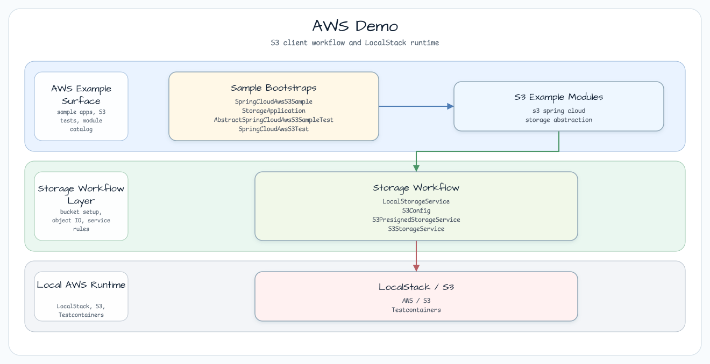

# AWS Workshop

[English](README.md) | 한국어

AWS 워크숍은 S3 storage, DynamoDB persistence, vector search, access decision,
observability를 로컬에서 먼저 검증할 수 있는 예제로 구성됩니다. Spring Cloud AWS와
`S3Template` 흐름을 작게 실행해 보고 싶다면 `s3-spring-cloud/`를 사용합니다. 로컬
파일, S3, pre-signed S3 URL 사이를 Spring profile로 전환하는 서비스 경계를 보고
싶다면 `storage-abstraction/`을 사용합니다. Ktor route, DynamoDB table bootstrap,
conditional write, optimistic update를 로컬 AWS 에뮬레이터로 확인하고 싶다면
`ktor-dynamodb/`를 사용합니다. S3 Vectors upsert/query와 S3 Access Grants read
decision을 분리해서 보고 싶다면 `s3-vectors-access-grants/`를 사용합니다. 실제 AWS
자격 증명 없이 CloudWatch metrics, CloudWatch Logs, Micrometer publishing, 명시적
IMDS 경계를 배우고 싶다면 `cloudwatch-imds-observability/`를 사용합니다.

## 아키텍처



모든 모듈은 기본 학습 경로를 local-first로 유지합니다. S3와 DynamoDB 모듈은 로컬 AWS
호환 인프라를 사용하고, S3 Vectors/Access Grants와 CloudWatch/IMDS 모듈은 local
adapter bean을 사용하므로 기본 테스트는 실제 AWS 서비스나 IMDS를 호출하지 않습니다.

## 모듈 가이드

| module | Gradle task path | use it for |
| --- | --- | --- |
| `s3-spring-cloud/` | `:aws-s3-spring-cloud` | Spring Cloud AWS `S3Template`, AWS SDK v2 `S3Client`, 버킷 생성, 객체 업로드, 객체 목록 조회, `ResourceLoader` 접근을 확인합니다. |
| `storage-abstraction/` | `:aws-storage-abstraction` | `local`, `s3`, `s3-presigned` profile을 가진 `StorageService`, coroutine 친화적인 blocking I/O 경계, pre-signed URL 동작을 확인합니다. |
| `ktor-dynamodb/` | `:aws-ktor-dynamodb` | Ktor REST route, `DynamoDbKtorPlugin` table bootstrap, conditional write, optimistic version update, local emulator readiness check를 확인합니다. |
| `cloudwatch-imds-observability/` | `:aws-cloudwatch-imds-observability` | CloudWatch metric/log publish intent, Micrometer meter publishing, failure isolation, 명시적 IMDS metadata opt-in을 실제 자격 증명 없이 확인합니다. |
| `s3-vectors-access-grants/` | `:aws-s3-vectors-access-grants` | S3 Vectors 문서 upsert/query 경계, deterministic local vector ranking, redacted S3 Access Grants read-decision report를 확인합니다. |

## 런타임 모델

| concern | implementation |
| --- | --- |
| AWS endpoint | 에뮬레이터 기반 모듈에서는 샘플 또는 테스트가 `bluetape4k-testcontainers`의 로컬 AWS 호환 에뮬레이터를 시작합니다. |
| Credentials | 에뮬레이터가 제공하는 정적 로컬 자격 증명을 사용하며, 로컬 검증에는 실제 AWS 자격 증명이 필요하지 않습니다. |
| S3 client | AWS SDK v2 `S3Client`를 사용합니다. storage abstraction 모듈은 blocking 호출을 `Dispatchers.IO`로 감쌉니다. |
| DynamoDB client | `ktor-dynamodb/`에서 `DynamoDbKtorPlugin`을 통해 AWS Kotlin SDK `DynamoDbClient`를 설치합니다. |
| Spring integration | `s3-spring-cloud/`는 Spring Cloud AWS `S3Template`과 `ResourceLoader`를, `storage-abstraction/`은 Spring profile을 사용합니다. |
| Vector and access boundaries | `s3-vectors-access-grants/`는 기본적으로 bluetape4k `S3VectorsOperations`와 `S3AccessGrantsOperations` local adapter를 사용합니다. |
| Observability | `cloudwatch-imds-observability/`는 기본적으로 로컬 CloudWatch intent를 publish하고, 명시적으로 요청한 경우에만 IMDS metadata를 읽습니다. |

## 실행

```bash
./gradlew :aws-s3-spring-cloud:test
./gradlew :aws-storage-abstraction:test
./gradlew :aws-ktor-dynamodb:test --max-workers=1
./gradlew :aws-cloudwatch-imds-observability:test
./gradlew :aws-s3-vectors-access-grants:test
```

backend별 동작을 비교하려면 profile 기반 storage 샘플을 직접 실행합니다.

```bash
./gradlew :aws-storage-abstraction:bootRun --args='--spring.profiles.active=local'
./gradlew :aws-storage-abstraction:bootRun --args='--spring.profiles.active=s3'
./gradlew :aws-storage-abstraction:bootRun --args='--spring.profiles.active=s3-presigned'
./gradlew :aws-ktor-dynamodb:run \
  -Dbluetape4k.aws.mode=local \
  -Dbluetape4k.aws.dynamodb.endpoint-url=http://localhost:4566 \
  -Dbluetape4k.aws.access-key-id=test \
  -Dbluetape4k.aws.secret-access-key=test
./gradlew :aws-cloudwatch-imds-observability:bootRun
./gradlew :aws-s3-vectors-access-grants:bootRun
```

## 전제 조건

| item | requirement |
| --- | --- |
| JDK | Java 21 이상. |
| Docker | 에뮬레이터 기반 테스트와 S3 샘플 실행에 필요합니다. |
| AWS account | 로컬 워크숍 경로에는 필요하지 않습니다. 실제 CloudWatch/IMDS와 S3 Vectors/Access Grants 동작은 수동 opt-in입니다. |
