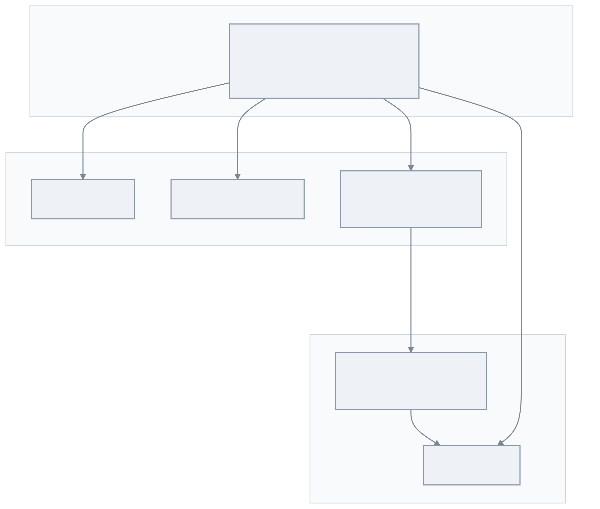

# AWS Demo

[한국어](README.ko.md) | English

## Example Scenario

This example exercises **AWS Demo** as a runnable AWS integration workshop slice. It focuses on the path a developer would inspect first: configure the module, run the sample or tests, and observe the library or framework APIs that remove repetitive infrastructure code.

## Architecture Diagram

The module is organized around the sample entry point or test fixture, the bluetape4k extension layer, and the runtime dependency used by the example. Keep the package under `io.bluetape4k.workshop.aws` as the source of truth when comparing this README with the code.


## Flow Diagram

1. Prepare the local runtime required by `AWS Demo`.
2. Execute the application, controller, service, or test fixture that owns the example scenario.
3. Delegate repetitive infrastructure work to bluetape4k utilities or Spring/Kotlin integrations.
4. Assert the visible result through the sample output, HTTP response, repository state, metric, trace, or test expectation.



## Sequence Diagram

The core sequence is: caller or test fixture -> workshop adapter -> bluetape4k helper/API -> external runtime or in-memory backend -> assertion/response. When this module has a dedicated sequence asset, the image below shows that interaction order; otherwise the source tests are the authoritative executable sequence.


AWS Java SDK V2 와 [Spring Cloud AWS](https://github.com/awspring/spring-cloud-aws) 를 사용한 예제를 제공합니다.


## 모듈 구조

| 모듈 | 디렉토리 | 설명 |
|------|----------|------|
| S3 Spring Cloud | `s3-spring-cloud/` | Spring Cloud AWS + AWS SDK v2 기반 S3 버킷 생성·파일 업로드·다운로드 예제 |

## 전제 조건

| 항목 | 설명 |
|------|------|
| Docker | Testcontainers가 LocalStack 컨테이너를 자동으로 기동하므로 Docker 데몬이 실행 중이어야 함 |
| AWS 자격증명 | 로컬 테스트는 LocalStack 에뮬레이터를 사용하므로 실제 AWS 자격증명 불필요 |
| Java 25 | `--enable-preview` 플래그 사용, Java 25 이상 필요 |
| Kotlin 2.x | 멀티플랫폼 호환 Kotlin 코루틴 기반 코드 포함 |

## 핵심 라이브러리

| 라이브러리 | 버전/역할 |
|-----------|----------|
| `software.amazon.awssdk:s3` | AWS SDK v2 — S3 저수준 API |
| `io.awspring.cloud:spring-cloud-aws-starter-s3` | Spring Cloud AWS — `S3Template` 고수준 추상화 |
| `io.bluetape4k:bluetape4k-testcontainers` | `LocalStackServer` — Testcontainers 기반 LocalStack 래퍼 |
| `io.bluetape4k:bluetape4k-aws` | `staticCredentialsProviderOf`, `createBucket` 등 bluetape4k AWS 확장 함수 |

## 빌드 및 테스트

```bash
# 전체 AWS 모듈 빌드
./gradlew :aws:s3-spring-cloud:build

# 테스트 실행 (Docker 필요)
./gradlew :aws:s3-spring-cloud:test
```
