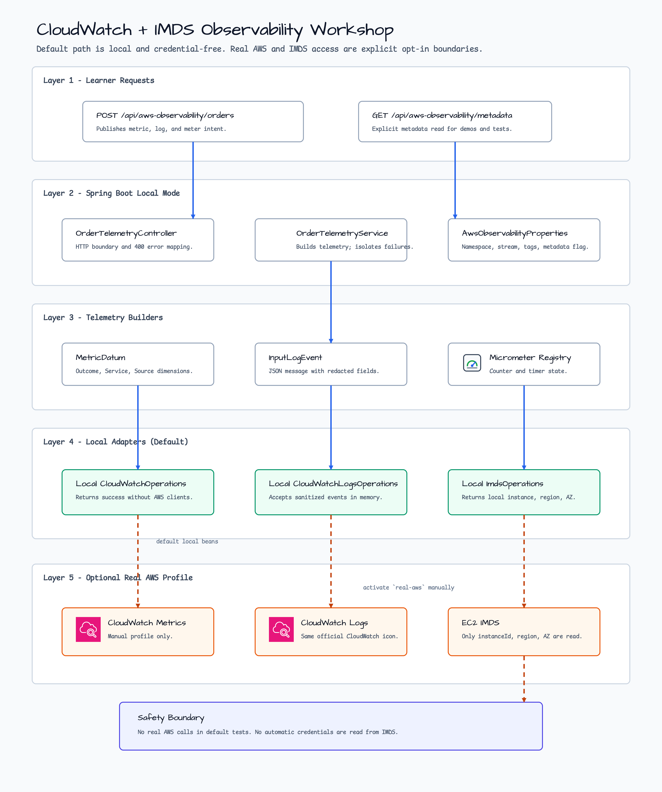
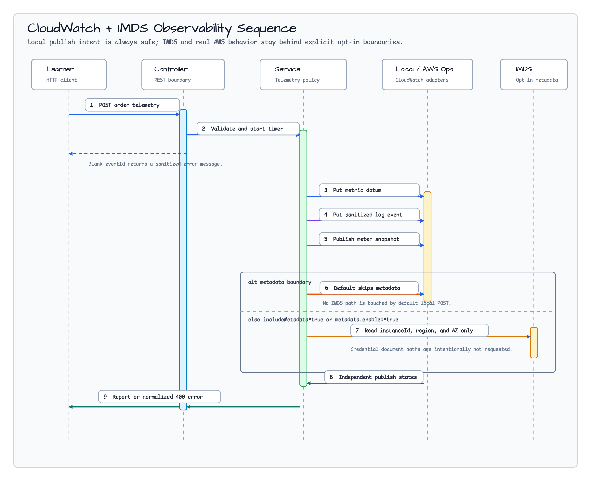

# CloudWatch + IMDS Observability Workshop

[한국어](README.ko.md) | English

This example teaches a safe observability boundary for AWS CloudWatch metrics,
CloudWatch Logs, Micrometer meter publishing, and EC2 Instance Metadata Service
(IMDS) reads. The default profile is local-first: it builds the same publish
requests the production path would use, but it does not create AWS clients, does
not require credentials, and does not call IMDS unless the request explicitly
asks for metadata.

## Architecture



The service layer owns the telemetry policy. It records a Micrometer counter and
timer, builds a CloudWatch `MetricDatum`, builds a sanitized CloudWatch Logs
`InputLogEvent`, and publishes a selected meter snapshot through the bluetape4k
CloudWatch publishing boundary. Local adapter beans return successful SDK
responses without contacting AWS.

## Request Flow



The `alt metadata boundary` is the important part of the flow. A normal order
telemetry request skips metadata lookup. Metadata is read only when
`includeMetadata=true` is sent in the request or the workshop property
`bluetape4k.workshop.aws.observability.metadata.enabled=true` is set.

## What You Learn

| Topic | Workshop behavior |
| --- | --- |
| CloudWatch metric intent | `OrderTelemetryOutcome` is published with `Outcome`, `Service`, and `Source` dimensions. |
| CloudWatch Logs intent | Log messages are serialized as small JSON objects and sensitive fields are redacted. |
| Micrometer bridge | The service records `workshop.aws.order.telemetry.requests` and publishes that meter snapshot. |
| Failure isolation | Metric, log, and meter publishing failures are reported independently. A log failure does not hide a metric success. |
| IMDS boundary | Only `instanceId`, `region`, and `availabilityZone` are read, and only after explicit opt-in. |
| Local safety | Default tests and smoke runs need no AWS account, no AWS credentials, and no real IMDS endpoint. |

## Run Locally

```bash
./gradlew :aws-cloudwatch-imds-observability:test
./gradlew :aws-cloudwatch-imds-observability:bootRun
```

Send a local telemetry request:

```bash
curl -s http://localhost:8080/api/aws-observability/orders \
  -H 'Content-Type: application/json' \
  -d '{
    "eventId": "order-1001",
    "outcome": "SUCCESS",
    "message": "accepted token=secret-value",
    "includeMetadata": false
  }' | jq
```

Expected local shape:

```json
{
  "outcome": "SUCCESS",
  "metric": { "state": "PUBLISHED", "message": "" },
  "logs": { "state": "PUBLISHED", "message": "" },
  "meterSnapshot": { "state": "PUBLISHED", "message": "" },
  "metadata": { "state": "SKIPPED", "message": "metadata lookup disabled" }
}
```

Request metadata explicitly:

```bash
curl -s http://localhost:8080/api/aws-observability/orders \
  -H 'Content-Type: application/json' \
  -d '{ "eventId": "order-1002", "includeMetadata": true }' | jq
```

The local profile returns deterministic demo metadata:

```json
{
  "metadata": {
    "state": "PUBLISHED",
    "instanceId": "local-instance",
    "region": "local-region",
    "availabilityZone": "local-zone"
  }
}
```

Validation failures are normalized so caller-supplied values are not echoed:

```bash
curl -s -i http://localhost:8080/api/aws-observability/orders \
  -H 'Content-Type: application/json' \
  -d '{ "eventId": "   " }'
```

```json
{ "error": "eventId must not be blank." }
```

## Configuration

Default `src/main/resources/application.yml` keeps bluetape4k AWS
auto-configuration disabled so the sample cannot resolve a region or credentials
from the host by accident:

```yaml
bluetape4k:
  aws:
    enabled: false
    cloudwatch:
      enabled: false
    cloudwatch-logs:
      enabled: false
    imds:
      enabled: false
  workshop:
    aws:
      observability:
        namespace: Bluetape4k/Workshop
        log-group-name: /bluetape4k/workshop/orders
        log-stream-name: local
        service-name: order-service
        source-name: workshop
        metadata:
          enabled: false
```

## Optional Real AWS Profile

Real AWS calls are intentionally outside the default path. Use them only in a
manual environment where cost, cleanup, IAM permissions, and region selection
are understood.

```bash
export AWS_REGION=ap-northeast-2
export AWS_PROFILE=your-profile

./gradlew :aws-cloudwatch-imds-observability:bootRun \
  --args='--spring.profiles.active=real-aws \
  --bluetape4k.aws.enabled=true \
  --bluetape4k.aws.cloudwatch.enabled=true \
  --bluetape4k.aws.cloudwatch-logs.enabled=true'
```

Enable IMDS only on an EC2 instance where metadata access is expected:

```bash
./gradlew :aws-cloudwatch-imds-observability:bootRun \
  --args='--spring.profiles.active=real-aws \
  --bluetape4k.aws.enabled=true \
  --bluetape4k.aws.imds.enabled=true \
  --bluetape4k.workshop.aws.observability.metadata.enabled=true'
```

This module does not use IMDS as an automatic credential source. IMDS is treated
as metadata only, and the service does not request security credential document
paths.

## Test Coverage

```bash
./gradlew :aws-cloudwatch-imds-observability:compileKotlin
./gradlew :aws-cloudwatch-imds-observability:compileTestKotlin
./gradlew :aws-cloudwatch-imds-observability:test
```

The tests verify the publish intent, tag and field mapping, redaction, partial
failure behavior, cancellation propagation, and the explicit IMDS opt-in
boundary without real AWS credentials.
