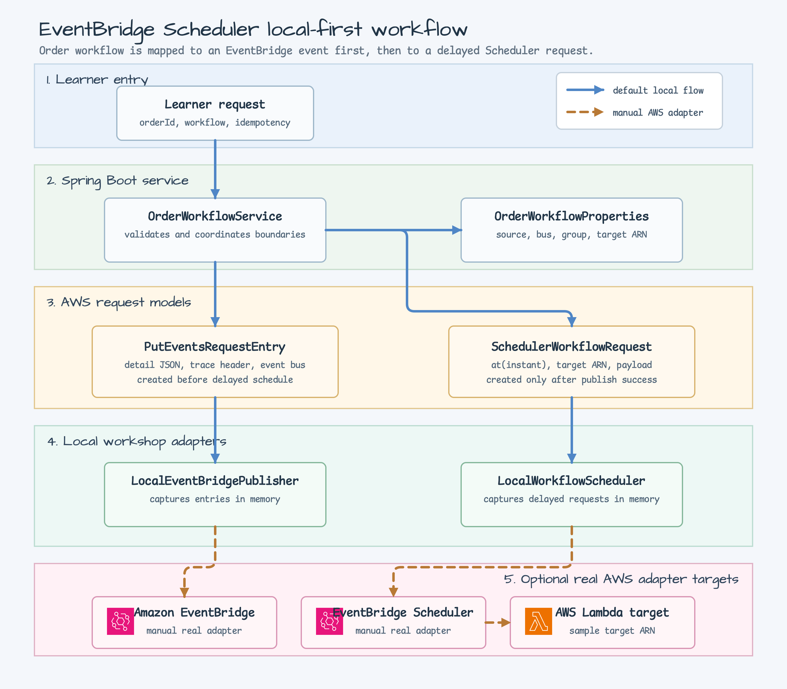
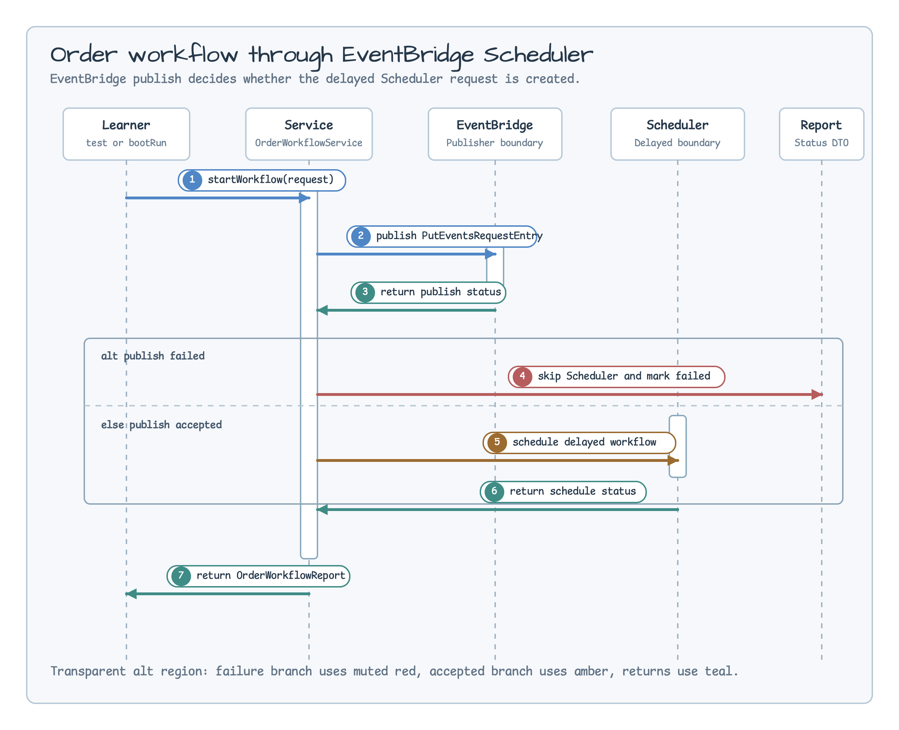

# AWS EventBridge Scheduler Workshop

[English](README.md) | 한국어

이 모듈은 주문 workflow를 두 AWS integration 경계로 매핑하는 방법을 보여 줍니다.
하나는 Amazon EventBridge event envelope이고, 다른 하나는 지연 실행을 표현하는
EventBridge Scheduler request입니다. 기본 구현은 local-first이므로 테스트와 예제 실행에
AWS 자격 증명이 필요하지 않습니다.

## 아키텍처



예제는 워크숍 경계를 명확히 드러내는 데 초점을 둡니다. `OrderWorkflowService`는 학습자
요청을 검증하고 AWS SDK v2 `PutEventsRequestEntry`를 만든 뒤, EventBridge publish 경계가
성공했을 때만 Scheduler request를 생성합니다. 로컬 adapter는 두 요청을 메모리에
캡처합니다. 이후 실제 AWS client를 붙일 때도 이 boundary 뒤에 adapter만 추가하면 됩니다.

## 시퀀스



시퀀스는 운영 계약을 강조합니다. EventBridge publish가 실패하면 지연 schedule은 만들지
않고, Scheduler가 실패하더라도 event envelope publish 결과는 유지해서 보고합니다.
코루틴 cancellation은 넓은 예외 처리보다 먼저 다시 던져 cooperative cancellation을
보존합니다.

## 비교 포인트

| pattern | 언제 쓰나 | trade-off |
| --- | --- | --- |
| Local application event | 다음 handler가 같은 process 안에 있을 때. | 단순하지만 cloud routing, SaaS target, delayed invocation 경계가 없습니다. |
| Kafka outbox | durable replay와 consumer-owned processing이 필요할 때. | 영속성 모델은 강하지만 database relay와 topic consumer까지 함께 이해해야 합니다. |
| EventBridge event | workflow를 여러 AWS target으로 라우팅할 수 있는 native event로 만들고 싶을 때. | service-bus 경계가 선명하지만 delivery와 target permission은 AWS 관심사가 됩니다. |
| EventBridge Scheduler | workflow 계약에 지연 실행이나 시간 기반 invocation이 포함될 때. | schedule 의미가 명확하지만 idempotency key와 target payload 설계를 신중히 해야 합니다. |

## 핵심 클래스

| class | responsibility |
| --- | --- |
| `OrderWorkflowService` | 입력을 검증하고 EventBridge entry를 만든 뒤, publish 성공 후에만 delayed workflow를 schedule합니다. |
| `EventBridgePublisher` | `PutEventsRequestEntry` publish 경계입니다. 기본 `LocalEventBridgePublisher`는 entry를 메모리에 저장합니다. |
| `WorkflowScheduler` | 지연 workflow request 경계입니다. 기본 `LocalWorkflowScheduler`는 request를 메모리에 저장합니다. |
| `OrderWorkflowProperties` | source, detail type, bus name, scheduler group, target ARN, flexible window mode를 워크숍 설정으로 매핑합니다. |

## 실행

```bash
./gradlew :aws-eventbridge-scheduler:test
./gradlew :aws-eventbridge-scheduler:bootRun
```

## 참고

`bluetape4k-dependencies` 2.0.0은 `bluetape4k-aws` 1.0.0을 해석합니다. AWS SDK 모듈이
classpath에 있으면 Spring Boot artifact에서 EventBridge operation을 사용할 수 있지만,
Scheduler는 여전히 AWS SDK를 직접 사용하는 영역입니다. 이 워크숍은 scheduler 계약을
명확히 보여주기 위해 AWS SDK v2 EventBridge/Scheduler 모델과 로컬 boundary interface를
유지합니다.

EventBridge detail payload에는 원문 secret이나 민감한 개인정보를 넣지 마세요. 이 예제의
payload는 workflow 식별자, correlation ID, 학습용 reason text 정도로 제한합니다.
