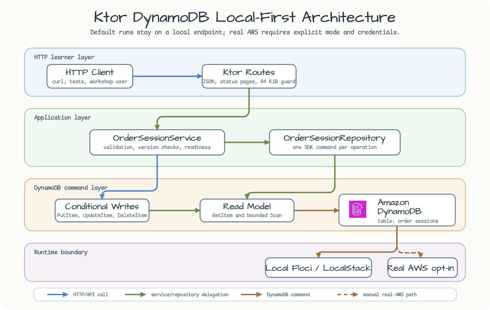
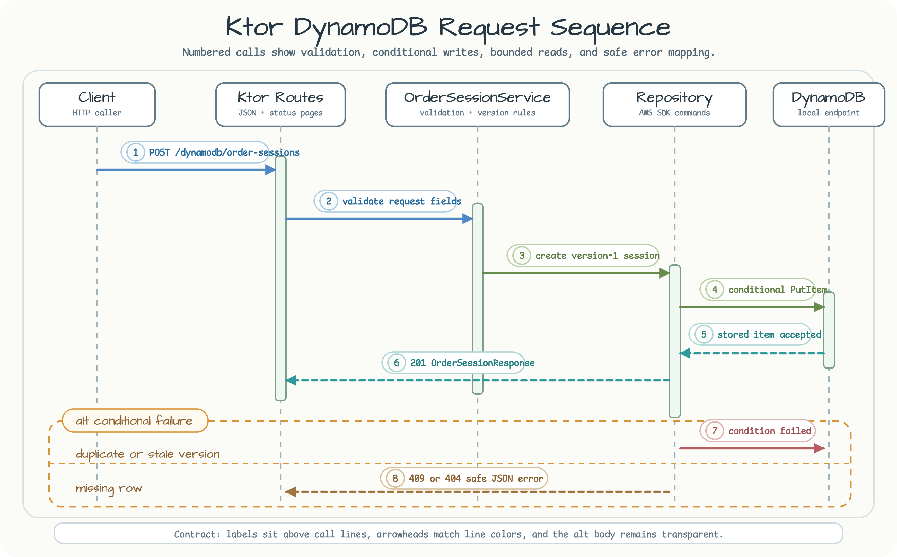

# Ktor DynamoDB Local-First

[English](README.md) | 한국어

이 모듈은 DynamoDB를 쓰는 Kotlin-first Ktor REST 서비스를 로컬에서 먼저 검증하는 예제입니다.
`DynamoDbKtorPlugin`으로 로컬 AWS 에뮬레이터에 테이블을 만들고, 작은 order-session API에서
conditional write, optimistic update, bounded scan, readiness check, 안정적인 에러 응답을
보여주며 DynamoDB Streams coroutine Flow consumer를 명시적으로 opt-in할 수 있습니다.

## 아키텍처



Route 계층은 HTTP shape와 JSON error mapping을 담당합니다. Service 계층은 validation과
version 규칙을 담당합니다. Repository 계층은 DynamoDB command budget을 고정하고,
conditional write 실패를 워크숍에서 설명 가능한 공개 에러로 바꿉니다.

## 요청 시퀀스



시퀀스의 핵심은 local path를 fail-closed로 두는 것입니다. Local mode에서는 에뮬레이터
endpoint와 dummy credential을 명시해야 합니다. Real AWS mode는 명시적으로 opt-in할 때만
사용하고, AWS profile, IAM 정책, cleanup 계획을 먼저 정해야 합니다.

## 학습 포인트

| 주제 | 예제 |
| --- | --- |
| Ktor plugin runtime | `DynamoDbKtorPlugin`이 route에서 client를 쓰기 전에 테이블을 생성합니다. |
| Conditional writes | `PutItem`으로 중복 order-session ID를 거부합니다. |
| Optimistic update | `UpdateItem`에서 `expectedVersion`을 확인하고 `version`을 증가시킵니다. |
| Error mapping | DynamoDB conditional failure를 안정적인 error code를 가진 `409` 응답으로 매핑합니다. |
| Bounded listing | `Scan`은 기본 limit `25`, 최대 limit `100`, opaque page token을 사용합니다. |
| DynamoDB Streams Flow | `DynamoDbStreamsShardRecord`로 stream-enabled table을 `TRIM_HORIZON`/`LATEST`에서 읽고, bounded polling과 in-memory checkpoint를 확인합니다. |
| Local-first boundary | Local mode에서 endpoint와 credential이 빠지면 일찍 실패하므로 실수로 real AWS를 호출하지 않습니다. |

## API Surface

| method | path | 동작 |
| --- | --- | --- |
| `POST` | `/dynamodb/order-sessions` | version `1`로 session을 생성합니다. |
| `GET` | `/dynamodb/order-sessions/{id}` | session 하나를 읽거나 `404`를 반환합니다. |
| `GET` | `/dynamodb/order-sessions?limit=25&nextToken=...` | bounded page를 조회합니다. |
| `PUT` | `/dynamodb/order-sessions/{id}` | `expectedVersion`으로 update하고 성공 시 version을 증가시킵니다. |
| `DELETE` | `/dynamodb/order-sessions/{id}` | 기존 session을 삭제합니다. |
| `GET` | `/health/readiness` | DynamoDB table이 active인지 확인합니다. |
| `POST` | `/dynamodb/order-sessions/streams/consume?maxRecords=1&startingPosition=trim_horizon` | bounded stream window를 읽고 shard/sequence/checkpoint 요약을 반환합니다. |

## DynamoDB Streams Flow

Local table을 emulator 경로에서 생성할 때 `NewAndOldImages` Streams를 함께 켭니다. Consumer는
기본적으로 disabled이며 `bluetape4k.aws.dynamodb.streams.enabled=true`일 때만 생성됩니다.
Table의 stream ARN을 확인한 뒤 upstream `shardRecordFlow`를 `batchLimit`, `pollInterval`,
shard 하나의 순차 수집으로 실행하므로 coroutine backpressure가 자연스럽게 유지됩니다.

Collector는 처리 경계를 먼저 호출하고 성공한 뒤 checkpoint를 저장합니다. 따라서 bounded
요청이 성공하면 마지막 checkpoint가 응답에 나타나고, processor가 실패하거나 취소되면 해당
record가 inclusive resume에서 다시 전달될 수 있습니다. Endpoint를 두 번 호출하면
at-least-once duplicate report를 확인할 수 있습니다. `startingPosition` query parameter에는
`TRIM_HORIZON`과 `LATEST`를 사용할 수 있습니다.

## 로컬 실행

테스트 경로는 `bluetape4k-testcontainers`를 통해 bluetape4k AWS 에뮬레이터를 시작합니다.

```bash
./gradlew :aws-ktor-dynamodb:test --max-workers=1
```

Ktor 앱을 직접 실행하려면 먼저 Floci 또는 LocalStack endpoint를 띄운 뒤, local endpoint와
dummy credential을 명시합니다.

```bash
./gradlew :aws-ktor-dynamodb:run \
  -Dbluetape4k.aws.mode=local \
  -Dbluetape4k.aws.emulator=floci \
  -Dbluetape4k.aws.region=ap-northeast-2 \
  -Dbluetape4k.aws.dynamodb.table-name=workshop-order-sessions \
  -Dbluetape4k.aws.dynamodb.endpoint-url=http://localhost:4566 \
  -Dbluetape4k.aws.access-key-id=test \
  -Dbluetape4k.aws.secret-access-key=test \
  -Dbluetape4k.aws.dynamodb.streams.enabled=true \
  -Dbluetape4k.aws.dynamodb.streams.starting-position=trim_horizon \
  -Dbluetape4k.aws.dynamodb.streams.max-records=10
```

```bash
curl -s http://localhost:8080/health/readiness

curl -s -X POST http://localhost:8080/dynamodb/order-sessions \
  -H 'Content-Type: application/json' \
  -d '{"id":"order-1001","customerId":"customer-42","notes":"new order"}'

curl -s http://localhost:8080/dynamodb/order-sessions/order-1001

curl -s -X PUT http://localhost:8080/dynamodb/order-sessions/order-1001 \
  -H 'Content-Type: application/json' \
  -d '{"expectedVersion":1,"status":"APPROVED","notes":"approved"}'

curl -s 'http://localhost:8080/dynamodb/order-sessions?limit=25'
curl -i -X DELETE http://localhost:8080/dynamodb/order-sessions/order-1001

curl -s -X POST \
  'http://localhost:8080/dynamodb/order-sessions/streams/consume?maxRecords=1&startingPosition=trim_horizon'
```

Consume 응답에는 stream ARN, shard ID, sequence number, duplicate flag, checkpoint만 포함합니다.
Record payload와 credential은 포함하지 않습니다. `LATEST`로 실행하기 전에는 새 order-session을
write하고, resume에서는 해당 service의 in-memory checkpoint가 starting position보다 우선합니다.

## Error Matrix

| 조건 | status | code |
| --- | ---: | --- |
| Validation failure | `400` | `VALIDATION_FAILED` |
| Malformed JSON | `400` | `MALFORMED_JSON` |
| 64 KiB 초과 body | `413` | `REQUEST_TOO_LARGE` |
| 잘못된 page token | `400` | `INVALID_PAGE_TOKEN` |
| 중복 create | `409` | `ORDER_SESSION_EXISTS` |
| 오래된 update version | `409` | `ORDER_SESSION_VERSION_CONFLICT` |
| 없는 read/update/delete target | `404` | `ORDER_SESSION_NOT_FOUND` |
| Readiness table down | `503` | `DYNAMODB_NOT_READY` |
| 예상하지 못한 DynamoDB failure | `503` | `DYNAMODB_UNAVAILABLE` |

## Command Budget

| operation | DynamoDB commands |
| --- | --- |
| Create success | conditional `PutItem` 한 번. |
| Read | `GetItem` 한 번. |
| List | bounded `Scan` 한 번. 기본 `25`, 최대 `100`. |
| Update success | `ReturnValues=ALL_NEW`을 쓰는 conditional `UpdateItem` 한 번. |
| Update condition failure | 실패한 `UpdateItem` 뒤 conflict 분류를 위한 `GetItem` 최대 한 번. |
| Delete success | conditional `DeleteItem` 한 번. |
| Readiness | 짧은 timeout을 가진 `DescribeTable` 한 번. |

## 설정

| property | default | local mode rule |
| --- | --- | --- |
| `bluetape4k.aws.mode` | `local` | 의도적으로 AWS에 접근할 때만 `real`을 사용합니다. |
| `bluetape4k.aws.emulator` | `floci` | `floci` 또는 `localstack`. |
| `bluetape4k.aws.region` | `ap-northeast-2` | 에뮬레이터가 지원하는 region이면 됩니다. |
| `bluetape4k.aws.dynamodb.table-name` | `workshop-order-sessions` | Local mode에서만 자동 생성합니다. |
| `bluetape4k.aws.dynamodb.endpoint-url` | 없음 | Local mode에서 필수입니다. |
| `bluetape4k.aws.access-key-id` | 없음 | Local mode에서 필수입니다. |
| `bluetape4k.aws.secret-access-key` | 없음 | Local mode에서 필수입니다. |
| `bluetape4k.aws.dynamodb.streams.enabled` | `false` | `true`일 때만 optional Streams route/client를 등록합니다. |
| `bluetape4k.aws.dynamodb.streams.starting-position` | `trim_horizon` | `trim_horizon` 또는 `latest`; 저장된 checkpoint부터 inclusive resume합니다. |
| `bluetape4k.aws.dynamodb.streams.max-records` | `10` | 요청별 record 상한이며 최대 `1000`입니다. |
| `bluetape4k.aws.dynamodb.streams.batch-limit` | `100` | `GetRecords`별 batch 상한이며 최대 `1000`입니다. |
| `bluetape4k.aws.dynamodb.streams.poll-interval-millis` | `200` | poll 간격이며 upstream이 service-safe 최소값을 적용합니다. |
| `bluetape4k.aws.dynamodb.streams.empty-backoff-millis` | `1000` | 빈 shard backoff이며 poll interval보다 짧을 수 없습니다. |

## Real AWS Opt-In

Real AWS mode에서는 endpoint override가 필요하지 않으며, 테이블을 자동 생성하지 않습니다.

```bash
./gradlew :aws-ktor-dynamodb:run \
  -Dbluetape4k.aws.mode=real \
  -Dbluetape4k.aws.region=ap-northeast-2 \
  -Dbluetape4k.aws.dynamodb.table-name=workshop-order-sessions
```

실제 AWS에서 실행할 때는 DynamoDB Streams를 켠 테이블을 명시적으로 만든 뒤 제한된 AWS profile을
사용하고, 테이블 비용과 삭제 절차를 먼저 확인합니다. Streams client는 opt-in property가 true일
때만 생성됩니다.

## 검증

```bash
./gradlew :aws-ktor-dynamodb:compileKotlin --warning-mode all
./gradlew :aws-ktor-dynamodb:compileTestKotlin --warning-mode all
./gradlew :aws-ktor-dynamodb:test --max-workers=1
```
