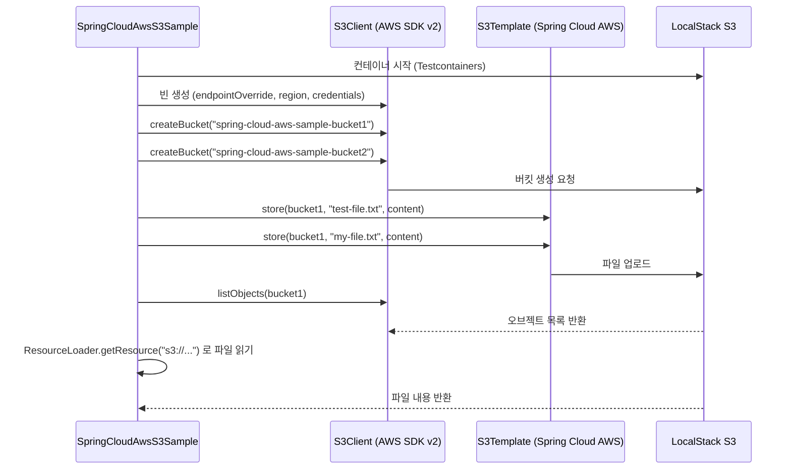

# Spring Cloud AWS S3 Demo

[Spring Cloud AWS](https://github.com/awspring/spring-cloud-aws) 를 이용하여 S3 서비스를 사용하는 예제입니다.



## 주요 기능

| 기능 | 설명 |
|------|------|
| 버킷 생성 | `S3Client.createBucket()` — bluetape4k 확장 함수로 간결하게 생성 |
| 파일 업로드 | `S3Template.store(bucket, key, content)` — Spring Cloud AWS 추상화 |
| 파일 목록 조회 | `S3Client.listObjects { it.bucket(...) }` — 버킷 내 오브젝트 열거 |
| 리소스 읽기 | `ResourceLoader.getResource("s3://bucket/key")` — Spring Resource 추상화 |
| 로컬 테스트 | `LocalStackServer` (Testcontainers) — 실제 AWS 없이 로컬에서 S3 에뮬레이션 |

## 설정 방법

### 의존성 (`build.gradle.kts`)

```kotlin
implementation("io.awspring.cloud:spring-cloud-aws-starter-s3")
implementation("software.amazon.awssdk:s3")
testImplementation("io.bluetape4k:bluetape4k-testcontainers")  // LocalStackServer
```

### S3Client 빈 등록 (LocalStack 연동)

```kotlin
@Bean
fun s3Client(): S3Client {
    return S3Client.builder()
        .endpointOverride(s3Server.endpoint)          // LocalStack 엔드포인트
        .region(Region.of(s3Server.region))
        .credentialsProvider(
            staticCredentialsProviderOf(s3Server.accessKey, s3Server.secretKey)
        )
        .build()
}
```

### 실제 AWS 연동 시 `application.yml` 설정

```yaml
spring:
  cloud:
    aws:
      credentials:
        access-key: ${AWS_ACCESS_KEY_ID}
        secret-key: ${AWS_SECRET_ACCESS_KEY}
      region:
        static: ap-northeast-2
      s3:
        enabled: true
```

## 사용 예제

### 파일 업로드 및 목록 조회

```kotlin
// 버킷 생성 (bluetape4k 확장 함수)
s3Client.createBucket("my-bucket") {}

// 파일 업로드 (Spring Cloud AWS S3Template)
s3Template.store("my-bucket", "hello.txt", "Hello, S3!")

// 오브젝트 목록 출력
s3Client.listObjects { it.bucket("my-bucket") }
    .contents()
    .forEach { log.info { "key=${it.key()}" } }
```

### Spring Resource 추상화로 파일 읽기

```kotlin
val resource = resourceLoader.getResource("s3://my-bucket/hello.txt") as WritableResource
val content = resource.inputStream.bufferedReader().readText()
```

## 테스트 전제 조건

- Docker 데몬 실행 필요 (Testcontainers가 LocalStack 컨테이너 자동 기동)
- 실제 AWS 자격증명 불필요 — LocalStack이 S3 API를 로컬에서 에뮬레이션
