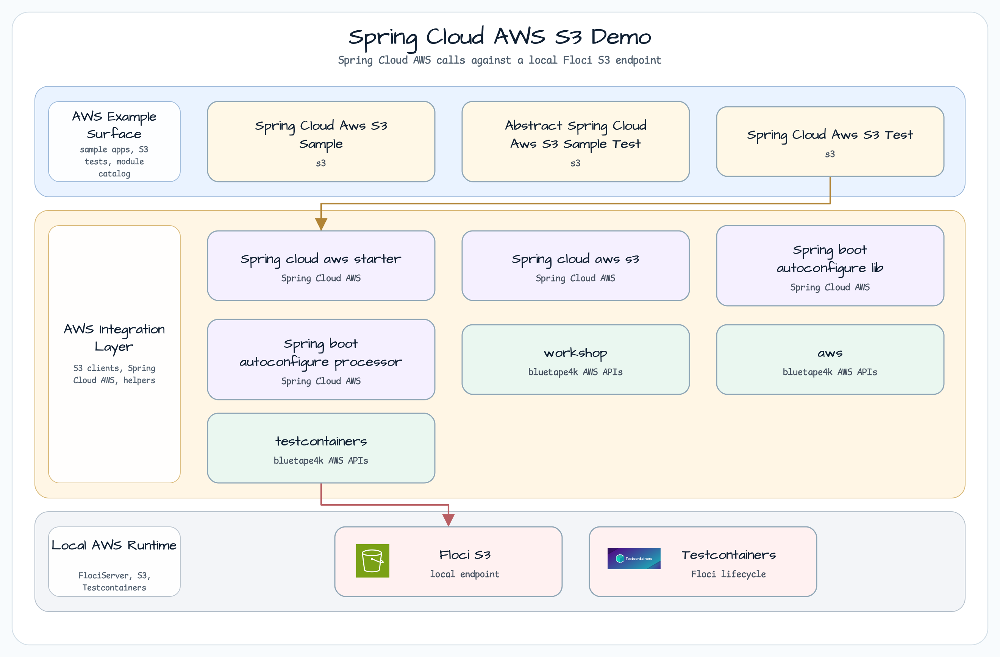
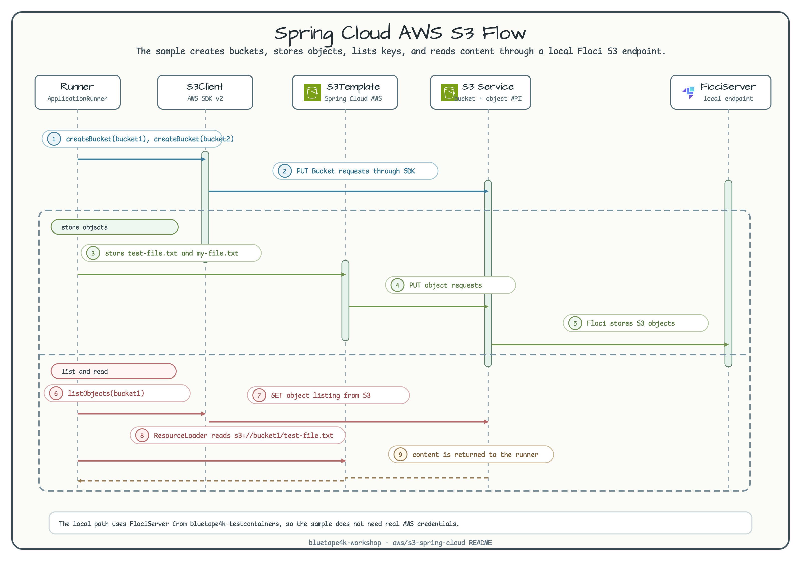

# Spring Cloud AWS S3 Demo

[한국어](README.ko.md) | English

## Example Scenario

This example exercises **Spring Cloud AWS S3 Demo** as a runnable AWS integration workshop slice. It focuses on the path a developer would inspect first: configure the module, run the sample or tests, and observe the library or framework APIs that remove repetitive infrastructure code.

## Architecture Diagram



The module is organized around the sample entry point or test fixture, the bluetape4k extension layer, and the runtime dependency used by the example. Keep the package under `io.bluetape4k.workshop.aws` as the source of truth when comparing this README with the code.

## Sequence Diagram



This is an example of using the S3 service using [Spring Cloud AWS](https://github.com/awspring/spring-cloud-aws)).

## Main features

| function | explanation |
|------|------|
| Create bucket | `S3Client.createBucket()` — Concise creation with bluetape4k extension function |
| file upload | `S3Template.store(bucket, key, content)` — Spring Cloud AWS abstraction |
| View file list | `S3Client.listObjects { it.bucket(...) }` — Enumerate objects within a bucket |
| Read Resources | `ResourceLoader.getResource("s3://bucket/key")` — Spring Resource abstraction |
| local test | `LocalStackServer` (Testcontainers) — S3 emulation locally without actual AWS |

## How to set up

### Dependencies (`build.gradle.kts`)

```kotlin
implementation("io.awspring.cloud:spring-cloud-aws-starter-s3")
implementation("software.amazon.awssdk:s3")
testImplementation("io.bluetape4k:bluetape4k-testcontainers")  // LocalStackServer
```

### Register S3Client bean (LocalStack integration)

```kotlin
@Bean
fun s3Client(): S3Client {
    return S3Client.builder()
.endpointOverride(s3Server.endpoint) // LocalStack endpoint
        .region(Region.of(s3Server.region))
        .credentialsProvider(
            staticCredentialsProviderOf(s3Server.accessKey, s3Server.secretKey)
        )
        .build()
}
```

### Setting `application.yml` when connecting to actual AWS

```yaml
spring:
  cloud:
    aws:
      credentials:
        access-key: ${AWS_ACCESS_KEY_ID}
        secret-key: ${AWS_SECRET_ACCESS_KEY}
      region:
        static: ap-northeast-2
      s3:
        enabled: true
```

## Usage example

### Upload files and view list

```kotlin
// Create bucket (bluetape4k extension function)
s3Client.createBucket("my-bucket") {}

// Upload file (Spring Cloud AWS S3Template)
s3Template.store("my-bucket", "hello.txt", "Hello, S3!")

// Output object list
s3Client.listObjects { it.bucket("my-bucket") }
    .contents()
    .forEach { log.info { "key=${it.key()}" } }
```

### Reading files with Spring Resource abstraction

```kotlin
val resource = resourceLoader.getResource("s3://my-bucket/hello.txt") as WritableResource
val content = resource.inputStream.bufferedReader().readText()
```

## Test prerequisites

- Requires Docker daemon to run (Testcontainers automatically starts LocalStack container)
- No need for actual AWS credentials — LocalStack emulates the S3 API locally
