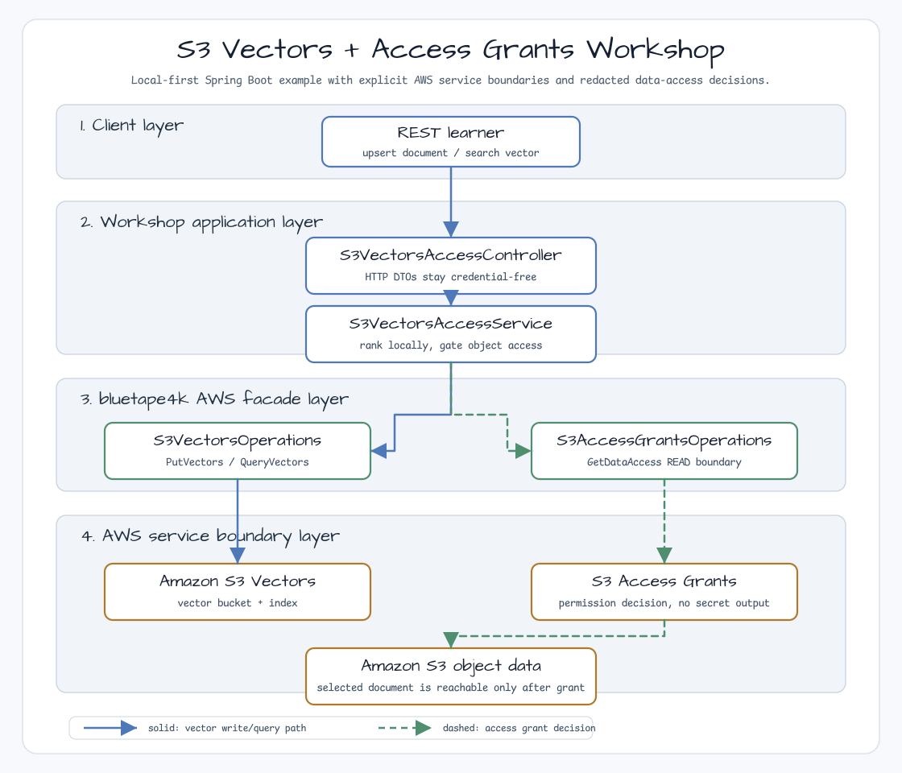
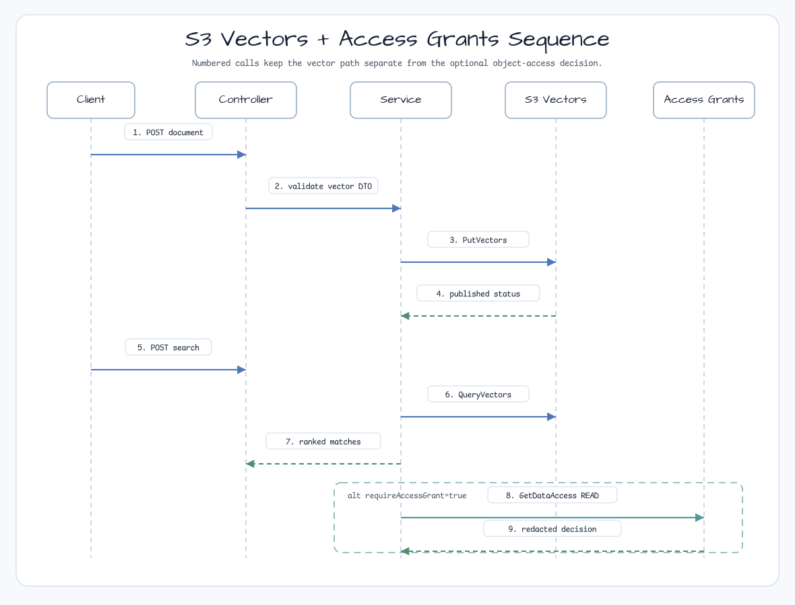

# S3 Vectors + Access Grants 워크숍

[English](README.md) | 한국어

이 예제는 Amazon S3 Vectors 검색과 S3 Access Grants 객체 권한 부여를 분리해서
다루는 방법을 보여줍니다. 기본 profile은 local-first입니다. 운영 경로와 같은
bluetape4k AWS facade request를 만들지만, 실제 AWS client를 만들지 않고, 자격
증명도 요구하지 않으며, API 응답에 임시 자격 증명 필드를 절대 반환하지 않습니다.

## 아키텍처



애플리케이션 계층이 학습 정책을 소유합니다. `S3VectorsAccessService`는
`S3VectorsOperations`로 문서 vector를 쓰고 조회합니다. 그다음 로컬 demo 문서를
결정적으로 rank하고, top match가 선택된 뒤에만 `S3AccessGrantsOperations`로 read
access를 요청합니다.

## 요청 흐름



`alt requireAccessGrant=true` 영역은 의도적으로 투명하게 두었습니다. 호출자는 vector
ranking만 요청할 수도 있고, 선택된 object URI를 Access Grants로 gate하도록 요청할
수도 있습니다.

## 학습 포인트

| 주제 | 워크숍 동작 |
| --- | --- |
| Vector write boundary | 문서 upsert는 bluetape4k `S3VectorsOperations`를 통해 `PutVectorsRequest`를 호출합니다. |
| Vector query boundary | Search는 `QueryVectorsRequest`를 호출한 뒤 반복 가능한 테스트를 위해 deterministic local vector를 rank합니다. |
| Access Grants boundary | Object access는 top match가 있을 때만 `READ` 권한의 `GetDataAccessRequest`를 호출합니다. |
| Redaction | API report는 `redacted=true`만 노출합니다. 임시 access key, secret key, session token 필드는 직렬화하지 않습니다. |
| Surface separation | 일반 S3 storage, pre-signed URL, S3 Vectors, Access Grants를 서로 다른 예제와 경계로 유지합니다. |
| Local safety | 기본 테스트와 smoke 실행에는 AWS 계정, AWS 자격 증명, 실제 S3 bucket이 필요하지 않습니다. |

## 로컬 실행

```bash
./gradlew :aws-s3-vectors-access-grants:test
./gradlew :aws-s3-vectors-access-grants:bootRun
```

로컬 demo 문서를 upsert합니다.

```bash
curl -s http://localhost:8080/aws/s3-vectors/documents \
  -H 'Content-Type: application/json' \
  -d '{
    "documentId": "doc-100",
    "title": "Coroutine Flow backpressure",
    "objectKey": "docs/coroutines-flow.md",
    "vector": [0.9, 0.1, 0.0],
    "metadata": { "topic": "coroutines" }
  }' | jq
```

선택된 object에 Access Grants decision을 요구하며 검색합니다.

```bash
curl -s http://localhost:8080/aws/s3-vectors/search \
  -H 'Content-Type: application/json' \
  -d '{
    "query": [0.8, 0.2, 0.0],
    "topK": 1,
    "requireAccessGrant": true
  }' | jq
```

예상되는 로컬 응답 형태는 다음과 같습니다.

```json
{
  "query": { "state": "PUBLISHED", "boundary": "S3 Vectors", "message": "" },
  "matches": [
    {
      "documentId": "doc-100",
      "title": "Coroutine Flow backpressure",
      "objectUri": "s3://workshop-documents/docs/coroutines-flow.md",
      "score": 0.9909924304103231,
      "metadata": { "topic": "coroutines" }
    }
  ],
  "access": {
    "state": "GRANTED",
    "target": "s3://workshop-documents/docs/coroutines-flow.md",
    "permission": "READ",
    "redacted": true,
    "message": "Temporary data access approved; sensitive AWS values are intentionally omitted."
  }
}
```

Vector ranking만 필요하다면 `requireAccessGrant=false`로 보냅니다.

```json
{
  "query": [0.8, 0.2, 0.0],
  "topK": 1,
  "requireAccessGrant": false
}
```

## 설정

기본 `src/main/resources/application.yml`은 일반 S3 auto-configuration을 꺼 둡니다.
그래서 샘플이 실수로 호스트의 region이나 자격 증명을 해석하지 않습니다.

```yaml
bluetape4k:
  aws:
    s3:
      enabled: false
workshop:
  aws:
    s3-vector-access:
      vector-bucket-name: semantic-documents
      index-name: docs-rag
      document-bucket-name: workshop-documents
      object-prefix: docs/
      max-search-results: 5
      max-vector-dimensions: 16
      access-grants:
        account-id: "123456789012"
        location-arn: arn:aws:s3:ap-northeast-2:123456789012:access-grants/default/location/default
```

## 선택적 Real AWS Profile

실제 AWS 호출은 기본 경로 밖에 있습니다. 비용, cleanup, IAM 권한, region 선택,
S3 Vectors index 구성, Access Grants instance 구성을 이해한 수동 환경에서만
사용하세요.

```bash
export AWS_REGION=ap-northeast-2
export AWS_PROFILE=your-profile

./gradlew :aws-s3-vectors-access-grants:bootRun \
  --args='--spring.profiles.active=real-aws \
  --bluetape4k.aws.s3.enabled=true \
  --bluetape4k.aws.s3.region=ap-northeast-2 \
  --bluetape4k.aws.s3-vectors.enabled=true \
  --bluetape4k.aws.s3-vectors.region=ap-northeast-2 \
  --bluetape4k.aws.s3.access-grants.enabled=true \
  --bluetape4k.aws.s3.access-grants.region=ap-northeast-2'
```

이 예제는 real AWS profile에서도 Access Grants data-access 응답을 redaction합니다.
임시 AWS 값은 별도의 통제된 수동 디버깅 경로에서만 확인하세요.

## 테스트 범위

```bash
./gradlew :aws-s3-vectors-access-grants:compileKotlin
./gradlew :aws-s3-vectors-access-grants:compileTestKotlin
./gradlew :aws-s3-vectors-access-grants:test
```

테스트는 vector upsert/query request 경계, local ranking, Access Grants gating,
redacted response shape, failure isolation, cancellation propagation, MVC JSON
출력을 실제 AWS 자격 증명 없이 검증합니다.
