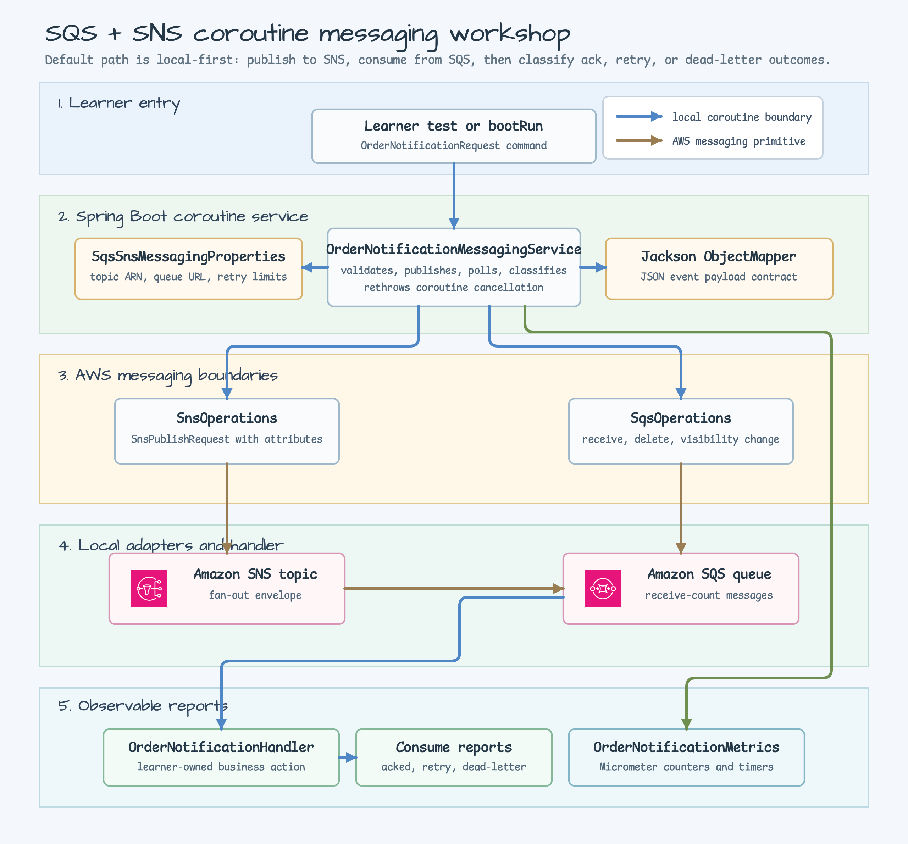
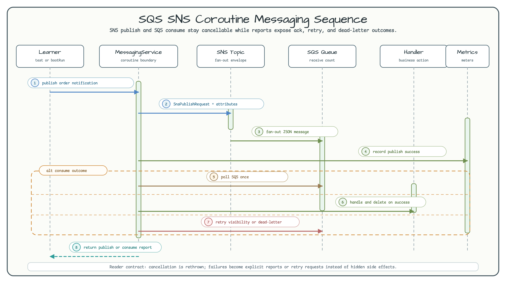

# SQS + SNS 코루틴 메시징 워크숍

[English](README.md) | 한국어

이 예제는 AWS SNS publish와 SQS consume 흐름을 코루틴 경계에서 안전하게 다루는
방법을 보여줍니다. 기본 bean은 in-memory adapter이므로 AWS 계정, AWS 자격 증명,
Docker, LocalStack 없이 애플리케이션을 실행할 수 있습니다. 테스트 스위트에는
Floci/Testcontainers 통합 테스트도 포함되어, 실제 bluetape4k
`SnsCoroutinesTemplate`와 `SqsCoroutinesTemplate` client를 로컬 AWS 호환 endpoint에
붙여 검증합니다.

## 아키텍처



`OrderNotificationMessagingService`가 단일 서비스 경계입니다. 요청을 검증하고,
`OrderNotificationEvent`를 JSON으로 직렬화한 뒤 bluetape4k `SnsOperations`로
publish합니다. Consume 경로에서는 bluetape4k `SqsOperations`로 poll하고, 숨은
side effect 대신 명시적인 report를 반환합니다. Local `SnsOperations`와
`SqsOperations` bean은 실제 bean이 없을 때만 등록됩니다. JSON payload에는
`bluetape4k-jackson3`의 `Jackson.defaultJsonMapper`를 사용합니다.

## 요청 흐름



핵심은 `alt consume outcome` 분기입니다. 메시지는 handler 성공 시 삭제되고,
handler 실패 시 visibility를 0초로 되돌려 retry 대상으로 분류되며, 설정한 receive
count 이상이면 dead-letter 결과로 삭제됩니다. `CancellationException`은 항상 다시
던져서 코루틴 취소가 report로 바뀌지 않게 합니다.

## 학습 포인트

| 주제 | 워크숍 동작 |
| --- | --- |
| SNS publish boundary | JSON body, subject, correlation id, idempotency key, event type attribute를 가진 `SnsPublishRequest`를 만듭니다. |
| SQS consume boundary | 학습자가 볼 수 있는 queue 설정으로 한 번 poll하고, 전달된 메시지마다 report를 반환합니다. |
| Retry classification | Handler 실패 시 `changeVisibility(..., timeoutSeconds = 0)`을 호출하고 `RETRY_REQUESTED`를 반환합니다. |
| Dead-letter classification | `maxReceiveCount` 이상인 메시지는 삭제하고 `DEAD_LETTER`로 반환합니다. |
| Metrics | `OrderNotificationMetrics`가 publish timer와 consume 결과 counter를 Micrometer에 기록합니다. |
| Local safety | 기본 `bootRun`은 실제 AWS 서비스를 호출하지 않으며, 통합 테스트는 실제 AWS 대신 Floci를 사용합니다. |

## 로컬 실행

```bash
./gradlew :aws-sqs-sns-coroutines:test
./gradlew :aws-sqs-sns-coroutines:bootRun
```

`test`는 Floci Testcontainers AWS emulator를 시작합니다. 로컬에서는 Docker가
필요하며, CI에서도 순차 container-backed lane에서 실행합니다.

이 모듈은 service-first 예제입니다. Publish, ack, retry, dead-letter, validation,
cancellation 사례는 테스트가 실행 가능한 walkthrough 역할을 합니다.

```bash
./gradlew :aws-sqs-sns-coroutines:test \
  --tests '*OrderNotificationMessagingServiceTest'
```

## 설정

기본 `src/main/resources/application.yml`은 샘플을 로컬에서 완결되게 유지합니다.

```yaml
bluetape4k:
  aws:
    sqs-sns:
      topic-arn: arn:aws:sns:ap-northeast-2:123456789012:order-notifications
      queue-url: https://sqs.ap-northeast-2.amazonaws.com/123456789012/order-notifications
      subject: Order notification
      max-messages: 10
      wait-time-seconds: 1
      visibility-timeout-seconds: 30
      max-receive-count: 3
```

실제 bluetape4k AWS bean으로 교체하는 경로는 수동 환경에서만 사용하세요. IAM 권한,
cleanup, region, 비용, retry 정책, queue/topic subscription wiring을 이해한 뒤에만
실행해야 합니다.

## 테스트 범위

```bash
./gradlew :aws-sqs-sns-coroutines:compileKotlin
./gradlew :aws-sqs-sns-coroutines:compileTestKotlin
./gradlew :aws-sqs-sns-coroutines:test
```

단위 테스트는 SNS request mapping, SQS ack, retry/dead-letter 분류, metrics,
property validation, request validation, coroutine cancellation propagation을
검증합니다. `OrderNotificationFlociIntegrationTest`는 실제 AWS 자격 증명 없이
실제 bluetape4k operation template, Floci, Awaitility `untilSuspending`,
`Jackson.defaultJsonMapper`로 SNS publish와 SQS consume 경로를 검증합니다.
