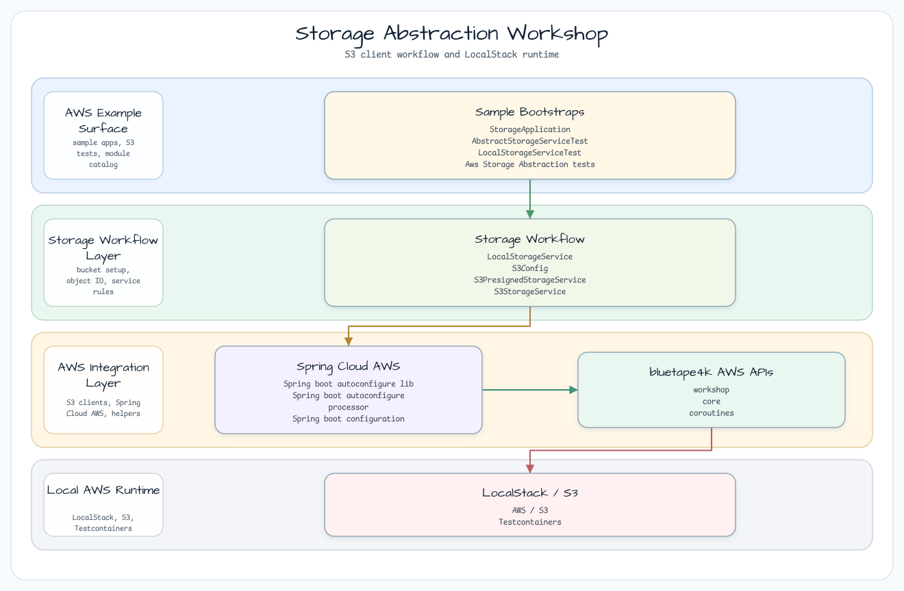

# Storage Abstraction Workshop

[English](README.md) | 한국어

## 예제 시나리오

이 예제는 **Storage Abstraction Workshop**을 실행 가능한 AWS 통합 워크숍 조각으로 다룹니다. 개발자가 가장 먼저 확인하는 경로인 모듈 설정, 샘플 또는 테스트 실행, 반복적인 인프라 코드를 줄여 주는 라이브러리와 프레임워크 API 관찰에 초점을 둡니다.

## 흐름 다이어그램

1. `aws-storage-abstraction`에 필요한 로컬 런타임을 준비합니다.
2. 예제 시나리오를 담당하는 애플리케이션, 컨트롤러, 서비스 또는 테스트 픽스처를 실행합니다.
3. 반복적인 인프라 작업을 bluetape4k 유틸리티 또는 Spring/Kotlin 통합 기능에 위임합니다.
4. 샘플 출력, HTTP 응답, 저장소 상태, 메트릭, 트레이스 또는 테스트 기대값으로 보이는 결과를 검증합니다.

## 시퀀스 다이어그램

핵심 시퀀스는 호출자 또는 테스트 픽스처 -> 워크숍 어댑터 -> bluetape4k 헬퍼/API -> 외부 런타임 또는 인메모리 백엔드 -> 검증/응답 순서입니다. 전용 시퀀스 이미지가 있는 모듈은 아래 이미지가 상호작용 순서를 보여 주며, 없는 경우 소스 테스트가 실행 가능한 시퀀스의 기준입니다.

Spring Profile을 통해 애플리케이션 코드를 바꾸지 않고 로컬 파일 시스템, AWS S3, S3 pre-signed URL 백엔드를 전환하는 플러그형 스토리지 전략을 보여 줍니다.

## 아키텍처




## 주요 기능

| 기능 | 설명 |
|---------|-------------|
| 스토리지 추상화 | `upload`, `download`, `getUrl`, `delete`를 제공하는 단일 `StorageService` 인터페이스 |
| 프로파일 전환 | `local` / `s3` / `s3-presigned` Spring profile이 구현체를 선택 |
| 로컬 백엔드 | `java.nio.file.Files` — 외부 의존성 없이 테스트를 즉시 시작 |
| S3 백엔드 | AWS SDK v2 `S3Client`를 `withContext(Dispatchers.IO)`로 감쌈 |
| Pre-signed URL | `S3Presigner`가 제한 시간 GET URL을 생성(기본 15분, 900초) |
| 코루틴 | 모든 메서드가 `suspend`; 블로킹 I/O는 `Dispatchers.IO`에서 실행 |
| 로컬 AWS 에뮬레이터 | `FlociServer`(Testcontainers)가 LocalStack Community edition을 대체 |

## 프로파일 전환

### local (기본 개발/테스트 — Docker 불필요)

```bash
./gradlew :aws-storage-abstraction:bootRun --args='--spring.profiles.active=local'
```

### s3 (LocalStack 호환 — Docker 필요)

```bash
./gradlew :aws-storage-abstraction:bootRun --args='--spring.profiles.active=s3'
```

### s3-presigned (pre-signed GET URL을 사용하는 S3 — Docker 필요)

```bash
./gradlew :aws-storage-abstraction:bootRun --args='--spring.profiles.active=s3-presigned'
```

## StorageService 인터페이스

```kotlin
interface StorageService {
    suspend fun upload(key: String, content: ByteArray, contentType: String): String
    suspend fun download(key: String): ByteArray
    suspend fun getUrl(key: String): String   // public URL or pre-signed URL
    suspend fun delete(key: String)
}
```

## Pre-signed URL 동작

`s3-presigned` profile이 활성화되면 `getUrl()`은 `S3Presigner`를 사용해 pre-signed S3 GET URL을 생성합니다. URL에는 `X-Amz-Expires=900` 쿼리 파라미터가 포함됩니다(`storage.s3.presign-duration-minutes`로 설정 가능).

```kotlin
// Example presigned URL (LocalStack / Floci):
// http://127.0.0.1:4566/bluetape4k-workshop-bucket/test/hello.txt
//   ?X-Amz-Algorithm=AWS4-HMAC-SHA256
//   &X-Amz-Date=...
//   &X-Amz-Expires=900
//   &X-Amz-SignedHeaders=host
//   &X-Amz-Signature=...
```

## 설정

`src/main/resources/application.yml`:

```yaml
storage:
  local:
    base-path: /tmp/bluetape4k-workshop-storage   # local profile root directory
  s3:
    bucket-name: bluetape4k-workshop-bucket        # S3 bucket name
    presign-duration-minutes: 15                   # pre-signed URL TTL
```

## 의존성

```kotlin
// build.gradle.kts
implementation(libs.bluetape4k.aws)           // bluetape4k-aws-spring-boot
implementation(libs.bluetape4k.coroutines)
implementation(libs.aws2.s3.lib)              // AWS SDK v2 S3
implementation(libs.bluetape4k.testcontainers)
implementation(libs.testcontainers.localstack) // Floci uses LocalStack-compatible API
```

## 테스트 실행

```bash
./gradlew :aws-storage-abstraction:test
```

테스트는 하나의 Gradle task에서 세 profile을 모두 실행합니다.

- `LocalStorageServiceTest` — 5 tests, `local` profile, no Docker
- `S3StorageServiceTest` — 5 tests, `s3` profile, Floci container (shared JVM singleton)
- `S3PresignedStorageServiceTest` — 7 tests, `s3-presigned` profile, Floci + presigned URL assertions

## 참고 사항

- `bluetape4k-aws-spring-boot`의 `S3AutoConfiguration`은 이 모듈이 `S3Config`로 자체 S3 bean을 관리하므로 `application.yml`에서 제외합니다.
- `FlociServer.Launcher.floci`는 JVM 수준 singleton입니다. 컨테이너는 한 번 시작되고 같은 Gradle test 실행 안의 모든 S3 테스트 클래스가 공유합니다.
- 모든 블로킹 AWS SDK 호출은 코루틴 구조적 동시성 계약을 지키기 위해 `withContext(Dispatchers.IO)`로 감쌉니다.
