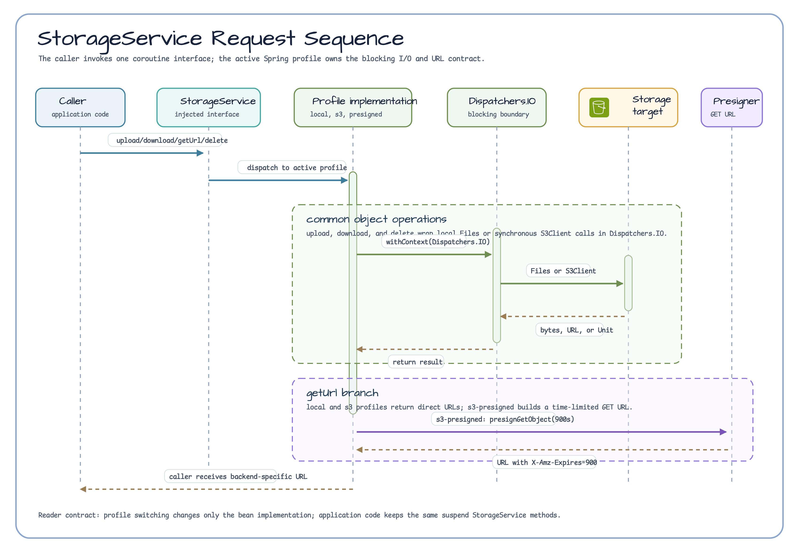

# Storage Abstraction Workshop

[한국어](README.ko.md) | English

## Storage Boundary

This example puts a small coroutine `StorageService` boundary in front of three
runtime choices: local files, S3 object storage, and S3 pre-signed GET URLs.
Application code keeps the same interface while Spring profiles choose the
implementation.

## Architecture


The important boundary is `StorageService`. The `local`, `s3`, and
`s3-presigned` profiles select different beans, but callers still use the same
`upload`, `download`, `getUrl`, and `delete` methods.

## Request Flow



`upload`, `download`, and `delete` run blocking filesystem or AWS SDK calls on
`Dispatchers.IO`. Object keys are trimmed and validated as relative forward-slash
keys before any backend call. `getUrl` returns a direct local URL for the `local`
profile, an endpoint-neutral `s3://bucket/key` object URI for the `s3` profile,
and a time-limited pre-signed GET URL for `s3-presigned`.

## Key Features

| Feature | Description |
|---------|-------------|
| Storage abstraction | Single `StorageService` interface with `upload`, `download`, `getUrl`, `delete` |
| Profile switching | `local` / `s3` / `s3-presigned` Spring profiles select the implementation |
| Local backend | `java.nio.file.Files` — zero external dependencies, instant test startup |
| S3 backend | AWS SDK v2 `S3Client` wrapped in `withContext(Dispatchers.IO)` plus bluetape4k S3 bucket helpers |
| Pre-signed URLs | `S3Presigner` generates time-limited GET URLs (default 15 min, 900 s) |
| Key guard | Blank, absolute, backslash, and `.` / `..` traversal keys fail before filesystem or S3 access |
| Coroutines | All `suspend` methods; blocking I/O dispatched on `Dispatchers.IO` |
| Local AWS emulator | `FlociServer` (Testcontainers) replaces LocalStack Community edition |

## Profile Switching

### local (default dev/test — no Docker required)

```bash
./gradlew :aws-storage-abstraction:bootRun --args='--spring.profiles.active=local'
```

### s3 (LocalStack-compatible — requires Docker)

```bash
./gradlew :aws-storage-abstraction:bootRun --args='--spring.profiles.active=s3'
```

### s3-presigned (S3 with pre-signed GET URLs — requires Docker)

```bash
./gradlew :aws-storage-abstraction:bootRun --args='--spring.profiles.active=s3-presigned'
```

## StorageService Interface

```kotlin
interface StorageService {
    suspend fun upload(key: String, content: ByteArray, contentType: String): String
    suspend fun download(key: String): ByteArray
    suspend fun getUrl(key: String): String   // local file URL, s3:// URI, or pre-signed URL
    suspend fun delete(key: String)
}
```

Keys are portable object keys, not raw local paths. Use relative values such as
`docs/readme.txt`; blank, absolute, backslash, and traversal keys are rejected.

## Pre-signed URL Behaviour

When the `s3-presigned` profile is active, `getUrl()` generates a pre-signed
S3 GET URL using `S3Presigner`. The URL includes an `X-Amz-Expires=900`
query parameter (configurable via `storage.s3.presign-duration-minutes`).

```kotlin
// Example presigned URL (LocalStack / Floci):
// http://127.0.0.1:4566/bluetape4k-workshop-bucket/test/hello.txt
//   ?X-Amz-Algorithm=AWS4-HMAC-SHA256
//   &X-Amz-Date=...
//   &X-Amz-Expires=900
//   &X-Amz-SignedHeaders=host
//   &X-Amz-Signature=...
```

## Configuration

`src/main/resources/application.yml`:

```yaml
storage:
  local:
    base-path: /tmp/bluetape4k-workshop-storage   # local profile root directory
  s3:
    bucket-name: bluetape4k-workshop-bucket        # S3 bucket name
    presign-duration-minutes: 15                   # pre-signed URL TTL
```

## Dependencies

```kotlin
// build.gradle.kts
implementation(libs.bluetape4k.aws)           // bluetape4k-aws-spring-boot
implementation(libs.bluetape4k.coroutines)
implementation(libs.aws2.s3.lib)              // AWS SDK v2 S3
implementation(libs.bluetape4k.testcontainers)
implementation(libs.testcontainers.localstack) // Floci uses LocalStack-compatible API
```

## Running Tests

```bash
./gradlew :aws-storage-abstraction:test
```

Tests run all three profiles in a single Gradle task:

- `LocalStorageServiceTest` — 8 tests, `local` profile, no Docker
- `S3StorageServiceTest` — 9 tests, `s3` profile, Floci container (shared JVM singleton)
- `S3PresignedStorageServiceTest` — 10 tests, `s3-presigned` profile, Floci + presigned URL assertions

## Notes

- `S3AutoConfiguration` from `bluetape4k-aws-spring-boot` is excluded in `application.yml`
  because this module manages its own S3 beans via `S3Config`.
- `FlociServer.Launcher.floci` is a JVM-level singleton — the container starts once and is
  shared by all S3 test classes in the same Gradle test run.
- All blocking AWS SDK calls are wrapped in `withContext(Dispatchers.IO)` to comply with
  coroutine structured concurrency contracts.
