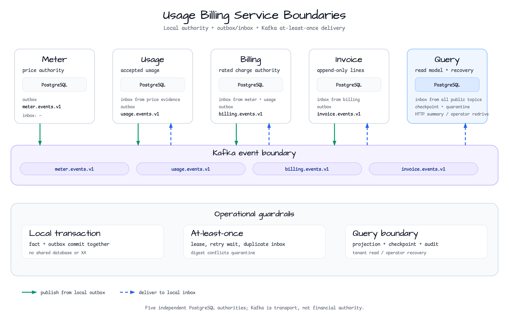

# Commerce Examples

[한국어](README.ko.md) | English

This group contains end-to-end commerce workflows whose correctness depends on
multiple independently versioned aggregates, durable application events, and
operator-visible recovery paths.

The usage-billing service boundaries are summarized below. Each service owns a
local PostgreSQL authority and crosses service boundaries through Kafka topics;
the diagram is a source-backed ownership view, not a throughput chart.



[Architecture SVG source](../docs/images/readme-diagrams/usage-billing-service-boundaries-01.svg)

## Modules

| Module | Focus | Infrastructure |
|--------|-------|----------------|
| [`order-lifecycle-fulfillment`](order-lifecycle-fulfillment/) | Independent order, payment, inventory, fulfillment, and refund lifecycles | PostgreSQL (Testcontainers) |
| [`reservation-control-plane`](reservation-control-plane/) | PostgreSQL-authoritative reservations, idempotent retries, waitlist offers, and expiry | PostgreSQL + Redis (Testcontainers) |
| [`shared`](shared/) | Voucher campaign compatibility contract and cross-example fixtures | None |
| [`event-sourced-promotion-voucher-campaign`](event-sourced-promotion-voucher-campaign/) | Append-only campaign/claim streams, snapshots, leased projections, fenced rebuilds, and position-aware HTTP/SSE | PostgreSQL (Testcontainers) |
| [`promotion-voucher-campaign`](promotion-voucher-campaign/) | Campaign capacity, voucher allocation/redemption, review, SSE, and reconciliation | PostgreSQL + Redis (Testcontainers) |
| [`pre-generated-voucher-pool`](pre-generated-voucher-pool/) | PostgreSQL-authoritative pre-generated voucher reservation, one-time reveal/replacement, revoke, and reconciliation | PostgreSQL + Redis (Testcontainers) |
| [`concert-ticket-flash-sale`](concert-ticket-flash-sale/) | Waiting-room admission, USER/IP purchase guards, payment/refund recovery, and ticket-safe restock | PostgreSQL + Redis (Testcontainers) |
| [`usage-metering-billing-ledger`](usage-metering-billing-ledger/) | Idempotent usage, time-versioned pricing, restartable close, and immutable ledger/invoice | PostgreSQL (Testcontainers) |
| [`usage-metering-billing-event-sourcing`](usage-metering-billing-event-sourcing/) | Event append/replay/upcasting, snapshots, fenced projection rebuilds, correction, and reconciliation | PostgreSQL (Testcontainers) |
| [`usage-billing-microservices`](usage-billing-microservices-composition-tests/) | Five independently deployable Spring Boot services with local outbox/inbox and explicit Kafka delivery boundaries | PostgreSQL + Kafka (Testcontainers) |
| [`usage-billing-meter-service`](usage-billing-meter-service/) | Immutable price versions, idempotent activation, and `meter.events.v1` publication | PostgreSQL + Kafka |
| [`usage-billing-usage-service`](usage-billing-usage-service/) | Price-evidence inbox, idempotent usage acceptance, and `usage.events.v1` publication | PostgreSQL + Kafka |
| [`usage-billing-billing-service`](usage-billing-billing-service/) | Replicated pricing evidence, deterministic charge rating, and `billing.events.v1` publication | PostgreSQL + Kafka |
| [`usage-billing-invoice-service`](usage-billing-invoice-service/) | Append-only invoice lines, correction events, and `invoice.events.v1` publication | PostgreSQL + Kafka |
| [`usage-billing-query-service`](usage-billing-query-service/) | Multi-topic projection, tenant summary, quarantine, and operator redrive audit | PostgreSQL + Kafka |

The modules use Java 25 virtual threads for blocking Spring MVC and Exposed JDBC
work. Database concurrency remains bounded by HikariCP; virtual threads increase
request concurrency, not PostgreSQL capacity.

## Run

```bash
./gradlew :commerce-order-lifecycle-fulfillment:test --max-workers=1
./gradlew :commerce-reservation-control-plane:test --max-workers=1
./gradlew :commerce-shared:test --max-workers=1
./gradlew :commerce-event-sourced-promotion-voucher-campaign:integrationTest --max-workers=1
./gradlew :commerce-promotion-voucher-campaign:test --max-workers=1
./gradlew :commerce-pre-generated-voucher-pool:test --max-workers=1
./gradlew :commerce-concert-ticket-flash-sale:test --max-workers=1
./gradlew :commerce-usage-metering-billing-ledger:integrationTest --max-workers=1
./gradlew :commerce-usage-metering-billing-event-sourcing:integrationTest --max-workers=1
./gradlew :commerce-usage-metering-billing-event-sourcing:stressTest --max-workers=1
./gradlew :commerce-usage-billing-meter-service:test --max-workers=1
./gradlew :commerce-usage-billing-usage-service:test --max-workers=1
./gradlew :commerce-usage-billing-billing-service:test --max-workers=1
./gradlew :commerce-usage-billing-invoice-service:test --max-workers=1
./gradlew :commerce-usage-billing-query-service:test --max-workers=1
./gradlew :commerce-usage-billing-microservices-composition-tests:integrationTest --max-workers=1
./scripts/smoke-validate.sh commerce
```
