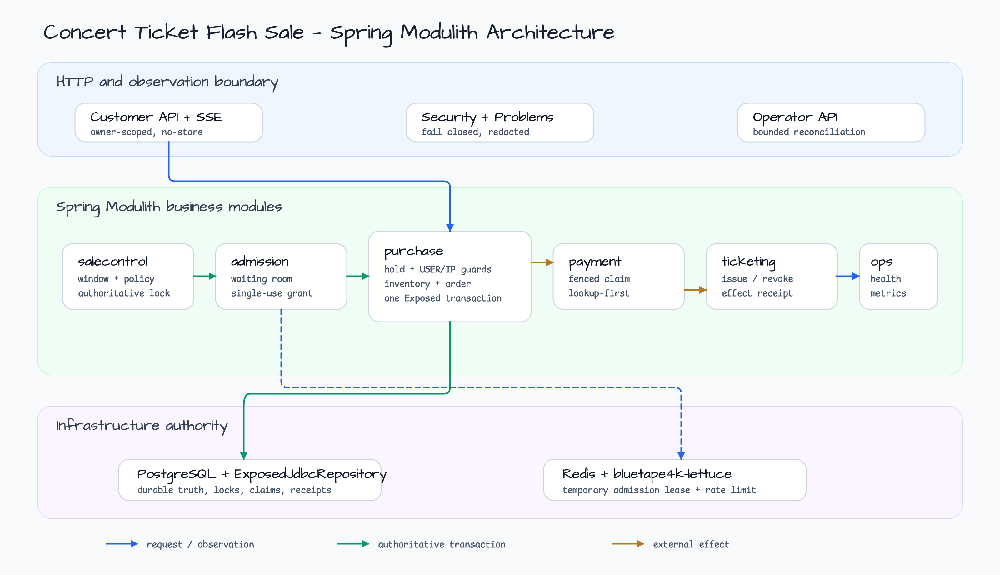
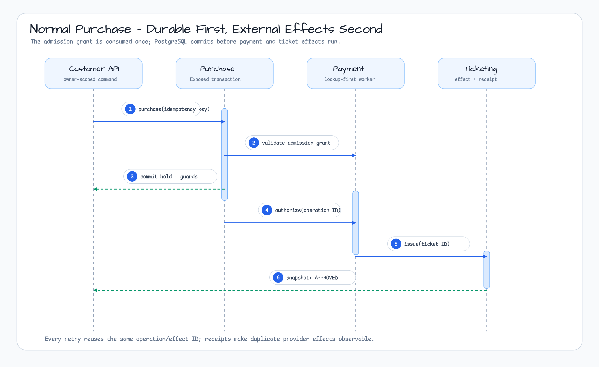
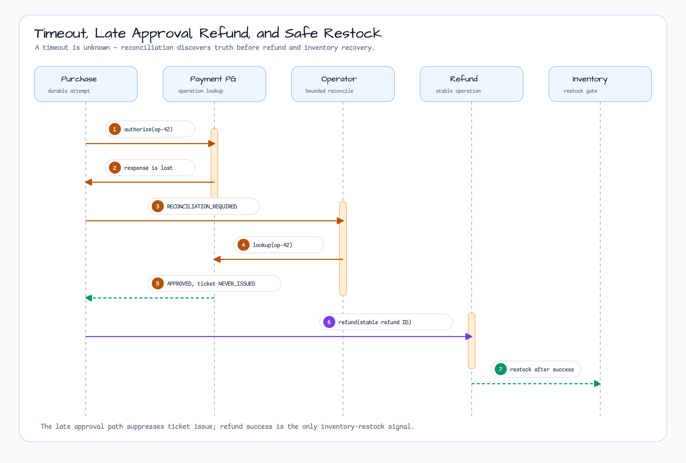
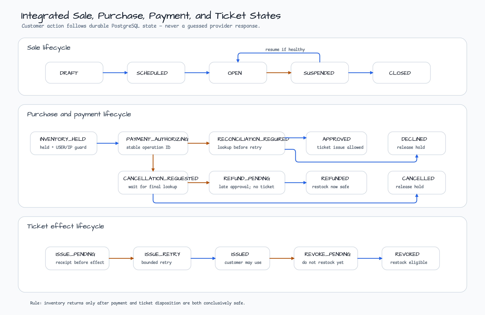
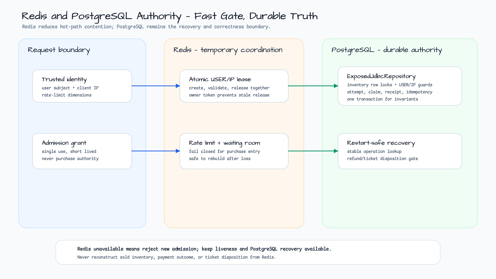
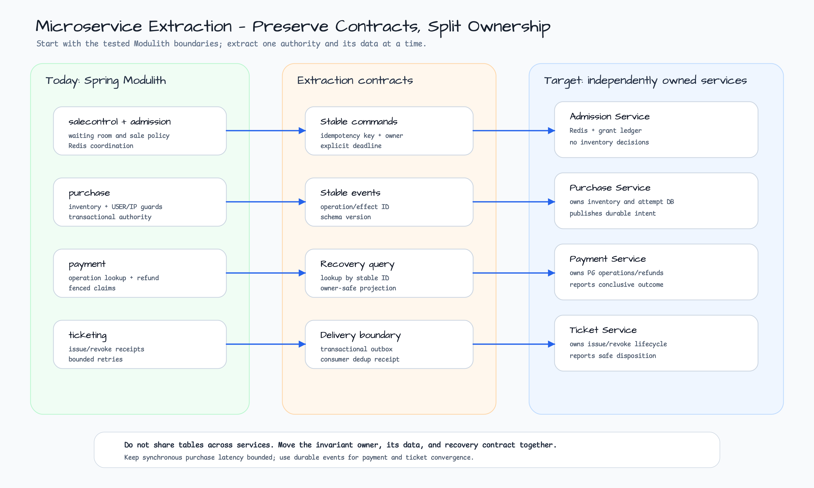

# 콘서트 티켓 Flash Sale

[English](README.md)

이 Spring Boot 4 / Kotlin 예제는 대규모 티켓 오픈에서 자주 만나는 실패 경계를 다룬다. 대기실 입장, 사용자/IP별 구매 제한, PostgreSQL 재고 직렬화, 결과를 알 수 없는 결제 timeout, 뒤늦은 승인, 환불, 티켓 발급·회수, 운영자 복구가 하나의 상태 모델로 이어진다.

구조는 Spring Modulith 기반 modular monolith다. 일반 DB 작업은 JetBrains Exposed와 Bluetape4k의 정확한 `ExposedJdbcRepository` 계약을 사용한다. Direct JDBC는 versioned startup migration에만 한정한다. Redis는 `bluetape4k-lettuce`로 임시 조정을 담당하며 판매 재고나 결제 결과의 영속적 진실이 아니다.



## Prerequisites and Java 25

- JDK 25. 신규 예제이므로 저장소의 Java 21 기본값과 의도적으로 다르다.
- PostgreSQL/Redis 통합 테스트를 위한 Docker 호환 container runtime.
- 수동 실행에는 PostgreSQL 18과 Redis 8. 테스트는 `bluetape4k-testcontainers`로 호환 container를 준비한다.
- 개별 Bluetape BOM은 사용하지 않고 `bluetape4k-dependencies`만 사용한다.

```bash
java -version
./gradlew :commerce-concert-ticket-flash-sale:test --max-workers=1
./gradlew :commerce-concert-ticket-flash-sale:build --max-workers=1
```

Hostile concurrency 검증은 고유 run ID를 요구한다.

```bash
./gradlew :commerce-concert-ticket-flash-sale:ticketStressTest \
  -PticketStressRun=local-ticket-check --max-workers=1
```

이 수치는 로컬 회귀 검증 자료이지 production capacity 약속이 아니다.

## Run, seed, and reset

로컬 dependency를 시작한다.

```bash
docker run --name ticket-postgres --rm -d \
  -e POSTGRES_USER=ticket -e POSTGRES_PASSWORD=ticket -e POSTGRES_DB=ticket \
  -p 5432:5432 postgres:18
docker run --name ticket-redis --rm -d -p 6379:6379 redis:8
```

Loopback 전용 demo profile로 실행한다.

```bash
export SPRING_DATASOURCE_URL=jdbc:postgresql://127.0.0.1:5432/ticket
export SPRING_DATASOURCE_USERNAME=ticket
export SPRING_DATASOURCE_PASSWORD=ticket
export WORKSHOP_TICKET_DEMO_OPERATOR_TOKEN=replace-with-a-long-local-secret
./gradlew :commerce-concert-ticket-flash-sale:bootRun \
  --args='--spring.profiles.active=demo --server.address=127.0.0.1'
```

`http://127.0.0.1:8080/`은 recovery contract 탐색 화면이다. Core module은 public sale 생성, seed/reset, purchase-start, network SSE endpoint를 의도적으로 노출하지 않는다. 통합 테스트가 module boundary에서 deterministic fixture를 만든다. 따라서 production 형태 애플리케이션에 위험한 reset API가 남지 않는다.

빈 로컬 DB로 다시 시작하려면 애플리케이션을 중지한 뒤 정확히 이 두 container만 중지한다.

```bash
docker stop ticket-postgres ticket-redis
```

앞의 실행 명령을 다시 수행하면 빈 store가 생성된다. Application migration은 version/checksum을 검증하고 PostgreSQL advisory transaction lock으로 동시 실행을 막는다.

## Join the waiting room

Admission에는 서로 다른 두 권한이 있다.

1. Redis가 짧게 유지되는 single-use 대기실 grant와 USER/IP lease를 원자적으로 관리한다.
2. PostgreSQL이 purchase transaction 안에서 판매 시간, 재고, USER/IP guard, policy version을 다시 검증한다.

Redis grant는 thundering herd를 줄이지만 재고 예약은 아니다. Redis 장애 시 신규 구매 진입은 fail closed하고, liveness와 PostgreSQL 복구는 유지한다. Production adapter는 사용자 subject를 인증된 principal에서, IP subject를 trusted-proxy allowlist 뒤에서 계산해야 한다.

## Purchase and replay a lost response

`PurchaseService.start`는 admission grant를 소비하고 정해진 순서로 inventory/guard lock을 획득한 뒤 attempt와 stable payment operation ID를 하나의 Exposed transaction으로 commit한다. 관련 repository는 정확한 Bluetape4k `ExposedJdbcRepository` interface를 구현한다.



HTTP 응답이 유실되면 같은 idempotency key와 동일 fingerprint로 재시도한다. 같은 key에 다른 body를 보내면 conflict다. Attempt ID를 알고 나면 owner-scoped recovery query를 사용한다.

```bash
BUYER=11111111-1111-1111-1111-111111111111
ATTEMPT=replace-with-seeded-attempt-id
curl -i \
  -H "X-Demo-Buyer: ${BUYER}" \
  "http://127.0.0.1:8080/api/v1/purchase-attempts/${ATTEMPT}"
```

응답은 `Cache-Control: no-store`다. 존재하지 않는 ID와 다른 구매자 소유 ID는 동일한 not-found problem을 반환하여 ID probing을 막는다.

## Reconcile timeout and late approval

Provider timeout은 `DECLINED`가 아니라 `UNKNOWN`이다. Payment worker는 fenced claim을 저장하고 stable operation ID로 provider를 호출하며, 재시작 후 같은 ID를 먼저 조회한다. 오래된 claim 결과는 최신 revision을 덮어쓸 수 없다.



결과가 불명확한 동안 취소를 요청했고 lookup에서 뒤늦은 승인이 확인되면 상태는 `REFUND_PENDING`, ticket disposition은 `NEVER_ISSUED`가 된다. 티켓 발급은 억제한다. 즉 돈은 보상하되 사용할 수 있는 티켓은 만들지 않는다.

Health와 backlog를 확인한 다음 제한된 operator pass만 실행한다.

```bash
curl -i -X POST http://127.0.0.1:8080/api/v1/operator/reconciliation-runs \
  -H 'Content-Type: application/json' \
  -H 'X-Operator-Token: replace-with-a-long-local-secret' \
  -d '{"limit":25,"reason":"reconcile unknown payment operations"}'
```

Reference application은 bounded operator framework를 제공하지만 기본 `ReconciliationJob` bean은 제공하지 않는다. Production adapter가 payment/refund lookup과 ticket-effect recovery job을 명시적으로 연결해야 한다. 빈 결과를 backlog가 없다는 증거로 해석하면 안 된다.

## Cancel, refund, revoke, and restock

취소는 convergence를 요청하는 것이지 provider가 즉시 취소됐다고 가정하는 동작이 아니다.

```bash
curl -i -X POST \
  -H "X-Demo-Buyer: ${BUYER}" \
  "http://127.0.0.1:8080/api/v1/purchase-attempts/${ATTEMPT}/cancellation"
```

재고는 두 영역이 모두 안전하다고 확정된 경우에만 복구한다.

- 승인이 거절됐거나 승인 전 hold가 만료됨
- 환불이 성공했고 티켓이 발급되지 않았음
- 환불이 성공했고 발급된 티켓 회수가 성공함

`REFUND_PENDING`, `REVOKE_PENDING`, quarantine 상태는 restock 신호가 아니다. 수동 SQL 수정은 Exposed transaction invariant를 우회하므로 금지한다.



## Operator invariant and backlog checks

다음 순서로 signal을 확인한다.

| Signal | 정상 | Warning | 조치 | 복구 확인 |
|---|---|---|---|---|
| Migration readiness | `UP` | checksum/lock 실패 | rollout 중단, immutable migration 비교 | clean restart 뒤 `UP` |
| Redis readiness | `UP` | `redis_unavailable` | 신규 admission 거부, recovery 유지 | lease acquire/validate/release 성공 |
| Payment unknown age | provider SLA 이내 | oldest age 증가 | bounded lookup reconciliation | stable ID가 terminal outcome 도달 |
| Refund backlog | 일정하거나 감소 | `REFUND_PENDING` 증가 | provider lookup 뒤 retry | 중복 없이 refund receipt 수렴 |
| Ticket quarantine | 0 | quarantine 존재 | provider receipt와 adapter 조사 | `REVOKED` 또는 안전한 disposition |
| DB bulkhead | 낮은 reject ratio | foreground reject 지속 | pool 증설 전 ingress 감소 | transaction p99/permit 정상화 |

무제한 reconciliation은 금지한다. Operator API는 요청당 최대 50개, 필수 reason, 독립 permit, 실행 deadline을 갖는다. Metric에는 low-cardinality result code만 넣고 buyer/IP/attempt/provider ID는 접근 통제된 진단에만 남긴다.

## State mapping: internal state to customer action

| Internal state | 고객 메시지 | 허용 동작 |
|---|---|---|
| `INVENTORY_HELD` | 재고를 잠시 확보했습니다 | 기다리고 다른 구매를 시작하지 않음 |
| `PAYMENT_AUTHORIZING` | 결제를 처리하고 있습니다 | 같은 attempt ID로 snapshot 재조회 |
| `RECONCILIATION_REQUIRED` | 결제 결과를 확인하고 있습니다 | 기다리거나 취소 요청, 재결제 금지 |
| `CANCELLATION_REQUESTED` | 취소 결과를 확인하고 있습니다 | provider 최종 lookup 대기 |
| `APPROVED` | 구매가 승인됐습니다 | ticket state가 `ISSUED`일 때만 사용 |
| `DECLINED`, `CANCELLED`, `EXPIRED` | 구매가 완료되지 않았습니다 | 새 admission 재시도 가능 |
| `REFUND_PENDING` | 환불 처리 중입니다 | attempt ID 보관, SLA 이후 문의 |
| `REFUNDED` | 환불이 완료됐습니다 | 추가 동작 없음 |
| `REFUND_QUARANTINED` | 수동 확인이 필요합니다 | 운영자 조사, 자동 restock 금지 |

Browser는 항상 텍스트와 accessible name이 있는 icon을 함께 표시한다. 색상만으로 상태를 전달하지 않는다.

## Redis and PostgreSQL authority



| Concern | Redis | PostgreSQL |
|---|---|---|
| Waiting-room lease | 임시 coordinator | 선택적 audit/reference |
| USER/IP 중복 억제 | 빠른 atomic lease | durable unique guard와 복구 권한 |
| Inventory | 권한 없음 | locked counter와 invariant owner |
| Payment/refund | 권한 없음 | stable operation, claim, outcome, receipt |
| Ticket issue/revoke | 권한 없음 | effect claim, receipt, disposition |
| HTTP idempotency | 선택적 edge 최적화 | fingerprint와 replay 권한 |

재사용 가능한 two-key Lua lease는 `bluetape4k-lettuce`로 승격하기 전까지 이 예제에 로컬로 둔다. 후속 작업은 [bluetape4k-projects #1065](https://github.com/bluetape4k/bluetape4k-projects/issues/1065)에서 추적한다.

## Production security boundary

`demo` profile의 `X-Demo-Buyer`와 `X-Operator-Token`은 loopback peer에서만 허용된다. 이 profile을 proxy 뒤나 신뢰하지 않는 network에 노출하면 안 된다.

Production은 header authenticator가 없으며 의도적으로 fail closed한다. 실제 Spring Security adapter는 다음을 만족해야 한다.

- 배포 IdP의 JWT/OAuth2 검증
- 변경되지 않는 stable subject UUID 매핑
- customer auth와 분리된 operator RBAC
- client IP 계산 전 trusted proxy 설정
- stateless bearer-token API인 경우에만 CSRF 비활성화
- public problem/metric에서 provider payload, credential, buyer/IP subject, operation ID redaction

Static page는 공개 문서지만 모든 `/api/**` endpoint는 인증이 필요하고 operator endpoint는 `ROLE_OPERATOR`가 추가로 필요하다.

## Microservice extraction guide



Modulith boundary와 recovery behavior를 측정한 뒤에만 분리한다.

1. 가장 강한 transaction invariant를 가진 purchase와 inventory는 먼저 함께 유지한다.
2. Stable effect ID와 consumer receipt를 경계로 ticketing을 분리한다.
3. PG가 stable operation ID 기반 lookup/idempotency를 보장할 때 payment를 분리한다.
4. Redis 유실이 durable recovery에 영향을 주지 않으므로 admission은 마지막 또는 독립적으로 분리한다.

각 서비스가 자기 table을 소유해야 한다. In-process Modulith publication은 transactional outbox와 schema-versioned event로 바꾼다. Owner-scoped recovery query, deadline, fenced claim, dedup receipt, low-cardinality observability를 보존한다. Distributed transaction과 shared database는 도입하지 않는다.

Module 내부 `TicketEventStream`은 bounded snapshot-first subscription과 slow-consumer eviction 계약을 증명한다. Durable event log나 network `SseEmitter` endpoint가 아니다. Production HTTP adapter는 durable high-water mark에서 재연결하거나 owner-safe polling으로 fallback해야 한다. Demo page는 durable SSE replay를 주장하지 않고 polling 동작만 보여준다.

### 검증

```bash
node scripts/validate-ticket-flash-sale-runbook.mjs
node scripts/validate-readme-architecture-diagrams.mjs
node scripts/validate-readme-diagram-qa.mjs
node scripts/validate-sequence-diagrams.mjs
./gradlew :commerce-concert-ticket-flash-sale:test --max-workers=1
```

## 고경합 증거

Docker daemon이 실행 중이고 JDK 25를 사용하며 Gradle과 container가 사용할
수 있는 메모리가 최소 4 GiB인 환경에서 Ticket과 Job Console profile을
실행합니다.

```bash
CI_RUN_ID=developer-ci-001
REFERENCE_RUN_ID=developer-reference-001
./gradlew highContentionCi -PhighContentionRunId="$CI_RUN_ID" --max-workers=1
./gradlew highContentionLocalReference -PhighContentionRunId="$REFERENCE_RUN_ID" --max-workers=1
```

정확성 게이트는 `highContentionCi`입니다. `highContentionLocalReference`는
해당 환경의 실행 관찰값을 기록할 뿐이며, 프레임워크 순위를 매기지 않는다.
또한 운영 용량을 입증하지 않는다. Canonical report는
`build/reports/high-contention/<run-id>/` 아래에 기록됩니다. 명령마다 새 run
ID를 사용해야 하며 local-reference 실행에는 clean worktree도 필요합니다.

Ticket adapter는 Spring-managed HikariCP pool을 사용하지만 inventory,
purchase fencing, payment reconciliation, deduplication, receipt의 권위는
PostgreSQL이 유지합니다. Toxiproxy는 기존 connection과 새 connection을
포함한 Redis admission 경로의 단절·복구에만 사용하며 PostgreSQL 권위를
대체하거나 broker, database, host failover를 증명하지 않습니다.
