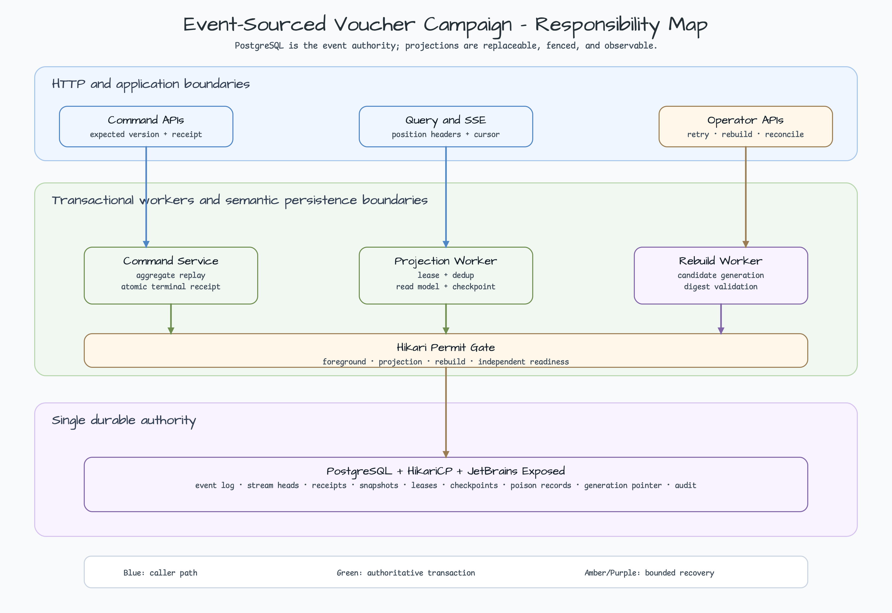
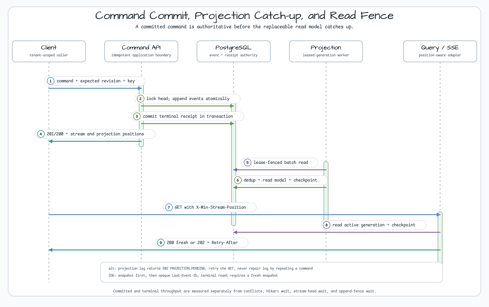
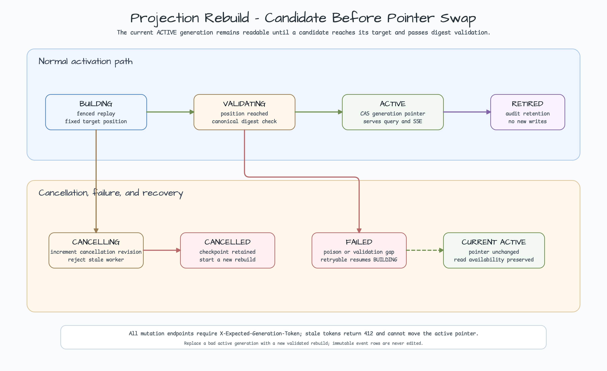

# Event-Sourced Promotion Voucher Campaign

[한국어](README.ko.md) | English

This Java 25 and Spring Boot 4 example keeps campaign and voucher history in an
append-only PostgreSQL event store. Commands use expected stream versions and
idempotency receipts; independently leased projections build the public read
model and can be rebuilt without replacing the event authority.

## Architecture



Spring MVC runs blocking work on Java 25 virtual threads, while a Spring-managed
HikariCP pool bounds PostgreSQL concurrency. Command, projection, rebuild, and
readiness lanes reserve separate permits. The event store, stream heads,
idempotency receipts, snapshots, projection checkpoints, poison records,
generation pointers, and operator audit records remain in PostgreSQL.

Repositories use bluetape4k `ExposedJdbcRepository` where generic CRUD is safe.
The event store and projection recovery boundaries deliberately expose semantic
operations instead of inherited CRUD, so callers cannot bypass append fencing,
lease ownership, checkpoint, deduplication, or read-model atomicity.

## Event Envelope

Every `EventEnvelope` contains:

| Field | Contract |
|---|---|
| `eventId` | UUIDv7 identity |
| `tenantId` | Tenant isolation key |
| `stream.type`, `stream.id`, `stream.version` | Aggregate stream and expected ordering |
| `globalPosition` | Monotonic cross-stream projection cursor |
| `eventType`, `schemaVersion` | Stable type and upcast version |
| `occurredAt`, `recordedAt` | Domain time and durable recording time |
| `correlationId`, `causationId` | Traceable command/event relationship |
| `actorSurrogate`, `actorHmacKeyVersion` | Erasable identity indirection, never raw identity |
| `payload`, `canonicalChecksum` | Bounded canonical JSON and tamper-evident checksum |

Payloads are limited to 64 KiB, depth 16, and 8 KiB per string. Voucher codes,
raw user identifiers, idempotency keys, authorization values, device/IP data,
and other sensitive fields are rejected before append. Unknown schemas and
upcast chains longer than four steps fail closed.

## Consistency and Lag



A successful command commits event rows and its terminal idempotency receipt in
one transaction. The response exposes the authoritative and observed positions:

| Header | Meaning |
|---|---|
| `X-Stream-Position` | Latest committed event-store position relevant to the response |
| `X-Projection-Position` | Position currently represented by the read model |
| `X-Projection-Lag` | `stream - projection` |
| `X-Min-Stream-Position` | Optional query fence supplied by the caller |
| `Idempotency-Replayed` / `X-Idempotent-Replay` | A stored terminal outcome was replayed; the representation may reflect newer aggregate state |
| `Retry-After` | Safe delay before retrying an in-progress command or lagging projection |

`GET /api/v1/campaigns/{campaignId}` returns `200` when the projection has
reached `X-Min-Stream-Position`. It returns `202 PROJECTION_PENDING` with
position headers and `Retry-After: 1` when the write is committed but the
projection has not caught up. The caller should retry the GET or refresh
manually; it must not repeat a non-idempotent command to repair read lag.

SSE starts with a `snapshot` event and then emits public descriptors ordered by
the opaque `Last-Event-ID` cursor. Reconnect with the last cursor. A malformed
cursor or one ahead of current positions is rejected with a stable safe error;
an older valid cursor resumes from a fresh snapshot. Queue overflow emits a
terminal `reset`, after which the client fetches a fresh snapshot.

## HTTP Contract

All API calls require `X-Workshop-Tenant` and `X-Workshop-Principal`. Commands
also require `Idempotency-Key`. Operator routes additionally require the
workshop operator secret/guard/role headers and rebuild mutations require
`X-Expected-Generation-Token`.

| Method and route | Success | Retry or operator action |
|---|---|---|
| `POST /operator/api/v1/campaigns` | `201`; replay returns the stored terminal outcome and may render newer aggregate state | `409 COMMAND_IN_PROGRESS`, then retry with the same idempotency key |
| `POST /operator/api/v1/campaigns/{campaignId}/activate` | `200` | Resolve revision conflict; do not blind retry with a new key |
| `POST /api/v1/campaigns/{campaignId}/claims` | `201` | Same-key retry for in-progress/transport uncertainty |
| `POST /api/v1/claims/{claimId}/redeem` | `200` | Inspect stable conflict code before retry |
| `POST /api/v1/claims/{claimId}/release` | `200` | Inspect stable conflict code before retry |
| `GET /api/v1/campaigns/{campaignId}` | `200` fresh body | `202` means retry GET or manually refresh |
| `GET /api/v1/campaigns/{campaignId}/events` | SSE `snapshot` plus cursor events | Reconnect with `Last-Event-ID`; fetch a new snapshot after `reset` |
| `POST /operator/api/v1/projections/{projection}/rebuilds` | `202` | Poll status; use returned generation/token |
| `GET /operator/api/v1/projections/{projection}/rebuilds/{generation}` | `200` | Diagnose state and checkpoint |
| `POST .../rebuilds/{generation}/cancel` | `200` | Poll until `CANCELLED` |
| `POST .../rebuilds/{generation}/resume` | `200` | Resume only retryable `FAILED` work; start a new rebuild after cancellation |
| `POST .../poison-events/{eventId}/retry` | `200` | Respect `409 POISON_RETRY_BACKOFF` and `Retry-After` |
| `POST .../reconciliation` | `200` | Verify lag, failed poison count, and digest before activation |

Campaign actions are state constrained:

| Current state | Allowed action | Rejected action |
|---|---|---|
| `DRAFT` | activate, capacity change | allocate/redeem before activation |
| `ACTIVE` | allocate, redeem, release, capacity change | second activation or capacity below allocations |
| `PAUSED` | release and operator recovery | new allocation |
| `ENDED` | reconciliation and historical reads | new allocation or activation |

Voucher transitions are one-way from `ELIGIBLE` to `ALLOCATED`, then to
`REDEEMED`, `RELEASED`, `EXPIRED`, or `REVOKED`. Expected revisions and
idempotency receipts make concurrent callers converge on one terminal result.

## Projection Recovery



A projection worker owns a 15-second lease, renews every five seconds, and
applies at most 200 events or 2 MiB per transaction. Checkpoint, deduplication,
read-model mutation, and lease fencing commit atomically. A poison event moves
the projection to a degraded, operator-visible path without advancing past the
failed event.

Rebuild creates a new generation in `BUILDING`, catches up to a fixed target,
enters `VALIDATING`, and becomes `ACTIVE` only after position and canonical
digest checks. The active pointer changes by fenced compare-and-set; the prior
generation is retained as `RETIRED` for audit and bounded cleanup. Cancel/resume increments the
cancellation revision so stale workers cannot continue writing.

## Security

Immutable events never contain raw user identities. The command boundary maps
an identity HMAC to a random UUIDv7 surrogate in the deletable
`voucher_subject_identity_mapping`; erasure deletes that mapping without
rewriting event history. HMAC inputs are separated by version, purpose, tenant,
and domain.

Production must inject a stable Base64 key of at least 32 bytes. Retired keys
remain available through the maximum receipt/snapshot replay window. Removing a
required key causes `503 REPLAY_KEY_UNAVAILABLE`, not a guessed response.
Mapping backups use a separate encrypted access class and must apply the
erasure deletion journal before restore readiness.

## Failure Injection

Integration fixtures can pause or fail command phases, projection application,
snapshot maintenance, and rebuild processing. Use them to prove active-generation preservation,
idempotent retry, lease takeover, poison-event degradation, stale-fence
rejection, and active-generation preservation. They are test-only hooks and do
not alter production defaults.

## Performance Profiles

Default `test` is container-free. `integrationTest` uses PostgreSQL
Testcontainers and a Spring-managed HikariCP datasource. The opt-in
`stressTest` separates correctness from machine-sensitive thresholds:

- hot stream: 64 virtual-thread clients, one campaign, 1,000 commands;
- independent streams: 64 clients, 32 campaigns, 1,000 commands;
- query plans: 100 tenants, 1,000 campaigns, 10,000 streams, 100,000 events,
  and 100,000 projection rows with `EXPLAIN (ANALYZE, BUFFERS)`;
- budgets: no unexpected sequential scan, bounded buffers/latency, zero
  starvation, and separately reported terminal, committed, conflict, Hikari,
  stream-head, and append-fence measurements.

These profiles are regression evidence, not production capacity guarantees.

## Runbook

1. Check health, projection lag, failed poison count, rebuild state, Hikari
   waiting, stream-head wait, and append-fence wait.
2. Fix the event handler, schema/upcaster, key availability, or deployment
   fault before changing projection state.
3. Retry one poison event when the failure is isolated; start or resume a
   rebuild when the generation is incomplete or broadly inconsistent.
4. Verify checkpoint equals the intended stream position and compare the
   canonical projection digest. Run reconciliation and inspect the operator
   audit record.
5. Activate only a validated candidate. Keep the current `ACTIVE` generation
   when validation fails. To replace a bad active generation, fix the handler
   and start a new rebuild from event authority; do not rewrite events or
   manually restore a retained pointer.
6. Re-run reconciliation and keep alerts open until lag and failed poison count
   return to zero.

Alert when projection lag reaches 10,000 events, foreground permit utilization
reaches 80%, any poison event reaches `FAILED`, rebuild ETA exceeds ten minutes,
or lock/statement timeouts exceed 1%. Operator audit lookup is the source for
who requested retry, rebuild, cancel, resume, reconciliation, and activation.

## Run

```bash
./gradlew :commerce-event-sourced-promotion-voucher-campaign:test --console=plain
./gradlew :commerce-event-sourced-promotion-voucher-campaign:integrationTest --console=plain
./gradlew :commerce-event-sourced-promotion-voucher-campaign:koverXmlReport --console=plain
./gradlew :commerce-event-sourced-promotion-voucher-campaign:stressTest \
  -PeventSourcedStress=true --console=plain
node scripts/validate-event-sourced-voucher-readme.mjs
EXPECTED_GRADLE_PROJECTS=112 ./scripts/smoke-validate.sh stale-check
```

Start the application with a PostgreSQL datasource and production HMAC key:

```bash
export VOUCHER_HMAC_ACTIVE_VERSION=2
export VOUCHER_HMAC_ACTIVE_KEY_BASE64='<base64-secret>'
./gradlew :commerce-event-sourced-promotion-voucher-campaign:bootRun
```

## Production Boundary

This workshop demonstrates one PostgreSQL event authority, bounded synchronous
projection workers, generation-safe rebuild, and stable HTTP compatibility
with the normalized voucher example. It does not provide multi-region event
replication, schema deployment automation, tax/payment handling, or a Kafka
read-model transport. Add broker delivery only after preserving expected
version, idempotency, fencing, checkpoint, deduplication, and active-pointer
semantics.
