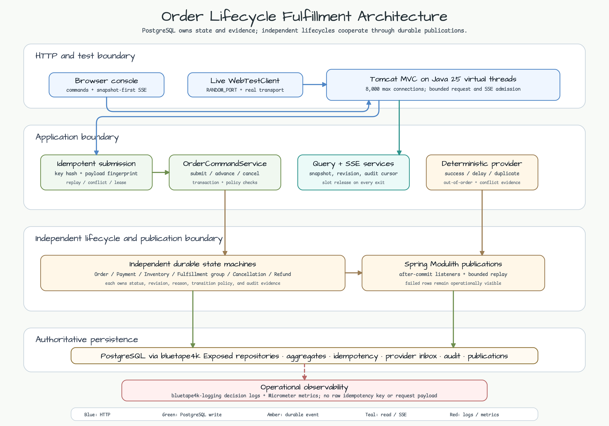
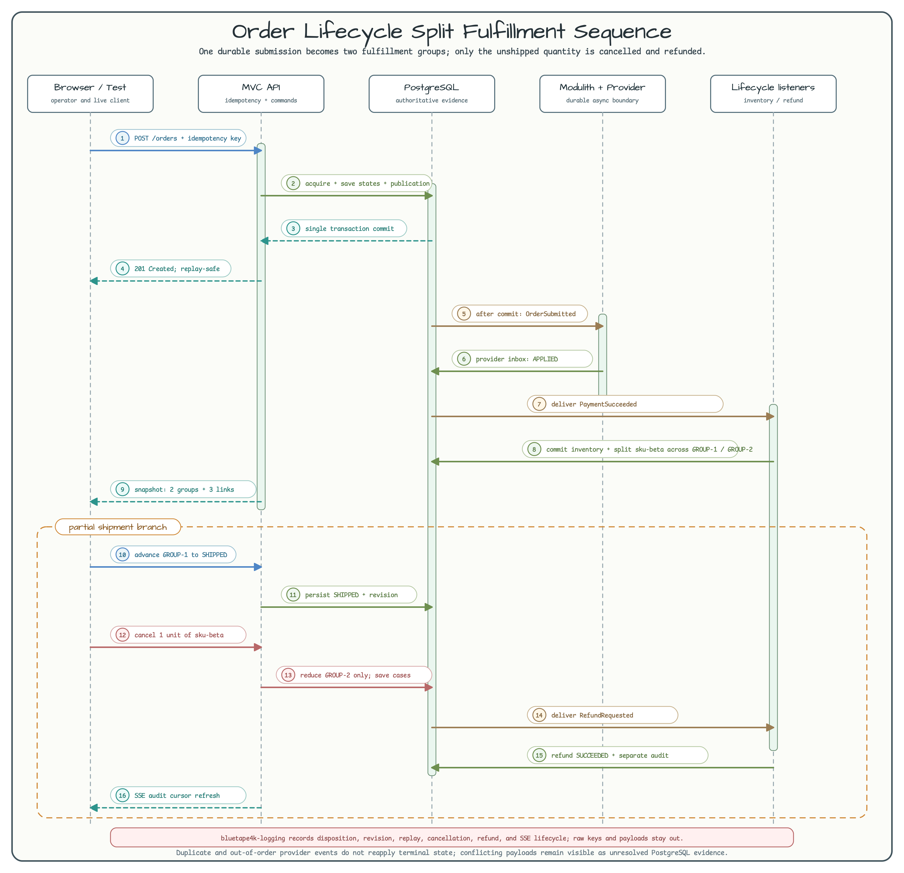

# 주문 생명주기와 분할 배송

[English](README.md) | 한국어

이 Spring Boot MVC 예제는 주문, 결제, 재고 예약, 배송, 취소, 환불 생명주기를 서로
독립적으로 관리합니다. PostgreSQL을 authoritative store로 사용하고, Spring
Modulith가 application event publication을 영속화합니다. 외부 결제 시스템
대신 deterministic payment provider를 사용해 성공, 실패, 중복, 순서 역전
시나리오를 반복해서 재현합니다.

## 학습 목표

- 하나의 전역 주문 상태 대신 각 생명주기에 독립적인 status와 revision을 둡니다.
- PostgreSQL aggregate persistence에 `bluetape4k-exposed-jdbc` repository를 사용합니다.
- 운영 형태의 테스트에 `bluetape4k-exposed-jdbc-tests`와 `PostgreSQLServer`를 사용합니다.
- 애플리케이션이 소유하는 PostgreSQL 테이블로 HTTP submission을 idempotent하게 만듭니다.
- 실패한 event publication을 노출하고 제한된 operator endpoint로 replay합니다.
- SSE에서 snapshot을 먼저 보내고 이후 audit event를 증분 전달합니다.
- Java 25 virtual thread를 사용하면서 JDBC 동시성은 HikariCP로 제한합니다.

## 생명주기 경계

| Aggregate | 진행 예 |
|-----------|---------|
| Order | `SUBMITTED -> ACCEPTED -> FULFILLMENT_IN_PROGRESS` |
| Payment attempt | `CREATED -> AUTHORIZING -> SUCCEEDED|FAILED` |
| Inventory reservation | `HELD -> COMMITTED|RELEASED|RECONCILIATION_REQUIRED` |
| Fulfillment group | `REQUESTED -> ALLOCATED -> PICKING -> SHIPPED -> DELIVERED` |
| Cancellation case | `REQUESTED -> APPROVED|REJECTED` |
| Refund case | `REQUESTED -> PENDING_PROVIDER -> SUCCEEDED|FAILED|MANUAL_REVIEW` |

결제가 성공해도 주문은 완료되지 않습니다. Split fulfillment group은 서로
독립적으로 진행할 수 있고, 아직 배송되지 않은 line을 취소하면 이미 배송된
line을 되돌리지 않고 cancellation case와 refund case를 각각 생성합니다.

## 예제 시나리오

| 시나리오 | 재현 방법 | 확인할 증거 |
|----------|-----------|-------------|
| 멱등 주문 제출 | 같은 key와 canonical payload를 두 번 전송한 다음, SKU를 바꾼 payload에 같은 key를 사용합니다. | 두 번째 응답은 `Idempotency-Replayed: true`이고, 변경된 payload는 HTTP 409를 받습니다. 로그에는 원본 key나 payload 대신 key hash prefix만 남습니다. |
| 지연 및 충돌 provider event | `DELAYED_SUCCESS` 주문을 만들고 지연 성공을 전달한 다음, integration fixture에서 같은 provider event ID에 다른 payload를 전달합니다. | Payment는 한 번만 `SUCCEEDED`가 됩니다. 중복·순서 역전 event는 terminal state를 다시 적용하지 않고, 충돌 payload는 PostgreSQL unresolved evidence로 계속 집계됩니다. |
| 분할 배송과 부분 취소 | 기본 주문을 만듭니다. 수량이 2인 `sku-beta`는 `GROUP-1`과 `GROUP-2`에 나뉩니다. `GROUP-1`을 `SHIPPED`로 진행한 뒤 `sku-beta` 한 개를 취소합니다. | 배송된 link의 수량 1은 유지되고 미배송 `GROUP-2` link만 0이 됩니다. Cancellation과 refund는 서로 다른 revision과 audit row를 유지합니다. |
| 실패 publication replay | Integration fixture에서 inventory listener의 결정적 1회 실패를 설정하고 결제 성공을 전달한 뒤 제한된 replay endpoint를 호출합니다. | 실패 publication은 replay 전까지 노출되고, inventory와 fulfillment는 정확히 한 번만 생성됩니다. |

브라우저만으로 확인하려면 기본 `SUCCESS` 주문을 만들고 `GROUP-1`을
`ALLOCATED`, `PICKING`, `SHIPPED` 순서로 진행한 뒤 `sku-beta`의
**Cancel one**을 누릅니다. Console은 SSE로 갱신되며 배송된 group, 취소된
group, 승인된 cancellation, 성공한 refund, 각 aggregate revision과 audit
history를 독립적으로 보여 줍니다.

## Architecture



HTTP boundary는 Java 25 virtual thread에서 실행하지만 PostgreSQL 동시성은
HikariCP로 제한합니다. Application-owned idempotency, Exposed repository,
Spring Modulith publication, provider inbox evidence, audit history, query/SSE,
`bluetape4k-logging`, Micrometer를 서로 다른 운영 경계로 유지합니다.

## Sequence Diagram



이 흐름은 하나의 line을 실제로 분할합니다. `sku-beta` 한 개는 `GROUP-1`과
함께 이미 배송됐고, `GROUP-2`의 남은 한 개만 취소됩니다. 배송 완료 group과
취소 group만 남으면 주문은 `COMPLETED`가 되고, 모든 group이 취소되면 주문은
`CANCELLED`가 됩니다.

## REST API와 브라우저

애플리케이션을 시작한 뒤 `http://localhost:8080/`을 엽니다. Browser console은
결정적인 주문 제출, 현재 snapshot 조회, SSE 구독, aggregate revision과 audit
history 표시, fulfillment 진행, active line 부분 취소, 지연 결제 성공 전달,
workshop operator용 publication replay를 제공합니다.

주문 제출:

```bash
curl -i -X POST http://localhost:8080/api/v1/orders \
  -H 'Content-Type: application/json' \
  -H 'Idempotency-Key: demo-order-0001' \
  -d '{
    "tenantId":"tenant-demo",
    "customerReference":"customer-order-0001",
    "providerMode":"SUCCESS",
    "lines":[
      {"sku":"sku-a","quantity":1,"unitPrice":10.00},
      {"sku":"sku-b","quantity":2,"unitPrice":20.00}
    ]
  }'
```

같은 canonical payload와 key를 다시 사용하면 저장된 응답과
`Idempotency-Replayed: true`를 반환합니다. 다른 payload에 같은 key를 쓰면
HTTP 409와 `IDEMPOTENCY_FINGERPRINT_CONFLICT`를 반환합니다. 원본 key는
저장하지 않고 고정 길이 hash만 저장합니다.

Operator replay는 의도적으로 제한합니다.

```bash
curl -X POST 'http://localhost:8080/api/v1/operations/publications/replay-failed?batchSize=10'
```

`batchSize`는 100을 넘을 수 없습니다. 운영 배포에서는 이 route를 operator
인증과 권한 뒤에 두어야 합니다.

## 동시성과 timeout

```yaml
spring:
  datasource:
    hikari:
      maximum-pool-size: 8
      minimum-idle: 2
      connection-timeout: 60000
  transaction:
    default-timeout: 60s
server:
  tomcat:
    threads:
      max: 8000
    max-connections: 8000
    accept-count: 1000
```

Spring virtual thread가 활성화되면 Tomcat은 `threads.max`를 무시합니다. 이 값은
platform thread fallback으로 유지하고, 실제 HTTP admission limit는
`max-connections`로 둡니다. Virtual thread가 PostgreSQL connection 비용을
낮추지는 않으므로 Hikari pool은 작게 유지합니다. 늘어난 connection 및
transaction timeout은 제한된 대기를 허용할 뿐, DB capacity나 backpressure를
대신하지 않습니다.

## 운영 Logging

운영 component는 lazy `KLogging` message를 제공하는 `bluetape4k-logging`을
사용합니다. Command 결과, idempotency disposition, provider event 판정,
aggregate revision, publication replay, refund 완료, SSE 연결과 반환을 안정적인
`key=value` field로 기록합니다. 원본 idempotency key, canonical payload,
response body, 고객 데이터는 의도적으로 로그에서 제외합니다.

## 실행과 검증

애플리케이션은 `application.yml` 또는 `ORDER_DATABASE_*` 환경 변수의
PostgreSQL 설정을 사용합니다. 테스트는 `PostgreSQLServer`로 PostgreSQL을
시작합니다.

HTTP integration test는 `RANDOM_PORT + WebTestClient.bindToServer()`를 사용해
실제 Tomcat, virtual thread, static resource, SSE 경계를 실행합니다.

```bash
./gradlew :commerce-order-lifecycle-fulfillment:test --max-workers=1
./gradlew :commerce-order-lifecycle-fulfillment:bootJar
```

이 모듈은 저장소 공통 `bluetape4k-dependencies` BOM을 사용합니다. Bluetape
모듈 버전은 로컬에서 별도로 고정하지 않습니다.
