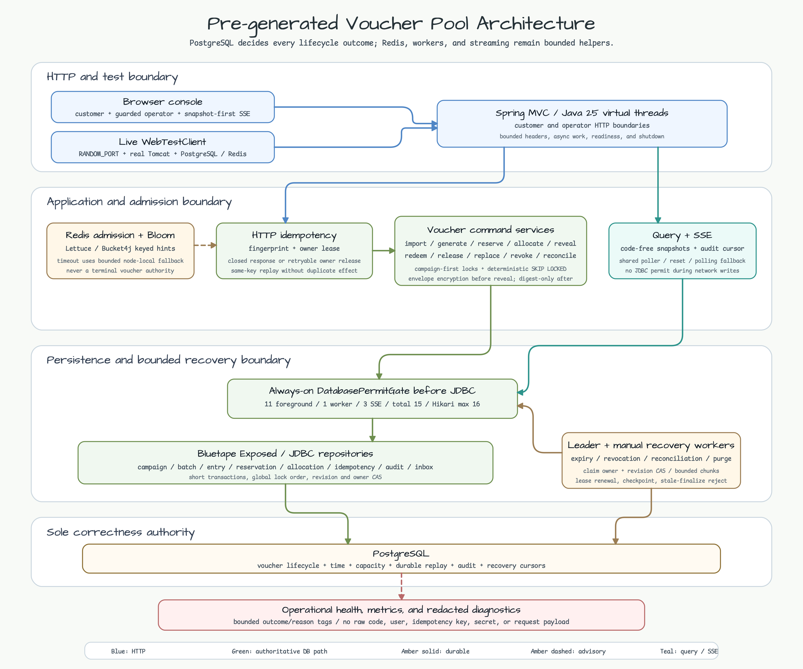
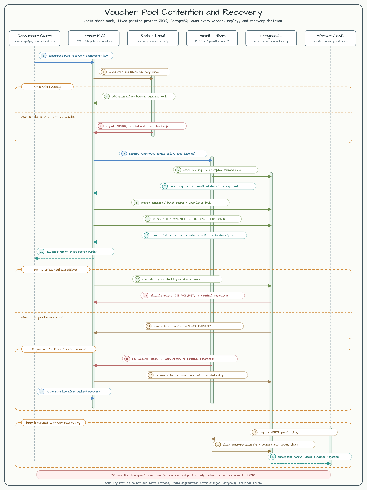

# 사전 생성 바우처 풀

[English](README.md) | 한국어

이 Spring Boot MVC 워크숍은 수요가 발생하기 전에 암호화된 바우처 재고를 import하거나 생성하고, 같은 entry를 두 번 소비하지 않으면서 reservation, allocation, reveal, redemption, release, revoke, reconciliation을 수행하는 방법을 보여줍니다. 유일한 정합성 기준은 PostgreSQL입니다. Redis admission, Bloom signal, leader scheduling은 보조 수단이므로 장애가 나면 처리량은 낮아질 수 있지만 상태 전이를 승인할 수는 없습니다.

> 워크숍 경계: 애플리케이션은 loopback에만 bind하고 production IAM, OAuth, CSRF 인프라 대신 local header를 사용합니다. Operator route와 mounted key material은 격리된 개발 장비에서만 사용해야 합니다. Loopback이 아닌 interface에 노출하지 마십시오.

이 모듈은 Java 25 virtual thread, 16개로 고정한 Hikari pool, foreground 11개, worker 1개, SSE 3개로 나눈 database permit을 사용합니다. 바우처 평문은 import 요청과 최초로 commit된 reveal 응답에만 나타납니다. Snapshot, metric, diagnostic, audit row, application log에는 바우처 material을 남기지 않습니다.

## Architecture



중앙 경로는 Browser 또는 `curl` -> Tomcat MVC -> idempotency owner -> bounded database permit -> application service -> PostgreSQL입니다. Entry는 persistence 전에 envelope key로 암호화합니다. Redis는 과도한 admission을 일찍 거절하고 leader는 중복 worker trigger를 줄일 수 있지만, 모든 reservation과 terminal result는 PostgreSQL transaction, row lock, revision, unique constraint가 결정합니다.

## 경합과 복구



동시에 실행되는 allocator는 제한된 lock으로 eligible entry를 선택하고 서로 다른 winner로 수렴합니다. Command는 safe response descriptor를 저장하거나 retryable owner를 해제하거나 terminal tombstone을 유지할 때까지 idempotency key를 소유합니다. Connection acquisition timeout과 permit 포화는 재시도 가능한 `503 BACKEND_TIMEOUT`으로 매핑되며, eligible row는 있지만 lock 가능한 candidate가 없는 도메인 경합은 `503 POOL_BUSY`로 매핑됩니다. 두 경우 모두 retryable owner를 해제하고 terminal descriptor를 쓰지 않습니다.

Sequence는 one-time reveal 응답 유실도 다룹니다. Reveal을 replay해도 code를 다시 반환하지 않습니다. Customer가 응답 유실을 명시적으로 확인하면 server는 노출된 entry를 revoke하고 같은 entitlement root 아래에서 최대 한 개의 replacement reservation을 만듭니다. Reconciliation은 PostgreSQL row를 기준으로 pool-depth와 user-limit counter를 복구할 뿐 winner를 새로 만들지 않습니다.

## 사전 준비와 설정

- JDK 25
- 빈 `voucher_pool` database가 있는 PostgreSQL 16+
- Advisory 경로를 활성화할 때만 Redis
- 현재 process user가 소유한 permission-restricted absolute key-file path
- `curl`; walkthrough에서는 `jq`를 함께 사용하면 편리합니다

Operator credential과 key material에는 기본값이 없습니다. Test profile이 아니라면 `VOUCHER_POOL_OPERATOR_SECRET`, `VOUCHER_POOL_OPERATOR_GUARD`, `VOUCHER_POOL_KEY_FILE`이 필수입니다. Mounted JSON file은 64 KiB 이하의 canonical non-symlink regular file이어야 하고 owner만 읽을 수 있어야 합니다. `stableDedup`, `commandTombstone`, rotating `VERIFICATION`, `USER_IDENTITY`, `REDIS_SIGNAL`, `AUDIT` ring과 `kek` ring을 포함합니다. 서로 독립적인 high-entropy 값을 생성하고 test fixture를 복사하지 마십시오.

| 관심사 | 기본값 | 변경 방법 또는 불변식 |
|---|---:|---|
| HTTP | `127.0.0.1:8080` | `VOUCHER_POOL_SERVER_ADDRESS`, `VOUCHER_POOL_SERVER_PORT` |
| Management | `127.0.0.1:8081` | `VOUCHER_POOL_MANAGEMENT_PORT` |
| PostgreSQL | `jdbc:postgresql://localhost:5432/voucher_pool` | `VOUCHER_POOL_DATABASE_URL`, `VOUCHER_POOL_DATABASE_USERNAME`, `VOUCHER_POOL_DATABASE_PASSWORD` |
| Hikari | max 16, min idle 4, acquisition 2s | 포화 시 첫 대응으로 pool을 늘리지 않음 |
| Foreground lane | permit 11개, wait 250ms, transaction/lock 5s | Customer와 operator command |
| Worker lane | permit 1개, wait 1s, transaction/lock 10s | Revoke, expiry, reconciliation, retention |
| SSE lane | permit 3개, wait 1s, transaction/lock 5s | Snapshot과 cursor polling |
| Redis | disabled, command timeout 500ms | `VOUCHER_POOL_REDIS_ENABLED`, `VOUCHER_POOL_REDIS_URI` |
| SSE | 전체 32개, scope당 8개, queue 64, write 5s | 제한된 reset과 polling fallback |
| Operator 경계 | credential 기본값 없음 | `VOUCHER_POOL_OPERATOR_SECRET`, `VOUCHER_POOL_OPERATOR_GUARD` |
| Key material | 기본값과 CLI key 없음 | `VOUCHER_POOL_KEY_FILE` absolute mounted-secret path |

```bash
export VOUCHER_POOL_DATABASE_URL=jdbc:postgresql://localhost:5432/voucher_pool
export VOUCHER_POOL_DATABASE_USERNAME=vouchers
export VOUCHER_POOL_DATABASE_PASSWORD=vouchers
export VOUCHER_POOL_OPERATOR_SECRET='replace-with-at-least-32-random-bytes'
export VOUCHER_POOL_OPERATOR_GUARD='replace-with-an-independent-random-guard'
export VOUCHER_POOL_KEY_FILE=/absolute/path/to/voucher-pool-keys.json
chmod 600 "$VOUCHER_POOL_KEY_FILE"
./gradlew :commerce-pre-generated-voucher-pool:bootRun
```

Advisory admission과 leader scheduling을 확인할 때만 Redis를 활성화합니다.

```bash
export VOUCHER_POOL_REDIS_ENABLED=true
export VOUCHER_POOL_REDIS_URI=redis://127.0.0.1:6379
./gradlew :commerce-pre-generated-voucher-pool:bootRun
```

## 가져오기와 생성

Operator 요청에는 loopback transport, 허용된 `Host`, same-origin `Origin` 또는 `X-Workshop-Origin`, `X-Workshop-Tenant`, `X-Workshop-Operator-Secret`, `X-Workshop-Guard`가 필요합니다. Mutation에는 `Idempotency-Key`와 명시적인 생성 또는 revision precondition도 필요합니다.

| Method | Operator route | 용도 |
|---|---|---|
| `POST` | `/operator/api/v1/campaigns` | Campaign 생성 |
| `POST` | `/operator/api/v1/campaigns/{campaignId}/policy` | `If-Match` 아래에서 policy 변경 |
| `POST` | `/operator/api/v1/campaigns/{campaignId}/activate`, `/pause`, `/resume` | Campaign lifecycle 이동 |
| `POST` | `/operator/api/v1/campaigns/{campaignId}/revoke-preview`, `/revoke` | Campaign revoke preview와 confirm |
| `POST` | `/operator/api/v1/batches/import`, `/operator/api/v1/batches/generate` | Import 또는 generation batch 생성 |
| `POST` | `/operator/api/v1/batches/{batchId}/import-chunks`, `/generate-chunks` | Replay-safe ordered chunk 추가 |
| `POST` | `/operator/api/v1/batches/{batchId}/activate`, `/pause`, `/resume` | Batch lifecycle 이동 |
| `POST` | `/operator/api/v1/batches/{batchId}/revoke-preview`, `/revoke` | Batch revoke preview와 confirm |
| `POST` | `/operator/api/v1/reconciliation/run` | Bounded reconciliation 1회 실행 |
| `GET` | `/operator/api/v1/batches/{batchId}`, `/pool-depth`, `/reservations/stuck` | Authoritative operator state 조회 |
| `GET` | `/operator/api/v1/diagnostics/{requestId}`, `/snapshots`, `/events` | Bounded diagnostic, snapshot, SSE 조회 |

Campaign을 생성하고 activate한 뒤 첫 chunk를 포함한 import batch를 만듭니다. 응답의 `ETag`는 따옴표를 포함한 형태 그대로 다시 사용합니다.

```bash
ORIGIN=http://127.0.0.1:8080
TENANT=voucher-pool-demo
CAMPAIGN_ID=018f3b8c-45a7-7cc1-8f1d-31b63140d001
BATCH_ID=018f3b8c-45a7-7cc1-8f1d-31b63140d101
MANIFEST=$(printf 'voucher-pool-import-v1' | shasum -a 256 | awk '{print $1}')
OPERATOR=(-H "Origin: $ORIGIN" -H "X-Workshop-Tenant: $TENANT" \
  -H "X-Workshop-Operator-Secret: $VOUCHER_POOL_OPERATOR_SECRET" \
  -H "X-Workshop-Guard: $VOUCHER_POOL_OPERATOR_GUARD")

curl -i -X POST "$ORIGIN/operator/api/v1/campaigns" "${OPERATOR[@]}" \
  -H 'Content-Type: application/json' -H 'Idempotency-Key: campaign-create-0001' \
  -H 'If-None-Match: *' \
  -d "{\"campaignId\":\"$CAMPAIGN_ID\",\"startsAt\":\"2026-07-20T00:00:00Z\",\"endsAt\":\"2036-07-20T00:00:00Z\",\"perUserLimit\":1,\"reservationTtlSeconds\":300,\"allocationTtlSeconds\":1800,\"replacementAllowance\":1}"

curl -i -X POST "$ORIGIN/operator/api/v1/campaigns/$CAMPAIGN_ID/activate" "${OPERATOR[@]}" \
  -H 'Content-Type: application/json' -H 'Idempotency-Key: campaign-activate-0001' \
  -H 'If-Match: "0"' -d '{}'

curl -i -X POST "$ORIGIN/operator/api/v1/batches/import" "${OPERATOR[@]}" \
  -H 'Content-Type: application/json' -H 'Idempotency-Key: batch-import-0001' \
  -H 'If-None-Match: *' \
  -d "{\"batchId\":\"$BATCH_ID\",\"campaignId\":\"$CAMPAIGN_ID\",\"manifestDigest\":\"$MANIFEST\",\"expectedCount\":2,\"activatesAt\":\"2026-07-20T00:00:00Z\",\"codes\":[\"POOL-IMPORT-0001\"]}"

curl -i -X POST "$ORIGIN/operator/api/v1/batches/$BATCH_ID/import-chunks" "${OPERATOR[@]}" \
  -H 'Content-Type: application/json' -H 'Idempotency-Key: batch-import-0002' \
  -H 'If-Match: "1"' \
  -d "{\"campaignId\":\"$CAMPAIGN_ID\",\"firstOrdinal\":1,\"manifestDigest\":\"$MANIFEST\",\"codes\":[\"POOL-IMPORT-0002\"]}"

curl -i -X POST "$ORIGIN/operator/api/v1/batches/$BATCH_ID/activate" "${OPERATOR[@]}" \
  -H 'Content-Type: application/json' -H 'Idempotency-Key: batch-activate-0001' \
  -H 'If-Match: "2"' -d '{}'
```

Server-side generation은 `/operator/api/v1/batches/generate`를 생성한 뒤 `firstOrdinal`, `manifestDigest`, bounded `count`를 가진 `/generate-chunks`를 순서대로 추가하고 반환된 revision에서 activate합니다. Import와 generation은 replay-safe합니다. Batch는 source kind, manifest digest, expected count, next ordinal, accepted/rejected count, failure code를 고정합니다. 누락된 chunk를 추측하지 말고 authoritative batch snapshot에서 재개하십시오.

## 고객 워크플로

Customer route는 `X-Workshop-Tenant`, `X-Workshop-Principal`을 사용하고 mutation은 `Idempotency-Key`와 strong ETag precondition도 사용합니다. `ReserveVoucherRequest`는 의도적으로 비어 있는 closed JSON object입니다. 안전한 `GET` 응답에는 entry identity나 바우처 material이 포함되지 않습니다.

| Method | Customer route | 용도 |
|---|---|---|
| `POST` | `/api/v1/campaigns/{campaignId}/reservations` | Eligible entry 하나 reserve |
| `GET` | `/api/v1/reservations/{reservationId}` | Owner-scoped reservation 조회 |
| `POST` | `/api/v1/reservations/{reservationId}/allocate` | Active reservation을 allocation으로 전환 |
| `POST` | `/api/v1/allocations/{allocationId}/code-reveals` | Code를 한 번만 전달 |
| `GET` | `/api/v1/allocations/{allocationId}` | Code-free allocation snapshot 조회 |
| `POST` | `/api/v1/allocations/{allocationId}/replacements` | Reveal 유실을 확인하고 bounded replacement 생성 |
| `POST` | `/api/v1/allocations/{allocationId}/redeem` | Code 검증과 redemption |
| `POST` | `/api/v1/allocations/{allocationId}/release` | Unredeemed allocation을 재활용 없이 release |
| `GET` | `/api/v1/snapshots`, `/api/v1/events` | Snapshot-first state와 SSE update 조회 |

```bash
USER_REF=customer-001
CUSTOMER=(-H "X-Workshop-Tenant: $TENANT" -H "X-Workshop-Principal: $USER_REF")

RESERVATION_HEADERS=$(mktemp)
RESERVATION_BODY=$(mktemp)
curl -sS -D "$RESERVATION_HEADERS" -o "$RESERVATION_BODY" \
  -X POST "$ORIGIN/api/v1/campaigns/$CAMPAIGN_ID/reservations" "${CUSTOMER[@]}" \
  -H 'Content-Type: application/json' -H 'Idempotency-Key: reserve-0001' \
  -H 'If-None-Match: *' -d '{}'
RESERVATION_ID=$(jq -r .reservationId "$RESERVATION_BODY")

ALLOCATION_BODY=$(mktemp)
curl -sS -o "$ALLOCATION_BODY" \
  -X POST "$ORIGIN/api/v1/reservations/$RESERVATION_ID/allocate" "${CUSTOMER[@]}" \
  -H 'Idempotency-Key: allocate-0001' -H 'If-Match: "0"'
ALLOCATION_ID=$(jq -r .allocationId "$ALLOCATION_BODY")

REVEAL_BODY=$(mktemp)
curl -sS -o "$REVEAL_BODY" \
  -X POST "$ORIGIN/api/v1/allocations/$ALLOCATION_ID/code-reveals" "${CUSTOMER[@]}" \
  -H 'Idempotency-Key: reveal-0001' -H 'If-Match: "0"'
VOUCHER_CODE=$(jq -r .code "$REVEAL_BODY")
REVISION=$(jq -r .revision "$REVEAL_BODY")

curl -i -X POST "$ORIGIN/api/v1/allocations/$ALLOCATION_ID/redeem" "${CUSTOMER[@]}" \
  -H 'Content-Type: application/json' -H 'Idempotency-Key: redeem-0001' \
  -H "If-Match: \"$REVISION\"" -d "{\"code\":\"$VOUCHER_CODE\"}"

rm -f "$RESERVATION_HEADERS" "$RESERVATION_BODY" "$ALLOCATION_BODY" "$REVEAL_BODY"
```

결과를 알기 전에 응답을 잃었다면 method, route, header, idempotency key, body를 모두 동일하게 replay합니다. `COMMAND_IN_PROGRESS`는 `Retry-After`를 포함하고 완료된 descriptor는 두 번째 effect 없이 replay됩니다. 같은 key에서 payload를 바꾸면 `IDEMPOTENCY_FINGERPRINT_CONFLICT`가 됩니다.

## 유실된 reveal 교체

Reveal 응답은 한 번만 전달됩니다. Replay는 `code` 없이 `200 ALREADY_REVEALED`, `replacementAvailable`, safe request ID를 반환합니다. 먼저 `GET /api/v1/allocations/{allocationId}`와 해당 diagnostic을 확인합니다. Customer가 commit된 응답을 실제로 잃었다면 최신 ETag로 replacement를 명시적으로 확인합니다.

```bash
curl -i -X POST "$ORIGIN/api/v1/allocations/$ALLOCATION_ID/replacements" "${CUSTOMER[@]}" \
  -H 'Content-Type: application/json' -H 'Idempotency-Key: replace-lost-0001' \
  -H "If-Match: \"$REVISION\"" -d '{"confirmLostReveal":true}'
```

기존 allocation은 lost-reveal reason으로 `REVOKED`가 되며 inventory로 돌아가지 않습니다. Replacement는 같은 entitlement root와 증가한 `replacementOrdinal`을 가진 새 reservation입니다. Campaign policy가 allowance를 제한하므로 이를 소진하면 다른 automatic code를 만들지 않고 operator review로 넘깁니다.

## 오류 상태 retry 및 조치 catalog

| Status | Stable code | Retry 규칙 | 제한된 caller 또는 operator 조치 |
|---:|---|---|---|
| 200 | `ALREADY_REVEALED` | Code를 받기 위해 replay하지 않음 | Allocation을 새로 읽고 응답 유실을 확인한 뒤에만 명시적인 replacement flow 사용 |
| 404 | `WRONG_OWNER`, `SCOPE_NOT_FOUND` | 다른 tenant나 owner를 탐색하지 않음 | Local identity와 identifier 확인; cross-scope resource는 의도적으로 없는 것처럼 보임 |
| 409 | `COMMAND_IN_PROGRESS` | `Retry-After` 뒤 같은 요청 재시도 | Method, route, body, precondition, key 보존 |
| 409 | `IDEMPOTENCY_FINGERPRINT_CONFLICT` | 이 key로 바뀐 payload를 재시도하지 않음 | 기존 payload를 쓰거나 실제 새 command에 새 key 사용 |
| 410 | `REPLAY_WINDOW_EXPIRED` | 과거 effect를 재생성하지 않음 | Safe request ID로 authoritative state와 audit 조회 |
| 503 | `POOL_BUSY`, `BACKEND_TIMEOUT`, `BATCH_FAILED_RETRYABLE` | 같은 key로 bounded backoff | Permit/database capacity 복구 또는 batch source 수리 후 재시도 |
| 409 | `POOL_EXHAUSTED`, `USER_LIMIT_REACHED` | 현재 campaign/user 상태에서 terminal | 새 eligible campaign을 쓰거나 operator review 요청 |
| 409 | `STALE_REVISION` | Stale precondition을 재사용하지 않음 | Authoritative snapshot을 새로 읽고 새 key로 command 생성 |
| 409 | `CAMPAIGN_NOT_ACTIVE`, `CAMPAIGN_PAUSED`, `BATCH_PAUSED`, `BATCH_EXPIRING` | Bounded backoff로 상태 재확인 | Activation/resume을 기다리거나 다른 active scope 선택 |
| 409 | `CAMPAIGN_REVOKING`, `CAMPAIGN_REVOKED`, `BATCH_REVOKED`, `BATCH_EXPIRED`, `BATCH_FAILED_TERMINAL` | 해당 scope에서 terminal | 새 scope를 선택하거나 operator recovery 완료 |
| 409 | `RESERVATION_EXPIRED`, `ALLOCATION_EXPIRED` | 만료 object를 mutate하지 않음 | 새 reservation을 만들거나 문서화된 recovery path 사용 |
| 429 | `RATE_LIMITED` | `Retry-After` 뒤 재시도 | Admission rate 축소; 거절된 요청은 PostgreSQL 상태를 바꾸지 않음 |
| 503 | `KEY_MATERIAL_UNAVAILABLE`, `CIPHERTEXT_INVALID` | Fail closed; key를 대체하지 않음 | 영향 entry를 quarantine하고 참조된 retained key version 복구 |
| 400/500 | `INVALID_REQUEST`, `INTERNAL_ERROR` | Invalid input 수정; 500은 replay 전 조사 | Safe request ID와 redacted diagnostic으로 확인한 뒤 same-key replay 안전성 판단 |

## revoke preview confirm과 진행 상태

Revocation은 blind bulk update가 아니라 preview-confirm 작업입니다. Campaign 또는 batch를 pause하고 `If-Match`와 함께 `POST /operator/api/v1/{scope}/{id}/revoke-preview`를 호출합니다. Count와 `affectedCount`를 확인한 뒤 반환된 short-lived `previewToken`, 확인 대상 ID, 현재 ETag, 새 idempotency key를 `/revoke`로 보냅니다. Worker가 progress state와 revision을 반환하므로 terminal이 될 때까지 scope snapshot과 pool depth를 조회합니다.

```bash
curl -i -X POST "$ORIGIN/operator/api/v1/batches/$BATCH_ID/revoke-preview" "${OPERATOR[@]}" \
  -H 'Content-Type: application/json' -H 'If-Match: "3"' -d '{}'

curl -i -X POST "$ORIGIN/operator/api/v1/batches/$BATCH_ID/revoke" "${OPERATOR[@]}" \
  -H 'Content-Type: application/json' -H 'Idempotency-Key: batch-revoke-0001' \
  -H 'If-Match: "3"' \
  -d "{\"previewToken\":\"$PREVIEW_TOKEN\",\"confirmedBatchId\":\"$BATCH_ID\"}"
```

만료되거나 대상이 다른 token은 fail closed합니다. Revoke와 redeem은 PostgreSQL revision과 row-lock 순서로 경쟁하며 terminal transition은 정확히 하나만 이깁니다. Worker는 제한된 크기로 재시작할 수 있으므로 두 번째 confirm을 보내지 말고 progress observation을 재시도하십시오.

## Reconciliation

Leader-triggered worker는 제한된 chunk로 pool-depth projection, user-limit counter, expired reservation, durable checkpoint를 복구합니다. Leader scheduling을 사용할 수 없으면 한 batch에 같은 경로를 수동 실행합니다.

```bash
curl -i -X POST "$ORIGIN/operator/api/v1/reconciliation/run" "${OPERATOR[@]}" \
  -H 'Content-Type: application/json' -H 'Idempotency-Key: reconcile-0001' \
  -d "{\"batchId\":\"$BATCH_ID\"}"

curl -sS "$ORIGIN/operator/api/v1/pool-depth?batchId=$BATCH_ID" "${OPERATOR[@]}"
curl -sS "$ORIGIN/operator/api/v1/reservations/stuck?campaignId=$CAMPAIGN_ID&limit=50" "${OPERATOR[@]}"
```

Checkpoint가 전진하고 backlog age가 줄며 counter가 authoritative row count와 일치하고 duplicate effect가 0이면 성공입니다. Manual reconciliation은 무제한 loop를 실행하거나 worker lane을 permit 1개보다 늘릴 권한이 아닙니다.

## Redis 장애

Redis rate admission, Bloom hint, leader election은 terminal authority가 아닙니다. Redis를 사용할 수 없으면 health component가 `DEGRADED`가 되고 admission은 local permit과 PostgreSQL로 fallback합니다. Leader-triggered worker는 제한된 manual path가 필요할 수 있지만 customer mutation 결과는 계속 PostgreSQL이 결정합니다.

Redis와 network reachability를 복구한 뒤 probe 3회가 성공해야 admission을 healthy로 판단합니다. Degraded signal을 숨기기 위해 단순 재시작하지 말고 database precondition을 끄지 마십시오. 장애 구간에도 pool depth와 user-limit counter drift가 없었는지 확인합니다.

## Health와 degraded 상태

`GET http://127.0.0.1:8081/actuator/health/liveness`는 process가 계속 실행될 수 있는지 답합니다. `GET http://127.0.0.1:8081/actuator/health/readiness`는 `voucherPoolReadiness`를 포함하고 authoritative boundary가 요청을 처리할 수 없을 때 새 작업을 막습니다. `DEGRADED`, `RECOVERING`은 HTTP 200이므로 Redis나 leader 보조 경로 장애만으로 PostgreSQL-capable instance를 제거하지 않습니다. `DOWN`, `OUT_OF_SERVICE`는 HTTP 503입니다.

Prometheus 노출은 `health`, `prometheus`로 제한합니다. Metric tag에는 bounded command, outcome, reason, backend, state enum만 사용합니다. Tenant, batch, allocation, request, user, 바우처 material, URL, exception message는 label로 사용하지 않습니다.

## 알림과 진단

모든 diagnostic은 caller에게 반환한 safe `X-Request-Id`와 명시적인 tenant header에서 시작합니다. `GET /operator/api/v1/diagnostics/{requestId}`는 method, path, status, elapsed time만 반환합니다. 다음 threshold는 제한을 우회할 권한이 아니라 warning입니다.

| Alert | Threshold | Safe diagnostic | Authoritative query | Bounded action | Recovery signal |
|---|---|---|---|---|---|
| PostgreSQL/Hikari | pending `> 0` 10초 | Safe request ID와 readiness | `pg_stat_activity`; `SELECT state,count(*) FROM voucher_pool_entries GROUP BY state` | Traffic 증폭을 멈추고 blocked/slow transaction 수리; max pool은 16 유지 | readiness `UP`, pending 0, state 합이 import count와 일치 |
| Worker checkpoint | 30초 동안 progress 없음 | Tenant-scoped batch snapshot | Worker checkpoint row와 oldest claim age | 실패 dependency 복구 또는 bounded reconciliation 1회 | Checkpoint 전진, oldest age 감소 |
| Redis | degraded 30초 | Readiness component와 bounded backend metric | `redis-cli -u "$VOUCHER_POOL_REDIS_URI" PING` | PostgreSQL authority를 유지하면서 Redis/network 수리 | Probe 3회 성공, counter drift 없음 |
| Eligible pool depth | 60초 동안 10% 미만 | Safe request ID와 batch scope | `GET /operator/api/v1/pool-depth`; authoritative entry-state aggregation | 검증된 batch activate 또는 신규 수요 pause; exposed entry 재활용 금지 | Eligible depth가 threshold 이상, total invariant 유지 |
| SSE reset | 분당 10회 | Subscriber/reset metric과 safe snapshot | Cursor retention query | Slow client를 polling으로 전환하고 queue/write pressure 조사 | Reset rate 감소, disconnect 뒤 permit 반환 |
| Quarantine | row 1개 이상 | Tenant-scoped quarantine count | Referenced key-version coverage query | 영향 row purge 중단, key 복구, ciphertext integrity 조사 | 검증된 recovery로 quarantine 해소, invalid ciphertext 0 |
| Purge lag | oldest eligible row 24시간 초과 | Stage별 backlog count/oldest age | Legal-hold와 quarantine join | Backup 검증 뒤 dependency-ordered bounded purge 1회 | Reference 위반 없이 oldest age와 count 감소 |
| Restore smoke | 실패 1회 즉시 | Restore manifest coverage와 smoke result | Migration checksum; replay, counter, audit/cursor, worker, reveal 결과 | Traffic을 멈춘 채 누락된 database/key unit 복구 후 smoke 1회 재실행 | Readiness를 열기 전에 complete smoke 통과 |

## 보존과 purge

기본 retention은 full idempotency descriptor 24시간, terminal inbox와 claim 7일, terminal entry와 reservation history 30일, audit 90일입니다. Stable dedup과 command tombstone은 명시적인 irreversible tenant deletion과 backup retention 종료까지 유지합니다. Legal hold와 quarantine은 deletion을 중단합니다.

Purge는 bounded limit와 durable cursor를 사용해 descriptor -> terminal inbox/claim -> terminal reservation/entry -> audit dependency order로 실행됩니다. Stage마다 count와 oldest age를 보고합니다. Replay, verification, legal hold, quarantine, retained backup에 필요한 entry, key reference, tombstone, audit row를 삭제하면 안 됩니다.

## Migration과 rollback

Startup은 PostgreSQL advisory lock 아래에서 checksum을 검증한 `V001__voucher_pool.sql`을 적용합니다. Checksum mismatch는 fail closed합니다. 배포 전에 packaged compatibility fixture로 clean, warm, previous-schema migration을 rehearsal합니다.

Rollback은 in-place schema downgrade가 아니라 restore 방식입니다. Application traffic을 중단하고 실패 database를 보존합니다. 마지막 compatible database와 정확히 참조되는 key inventory를 함께 복구한 뒤 node 하나만 시작해 migration checksum, key coverage, restore smoke를 확인합니다. Replay와 state invariant가 통과한 뒤에만 readiness를 다시 엽니다.

## Backup과 restore

Database와 referenced key inventory를 하나의 recovery unit으로 다룹니다. Backup manifest는 live row, retained tombstone, audit, backup history가 참조하는 KEK, verification, user-identity, audit, stable-dedup, command-tombstone, signature version을 포함합니다. 새 current key를 추가해도 참조 중인 이전 version을 폐기할 수 없습니다.

Restore는 data import 전에 모든 manifest key를 검증하고, live ciphertext coverage, pool/user counter, idempotent replay, audit/cursor continuity, stale worker takeover, one-time reveal behavior를 확인합니다. Descriptor purge 이후 같은 과거 key를 replay하면 새 effect 없이 `410 REPLAY_WINDOW_EXPIRED`여야 합니다. Restore smoke가 실패하면 readiness를 닫아 둡니다.

## 지원하지 않는 범위

- Redis는 correctness authority, queue, 대체 database가 아닙니다.
- Local header guard는 production authentication/authorization이 아닙니다.
- Browser console은 operator 학습 도구이지 internet-facing administration product가 아닙니다.
- Cross-region active-active allocation, multi-database consensus, external secret-manager adapter는 구현하지 않습니다.
- Redeemed voucher는 reverse하거나 recycle하지 않습니다. Exposed, revoked, expired, quarantined, lost-reveal entry는 eligible pool로 돌아가지 않습니다.
- Retention API는 internal bounded worker service입니다. Guard가 없는 HTTP purge/restore endpoint는 없습니다.

## 검증

Container-backed task는 순차로 실행합니다. Stress latency와 throughput은 report-only이고 correctness, resource bound, lane wait, deadline, pending drain, progress, leak 검사는 hard gate입니다.

```bash
./gradlew :commerce-pre-generated-voucher-pool:test --max-workers=1
./gradlew :commerce-pre-generated-voucher-pool:migrationCompatibilityTest --rerun-tasks --max-workers=1
./gradlew :commerce-pre-generated-voucher-pool:stressTest -PvoucherPoolStressRun=local --rerun-tasks --max-workers=1
./gradlew :commerce-pre-generated-voucher-pool:koverXmlReport --max-workers=1
node scripts/validate-voucher-pool-runbook.mjs
node scripts/validate-readme-parity.mjs
node scripts/validate-readme-architecture-diagrams.mjs
node scripts/validate-sequence-diagrams.mjs
EXPECTED_GRADLE_PROJECTS=105 ./scripts/smoke-validate.sh stale-check
./scripts/smoke-validate.sh commerce
```

이 consumer module은 repository-wide `bluetape4k-dependencies` platform만 import합니다. BOM을 publish하거나 개별 Bluetape module version을 고정하지 않습니다.
