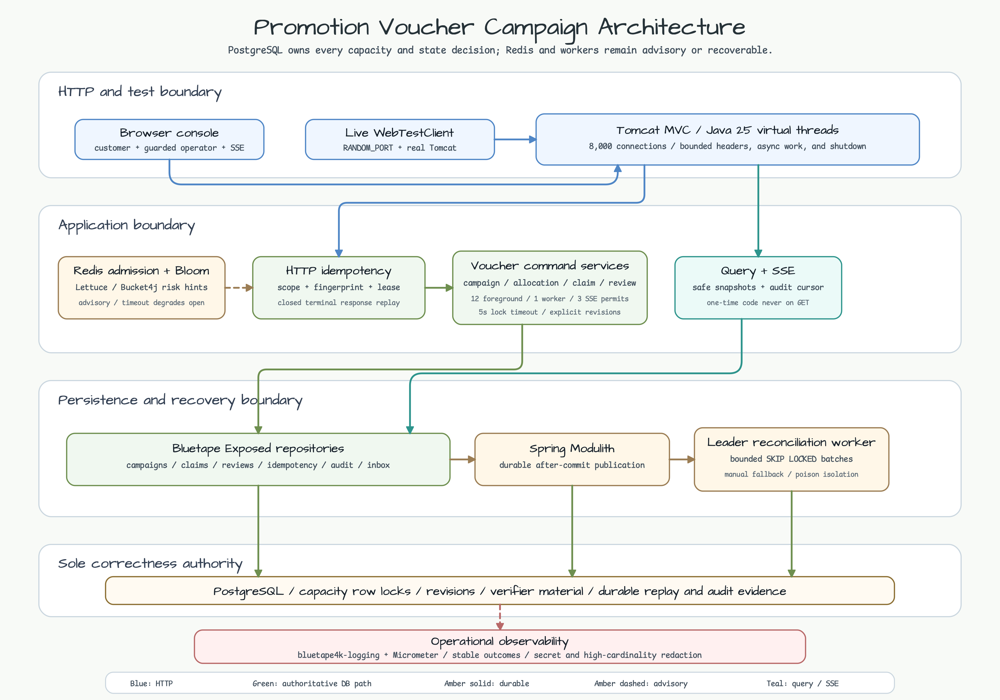
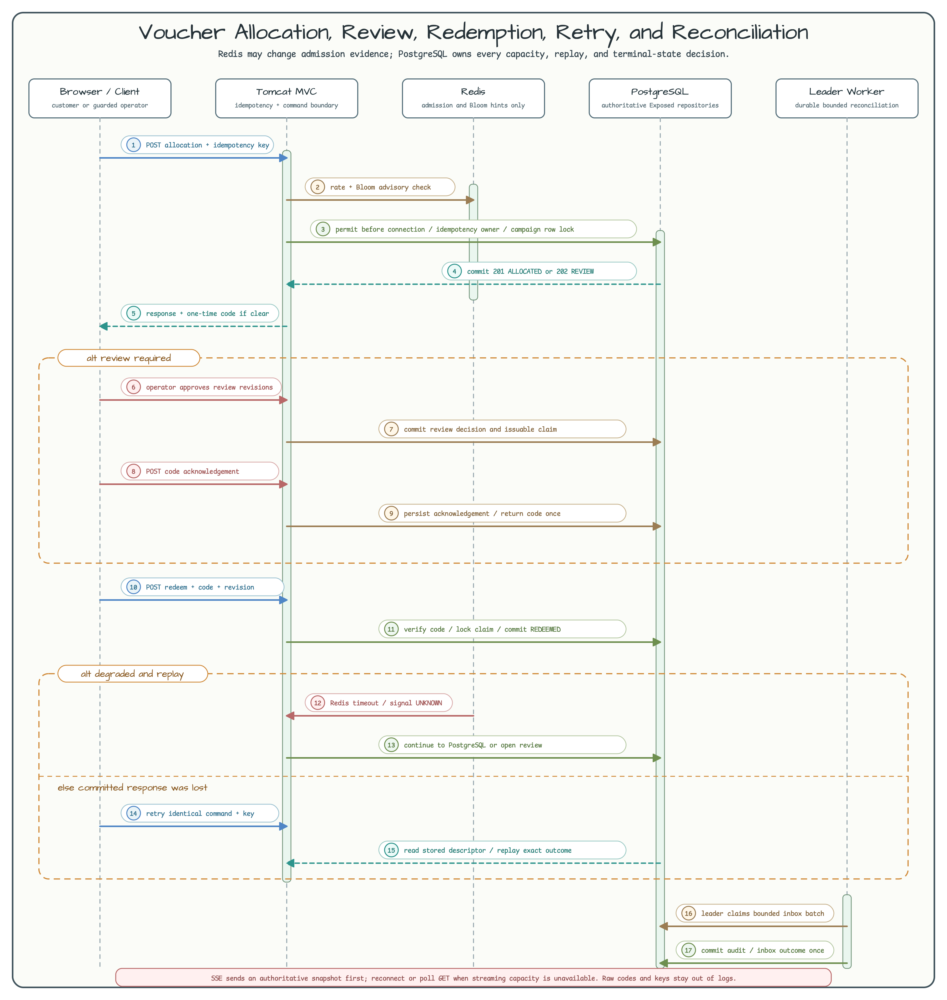

# Promotion Voucher Campaign

[한국어](README.ko.md) | English

This Spring Boot MVC reference application shows how a high-contention voucher campaign can remain correct when responses are lost, Redis is unavailable, reviews are delayed, or workers restart. PostgreSQL is the sole correctness authority. Redis admission, Bloom risk hints, leader election, and Spring Modulith delivery improve throughput or recovery without authorizing a voucher transition.

> Workshop boundary: the server binds to loopback and uses local headers instead of production IAM, OAuth, or CSRF infrastructure. Never expose the operator routes or workshop secrets on a non-loopback interface.

## What This Teaches

- Run Tomcat MVC on Java 25 virtual threads while limiting HikariCP to 16 connections.
- Reserve database permits as 12 foreground, 1 worker, and 3 SSE-maintenance lanes before acquiring JDBC connections.
- Implement tenant-scoped Exposed repositories with `bluetape4k-exposed-jdbc` and production-shaped `PostgreSQLServer` tests.
- Persist closed idempotency response descriptors so the same command can replay after response loss or process restart.
- Treat Redis/Lettuce rate admission and Bloom signals as advisory; PostgreSQL capacity and state transitions always decide.
- Return an immediate allocation's one-time code only in its command response, and isolate review-approved code delivery from safe `GET` snapshots through an idempotent acknowledgement command.
- Keep reconciliation durable and leader-coordinated while preserving a bounded manual recovery path.
- Record operational decisions with `bluetape4k-logging` without raw tenant, user, voucher code, idempotency key, or operator secret values.

## Architecture



The central path is Browser or live `WebTestClient` -> Tomcat MVC -> application-owned idempotency and command services -> Exposed repositories -> PostgreSQL. Redis admission/Bloom, the leader worker, and Spring Modulith publication are advisory or durable side paths; none can spend capacity without the PostgreSQL transaction.

## Sequence Diagram



The sequence follows allocation, optional review approval and acknowledgement, redemption, Redis degradation, a lost-response replay, and reconciliation. A repeated idempotency key returns the stored descriptor and never repeats the capacity mutation.

## Prerequisites

- JDK 25
- PostgreSQL 16+ with an empty `voucher_campaign` database
- Redis only when the advisory path is enabled
- `curl`; a browser is optional

## Startup And Configuration

| Concern | Default | Override |
|---|---:|---|
| HTTP | `127.0.0.1:8080` | `VOUCHER_SERVER_ADDRESS`, `VOUCHER_SERVER_PORT` |
| Management | `127.0.0.1:8081` | `VOUCHER_MANAGEMENT_PORT` |
| PostgreSQL | `jdbc:postgresql://localhost:5432/voucher_campaign` | `VOUCHER_DATABASE_URL`, `VOUCHER_DATABASE_USERNAME`, `VOUCHER_DATABASE_PASSWORD` |
| Hikari | max 16, min idle 4, connection timeout 60s | `application.yml` |
| Transactions / MVC async | 60s / 60s | `application.yml` |
| Tomcat | 8,000 connections, 8,000 platform-thread fallback | `application.yml` |
| Redis | disabled, `redis://127.0.0.1:6379` | `VOUCHER_REDIS_ENABLED`, `VOUCHER_REDIS_URI` |
| Operator boundary | local development secrets | `VOUCHER_OPERATOR_SECRET`, `VOUCHER_OPERATOR_GUARD` |
| Key material | local development keys | `VOUCHER_GENERATION_KEY_1`, `VOUCHER_VERIFICATION_KEY_1`, `VOUCHER_IDENTITY_KEY`, `VOUCHER_RISK_KEY`, `VOUCHER_REDIS_SLOT_KEY` |

```bash
export VOUCHER_DATABASE_URL=jdbc:postgresql://localhost:5432/voucher_campaign
export VOUCHER_DATABASE_USERNAME=vouchers
export VOUCHER_DATABASE_PASSWORD=vouchers
export VOUCHER_OPERATOR_SECRET='replace-with-at-least-32-random-bytes'
./gradlew :commerce-promotion-voucher-campaign:bootRun
```

Enable Redis only to exercise advisory admission:

```bash
export VOUCHER_REDIS_ENABLED=true
export VOUCHER_REDIS_URI=redis://127.0.0.1:6379
./gradlew :commerce-promotion-voucher-campaign:bootRun
```

Virtual threads do not make database connections cheaper. Hikari stays at 16; the 60-second connection and transaction timeouts permit bounded waiting, while the 12/1/3 permit lanes prevent foreground, worker, and SSE maintenance work from consuming one another's reserved capacity.

## Seed And Reset

Startup applies the checksummed `V001__voucher_campaign.sql` migration under a PostgreSQL advisory lock. Create a deterministic workshop campaign with the operator API; this is the seed step used by the walkthrough:

```bash
CAMPAIGN_ID=018f3b8c-45a7-7cc1-8f1d-31b63140c001
TENANT=voucher-demo
ORIGIN=http://127.0.0.1:8080
OPERATOR_SECRET="$VOUCHER_OPERATOR_SECRET"

curl -i -X POST "$ORIGIN/operator/api/v1/campaigns" \
  -H "Origin: $ORIGIN" \
  -H 'Content-Type: application/json' \
  -H 'X-Workshop-Guard: voucher-workshop-operator' \
  -H "X-Workshop-Operator-Secret: $OPERATOR_SECRET" \
  -H "X-Workshop-Tenant: $TENANT" \
  -H 'Idempotency-Key: campaign-create-0001' \
  -H 'If-None-Match: *' \
  -d '{"campaignId":"018f3b8c-45a7-7cc1-8f1d-31b63140c001","startsAt":"2026-07-20T00:00:00Z","endsAt":"2036-07-20T00:00:00Z","capacity":100,"perUserLimit":1,"redemptionTtlSeconds":3600}'

curl -i -X POST "$ORIGIN/operator/api/v1/campaigns/$CAMPAIGN_ID/activate" \
  -H "Origin: $ORIGIN" -H 'Content-Type: application/json' \
  -H 'X-Workshop-Guard: voucher-workshop-operator' \
  -H "X-Workshop-Operator-Secret: $OPERATOR_SECRET" \
  -H "X-Workshop-Tenant: $TENANT" \
  -H 'Idempotency-Key: campaign-activate-0001' \
  -d '{"expectedRevision":0}'
```

The guarded `POST /operator/api/v1/fixtures/reset` route deletes only the selected workshop tenant's campaigns, claims, reviews, audits, inbox rows, and armed fixture signals. It is available only in `local`, `demo`, and `test` profiles, requires the normal operator guard plus an idempotency key, and never resets a shared or implicit tenant. For a complete schema rehearsal, stop the app and recreate the dedicated database instead.

## Customer Curl Walkthrough

Allocate a voucher. `userRef` must equal `X-Workshop-Principal`:

```bash
USER_REF=user-demo
curl -i -X POST "$ORIGIN/api/v1/campaigns/$CAMPAIGN_ID/claims" \
  -H 'Content-Type: application/json' \
  -H "X-Workshop-Tenant: $TENANT" \
  -H "X-Workshop-Principal: $USER_REF" \
  -H 'Idempotency-Key: allocation-0001' \
  -d '{"userRef":"user-demo"}'
```

Save `claimId`, `revision`, and the one-time `code` from the response. Safe `GET /api/v1/claims/{claimId}` never reconstructs or returns that code. An immediate allocation response already delivers its code, so do not call the acknowledgement route for this path. Proceed directly to redemption.

Only an allocation that returned `reviewId` omits the code. After the operator approves that review, receive and acknowledge the newly issued code exactly once:

```bash
curl -i -X POST "$ORIGIN/api/v1/claims/$CLAIM_ID/code-acknowledgements" \
  -H 'Content-Type: application/json' -H "X-Workshop-Tenant: $TENANT" \
  -H "X-Workshop-Principal: $USER_REF" -H 'Idempotency-Key: code-ack-0001' \
  -d "{\"expectedRevision\":$REVISION}"
```

Redeem with the latest revision and a business reference:

```bash
curl -i -X POST "$ORIGIN/api/v1/claims/$CLAIM_ID/redeem" \
  -H 'Content-Type: application/json' -H "X-Workshop-Tenant: $TENANT" \
  -H "X-Workshop-Principal: $USER_REF" -H 'Idempotency-Key: redeem-0001' \
  -d "{\"code\":\"$VOUCHER_CODE\",\"expectedRevision\":$REVISION,\"redemptionReference\":\"order-demo-0001\"}"
```

## Lost-Response Idempotent Retry

If the client loses the allocation or redemption response, resend the identical method, route, headers, key, and body. The response includes `Idempotency-Replayed: true`. Reusing the key with a different fingerprint returns `409 IDEMPOTENCY_FINGERPRINT_CONFLICT`; an active owner returns `409 COMMAND_IN_PROGRESS` with `Retry-After`. Terminal failure descriptors replay just like successful descriptors.

## Allocation And Redemption Review

The guarded fixture API exists only in `local`, `demo`, and `test` profiles. `allocation-review`, `bloom-false-positive`, and `redis-outage` arm the next allocation for that principal; `redemption-review` arms the next redemption and does not get consumed by allocation. A review-required command returns HTTP 202. Replaying the fixture request returns the stored response and never re-arms a consumed signal.

```bash
curl -i -X POST "$ORIGIN/operator/api/v1/fixtures/allocation-review/run" \
  -H "Origin: $ORIGIN" -H 'Content-Type: application/json' \
  -H 'X-Workshop-Guard: voucher-workshop-operator' \
  -H "X-Workshop-Operator-Secret: $OPERATOR_SECRET" \
  -H "X-Workshop-Tenant: $TENANT" -H 'Idempotency-Key: fixture-review-0001' \
  -d '{"principalRef":"review-user"}'
```

Approve or reject through `/operator/api/v1/reviews/{reviewId}/approve|reject` with campaign/claim IDs and both expected revisions. Approval moves the claim to an issuable state; the customer must call the code-acknowledgement command to receive and acknowledge the one-time code. This separation prevents operator `GET` or customer `GET` from leaking replayable voucher material.

## Reconciliation

Spring Modulith publication and the event inbox preserve durable delivery evidence. The leader worker processes at most 50 rows per run with a 10-second deadline and reserved worker capacity. Run the same bounded path manually when leader scheduling is unavailable:

```bash
curl -i -X POST "$ORIGIN/operator/api/v1/reconciliation/run" \
  -H "Origin: $ORIGIN" -H 'Content-Type: application/json' \
  -H 'X-Workshop-Guard: voucher-workshop-operator' \
  -H "X-Workshop-Operator-Secret: $OPERATOR_SECRET" \
  -H "X-Workshop-Tenant: $TENANT" -H 'Idempotency-Key: reconcile-0001' \
  -d '{}'
```

## Redis And PostgreSQL Outages

- Redis timeout, outage, or Bloom false positive changes admission/risk evidence only. Commands fall back to the local permit plus PostgreSQL boundary; a risk hint may open review but cannot consume capacity by itself.
- PostgreSQL outage, Hikari exhaustion, lock timeout, or database permit rejection stops authoritative commands. The application never accepts a Redis-only mutation. Preserve the same idempotency key and retry only after the advertised `Retry-After` and backend recovery.

## SSE Reconnect And Polling Fallback

Subscribe with tenant and principal headers to `/api/v1/campaigns/{campaignId}/events`. The stream emits an authoritative snapshot first, then audit rows, heartbeats, and reset events. Reconnect with the last event ID. A `503 SSE_CAPACITY_REJECTED` response includes `Retry-After: 2` and a `Link` header to `GET /api/v1/campaigns/{campaignId}`; use that JSON snapshot as the polling fallback. Slow clients are closed when queue, payload, or write-time limits are exceeded, and every exit returns the SSE permit.

## Browser Walkthrough

Open `http://127.0.0.1:8080/`, enter the seeded campaign UUID, tenant, principal, and local operator secret, then connect. The console loads the authoritative snapshot, starts SSE, enables allocation only for an active campaign, and shows audit/reconciliation events. Select a cookbook entry and choose **Run scenario**. The runner resets and recreates the selected tenant campaign, arms server signals when required, executes client concurrency or delayed-event commands, verifies the scenario invariant, reloads PostgreSQL state, and leaves audit/SSE evidence in the timeline. **Reset tenant** runs the same guarded tenant-local reset without touching another tenant. The confirmation dialog gates standalone operator pause/activate/end changes.

## Stable Error And Retry Catalog

| Status | Stable code | Retry rule |
|---:|---|---|
| 400 | `INVALID_REQUEST` | Correct headers/body; do not reuse the failed payload blindly. |
| 403 | `OPERATOR_ACCESS_DENIED` | Restore loopback, same-origin, guard, secret, tenant, and JSON preconditions. |
| 404 | `RESOURCE_NOT_FOUND`, `CAMPAIGN_NOT_FOUND`, `CLAIM_NOT_FOUND`, `REVIEW_NOT_FOUND` | Confirm tenant and identifier; cross-tenant reads intentionally look absent. |
| 409 | `COMMAND_IN_PROGRESS`, `IDEMPOTENCY_FINGERPRINT_CONFLICT`, `CAMPAIGN_ALREADY_EXISTS`, `CAMPAIGN_PAUSED`, `CAMPAIGN_NOT_ACTIVE`, `CAMPAIGN_NOT_STARTED`, `CAMPAIGN_ENDED`, `CAPACITY_EXHAUSTED`, `PER_USER_LIMIT_REACHED`, `INVALID_CODE`, `CLAIM_EXPIRED`, `CLAIM_REVOKED`, `ALREADY_REDEEMED`, `CONCURRENT_MODIFICATION`, `CODE_ALREADY_ACKNOWLEDGED`, `RECONCILIATION_IN_PROGRESS` | Retry only `COMMAND_IN_PROGRESS`, `CAMPAIGN_PAUSED`, or reconciliation-in-progress after `Retry-After`; other codes require a new state or request. |
| 412 | `STALE_REVISION` | Reload the authoritative snapshot and submit a new command with the new revision and idempotency key. |
| 429 | `RATE_LIMITED` | Wait for `Retry-After`; PostgreSQL state did not change. |
| 503 | `DATABASE_BULKHEAD_REJECTED`, `AUTHORITATIVE_BACKEND_UNAVAILABLE`, `IDEMPOTENCY_REPLAY_KEY_UNAVAILABLE`, `SSE_CAPACITY_REJECTED`, `SERVICE_SHUTTING_DOWN` | Preserve the request, follow `Retry-After`, restore the named boundary, then retry with the same key when safe. |
| 500 | `INTERNAL_ERROR` | Inspect the request ID and redacted logs before deciding whether to replay. |

## Operator Runbook

| Subsystem | Signal | Query or command | Warning threshold | Decision | Action | Recovery check |
|---|---|---|---|---|---|---|
| PostgreSQL | readiness health, Hikari active/pending, lock waits | `curl -s http://127.0.0.1:8081/actuator/health/readiness`; inspect `pg_stat_activity` | Hikari pending sustained across the 60s acquisition budget or lock waits near 5s | Authority unavailable or saturated | Stop traffic amplification, restore PostgreSQL, inspect slow/blocked transactions; do not raise pool above 16 as a first response | readiness `UP`, pending returns to zero, invariant query matches capacity |
| Redis | degraded health and admission failures | `redis-cli -u "$VOUCHER_REDIS_URI" PING`; inspect `voucher_redis_*` metrics | degraded continuously for 5 minutes | Advisory path unavailable | Restore Redis/network; keep PostgreSQL-authoritative commands enabled; restart only if optional beans were absent at boot | three successful probes return admission to normal and no capacity drift exists |
| Leader | leader state and worker run timestamp | inspect Prometheus leader/worker metrics and application logs | no leader or no worker success for more than 2 scheduling cycles | Automatic reconciliation stalled | Restore Redis/leader lease or run one bounded manual reconciliation | one leader is active and a subsequent scheduled run succeeds |
| Worker | oldest inbox/backlog age, poison count | query inbox status and run `/operator/api/v1/reconciliation/run` | oldest backlog age exceeds 10 minutes or last success exceeds 2 cycles | Durable work is delayed | Fix the failing handler/provider, quarantine poison evidence, run bounded batches | oldest age falls, failed count stops growing, duplicate effects remain zero |
| SSE | active campaigns, queue rejection, cleanup/leak metrics | inspect SSE metrics/logs; poll `GET /api/v1/campaigns/{id}` | any sustained rejection or non-zero cleanup leak | Streaming capacity exhausted or resource not released | Apply polling fallback, reduce slow consumers, investigate write timeout/queue pressure | new stream gets snapshot; active count and permits return after disconnect |
| Keys | active versions and replay-key errors | inspect startup validation and `IDEMPOTENCY_REPLAY_KEY_UNAVAILABLE` | any missing active read version or replay-key failure | Required verification/decryption material is missing | Restore the retained generation/verification key version; never substitute a new key under an old version | startup succeeds and old code/replay fixtures verify |

### Backup, Restore, And Key Retention

Back up PostgreSQL tables and every key version referenced by active claims, stored idempotency descriptors, and the audit retention window. On restore, keep the application stopped, restore the database and exact versioned key material together, validate migration checksum and key-version coverage, then start one node and run a read-only snapshot plus bounded reconciliation. Retire a key only after no retained claim, replay descriptor, or audit requirement references it. Rotating the current generation version does not authorize deleting prior verification versions.

## Scenario Cookbook

| Scenario | Trigger | Authoritative evidence |
|---|---|---|
| Happy allocation and redemption | seed -> allocate -> redeem | claim `REDEEMED`, one capacity contribution, audit/SSE `VOUCHER_REDEEMED` |
| Same-key response loss | repeat identical allocation or redemption | `Idempotency-Replayed: true`, one claim/effect |
| Capacity race | browser **Run scenario** creates capacity 2 and submits eight concurrent principals | winners equal capacity; losers get `CAPACITY_EXHAUSTED` |
| Allocation review | fixture `allocation-review` | claim `PENDING_REVIEW`, open review, no code until approval/acknowledgement |
| Redemption review | fixture `redemption-review` before the tested path | review row and terminal decision remain PostgreSQL evidence |
| Redis outage | fixture `redis-outage` or stop Redis | degraded advisory signal; PostgreSQL result remains authoritative |
| Bloom false positive | fixture `bloom-false-positive` | review opens; no terminal rejection based only on Bloom |
| Delayed event | browser **Run scenario** selects `delayed-duplicate-out-of-order` and submits apply, duplicate, and lower-sequence events through the guarded fixture | inbox applies once; stale/conflicting evidence remains visible |
| Pause/allocation race | browser **Run scenario** selects `pause-allocation-race` and concurrently submits operator pause and customer allocation with distinct idempotency keys | revision order is authoritative; audit explains accepted/rejected command |
| Redeem/revoke race | browser **Run scenario** selects `redeem-revoke-race` and concurrently submits customer redeem and operator revoke from the same claim revision | exactly one terminal winner and no double capacity effect |
| Policy change race | browser **Run scenario** submits two policy updates from the same expected revision | exactly one policy revision wins; the stale command fails closed |

## Unsupported Scope

Voucher-pool pre-generation is tracked separately by #537, and event-sourced reconstruction by #538. This module intentionally uses on-demand opaque code generation and state-table/audit persistence. Reversal/compensation after redemption is also not implemented; an operator revoke races only before a conflicting terminal transition wins.

## Troubleshooting

- Startup failure codes identify invalid Hikari/permit/key/Redis/worker/SSE configuration; fix configuration instead of bypassing validation.
- `STALE_REVISION` means the client view is old, not that the server should retry internally.
- `IDEMPOTENCY_REPLAY_KEY_UNAVAILABLE` means the stored descriptor references missing retained key material; restore that key version.
- Repeated SSE resets usually mean the requested cursor fell outside retention; accept the new snapshot.
- Raw tenant, principal, code, idempotency key, operator secret, and request body values must never appear in logs. Investigate any redaction failure as a security defect.

## Verify

Tests use `PostgreSQLServer`, `RedisServer`, Lettuce, live `WebTestClient`, and Java 25 virtual threads.

```bash
./gradlew :commerce-promotion-voucher-campaign:test --max-workers=1
./gradlew :commerce-promotion-voucher-campaign:migrationCompatibilityTest --max-workers=1
./gradlew :commerce-promotion-voucher-campaign:stressTest -PvoucherStressRun=local --rerun-tasks --max-workers=1
```

The module consumes the repository-wide `bluetape4k-dependencies` platform only. Bluetape modules, including Exposed JDBC/tests, virtual-thread API/JDK25, logging, Testcontainers, Lettuce, Bucket4j, and leader support, are not version-pinned locally.
