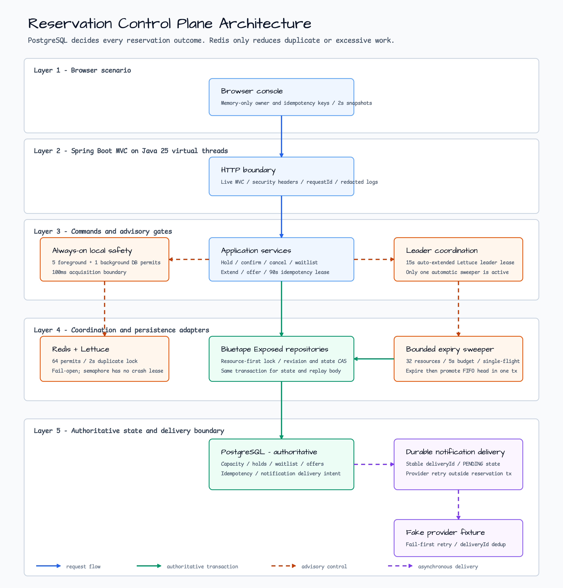
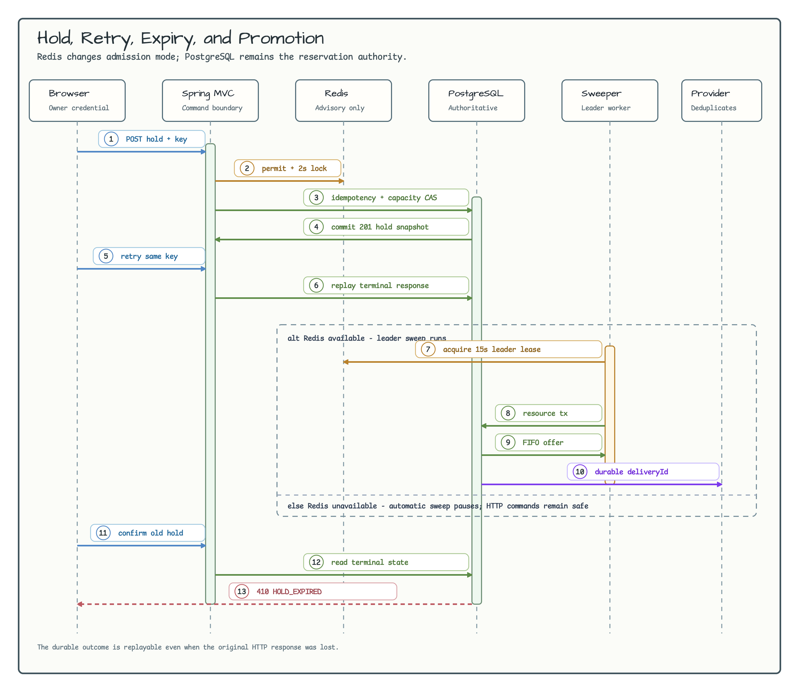

# 예약 제어 플레인

[English](README.md) | 한국어

이 Spring Boot 예제는 한정된 용량을 안전하게 예약하는 application-owned 제어 플레인을 구현합니다. 정합성의 최종 권한은 PostgreSQL에 있으며, Redis는 중복 작업 억제·만료 sweeper 조정·best-effort admission control에만 사용합니다.

## 예제 시나리오

1. 두 브라우저에서 `http://localhost:8080`을 열고 같은 resource revision으로 hold를 시도합니다. PostgreSQL row lock과 revision 검사가 유효한 전이 하나만 허용합니다.
2. hold를 만든 브라우저의 owner credential로 confirm, extend, cancel을 수행합니다.
3. 용량이 찬 resource의 FIFO waitlist에 참여합니다. 기존 hold의 만료나 취소가 가장 오래 기다린 entry를 제한 시간 offer로 승격하며, 같은 owner만 이를 수락할 수 있습니다.
4. 응답을 받지 못한 명령을 같은 `Idempotency-Key`로 다시 보냅니다. 저장된 응답은 replay되고, 같은 key를 다른 owner나 payload에 사용하면 conflict가 발생합니다.
5. 트래픽이 흐르는 동안 Redis를 중단합니다. local bulkhead와 PostgreSQL invariant는 계속 적용되고 Redis 기반 최적화와 leader-only sweep만 degraded 상태가 됩니다.
6. 각 resource의 현지 calendar 시간을 확인합니다. DST gap은 거부하고 중복되는 local time은 유효한 UTC offset을 명시해야 하므로 node마다 같은 입력을 다르게 해석하지 않습니다.
6. operator API를 명시적으로 활성화해 고착된 hold를 강제 해제하거나 제한된 manual sweep 한 번을 실행합니다.

## Architecture



권한 경계는 의도적으로 분리했습니다.

- PostgreSQL transaction, row lock, revision, capacity count, ownership digest, idempotency record, offer, durable notification delivery가 정합성을 결정합니다.
- node-local bulkhead는 항상 동작하며 DB 작업에 foreground permit 5개와 background permit 1개를 분리합니다.
- Redis 경로는 `bluetape4k-lettuce`, `LettuceSemaphore`, `LettuceLock`, `bluetape4k-leader`를 사용합니다. 모두 advisory이며 실패하면 local/PostgreSQL 경계로 fail-open합니다.
- 현재 해석된 Bluetape 버전의 `LettuceSemaphore`에는 lease가 없습니다. 프로세스가 비정상 종료되면 Redis key를 초기화하거나 Redis를 재시작할 때까지 permit이 누수될 수 있지만 예약 정합성에는 영향을 주지 않습니다.

## Sequence Diagram



만료 worker는 resource 하나를 잠그고, compare-and-set으로 만료 hold와 offer를 전이한 뒤 다음 FIFO entry를 승격하거나 capacity를 반환하고 durable notification delivery를 같은 transaction에서 생성합니다. 같은 작업을 다시 실행하면 이미 커밋된 상태를 읽으므로 중복 승격하지 않습니다.

## Software stack

| 관심사 | 선택 |
|---|---|
| Runtime | Java 25, Kotlin, virtual threads |
| Web | Spring Boot MVC, embedded Tomcat |
| Persistence | PostgreSQL, Exposed JDBC, `AbstractJdbcRepository` 패턴 |
| Test database | `bluetape4k-testcontainers`의 `PostgreSQLServer` |
| Advisory coordination | Lettuce 기반 Redis, `bluetape4k-leader` |
| Observability | `bluetape4k-logging`, Actuator health, Prometheus registry |
| Dependency authority | `bluetape4k-dependencies:1.4.0`만 사용 |

이 모듈은 root dependency platform을 통해 `bluetape4k-exposed-jdbc`, `bluetape4k-exposed-jdbc-tests`, `bluetape4k-virtualthread-api`, `bluetape4k-virtualthread-jdk25`를 사용합니다. 개별 Bluetape BOM을 import하거나 Bluetape 모듈 버전을 직접 고정하지 않습니다.

## 실행

PostgreSQL과 대상 database를 준비한 뒤 실행합니다.

```bash
export RESERVATION_DATABASE_URL=jdbc:postgresql://localhost:5432/reservation_control_plane
export RESERVATION_DATABASE_USERNAME=reservations
export RESERVATION_DATABASE_PASSWORD=reservations
export RESERVATION_HMAC_SECRET='replace-with-at-least-32-random-bytes'
./gradlew :commerce-reservation-control-plane:bootRun
```

Redis는 선택 사항이며 기본값은 비활성입니다.

```bash
export RESERVATION_REDIS_ENABLED=true
export RESERVATION_REDIS_URI=redis://localhost:6379
./gradlew :commerce-reservation-control-plane:bootRun
```

브라우저는 256-bit owner credential과 idempotency key를 메모리에만 생성합니다. `localStorage`, cookie, URL, DOM에는 기록하지 않습니다. 페이지를 새로 고치면 의도적으로 새로운 owner가 됩니다.

## API 계약

사용자 command endpoint에는 `X-Reservation-Owner`와 `Idempotency-Key`가 필요합니다. owner 전용 응답을 반환하는 query endpoint도 owner credential을 요구합니다.

| Method | Path | 용도 |
|---|---|---|
| `GET` | `/api/resources` | resource snapshot 조회 |
| `POST` | `/api/resources/{id}/holds` | 만료 시간이 있는 hold 생성 |
| `POST` | `/api/holds/{id}/confirm` | hold 확정 |
| `POST` | `/api/holds/{id}/extend` | 유효한 hold 연장 |
| `POST` | `/api/holds/{id}/cancel` | hold 취소 및 capacity 반환 |
| `POST` | `/api/resources/{id}/waitlist` | FIFO waitlist 참여 |
| `GET` | `/api/waitlist/{id}` | owner 범위 waitlist entry 조회 |
| `POST` | `/api/waitlist/{id}/cancel` | waitlist entry 취소 |
| `GET` | `/api/offers/{id}` | owner 범위 offer 조회 |
| `POST` | `/api/offers/{id}/accept` | 유효한 offer 수락 |
| `POST` | `/api/operator/holds/{id}/force-release` | operator mode에서 hold 강제 해제 |
| `POST` | `/api/operator/sweep` | operator mode에서 제한된 sweep 한 번 실행 |

동일한 idempotency key와 fingerprint는 원래 status와 body를 replay하고 `Idempotency-Replayed: true`를 반환합니다. fingerprint가 달라지면 `409 Conflict`, 처리 중인 명령이면 중복 실행 대신 retry 가능한 응답을 반환합니다.

## 동시성과 timeout 예산

Virtual threads는 request마다 platform thread를 점유하는 비용을 없애지만 DB connection을 늘리지는 않습니다. Tomcat은 최대 8,000 connection과 8,000개의 platform-thread fallback을 허용하지만 Hikari는 8개 connection으로 제한하고 acquisition timeout을 60초로 둡니다. transaction timeout도 60초입니다. local database bulkhead가 Hikari를 점유하기 전에 초과 작업을 제한합니다.

HTTP 동시성과 JDBC pool 크기를 동일하게 키우지 말고 다음 항목을 독립적으로 조정합니다.

- `RESERVATION_TOMCAT_MAX_CONNECTIONS`, `RESERVATION_TOMCAT_MAX_THREADS`
- `RESERVATION_DB_POOL_MAX`, `RESERVATION_DB_CONNECTION_TIMEOUT_MS`
- `RESERVATION_TRANSACTION_TIMEOUT`
- `RESERVATION_SWEEP_BATCH_SIZE`, `RESERVATION_SWEEP_DELAY`

## Operator mode

다음 설정을 명시하지 않으면 operator endpoint 자체가 생성되지 않습니다.

```bash
export RESERVATION_OPERATOR_ENABLED=true
export RESERVATION_OPERATOR_KEY='replace-with-at-least-32-random-bytes'
```

key는 `X-Operator-Key`로 전달합니다. 비교는 constant-time으로 수행하며 raw owner, idempotency, operator credential은 로그에 남기지 않습니다. 강제 해제에는 `CUSTOMER_SUPPORT` 같은 대문자 `reasonCode`도 필요합니다.

## Runbook

| 증상 | 예상 동작 | 대응 |
|---|---|---|
| PostgreSQL 접속 불가 또는 pool 고갈 | command가 실패하며 Redis만으로 mutation하지 않음 | PostgreSQL 복구 후 Hikari acquisition latency를 점검하고 pool은 제한된 크기로 유지 |
| Redis 접속 불가 | local bulkhead와 PostgreSQL을 통해 command는 계속 처리되고 leader-only 자동 sweep은 중단 | Redis 복구 후 leader 획득을 확인하고, 애플리케이션 시작 시점부터 Redis가 없었다면 예제를 재시작해 선택적 Redis bean을 다시 활성화 |
| 프로세스 비정상 종료 후 Redis admission permit 잔류 | admission 성능이 저하될 수 있지만 DB 정합성은 유지 | reservation semaphore key 초기화 또는 전용 Redis 재시작 |
| 만료 hold/offer 누적 | capacity가 일시적으로 반환되지 않을 수 있음 | leader와 PostgreSQL 상태를 확인하고 제한된 operator sweep 실행 |
| notification delivery backlog 증가 | 예약 상태는 커밋되어 있으며 delivery는 별도 재시도 대상 | durable delivery row와 provider 오류를 확인한 뒤 재시도 |
| hold가 운영상 고착 | 일반 owner transition으로 복구하지 못할 수 있음 | operator mode를 잠시 활성화하고 감사 가능한 reason code로 강제 해제 |

예제는 notification delivery 의도를 영속화하고 fake provider로 retry/deduplication을 검증합니다. production provider 전용 worker는 포함하지 않습니다.

## 검증

통합 테스트는 `PostgreSQLServer`로 PostgreSQL을 시작하고 `WebTestClient`로 실제 HTTP server를 호출합니다.

```bash
./gradlew :commerce-reservation-control-plane:test
./gradlew :commerce-reservation-control-plane:build
./gradlew detekt
```
