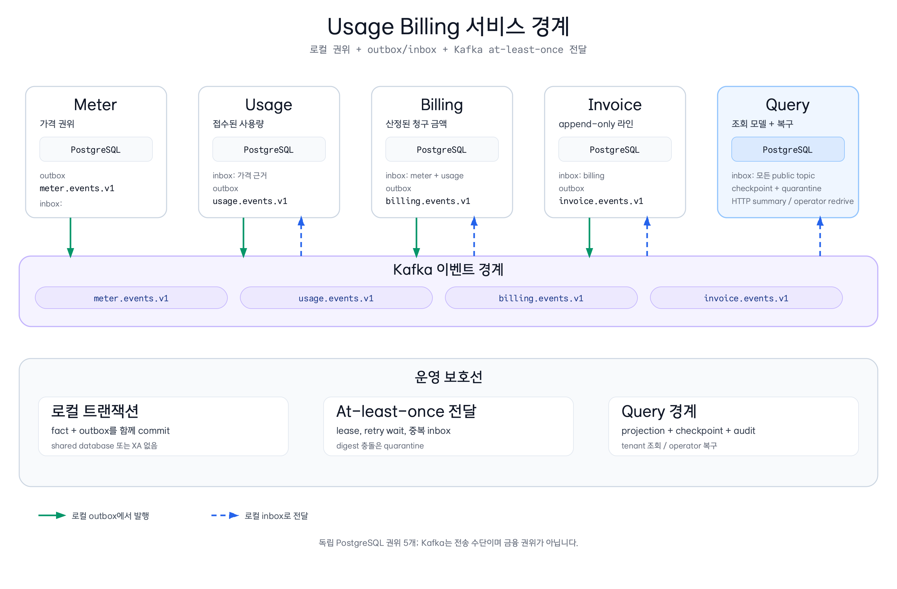

# Usage Billing Billing Service

[English](README.md) | 한국어

`usage-billing-billing-service`는 복제된 가격 근거와 불변 charge 산정을
소유합니다. Meter와 Usage event를 소비하고 자체 PostgreSQL transaction에서
금액을 계산한 뒤 `billing.events.v1`에 `ChargeRated`를 발행합니다.



[Architecture SVG source](../../docs/images/readme-diagrams/usage-billing-service-boundaries-01.ko.svg)

## 책임

- public topic에서 `PriceActivated`와 `UsageAccepted`를 소비합니다.
- Meter나 Usage table을 읽지 않고 Meter 가격 근거를 로컬에 보관합니다.
- inbox deduplication, digest conflict quarantine, aggregate-version 순서를
  적용합니다.
- `unitPrice × quantity`를 계산하고 불변 `BillingCharge`를 append합니다.
- local outbox를 통해 `ChargeRated`, `AdjustmentPosted`,
  `BillingPeriodClosed`를 발행합니다.

이 모듈에는 HTTP controller가 없습니다. `BillingInboxService`와
`BillingAdjustmentService`가 test와 composition fixture가 사용하는
application 경계입니다.

## inbound event contract

`BillingInboundEventDecoder`는 `PriceActivated`와 `UsageAccepted`의 schema
`1`을 허용하고, inbox journal에 전달하기 전에 envelope payload digest를
검증합니다.

| Inbox 결과 | 의미 |
| --- | --- |
| `APPLIED` | 새 event이고 근거가 있으며 예상 aggregate version이 존재함 |
| `DUPLICATE` | 같은 event ID와 payload digest가 이미 적용되었거나 오래된 version임 |
| `DEFERRED` | 로컬 가격 근거나 이전 aggregate version이 아직 없음 |
| `QUARANTINED` | event ID가 다른 digest와 충돌하거나 contract가 영구적으로 잘못됨 |

적용된 `UsageAccepted`는 Billing의 로컬 근거로 rate합니다. 미래
aggregate-version gap은 redelivery를 위해 defer하며 조용히 건너뛰지 않습니다.

## charge와 correction 경계

local transaction은 inbox 결정, 불변 charge, outbox row를 함께 append합니다.
`BillingAdjustmentService`는 새 음수 adjustment fact를 만들며 기존 charge를
수정하지 않습니다. outbox row는 `PENDING → CLAIMED → PUBLISHED`를 사용하고,
`RETRY_WAIT`와 `QUARANTINED` 복구 상태 및 lease 기반 fencing 갱신을 포함합니다.

관련 source: [`BillingInboxService`](src/main/kotlin/io/bluetape4k/workshop/commerce/usagebilling/billing/application/BillingInboxService.kt),
[`BillingPricingEvidenceService`](src/main/kotlin/io/bluetape4k/workshop/commerce/usagebilling/billing/application/BillingPricingEvidenceService.kt),
[`BillingInboundEventDecoder`](src/main/kotlin/io/bluetape4k/workshop/commerce/usagebilling/billing/messaging/BillingKafkaConsumer.kt),
[`BillingOutboxPersistence`](src/main/kotlin/io/bluetape4k/workshop/commerce/usagebilling/billing/persistence/BillingOutboxPersistence.kt).

## 검증 실행

```bash
./gradlew :commerce-usage-billing-billing-service:test --max-workers=1
./gradlew :commerce-usage-billing-billing-service:integrationTest --max-workers=1
```

기본 suite는 container 없이 실행합니다. integration test는 PostgreSQL로
가격 근거 uniqueness, inbox 순서, charge/outbox 원자적 기록, digest 충돌,
fenced publisher 완료를 검증합니다.

## 관련 서비스

- [`usage-billing-meter-service`](../usage-billing-meter-service/)가 로컬 근거로
  소비할 가격 이력을 발행합니다.
- [`usage-billing-usage-service`](../usage-billing-usage-service/)가 여기서
  산정할 accepted usage를 발행합니다.
- [`usage-billing-invoice-service`](../usage-billing-invoice-service/)가 산정된
  charge와 adjustment를 소비합니다.
