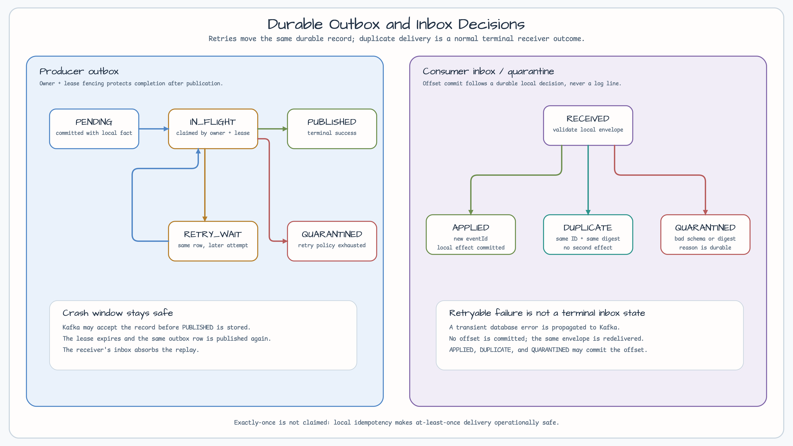
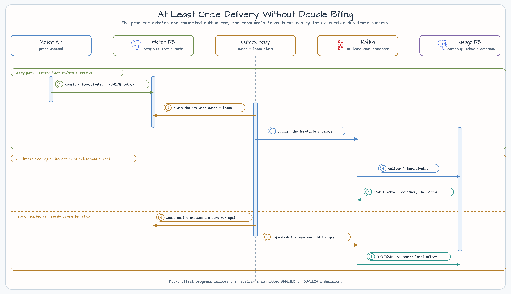
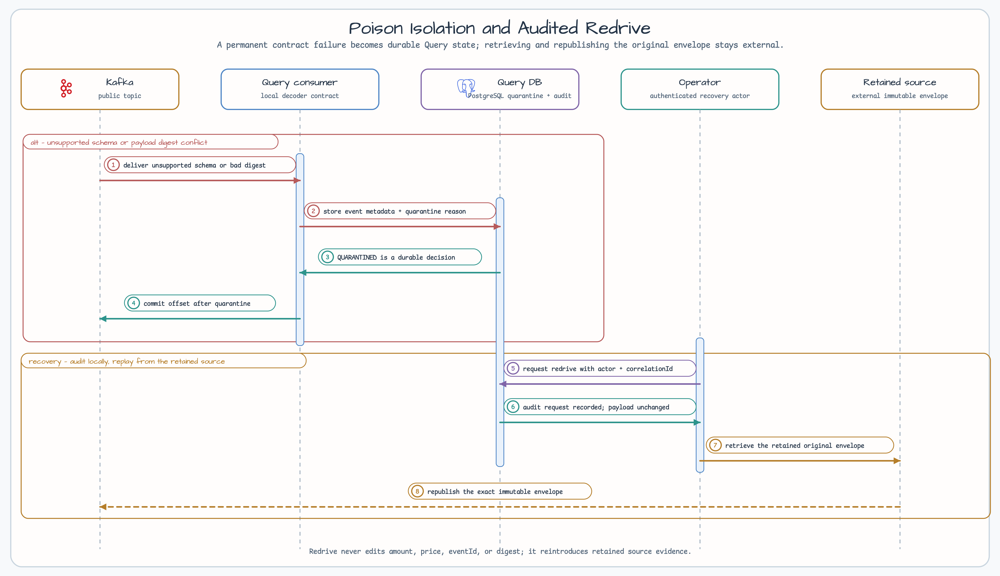
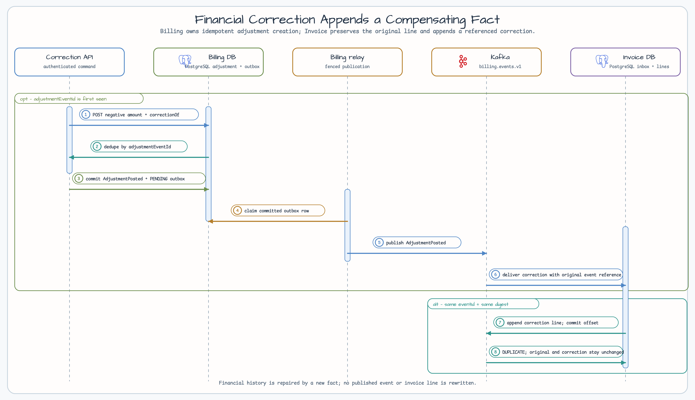
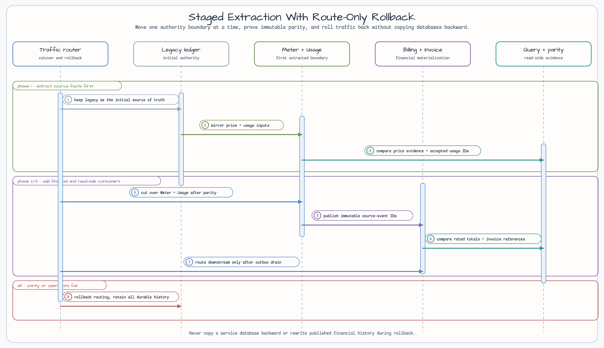

# Event-Sourced Usage Billing Microservices

[한국어](README.ko.md) | English

This advanced Spring Boot 4 / Java 25 reference separates usage billing into five independently deployable services: Meter, Usage, Billing, Invoice, and Query. It is for teams that already understand the transactional ledger and need to reason about the new failure boundaries created by separate PostgreSQL databases and Kafka at-least-once delivery.

Each service owns its database and its own integration decoder. JetBrains Exposed and `bluetape4k-exposed-jdbc` are the only database access path; every concrete repository implements `ExposedJdbcRepository`. There is no shared database, raw SQL/JDBC escape hatch, XA transaction, or end-to-end exactly-once claim.


[Architecture SVG source](../../docs/images/readme-diagrams/usage-billing-microservices-architecture-01.svg)

## Choose this only when the boundary is real

Start with [`usage-metering-billing-ledger`](../usage-metering-billing-ledger/) when one PostgreSQL transaction is sufficient. Use this example when independent deployment, ownership, or scaling boundaries are real requirements and the team can operate replay, backlogs, quarantine audit requests, and cross-service contract evolution.

| Concern | Modular monolith / ledger | This microservice reference |
| --- | --- | --- |
| Financial authority | One PostgreSQL authority | One local authority per service |
| Delivery | In-process transaction | Kafka at-least-once plus local outbox/inbox |
| Replay | Re-run one process | Re-deliver wire event; receiver absorbs it |
| Failure recovery | Transaction retry | Lease expiry, retry wait, quarantine, operator redrive request |
| Operational cost | Lower | Higher: topic, lag, compatibility, five databases |

## Ownership and topics

| Service | Local authority | Publishes | Consumes |
| --- | --- | --- | --- |
| Meter | immutable price version | `PriceActivated` → `meter.events.v1` | — |
| Usage | idempotent accepted usage | `UsageAccepted` → `usage.events.v1` | price evidence |
| Billing | price evidence and immutable rated charge | `ChargeRated` → `billing.events.v1` | price and accepted usage |
| Invoice | immutable document line materialization | future invoice document events | rated charge / adjustment |
| Query | read model, checkpoint, quarantine/audit | — | all public topics |

Kafka is transport, not financial correctness authority. Every producer commits its local fact and a `PENDING` outbox row in one Exposed transaction. A relay claims that row with an owner-and-lease predicate, publishes, then marks it `PUBLISHED`. A crash after Kafka accepts a record but before the mark is deliberately recoverable as a duplicate delivery.



[State diagram SVG source](../../docs/images/readme-diagrams/usage-billing-microservices-outbox-inbox-state-01.svg)

The receiver first validates its own JSON envelope contract, then durably records `(tenantId, eventId, payloadDigest)` before applying a local effect. Same ID/same digest is a duplicate; same ID/different digest is a correctness conflict and is quarantined. A retryable database failure is propagated to Kafka for redelivery. An unknown schema or digest mismatch becomes a durable Query quarantine entry so unrelated records can keep progressing.

Local decoders use Bluetape validation helpers for required envelope fields, and durable boundary payload types keep explicit serialization IDs. Debug outcome logs contain only stable operational fields such as event ID, event type, and quarantine reason; they never emit the raw financial payload.



[Delivery SVG source](../../docs/images/readme-diagrams/usage-billing-microservices-delivery-01.svg)



[Poison recovery SVG source](../../docs/images/readme-diagrams/usage-billing-microservices-poison-recovery-01.svg)

## Run the evidence

JDK 25 and a Docker-compatible container runtime are required for PostgreSQL/Kafka integration paths.

```bash
./gradlew :commerce-usage-billing-meter-service:test --max-workers=1
./gradlew :commerce-usage-billing-usage-service:test --max-workers=1
./gradlew :commerce-usage-billing-billing-service:test --max-workers=1
./gradlew :commerce-usage-billing-invoice-service:test --max-workers=1
./gradlew :commerce-usage-billing-query-service:test --max-workers=1

./gradlew :commerce-usage-billing-meter-service:integrationTest \
  :commerce-usage-billing-usage-service:integrationTest \
  :commerce-usage-billing-billing-service:integrationTest \
  :commerce-usage-billing-invoice-service:integrationTest \
  :commerce-usage-billing-query-service:integrationTest \
  --max-workers=1

./gradlew :commerce-usage-billing-microservices-composition-tests:test \
  :commerce-usage-billing-microservices-composition-tests:integrationTest \
  --max-workers=1
```

Default tests are container-free and lock service-local decoder, envelope, idempotency, state, and repository contracts. Integration tests use Bluetape Testcontainers PostgreSQL fixtures to prove Exposed uniqueness, atomic local effect/outbox writes, replay, digest conflict, and fenced outbox completion.

## Composition evidence and operational meaning

The composition module starts one Kafka broker and five isolated PostgreSQL containers. It deliberately does not
share a Spring context, a database, a decoder, or a producer DTO between services. The suite is a runnable
failure-mode catalogue, not a benchmark and not an exactly-once proof.

| Scenario | What the test proves | Production response it teaches |
| --- | --- | --- |
| delayed publication | a committed Meter price remains in its local outbox until relay recovery | inspect the outbox first; do not reconstruct a price from another service database |
| duplicate delivery | a replayed `UsageAccepted` produces one Billing financial effect | retain the event ID and digest; duplicate is a normal success path |
| out-of-order aggregate versions | version 2 is deferred until version 1 is available, then can be retried | keep the aggregate key/version visible; do not silently rate a gap |
| deterministic transport fault | a test-only Meter fault moves the claimed row to `RETRY_WAIT`, then the normal Kafka transport delivers it | keep the fast default proof deterministic; recover by retrying the existing row, never by recreating the financial fact |
| real broker-path outage | Toxiproxy cuts both TCP directions between the host-JVM services and the Kafka custom listener; the existing Meter outbox row becomes `RETRY_WAIT`, then is delivered after the path is restored | use the outbox as recovery authority and verify the actual client route, not only a simulated exception |
| service restart | Usage restarts with price evidence still present and continues publication | local PostgreSQL, not process memory or a consumer offset, is the recovery authority |
| poison contract | one unsupported Query record is quarantined while an independent valid record progresses; a redrive request is audited | isolate permanent failures and retrieve the immutable original envelope from its retained source before any replay |
| schema evolution | Query accepts additive v2 and quarantines unsupported v99 | make compatibility an explicit decoder decision, not an accidental Jackson default |
| tenant isolation | a Query principal with `TENANT_a` cannot access tenant `b` | authorize the target tenant at the read boundary, even for projections |
| correction | `AdjustmentPosted` appends a second Invoice line and emits an invoice correction without rewriting the original line | repair financial history with a new fact and a reference to the original event |
| raw-access guard | service source is scanned for raw JDBC/SQL execution APIs | keep persistence inside Exposed repositories; test fixtures get no exception |

The test-only Meter fault switch is intentionally deterministic. It wraps the production Kafka transport only while
the composition fixture is running, then delegates to the same real Kafka transport for recovery. This keeps the
fast outbox retry assertion stable.

`BrokerPathRecoveryIntegrationTest` is the complementary nightly proof. It starts Toxiproxy and Kafka on one Docker
network, makes Kafka advertise the proxy mapped endpoint for its custom listener, then cuts both proxy directions.
Consequently the Spring Kafka client cannot recover by using a metadata-returned direct broker endpoint. After toxic
removal, the test retries the same outbox row and waits for Usage price evidence. This is a single-broker TCP path
recovery scenario, not a Kafka leader-election, ISR, replication, or cluster-failover claim; those behaviors belong
to the dedicated multi-broker reference.

## Production decision rules

- Price selection is Billing's local replicated evidence; Meter remains the authoritative publisher of price history.
- A `UsageAccepted` payload includes the accepted price provenance needed for Billing to rate from its own evidence rather than synchronously reading Usage or Meter tables.
- Invoice never edits a prior line. A correction is a new `AdjustmentPosted`-derived line referencing the original event.
- Query has no financial command endpoint. It owns read projection/checkpoint/quarantine visibility and operator redrive audit only.
- Offset commit follows a successful durable inbox/quarantine decision. It never follows a best-effort log line.



[Correction SVG source](../../docs/images/readme-diagrams/usage-billing-microservices-correction-01.svg)

## Staged extraction and rollback

1. Keep the ledger/modular-monolith as source of truth; extract Meter and Usage first while dual-checking accepted-usage counts and price evidence.
2. Add Billing's replicated price evidence and rated-charge parity checks. Drain its outbox before routing downstream traffic.
3. Add Invoice document materialization and Query read models last. Compare immutable source-event IDs and totals, not mutable rows.
4. Roll back traffic routing only. Do not copy a service database backwards or rewrite published financial history; leave durable events, outboxes, inboxes, and quarantine audit records intact for reconciliation.



[Extraction SVG source](../../docs/images/readme-diagrams/usage-billing-microservices-extraction-01.svg)

An operator should first inspect outbox backlog/state, oldest retry, inbox/quarantine reason, and the affected aggregate key. Query records an auditable redrive request; retrieving and republishing an immutable original envelope remains an external retained-source operation, never an edit surface for amounts or prices.

## Module map

| Module | Purpose |
| --- | --- |
| `usage-billing-meter-service` | price authority and outbox |
| `usage-billing-usage-service` | usage receipt, price evidence inbox, accepted usage outbox |
| `usage-billing-billing-service` | pricing evidence inbox, rating, charge outbox |
| `usage-billing-invoice-service` | charge inbox and immutable invoice lines |
| `usage-billing-query-service` | projection inbox, checkpoint, quarantine, operator diagnostics |
| `usage-billing-microservices-composition-tests` | contract/composition test-only boundary |
