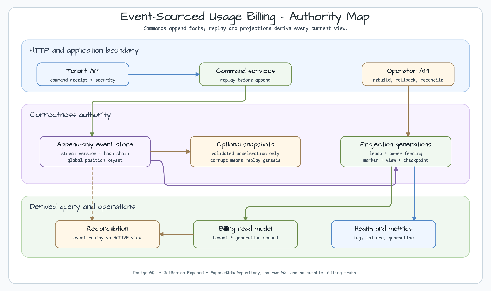
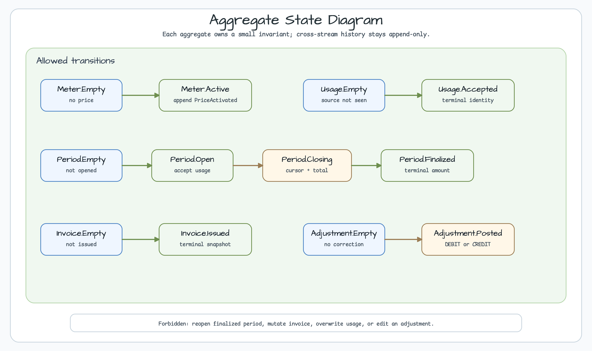
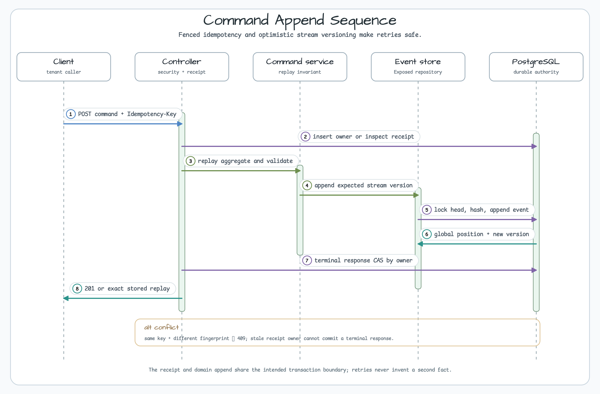
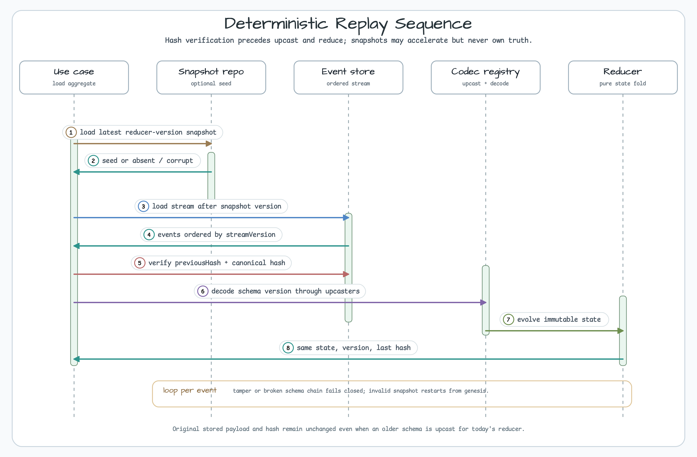
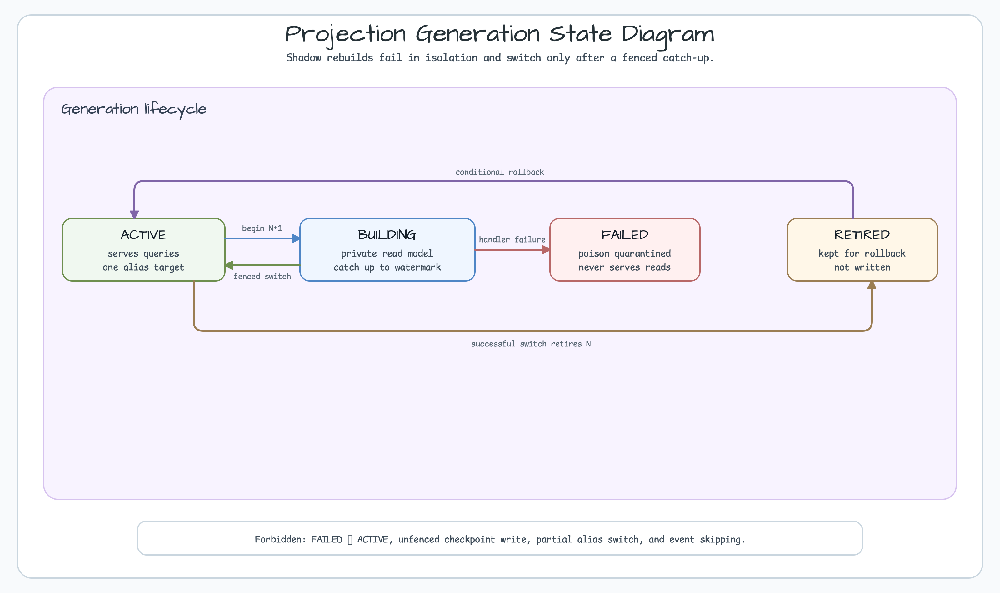
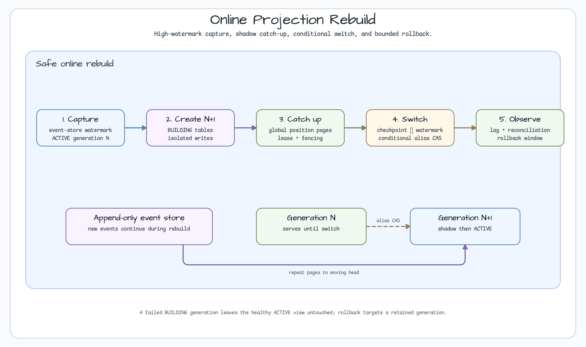
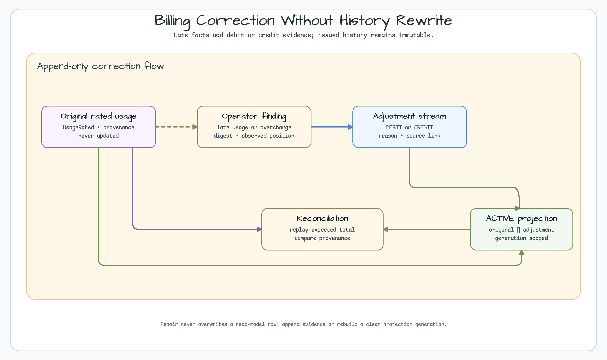
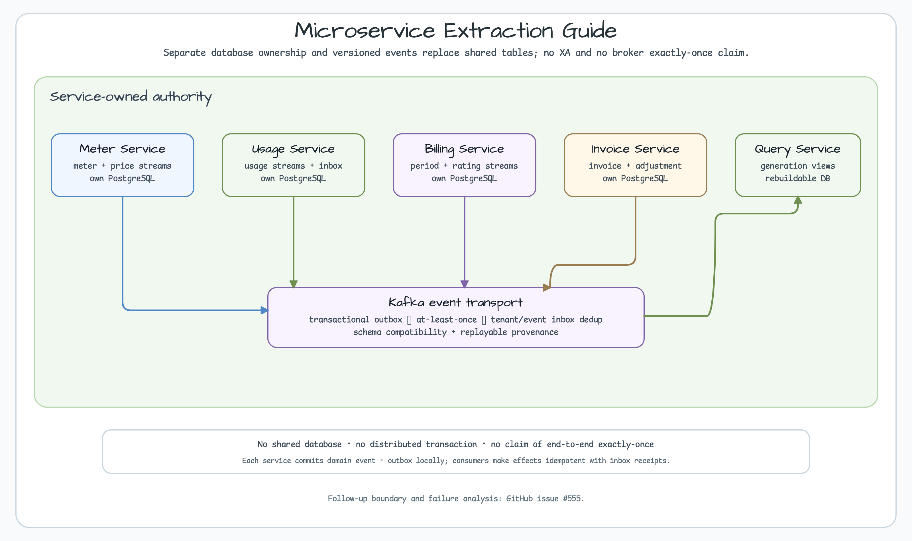

# Event-Sourced Usage Metering & Billing

[한국어](README.ko.md) | English

This advanced Spring Boot modular-monolith example stores usage-billing facts as append-only domain events, then derives current state through deterministic replay and rebuildable projections. It targets service companies that require auditable history, historical reconstruction, and online read-model replacement.

The module uses Java 25, Spring Boot 4, PostgreSQL, JetBrains Exposed JDBC, `bluetape4k-exposed-jdbc`, and Micrometer. Every concrete repository implements `ExposedJdbcRepository`, and production/test fixtures use Exposed DAO/DSL only. There is no `JdbcTemplate`, `java.sql.*`, `PreparedStatement`, `Transaction.exec`, or raw migration SQL.



[Architecture SVG source](../../docs/images/readme-diagrams/usage-billing-event-sourcing-architecture-01.svg)

## Choose baseline or advanced first

Most teams should start with the [`usage-metering-billing-ledger`](../usage-metering-billing-ledger/) baseline. Event Sourcing is not merely an audit feature; it commits the team to operating schema evolution, replay, projections, and recovery together.

| Decision | Baseline ledger | This advanced example |
|---|---|---|
| Current-state query | Normalized PostgreSQL rows | ACTIVE projection |
| Audit history | Immutable ledger/invoice provenance | Every domain event plus hash chain |
| Historical reconstruction | Dedicated audit query | Replay to a stream version |
| Read-model change | Schema/data migration | Shadow generation rebuild and switch |
| Operational cost | Lower | Higher: upcast, replay, lag, poison events, generations |

Choose advanced only when regulatory audit, temporal pricing reconstruction, multiple read models, or source-event reprocessing is an actual requirement.

## Run and verify quickly

JDK 25 and a Docker-compatible container runtime are required. PostgreSQL runs through the Bluetape Testcontainers fixture.

```bash
java -version
./gradlew :commerce-usage-metering-billing-event-sourcing:test --max-workers=1
./gradlew :commerce-usage-metering-billing-event-sourcing:integrationTest --rerun-tasks --max-workers=1
./gradlew :commerce-usage-metering-billing-event-sourcing:stressTest --rerun-tasks --max-workers=1
./gradlew :commerce-usage-metering-billing-event-sourcing:koverXmlReport
```

`test` covers reducers, hashes, upcasting, and Kotlin/Exposed architecture contracts. `integrationTest` proves PostgreSQL unique/CAS/fencing/replay/snapshot/projection/reconciliation/HTTP boundaries. `stressTest` closes 10,000 usage events in bounded batches and rebuilds projection generation 2 from genesis. It is correctness and restart evidence, not a capacity benchmark.

## Aggregate state and forbidden transitions

Aggregates remain small. Meter, Usage, Billing Period, Invoice, and Adjustment own separate invariants and never mutate one another's rows.



[Aggregate state SVG source](../../docs/images/readme-diagrams/usage-billing-event-sourcing-aggregate-state-01.svg)

- `Usage.Accepted` never creates a second fact for the same source identity.
- `Period.Finalized` and `Invoice.Issued` are terminal.
- Posted money is corrected by a new `Adjustment.Posted` `DEBIT` or `CREDIT`, never by mutation.
- Every command service replays its stream before deciding and appending at an expected version.

## Event envelope, hash chain, and schema evolution

Event-store authority is `(tenantId, streamType, streamId, streamVersion)` plus monotonically increasing `globalPosition`. The envelope carries event ID/type/schema version, canonical payload/metadata, `occurredAt`, `recordedAt`, `previousHash`, and `eventHash`.

One transaction checks the stream head and appends only at the expected version. The hash covers canonical material, so changed payload, metadata, or order fails replay closed. Stored payloads are never rewritten. `EventCodecRegistry` applies schema-version decoders and contiguous one-step upcasters before today's reducer. A missing upcast path is an error, not a skipped event.

## Idempotent commands and optimistic append

The command receipt stores an `Idempotency-Key` digest and canonical request fingerprint. Same key/same fingerprint replays the exact HTTP status/body; a different fingerprint returns `409`. An expired receipt lease may be taken over with a new owner token, while terminal CAS accepts only the current owner.



[Command sequence SVG source](../../docs/images/readme-diagrams/usage-billing-event-sourcing-command-sequence-01.svg)

Receipt and domain append share the intended transaction boundary so a retry cannot invent a second fact. Concurrent commands on one stream fail expected-version validation and must replay the latest state before deciding again.

## Safe replay and snapshots

Replay order is fixed: validate snapshot, load following events, verify the hash chain, upcast schema, decode, then fold with pure reducers.



[Replay sequence SVG source](../../docs/images/readme-diagrams/usage-billing-event-sourcing-replay-sequence-01.svg)

A snapshot is an optimization, never authority. It seeds replay only when reducer version, stream version, and last event hash match history. A corrupt or obsolete snapshot falls back to genesis instead of being repaired in place. The same event sequence must always produce the same state, version, and last hash.

## Projection generation state and online rebuild

Queries read one `ACTIVE` generation. A new projection starts as `BUILDING` and catches up under a separate generation key from event-store global positions.



[Projection state SVG source](../../docs/images/readme-diagrams/usage-billing-event-sourcing-projection-state-01.svg)

`BUILDING → ACTIVE` is allowed only after its checkpoint reaches the captured high watermark and the current lease owner's fencing token remains valid. The prior ACTIVE becomes `RETIRED` in the same switch. Decode/handler failure quarantines the poison event and moves only the shadow generation to `FAILED`; the healthy ACTIVE view remains available. `FAILED → ACTIVE`, stale-owner checkpoints, and partial alias switches are forbidden.



[Rebuild SVG source](../../docs/images/readme-diagrams/usage-billing-event-sourcing-rebuild-01.svg)

The operator captures a high watermark, creates N+1, catches up by keyset pages, conditionally switches the alias, then observes lag and reconciliation. Rollback conditionally selects a retained RETIRED generation; it never reverts events.

## Billing close, correction, and reconciliation

Close replays period and usage state, then appends `UsageRated` in bounded batches. Cursor and running total are period-stream events, so a replacement worker resumes from the last committed fact. Completion appends `BillingPeriodFinalized` and immutable `InvoiceIssued`.

Late usage or overbilling never edits an existing event or projection row. An operator finding captures event-store position and digest; while both remain current, a correction command appends new evidence to an adjustment stream.



[Correction SVG source](../../docs/images/readme-diagrams/usage-billing-event-sourcing-correction-01.svg)

Reconciliation compares authoritative replay totals with ACTIVE projection totals and provenance. It records findings but does not auto-mutate authority. Repair rejects a stale expected digest.

## HTTP consistency and security boundary

Tenant commands and queries live under `/api/v1/tenants/{tenantId}` and require the principal name to match the path tenant. Writes require `TENANT_BILLING_WRITE`, reads require `TENANT_BILLING_READ`, and `/api/admin/event-sourcing/**` requires `ROLE_OPERATOR`. The Basic Auth users are local demonstrations; production should connect the organization's JWT/OAuth2 provider.

`POST /meters` requires `Idempotency-Key`. Query responses expose `Projection-Position` and `Projection-Lag`. A client holding a command's global position may request a bounded read-your-write wait with `X-Wait-For-Position`. The maximum wait is 100ms; timeout returns `409 projection_not_caught_up` instead of waiting forever or querying the event store as a fallback.

## Operational signals and failure runbook

Micrometer records append latency/outcome, replay event count/duration, snapshot fallback, projection batch/lag/rebuild/quarantine, close batch, and reconciliation findings. Tenant, stream ID, and event ID are never tags. Actuator health checks event-store access, ACTIVE generation, checkpoint/lag, and quarantine through bounded queries.

| Symptom | Inspect first | Safe action |
|---|---|---|
| Projection lag grows | Worker lease, checkpoint, event-store head | Bound throughput and catch up; never force a stale owner to finish |
| Poison event | Failed position, type, failure digest | Fix codec/upcaster/handler and rebuild a new generation |
| Snapshot fallback grows | Reducer version and last hash | Discard the snapshot and observe genesis replay cost |
| Reconciliation mismatch | Expected/actual provenance | Append a bounded adjustment or rebuild; never edit event history |
| Repeated in-progress command | Receipt lease and owner token | Take over after expiry; stale terminal CAS remains rejected |
| No ACTIVE projection | Generation states and last switch | Roll back to healthy RETIRED or rebuild a fresh BUILDING generation |

## Microservice extraction

Do not split services first. Validate stream boundaries, event schemas, lag SLOs, and rebuild procedures in the modular monolith.



[Microservice SVG source](../../docs/images/readme-diagrams/usage-billing-event-sourcing-microservices-01.svg)

When extracted, Meter, Usage, Billing, Invoice, and Query own separate PostgreSQL databases and event/outbox contracts. Use neither shared tables nor XA. Commit domain event and outbox locally, deliver through Kafka at least once, and deduplicate each consumer by `(tenantId, eventId)` inbox receipt. Broker exactly-once or ordering never replaces database fencing, stream versions, or inbox idempotency. Track the detailed boundary and failure design in [workshop #555](https://github.com/bluetape4k/bluetape4k-workshop/issues/555).

The reusable library location and API for projection job lease/fencing is tracked in [bluetape4k-projects #1070](https://github.com/bluetape4k/bluetape4k-projects/issues/1070).

## Suggested code-reading order

1. Read events and state transitions in `domain/` and `AggregateReducers.kt`.
2. Follow `CanonicalEventHash`, `EventCodecRegistry`, and `AggregateReplayer` under `eventstore/`.
3. Inspect Exposed authority in `persistence/EventStoreRepository.kt` and `EventSourcingExposedJdbcRepository.kt`.
4. Follow owner fencing and replay in `idempotency/CommandReceiptService.kt`.
5. Read generation, lease, and poison recovery under `projection/` and `worker/ProjectionWorker.kt`.
6. Run the complete 10,000-event close/rebuild/reconciliation path in `BillingEventSourcingStressTest`.

This order makes authority and rebuildability visible before HTTP details.
