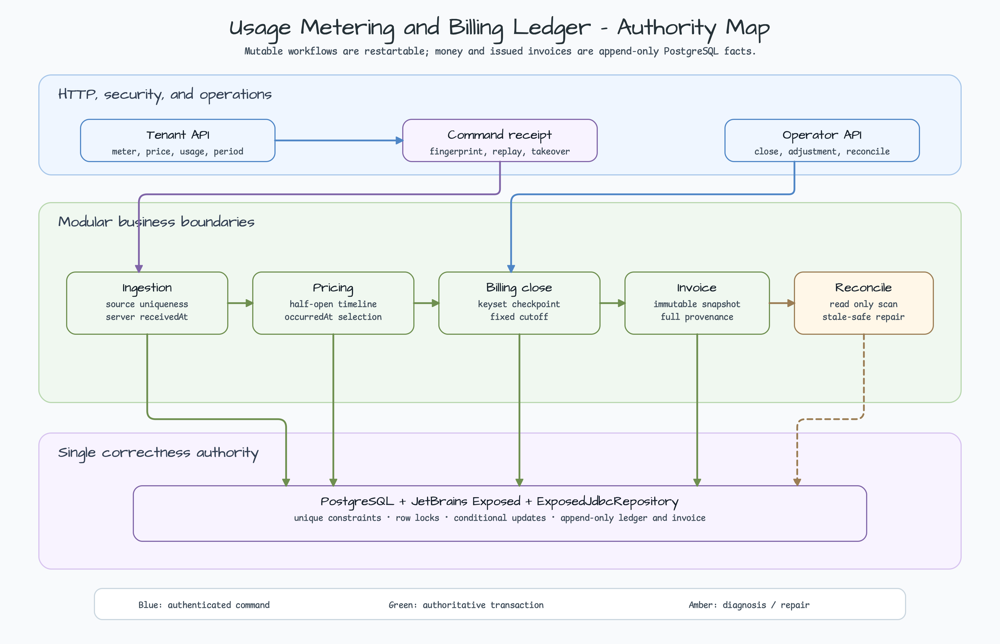
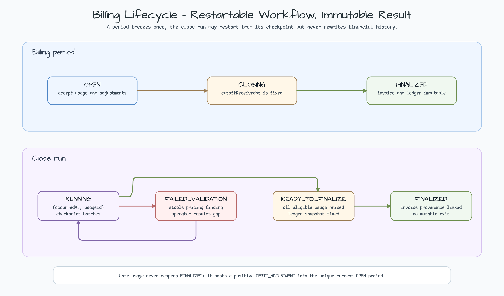
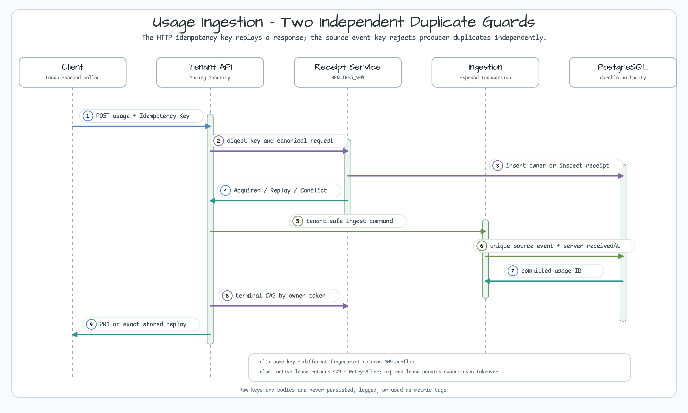
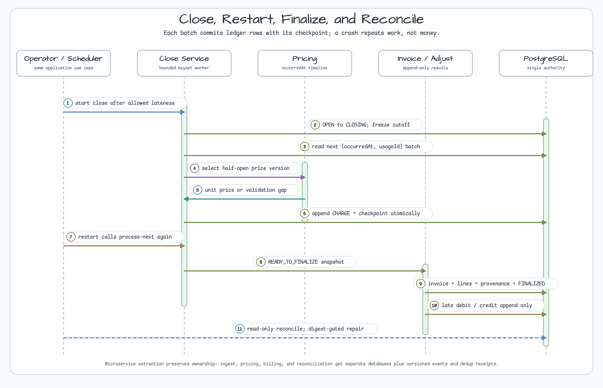

# SaaS Usage Metering & Billing Ledger

[한국어](README.ko.md) | English

This Java 25 Spring Boot example accepts continuously arriving usage, applies the price that was effective when the usage occurred, and produces an immutable billing ledger and invoice. The difficult parts are duplicate delivery, time-varying prices, worker restarts, and usage that arrives after a billing period was finalized.

The module uses Kotlin, JetBrains Exposed JDBC, `bluetape4k-exposed-jdbc`, and PostgreSQL. Redis, leader election, and a broker are deliberately absent from baseline correctness. Every concrete repository implements Bluetape `ExposedJdbcRepository`; production and test fixture data access use only Exposed DAO/DSL.



## Three rules to remember

1. The server `Clock` creates `receivedAt`; close cutoff never trusts a client timestamp.
2. Price selection uses usage `occurredAt` and half-open `[effectiveFrom, effectiveTo)` windows.
3. Posted money is never rewritten. Late or corrective outcomes append linked debit/credit entries.

This separates restartable mutable workflow state from immutable financial facts without requiring two correctness stores.

## State model

The billing period defines the accounting boundary. The close run is the restartable worker that processes that boundary.



| Resource | Transition | Meaning |
|---|---|---|
| Billing period | `OPEN → CLOSING → FINALIZED` | Freeze one cutoff and close with an invoice |
| Close run | `RUNNING → READY_TO_FINALIZE → FINALIZED` | Finalize only after every eligible usage has a price |
| Validation branch | `RUNNING → FAILED_VALIDATION` | Expose a pricing gap instead of hiding it |
| Repair branch | `FAILED_VALIDATION → RUNNING` | Resume with the same checkpoint contract after explicit repair |

A `FINALIZED` period never reopens. Usage received after its close cutoff posts a positive `DEBIT_ADJUSTMENT` into the unique `OPEN` period containing server posting time.

## Two duplicate guards

HTTP retries and producer retries are independent failure modes.

- `(tenantId, operation, keyDigest)` replays the original HTTP command status/body.
- `(tenantId, sourceSystem, sourceEventId)` prevents a producer event from being stored twice even with a different idempotency key.

Raw keys and request bodies are not persisted. A SHA-256 digest of the key and a canonical request fingerprint are stored. Same key/same fingerprint replays; same key/different fingerprint conflicts. A dead owner can be replaced after the 30-second lease. Terminal completion uses `(receiptId, ownerToken, IN_PROGRESS)` CAS so the stale owner cannot overwrite the winner.



Receipt acquire/takeover runs in a short `REQUIRES_NEW` transaction. Domain mutation and owner-token terminal CAS run afterward. A retry can therefore recover a committed result after the original HTTP response was lost.

## Price timeline

Each `(tenant, meter, currency)` owns one pricing schedule authority row. Activation serializes on that row, closes the last open interval once, and appends an immutable price version.

```text
v1: [2026-01-01T00:00Z, 2026-03-01T00:00Z)  USD 0.10
v2: [2026-03-01T00:00Z, ∞)                  USD 0.12
```

Usage exactly at `2026-03-01T00:00Z` selects v2. Normal activation rejects backdating and overlap. A production historical-gap repair should remain a separate operator command and must reject changes to intervals already referenced by ledger entries.

## Restartable close

The close-start transaction changes the period from `OPEN` to `CLOSING` and creates the close run with a fixed `cutoffReceivedAt`. Scheduler and operator `process-next` routes call the same `BillingCloseService.processNextBatch` use case.

Each batch:

1. Reads at most 200 usage rows after `(occurredAt, usageEventId)` checkpoint.
2. Selects the price effective at each usage `occurredAt`.
3. Calculates `quantity × unitPrice` with currency rounding.
4. Commits `CHARGE` ledger rows and the checkpoint in one transaction.
5. Moves to `READY_TO_FINALIZE` only at end-of-keyset with zero unpriced usage.



A crash before commit rolls back both ledger and checkpoint. A crash after commit may repeat the scan, but the ledger unique key prevents a second charge. Correctness never assumes a worker executes exactly once.

## Immutable invoice and provenance

Finalization accepts only a `READY_TO_FINALIZE` close run. One transaction reads the eligible ledger snapshot, groups lines by `(meterId, priceVersionId, entryType)`, links every ledger entry to exactly one line, verifies line/total/ledger sums, appends invoice provenance, and finalizes both run and period.

Ledger and invoice repositories reject inherited `save`, `saveAll`, and `delete*` methods with `UnsupportedOperationException`. Append-only is enforced at the repository contract, not merely hidden from the controller.

## Late usage, credits, and reconciliation

Late debit stores both original service period and current posting period. It selects price by original `occurredAt`. Credits keep a positive amount, express direction through `CREDIT_ADJUSTMENT`, and link `relatedOriginalEntryId`; downstream code never has to reinterpret negative amounts.

Reconciliation is read-only against billing authority. It records six immutable finding types: unledgered usage before/after cutoff, ledger-price mismatch, invoice-line mismatch, invoice-total mismatch, and tenant/currency mismatch. A late-usage repair requires `ROLE_OPERATOR`, `Idempotency-Key`, and the finding's expected digest. It appends only while the current usage digest still matches and no debit has already been posted; a repeated or stale repair is rejected. There is no automatic mutation from findings.

## Exposed and PostgreSQL boundary

| Concern | Authority |
|---|---|
| Command replay/takeover | PostgreSQL unique constraint + owner-token CAS |
| Producer duplicate | PostgreSQL source-event unique constraint |
| Price interval | Schedule serialization + half-open query |
| Close progress | Fixed cutoff + keyset checkpoint |
| Financial history | Append-only ledger/invoice/provenance |
| Data access | JetBrains Exposed DAO/DSL + `ExposedJdbcRepository` |

The module contains no `JdbcTemplate`, `java.sql.*`, `PreparedStatement`, `Transaction.exec`, or migration SQL. Test fixtures alone use `SchemaUtils` to prepare PostgreSQL. The application does not auto-create production schema; a real deployment must provision a schema matching the Exposed table contract through its organization-approved migration pipeline.

## Security and operations

Every `/api/**` route requires authentication, and `/api/v1/operator/**` additionally requires `ROLE_OPERATOR`. Tenant routes require the principal name to match path `tenantId`. The example provides the `SecurityFilterChain` boundary; deployment must connect its JWT/OAuth2 `AuthenticationProvider`.

Metrics use bounded tags such as `operation`, `result`, and `type`. Tenant, meter, source event, and idempotency keys are never tags. Health queries remain bounded and detailed identifiers stay behind the operator boundary.

| Signal | Warning | First action |
|---|---|---|
| Oldest `CLOSING` age | Beyond billing SLA | Inspect run state and checkpoint |
| Unpriced usage | Greater than zero | Investigate the price timeline gap |
| Receipt takeover ratio | Sustained increase | Inspect domain latency and DB timeouts |
| Reconciliation findings | Growing or unresolved | Review bounded repairs by type |
| DB permit rejection | Sustained | Reduce ingress and inspect transaction duration |

## Run and verify

JDK 25 and a Docker-compatible container runtime are required. Integration tests reuse the Bluetape Testcontainers PostgreSQL fixture.

```bash
java -version
./gradlew :commerce-usage-metering-billing-ledger:test --max-workers=1
./gradlew :commerce-usage-metering-billing-ledger:integrationTest --rerun-tasks --max-workers=1
./gradlew :commerce-usage-metering-billing-ledger:stressTest --rerun-tasks --max-workers=1
```

Default `test` runs container-free unit and architecture tests. `integrationTest` proves unique/CAS/transaction/restart behavior and all six reconciliation categories on PostgreSQL. `stressTest` closes 10,000 usage rows across bounded, freshly constructed workers and proves exactly 10,000 charge rows; it is a recovery regression, not a production capacity benchmark.

## Microservice extraction guide

Do not split this example immediately. First measure transaction invariants and operational behavior in the modular monolith, then extract by data ownership.

1. **Ingestion service** owns source-event uniqueness and command receipts. `UsageAccepted` carries stable usage ID, tenant, meter, quantity, occurred/received time, and schema version.
2. **Pricing service** owns schedules and immutable price versions. Billing consumes a versioned snapshot containing price ID or uses an idempotent lookup contract.
3. **Billing service** owns periods, close checkpoints, ledger, and invoice together. This is the strongest transaction boundary and should not be split further.
4. **Reconciliation service** compares owner read models and owns findings only. It sends idempotent repair commands instead of updating another service database.

After extraction, use neither a shared database nor distributed transactions. Replace in-process calls with transactional outbox and schema-versioned events, and give every consumer a dedup receipt. Broker ordering is not a substitute for database CAS. Preserve late-adjustment, invoice-provenance, tenant-predicate, and low-cardinality observability contracts end to end.

## Suggested code-reading order

1. Read money, time-window, and state invariants under `domain/`.
2. Inspect `MeteringTables.kt` and `MeteringExposedJdbcRepository.kt` for authority and append-only guards.
3. Follow replay/takeover in `CommandReceiptService.kt`.
4. Follow checkpoint and finalization transactions in `BillingCloseService.kt` and `InvoiceService.kt`.
5. Run the full lifecycle in `MeteringEndToEndIntegrationTest`.

This order makes the data authority visible before the HTTP adapter and highlights what must survive a production or microservice migration.
