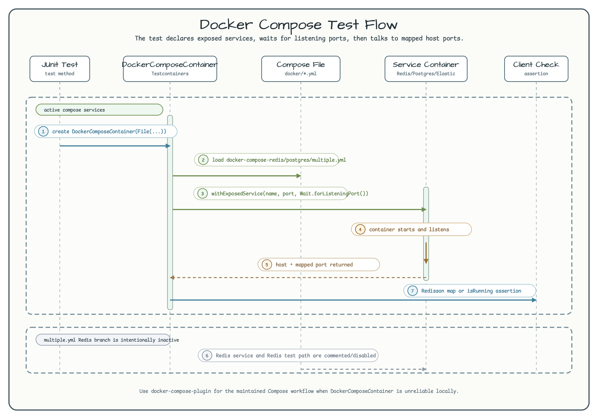

# docker compose-demo

[English](README.md) | 한국어

## 이 모듈에서 확인할 내용

이 모듈은 모듈-local Compose 파일을 Testcontainers
`DockerComposeContainer`로 실행하는 예제입니다. 각 테스트는
`docker/docker-compose-*.yml` 파일을 읽고, `withExposedService`로 서비스명과
포트를 선언하고, 서비스가 listen할 때까지 기다린 뒤 mapped host port 또는
client 동작을 확인합니다.

새 Compose 기반 테스트를 작성할 때는 유지보수되는 Docker Compose workflow를 위해
`docker-compose-plugin`을 사용하는 편이 낫습니다. 이 모듈은 legacy
`DockerComposeContainer`의 계약과 로컬 문제 해결 지점을 이해하는 용도로 남깁니다.

## 아키텍처


활성 서비스 집합은 세 Compose 파일에 의해 정해집니다.

| Test | Compose file | Active services |
|---|---|---|
| `DockerComposeRedisTest` | `docker-compose-redis.yml` | Redis `6379` |
| `DockerComposePostgresTest` | `docker-compose-postgres.yml` | PostgreSQL `5432` |
| `MultipleServiceTest` | `docker-compose-multiple.yml` | Elasticsearch `9200`, PostgreSQL `5432` |

`docker-compose-multiple.yml`에는 Redis service가 주석 처리되어 있고,
`MultipleServiceTest`의 Redis 테스트 경로도 disabled 상태입니다. 예제를 변경할 때
이 구분이 README와 다이어그램에 유지되어야 합니다.

## 런타임 흐름



## 사용법

```bash
./gradlew :docker-compose-demo:test
```

## 문제 해결

### Q. `Container startup failed for image alpine/socat:1.7.4.3-r0` 예외가 발생할 때

Docker Compose module이 arm64 플랫폼이 없는 오래된 `alpine/socat` 이미지를 사용할 때
발생할 수 있습니다. `~/.testcontainers.properties` 파일에 새 socat 이미지를
지정합니다.

```shell
$ grep socat ~/.testcontainers.properties
socat.container.image=alpine/socat:latest
```

### Q. linux/amd64 아키텍처만 지원하는 이미지를 사용할 때

Apple Silicon에서 amd64-only Docker 이미지를 실행해야 한다면 `build.gradle.kts`의
JNA 의존성을 유지합니다.

```kotlin
testImplementation(Libs.jna)
testImplementation(Libs.jna_platform)
```

## 참고 자료

* [Docker Compose Module](https://www.testcontainers.org/modules/docker_compose/)
* [How to run Docker Compose with Testcontainers](https://codeal.medium.com/how-to-run-docker-compose-with-testcontainers-7d1ba73afeeb)
* [Simple and Powerful Integration Tests with Gradle and Docker-Compose](https://codeal.medium.com/guide-simple-and-powerful-integration-tests-with-gradle-and-docker-compose-7a27bd06a0cd)
