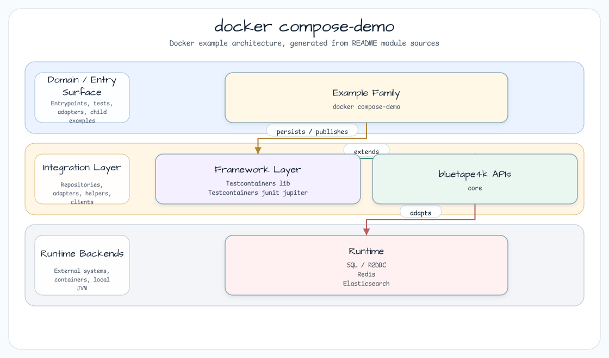
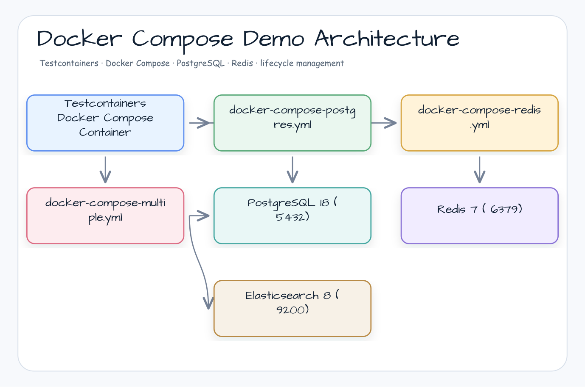

# docker compose-demo

[한국어](README.ko.md) | English

## Example Scenario

This example exercises **docker compose-demo** as a runnable Docker Compose test infrastructure workshop slice. It focuses on the path a developer would inspect first: configure the module, run the sample or tests, and observe the library or framework APIs that remove repetitive infrastructure code.

## Architecture Diagram



The module is organized around the sample entry point or test fixture, the bluetape4k extension layer, and the runtime dependency used by the example. Keep the package under `io.bluetape4k.workshop.docker` as the source of truth when comparing this README with the code.



## Flow Diagram

1. Prepare the local runtime required by `docker-compose-demo`.
2. Execute the application, controller, service, or test fixture that owns the example scenario.
3. Delegate repetitive infrastructure work to bluetape4k utilities or Spring/Kotlin integrations.
4. Assert the visible result through the sample output, HTTP response, repository state, metric, trace, or test expectation.

## Sequence Diagram

The core sequence is: caller or test fixture -> workshop adapter -> bluetape4k helper/API -> external runtime or in-memory backend -> assertion/response. When this module has a dedicated sequence asset, the image below shows that interaction order; otherwise the source tests are the authoritative executable sequence.

# FIXME

현재 `DockerComposeContainer` 가 제대로 실행되지 않는다.
`docker-compose-plugin` 을 사용하는 방식을 추천합니다.

## 개요

이 예제는 `Testcontainers`의 `DockerComposeContainer` 사용하여 `docker-compose.yml` 파일로부터 복수의 컨테이너를 실행하는 방법을 보여줍니다.


## 참고

* [Docker Compose Module](https://www.testcontainers.org/modules/docker_compose/)
* [How to run Docker Compose with Testcontainers](https://codeal.medium.com/how-to-run-docker-compose-with-testcontainers-7d1ba73afeeb)
* [Simple and Powerful Integration Tests with Gradle and Docker-Compose](https://codeal.medium.com/guide-simple-and-powerful-integration-tests-with-gradle-and-docker-compose-7a27bd06a0cd)

## Throuble Shooting

### Q. `Container startup failed for image alpine/socat:1.7.4.3-r0` 예외 발생 시

[alpine/socat container pinned at old version lacking arm64 platform](https://github.com/testcontainers/testcontainers-java/issues/5279)
를 참고해서, `~/.testcontainers.properties` 파일에 `socat.container.image=alpine/socat:latest` 를 추가하면 됩니다.

```shell
$ grep socat ~/.testcontainers.properties
socat.container.image=alpine/socat:latest
```

### Q. linux/amd64 아키텍처에서만 지원하는 이미지를 사용하는 경우

Apple Silicon M1 에서 linux/amd64 platform 용 Docker 이미지를 실행하기 위해서 필요한 라이브러리를 `build.gradle.kts` 에 추가해 주세요.

```kotlin
testImplementation(Libs.jna)
testImplementation(Libs.jna_platform)
```
