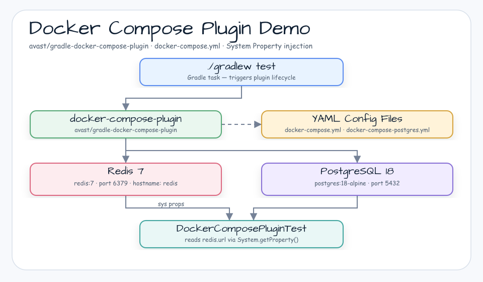
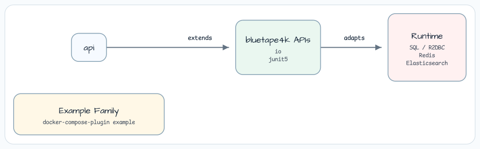

# docker-compose-plugin example

[English](README.md) | 한국어

## 예제 시나리오

이 예제는 **docker-compose-plugin example**을 실행 가능한 Docker Compose 테스트 인프라 워크샵 조각으로 다룹니다. 개발자가 가장 먼저 확인할 흐름인 모듈 설정, 샘플 또는 테스트 실행, 반복적인 인프라 코드를 줄여 주는 라이브러리/프레임워크 API 관찰에 초점을 둡니다.

## 아키텍처 다이어그램



이 모듈은 샘플 진입점 또는 테스트 픽스처, bluetape4k 확장 계층, 예제가 사용하는 런타임 의존성을 중심으로 구성됩니다. 이 README를 코드와 비교할 때는 `io.bluetape4k.workshop.docker` 패키지를 기준으로 삼습니다.



## 흐름 다이어그램

1. `docker-compose-plugin-demo`에 필요한 로컬 런타임을 준비합니다.
2. 예제 시나리오를 담당하는 애플리케이션, 컨트롤러, 서비스 또는 테스트 픽스처를 실행합니다.
3. 반복적인 인프라 작업을 bluetape4k 유틸리티 또는 Spring/Kotlin 통합 기능에 위임합니다.
4. 샘플 출력, HTTP 응답, 저장소 상태, 메트릭, 트레이스 또는 테스트 기대값으로 보이는 결과를 검증합니다.

## 시퀀스 다이어그램

핵심 시퀀스는 호출자 또는 테스트 픽스처 -> 워크샵 어댑터 -> bluetape4k 헬퍼/API -> 외부 런타임 또는 인메모리 백엔드 -> 검증/응답 순서입니다. 이 모듈에 전용 시퀀스 자산이 있으면 아래 이미지가 상호작용 순서를 보여 줍니다. 그렇지 않으면 소스 테스트가 실행 가능한 시퀀스의 기준입니다.

이 예제는 [Gradle docker-compose-plugin](https://github.com/avast/gradle-docker-compose-plugin)을 사용해 Testcontainers 없이 docker-compose를 실행합니다.
Gradle 빌드 스크립트만으로 docker-compose를 실행하는 방법을 보여 줍니다.


이 방식은 커스텀 서버를 구성하고 테스트할 때 가장 편리합니다.

## Docker Compose Yaml 파일 사전 검증

yml 파일 설정이 올바른지 확인합니다.

```shell
$ docker compose -f docker-compose.yml config
$ docker compose -f docker-compose-multiple.yml config
```

다음으로 dockerized service를 실제로 실행합니다.

```shell
$ docker compose -f docker-compose.yml up
```

```shell
$ docker compose -f docker-compose-multiple.yml up
```

## 참고 자료

* [Gradle docker-compose-plugin](https://github.com/avast/gradle-docker-compose-plugin)
* [Docker with Gradle: Getting started with Docker Compose](https://bmuschko.com/blog/gradle-docker-compose/)
