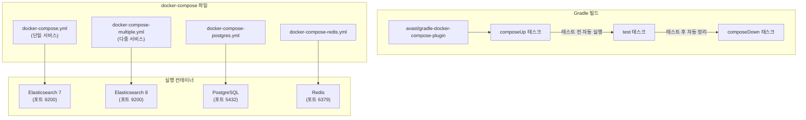

# docker-compose-plugin example

이 예제는 [Gradle docker-compose-plugin](https://github.com/avast/gradle-docker-compose-plugin) 을 사용하여 testcontainers 없이도
gradle build script
만으로 docker-compose 를 실행하는 방법을 보여줍니다.



Custom Server를 구성하고, 테스트 할 때에는 이 방식이 가장 편리합니다.

## Docker Compose Yaml 파일 사전 검증

yml 파일 설정이 제대로 되었는지 확인 합니다.

```shell
$ docker compose -f docker-compose.yml config
$ docker compose -f docker-compose-multiple.yml config
```

다음으로 실제로 dockerized 서비스를 실행해 봅니다.

```shell
$ docker compose -f docker-compose.yml up
```

```shell
$ docker compose -f docker-compose-multiple.yml up
```

## 참고

* [Gradle docker-compose-plugin](https://github.com/avast/gradle-docker-compose-plugin)
* [Docker with Gradle: Getting started with Docker Compose](https://bmuschko.com/blog/gradle-docker-compose/)
