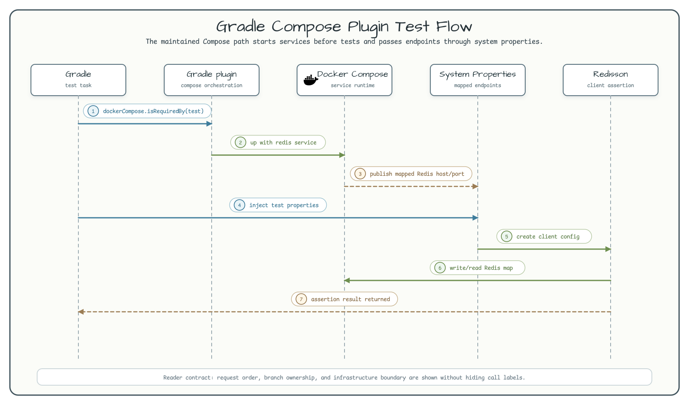

# docker-compose-plugin example

[한국어](README.ko.md) | English

## What This Module Shows

This module demonstrates the Gradle
[`docker-compose-plugin`](https://github.com/avast/gradle-docker-compose-plugin)
as the owner of test infrastructure lifecycle. The `test` task depends on
`dockerCompose`, starts Redis and PostgreSQL from module-local Compose files,
then exposes mapped host/port values as environment variables and JVM system
properties.

The current test consumes `redis.url` through Redisson. `postgres.url` is also
published for consumers that need a JDBC connection, even though this test only
asserts Redis behavior.

## Architecture


## Runtime Flow



## Compose Files

| Compose file | Used by `dockerCompose` | Services |
|---|---:|---|
| `docker-compose.yml` | yes | Redis `6379` |
| `docker-compose-postgres.yml` | yes | PostgreSQL `5432` |
| `docker-compose-redis.yml` | no | Standalone Redis file |
| `docker-compose-multiple.yml` | no | Elasticsearch `9200` |

## Usage

```bash
./gradlew :docker-compose-plugin-demo:test
```

## Docker Compose YAML Pre-Validation

Use Docker Compose directly when you want to validate file syntax before running
the Gradle test task.

```shell
$ docker compose -f docker-compose.yml config
$ docker compose -f docker-compose-multiple.yml config
```

You can also run the service manually when debugging Compose behavior outside
Gradle.

```shell
$ docker compose -f docker-compose.yml up
```

```shell
$ docker compose -f docker-compose-multiple.yml up
```

## References

* [Gradle docker-compose-plugin](https://github.com/avast/gradle-docker-compose-plugin)
* [Docker with Gradle: Getting started with Docker Compose](https://bmuschko.com/blog/gradle-docker-compose/)
