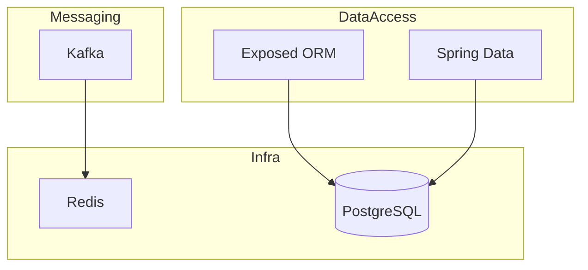

# docs/assets — Diagram and Image Conventions

This document defines naming, format, and placement conventions for all visual assets
in the `bluetape4k-workshop` repository.

---

## Directory Layout

```
docs/
├── assets/                          # Root visual assets referenced directly in README.md
│   ├── workshop-workbench.png       # Hero image shown in README.md
│   └── CONVENTIONS.md               # This file
├── images/
│   ├── readme-diagrams/             # Architecture and flow diagrams embedded in READMEs
│   │   └── <scope>-<type>-<seq>.png
│   └── readme-charts/               # Data/metric charts embedded in READMEs
│       └── <scope>-<type>-<seq>.png
```

---

## File Naming

Pattern: `<scope>-<type>-<seq>.<ext>`

| Segment | Values | Example |
|---------|--------|---------|
| `scope` | `root-readme` \| `<module-name>` | `root-readme`, `exposed-mvc-jdbc` |
| `type` | `overview` \| `architecture` \| `c4-context` \| `c4-component` \| `sequence` \| `diagram` \| `chart` \| `en-diagram` | `c4-context`, `sequence` |
| `seq` | two-digit sequence number | `01`, `02` |
| `ext` | `png` (preferred for raster), `svg` (preferred for vector/Mermaid export) | `png` |

### Examples

```
docs/images/readme-diagrams/root-readme-overview-01.png
docs/images/readme-diagrams/root-readme-c4-context-01.svg
docs/images/readme-diagrams/exposed-sequence-01.png
docs/images/readme-charts/root-readme-module-chart-01.png
```

---

## Diagram Types

### Architecture Overview

Use a top-level diagram showing all active domains and their relationships.
Recommended format: Mermaid `graph TD` or `C4Context`.



### C4 Component Diagrams

For each major domain, provide a C4 Component diagram showing:
- External actors (client, message broker, database)
- Application modules
- Connections with protocols

File naming: `<domain>-c4-component-01.svg`

Domains requiring C4 diagrams:
- `data-access-c4-component-01.svg` — Exposed + Spring Data
- `async-reactive-c4-component-01.svg` — Coroutines + Vert.x + Virtual Threads
- `observability-c4-component-01.svg` — Micrometer + Tracing
- `messaging-c4-component-01.svg` — Kafka + Event flow
- `arch-extensions-c4-component-01.svg` — Gateway + Security + Modulith

### UML Sequence Diagrams

For representative flows that involve multiple components.
File naming: `<module>-sequence-01.svg`

Key flows to document:
- `redis-distributed-lock-sequence-01.svg` — Lock acquire → work → release with coroutines
- `messaging-kafka-reply-sequence-01.svg` — Request → Kafka → reply → response
- `observability-tracing-sequence-01.svg` — HTTP in → DB span → Redis span → out

---

## Format Guidelines

| Concern | Guideline |
|---------|-----------|
| Raster images | PNG, minimum 1200px wide for architecture diagrams |
| Vector | SVG preferred for Mermaid exports and flow diagrams |
| Background | White or transparent; avoid dark backgrounds for readability in both light/dark GitHub themes |
| Font | System sans-serif or Roboto; minimum 12pt for labels |
| Color palette | Use bluetape4k brand colors: primary `#4A90D9`, accent `#6DB33F` (Spring green), neutral `#555555` |
| Alt text | Always set descriptive alt text in Markdown image embeds |

---

## How to Reference in README

```markdown
<!-- Preferred: descriptive alt text + relative path -->


<!-- For hero image in root README -->

```

---

## Tooling

| Tool | Use case |
|------|----------|
| [Mermaid](https://mermaid.js.org) | Architecture, flow, sequence diagrams — rendered natively by GitHub |
| [draw.io](https://app.diagrams.net) | C4, UML, and complex multi-layer diagrams |
| [PlantUML](https://plantuml.com) | UML sequence diagrams |
| macOS Screenshot / Snagit | Hero images and screenshots |

Store the source file (`.drawio`, `.puml`, `.mmd`) alongside the exported PNG/SVG
with the same base name:

```
docs/images/readme-diagrams/root-readme-c4-context-01.svg    ← exported
docs/images/readme-diagrams/root-readme-c4-context-01.drawio ← source
```

---

## Checklist for New Diagrams

- [ ] File follows `<scope>-<type>-<seq>.<ext>` naming
- [ ] Placed in `docs/images/readme-diagrams/` or `docs/images/readme-charts/`
- [ ] Alt text is descriptive (not "diagram")
- [ ] Source file committed alongside export
- [ ] Both light and dark GitHub themes verified
