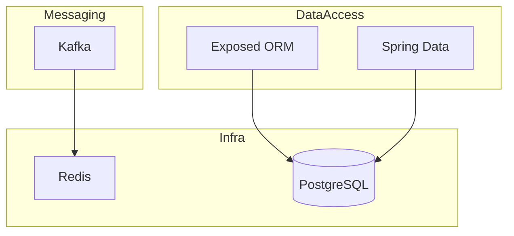

# docs/assets — Diagram and Image Conventions

이 문서는 `bluetape4k-workshop` 저장소의 모든 시각 asset에 대한 이름, 형식,
배치 규칙을 정의합니다.

---

## Directory Layout

```
docs/
├── assets/                          # README.md에서 직접 참조하는 루트 시각 asset
│   ├── workshop-workbench.png       # README.md에 표시되는 hero image
│   └── CONVENTIONS.md               # 이 파일
├── images/
│   ├── readme-diagrams/             # README에 삽입되는 architecture/flow diagram
│   │   └── <scope>-<type>-<seq>.png
│   └── readme-charts/               # README에 삽입되는 data/metric chart
│       └── <scope>-<type>-<seq>.png
```

---

## File Naming

패턴: `<scope>-<type>-<seq>.<ext>`

| Segment | Values | Example |
|---------|--------|---------|
| `scope` | `root-readme` \| `<module-name>` | `root-readme`, `exposed-mvc-jdbc` |
| `type` | `overview` \| `architecture` \| `c4-context` \| `c4-component` \| `sequence` \| `diagram` \| `chart` \| `en-diagram` | `c4-context`, `sequence` |
| `seq` | 두 자리 sequence number | `01`, `02` |
| `ext` | `png`(raster 권장), `svg`(vector/Mermaid export 권장) | `png` |

### Examples

```
docs/images/readme-diagrams/root-readme-overview-01.png
docs/images/readme-diagrams/root-readme-c4-context-01.svg
docs/images/readme-diagrams/exposed-sequence-01.png
docs/images/readme-charts/root-readme-module-chart-01.png
```

---

## Diagram Types

### Architecture Overview

활성 domain과 관계를 보여주는 최상위 diagram을 사용합니다.
권장 형식은 Mermaid `graph TD` 또는 `C4Context`입니다.



### C4 Component Diagrams

각 주요 domain에는 다음을 보여주는 C4 Component diagram을 제공합니다.
- 외부 actor(client, message broker, database)
- application module
- protocol을 포함한 connection

파일 이름: `<domain>-c4-component-01.svg`

반드시 C4 diagram이 필요한 domain:
- `data-access-c4-component-01.svg` — Exposed + Spring Data
- `async-reactive-c4-component-01.svg` — Coroutines + Vert.x + Virtual Threads
- `observability-c4-component-01.svg` — Micrometer + Tracing
- `messaging-c4-component-01.svg` — Kafka + Event flow
- `arch-extensions-c4-component-01.svg` — Gateway + Security + Modulith

### UML Sequence Diagrams

여러 component가 관여하는 대표 flow에 사용합니다.
파일 이름: `<module>-sequence-01.svg`

문서화할 핵심 flow:
- `redis-distributed-lock-sequence-01.svg` — Lock acquire → work → release with coroutines
- `messaging-kafka-reply-sequence-01.svg` — Request → Kafka → reply → response
- `observability-tracing-sequence-01.svg` — HTTP in → DB span → Redis span → out

---

## Format Guidelines

| Concern | Guideline |
|---------|-----------|
| Raster images | PNG를 사용하고 architecture diagram은 최소 1200px 폭을 유지합니다 |
| Vector | Mermaid export와 flow diagram에는 SVG를 권장합니다 |
| Background | GitHub light/dark theme 모두에서 읽기 쉽도록 흰색 또는 투명 배경을 사용하고 어두운 배경은 피합니다 |
| Font | system sans-serif 또는 Roboto를 사용하고 label은 최소 12pt로 둡니다 |
| Color palette | bluetape4k brand color를 사용합니다: primary `#4A90D9`, accent `#6DB33F`(Spring green), neutral `#555555` |
| Alt text | Markdown image embed에는 항상 설명적인 alt text를 설정합니다 |

---

## How to Reference in README

```markdown
<!-- 권장: 설명적인 alt text + relative path -->


<!-- 루트 README의 hero image -->

```

---

## Tooling

| Tool | Use case |
|------|----------|
| [Mermaid](https://mermaid.js.org) | architecture, flow, sequence diagram. GitHub에서 native rendering됩니다 |
| [draw.io](https://app.diagrams.net) | C4, UML, 복잡한 multi-layer diagram |
| [PlantUML](https://plantuml.com) | UML sequence diagram |
| macOS Screenshot / Snagit | hero image와 screenshot |

source file(`.drawio`, `.puml`, `.mmd`)은 같은 base name의 exported PNG/SVG와
같은 위치에 저장합니다.

```
docs/images/readme-diagrams/root-readme-c4-context-01.svg    ← export 결과
docs/images/readme-diagrams/root-readme-c4-context-01.drawio ← source
```

---

## Checklist for New Diagrams

- [ ] 파일 이름이 `<scope>-<type>-<seq>.<ext>` 형식을 따릅니다.
- [ ] `docs/images/readme-diagrams/` 또는 `docs/images/readme-charts/`에 배치했습니다.
- [ ] alt text가 "diagram"처럼 일반적이지 않고 설명적입니다.
- [ ] source file을 export 결과와 함께 commit했습니다.
- [ ] GitHub light/dark theme 모두에서 확인했습니다.
