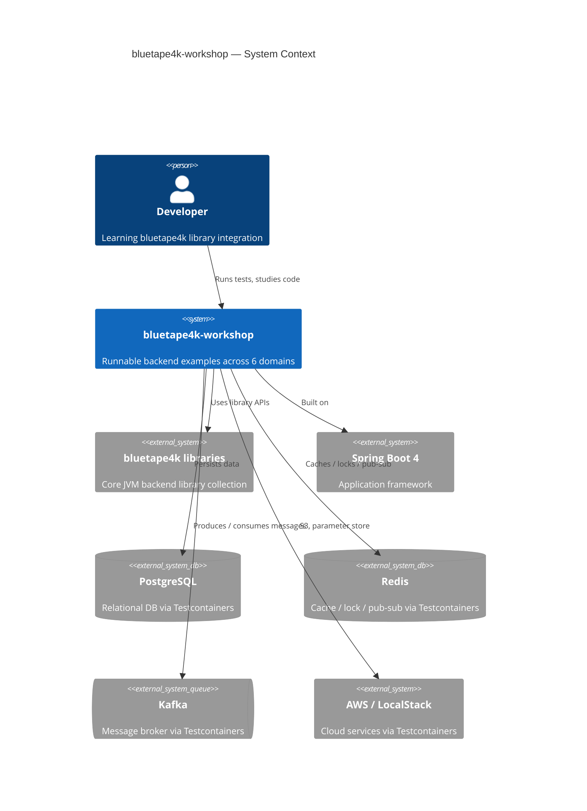

# Root Architecture Diagram — Source

이 파일은 워크숍 루트 architecture diagram의 Mermaid source를 담고 있습니다.
Mermaid CLI 또는 online editor로 `root-readme-overview-01.svg`를 export합니다.

```mermaid
graph TB
    classDef domain fill:#4A90D9,stroke:#2C5F8A,color:#fff,font-weight:bold
    classDef module fill:#E8F4FD,stroke:#4A90D9,color:#333
    classDef infra fill:#FFF3E0,stroke:#E65100,color:#333
    classDef bt fill:#6DB33F,stroke:#3B7A21,color:#fff,font-weight:bold

    BT["bluetape4k libraries"]:::bt

    subgraph DA["① Data Access"]
        direction LR
        exposed[exposed\nmvc-jdbc\nwebflux-r2dbc]:::module
        springdata[spring-data\nr2dbc · jpa · mongodb\nelasticsearch]:::module
    end

    subgraph SB["② Spring Boot Ops"]
        direction LR
        cache[cache\ncaffeine · redis]:::module
        resilience[resilience4j\ncoroutines]:::module
        webflux[webflux\ncoroutines · websocket]:::module
    end

    subgraph SM["③ Serialization & Messaging"]
        direction LR
        json[json\njackson3 · jsonview]:::module
        kafka[messaging\nkafka · reply]:::module
    end

    subgraph AR["④ Async & Reactive"]
        direction LR
        coroutines[kotlin\ncoroutines · patterns]:::module
        vt[virtualthreads\nmvc · webflux]:::module
        vertx[vertx\ncoroutines · sql · web]:::module
    end

    subgraph OB["⑤ Observability & Perf"]
        direction LR
        obs[observability\nbasic · advanced]:::module
        gatling[gatling\nload simulation]:::module
    end

    subgraph AX["⑥ Architecture Extensions"]
        direction LR
        gw[gateway\napi-gateway]:::module
        modulith[spring-modulith\nevents · jpa]:::module
        sec[spring-security\nmvc · webflux]:::module
        rl[ratelimit\nbucket4j]:::module
        redis[redis\nredisson · lock]:::module
        aws[aws\ns3-spring-cloud]:::module
        leader[leader\nelection]:::module
    end

    subgraph INFRA["Infrastructure (Testcontainers)"]
        direction LR
        pg[(PostgreSQL)]:::infra
        mongodb[(MongoDB)]:::infra
        es[(Elasticsearch)]:::infra
        redisdb[(Redis)]:::infra
        kafkabroker([Kafka]):::infra
        localstack([LocalStack]):::infra
    end

    BT --> DA
    BT --> SB
    BT --> SM
    BT --> AR
    BT --> OB
    BT --> AX

    exposed --> pg
    springdata --> pg
    springdata --> mongodb
    springdata --> es
    springdata --> redisdb
    cache --> redisdb
    kafka --> kafkabroker
    obs --> pg
    obs --> redisdb
    redis --> redisdb
    rl --> redisdb
    leader --> redisdb
    aws --> localstack
    modulith --> pg
```

## C4 Context Diagram

```mermaid
C4Context
    title bluetape4k-workshop — System Context

    Person(dev, "Developer", "Learning bluetape4k library integration")
    System(workshop, "bluetape4k-workshop", "Runnable backend examples across 6 domains")
    System_Ext(bt, "bluetape4k libraries", "Core JVM backend library collection")
    System_Ext(spring, "Spring Boot 4", "Application framework")
    SystemDb_Ext(pg, "PostgreSQL", "Relational DB via Testcontainers")
    SystemDb_Ext(redis, "Redis", "Cache / lock / pub-sub via Testcontainers")
    SystemQueue_Ext(kafka, "Kafka", "Message broker via Testcontainers")
    System_Ext(aws, "AWS / LocalStack", "Cloud services via Testcontainers")

    Rel(dev, workshop, "Runs tests, studies code")
    Rel(workshop, bt, "Uses library APIs")
    Rel(workshop, spring, "Built on")
    Rel(workshop, pg, "Persists data")
    Rel(workshop, redis, "Caches / locks / pub-sub")
    Rel(workshop, kafka, "Produces / consumes messages")
    Rel(workshop, aws, "S3, parameter store")
```
