# 서브모듈 README UML 다이어그램 추가 구현 계획

> **For agentic workers:** REQUIRED SUB-SKILL: Use superpowers:subagent-driven-development (recommended) or superpowers:executing-plans to implement this plan task-by-task. Steps use checkbox (`- [ ]`) syntax for tracking.

**Goal:** bluetape4k-workshop 68개 서브모듈 README에 Mermaid UML 다이어그램(classDiagram / sequenceDiagram / flowchart LR)을 추가하여 각 모듈의 구조와 동작을 시각적으로 파악할 수 있게 한다.

**Architecture:** 7개 병렬 에이전트가 도메인별로 독립 분산 처리. 각 에이전트는 소스 코드 탐색 → 다이어그램 타입 결정 → Mermaid 작성 → README 삽입 순으로 작업한다. 다이어그램은 제목/소개 섹션 직후에 삽입한다.

**Tech Stack:** Mermaid (flowchart LR, classDiagram, sequenceDiagram), Kotlin, Spring Boot 4, JetBrains Exposed, Gradle 멀티모듈

**Spec:** `docs/superpowers/specs/2026-03-23-submodule-readme-uml-diagrams-design.md`

---

## 공통 규칙 (모든 에이전트 적용)

- **배치 위치**: 제목/소개 또는 첫 번째 기능 섹션 직후
- **레이블**: 한국어 사용 (`클라이언트`, `서비스`, `DB`)
- **노드 수**: 최소 4개 ~ 최대 15개
- **서브그래프**: 계층 구분 시 `subgraph 레이어명` 활용
- **다이어그램 순서**: 아키텍처 흐름 → 도메인 모델 → 요청 처리 흐름
- **기존 내용 보존**: README 기존 텍스트 삭제·덮어쓰기 금지
- **src/ 하위 README 제외**: 대상 아님

## 다이어그램 선택 기준

| 상황 | 타입 |
|------|------|
| 엔티티/데이터클래스 관계 | `classDiagram` |
| HTTP 요청→처리→응답 | `sequenceDiagram` |
| 데이터 파이프라인/변환 | `flowchart LR` |
| 이벤트/메시지 처리 | `sequenceDiagram` + `flowchart LR` |
| 설정/인프라 중심 | `flowchart LR` (컴포넌트 구성도) |
| 소스 최소 or 인프라 전용 | `flowchart LR` 1개만 |

---

## Task 1: Agent-1 — exposed/, spring-modulith/, spring-security/ (7개)

**담당 README:**
- `exposed/README.md`
- `exposed/domain/README.md`
- `exposed/sql-webflux-coroutines/README.md`
- `exposed/dao-web-transaction/README.md`
- `exposed/sql-web-virtualthread/README.md`
- `spring-modulith/jpa-demo/README.md`
- `spring-security/README.md`

- [ ] **Step 1: exposed/domain 소스 탐색**

```bash
find exposed/domain/src -name "*.kt" | head -30
```

- [ ] **Step 2: exposed/domain/README.md — classDiagram + flowchart 추가**

소스에서 확인된 연관관계(One-to-One, One-to-Many, Many-to-Many) 기반으로 작성.
제목/소개 직후에 삽입:

```markdown
## 아키텍처 흐름

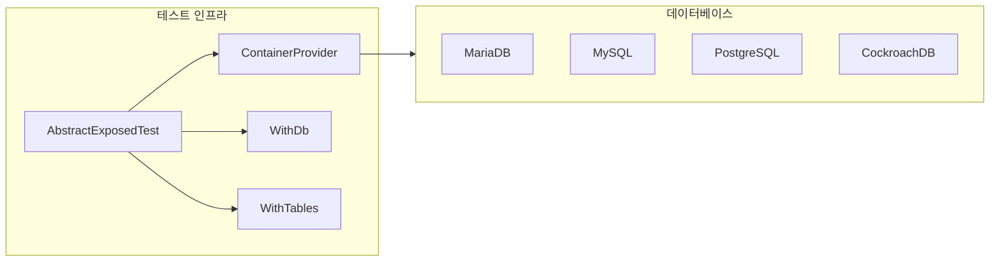

## 도메인 모델

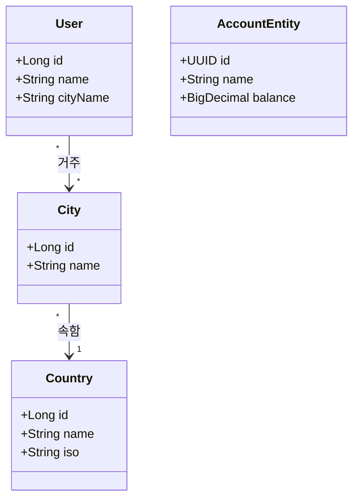
```

- [ ] **Step 3: exposed/sql-webflux-coroutines/README.md — sequenceDiagram + classDiagram 추가**

```bash
find exposed/sql-webflux-coroutines/src/main -name "*.kt" | head -20
```

삽입 내용 (소스 구조: Controller → Repository → Exposed DSL → DB):

```markdown
## 아키텍처 흐름

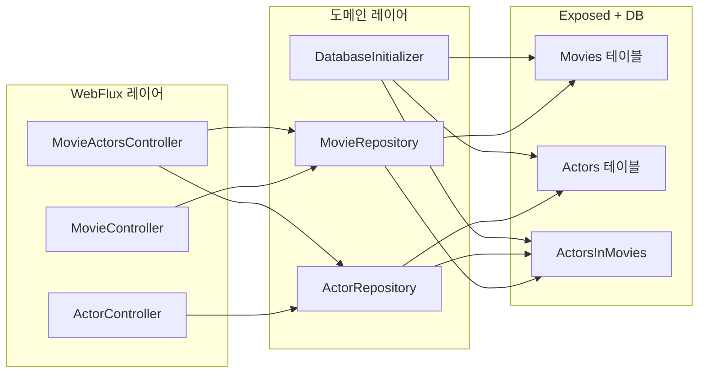

## 요청 처리 흐름

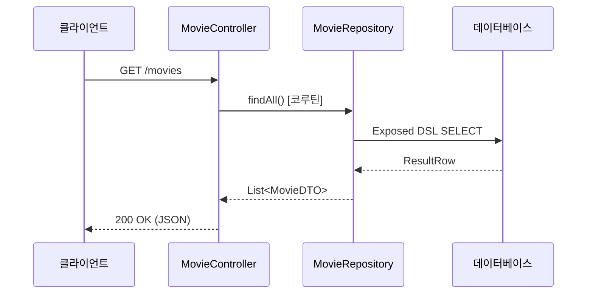
```

- [ ] **Step 4: exposed/dao-web-transaction/README.md — sequenceDiagram 추가**

```bash
find exposed/dao-web-transaction/src/main -name "*.kt" | head -20
```

```markdown
## 요청 처리 흐름

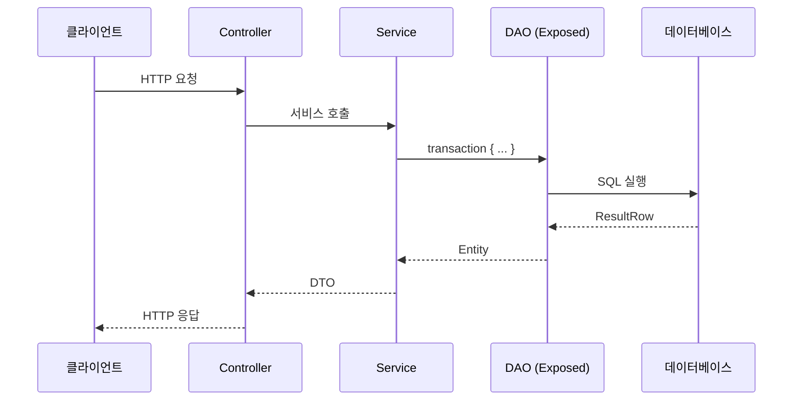
```

- [ ] **Step 5: exposed/sql-web-virtualthread/README.md — flowchart + sequenceDiagram 추가**

```bash
find exposed/sql-web-virtualthread/src/main -name "*.kt" | head -20
```

- [ ] **Step 6: exposed/README.md — 서브모듈 개요 flowchart 추가**

```markdown
## 모듈 구성

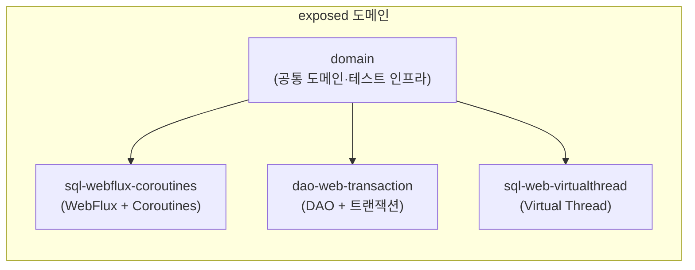
```

- [ ] **Step 7: spring-modulith/jpa-demo/README.md — flowchart 추가**

```bash
find spring-modulith/jpa-demo/src/main -name "*.kt" | head -20
```

- [ ] **Step 8: spring-security/README.md — flowchart 추가**

```bash
find spring-security -name "*.kt" -path "*/main/*" | head -20
```

---

## Task 2: Agent-2 — spring-boot/ (12개)

**담당 README:**
- `spring-boot/webflux-coroutines/README.md`
- `spring-boot/stomp-websocket/README.md`
- `spring-boot/application-event-demo/README.md`
- `spring-boot/cache-caffeine/README.md`
- `spring-boot/cache-redis/README.md`
- `spring-boot/resilience4j-coroutines/README.md`
- `spring-boot/async-logging/README.md`
- `spring-boot/problem/README.md`
- `spring-boot/chaos-monkey/README.md`
- `spring-boot/cbor-mvc/README.md`
- `spring-boot/protobuf-mvc/README.md`
- `spring-boot/webflux-websocket/README.md`

- [ ] **Step 1: webflux-coroutines/README.md — flowchart + sequenceDiagram 추가**

기존 내용(구현 방식 비교 테이블) 직후에 삽입:

```markdown
## 아키텍처 흐름

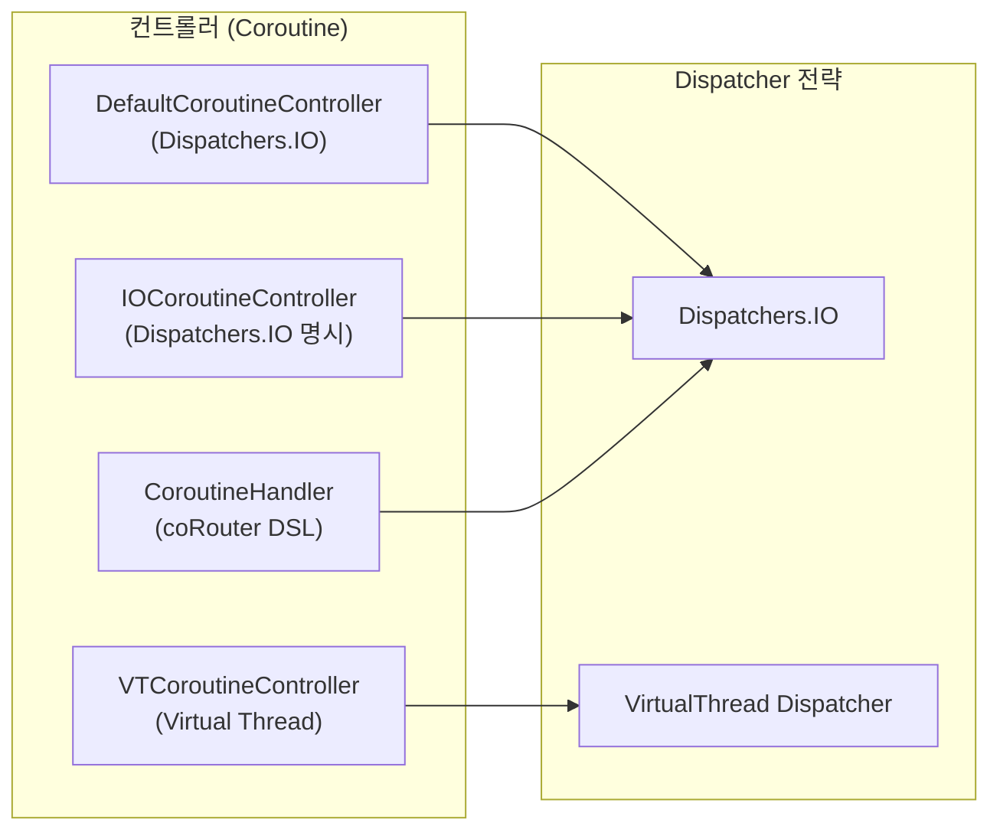

## 요청 처리 흐름

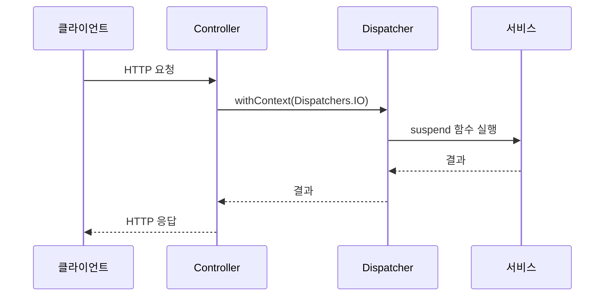
```

- [ ] **Step 2: stomp-websocket/README.md — sequenceDiagram 추가**

```bash
find spring-boot/stomp-websocket/src/main -name "*.kt"
```

```markdown
## 메시지 흐름

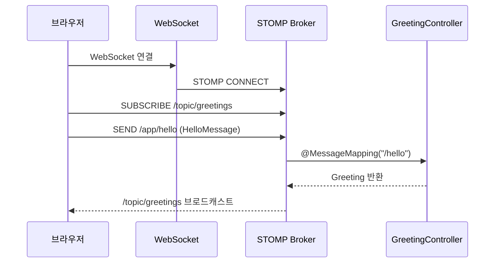
```

- [ ] **Step 3: application-event-demo/README.md — sequenceDiagram + classDiagram 추가**

```bash
find spring-boot/application-event-demo/src/main -name "*.kt" | head -30
```

```markdown
## 이벤트 흐름

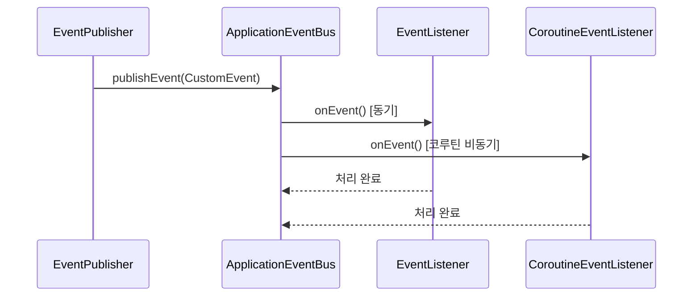
```

- [ ] **Step 4: cache-caffeine/README.md — flowchart 추가**

```bash
find spring-boot/cache-caffeine/src/main -name "*.kt"
```

```markdown
## 캐시 흐름

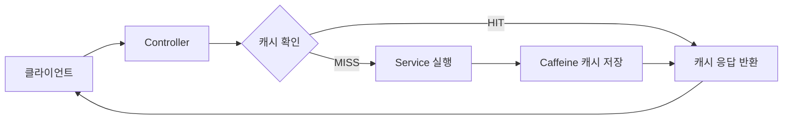
```

- [ ] **Step 5: cache-redis/README.md — flowchart 추가**

cache-caffeine과 유사하나 Redis 백엔드 반영:

```markdown
## 캐시 흐름

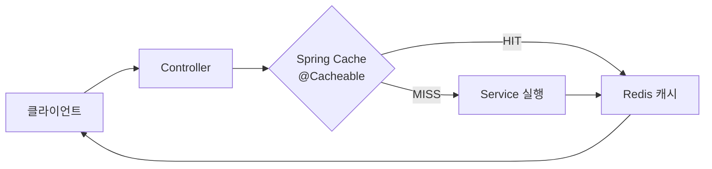
```

- [ ] **Step 6: resilience4j-coroutines/README.md — flowchart 추가**

```bash
find spring-boot/resilience4j-coroutines/src/main -name "*.kt" | head -20
```

```markdown
## Circuit Breaker 흐름

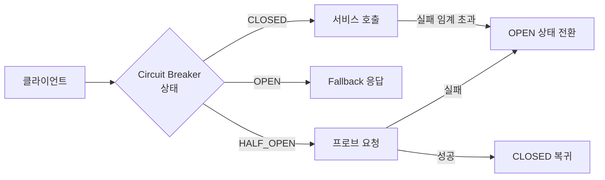
```

- [ ] **Step 7: async-logging/README.md — flowchart 추가**

```bash
find spring-boot/async-logging/src/main -name "*.kt" | head -20
```

- [ ] **Step 8: problem/README.md — flowchart 추가**

```bash
find spring-boot/problem/src/main -name "*.kt" | head -20
```

```markdown
## 에러 처리 흐름

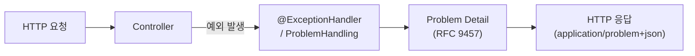
```

- [ ] **Step 9: chaos-monkey/README.md — flowchart 추가**

```bash
find spring-boot/chaos-monkey/src/main -name "*.kt" | head -20
```

- [ ] **Step 10: cbor-mvc/README.md — sequenceDiagram 추가**

```bash
find spring-boot/cbor-mvc/src/main -name "*.kt" | head -20
```

- [ ] **Step 11: protobuf-mvc/README.md — sequenceDiagram 추가**

```bash
find spring-boot/protobuf-mvc/src/main -name "*.kt" | head -20
```

- [ ] **Step 12: webflux-websocket/README.md — sequenceDiagram 추가**

```bash
find spring-boot/webflux-websocket/src/main -name "*.kt" | head -20
```

---

## Task 3: Agent-3 — spring-data/ (10개)

**담당 README:**
- `spring-data/r2dbc-examples/README.md`
- `spring-data/r2dbc-coroutines/README.md`
- `spring-data/r2dbc-webflux/README.md`
- `spring-data/r2dbc-webflux-exposed/README.md`
- `spring-data/jpa-querydsl/README.md`
- `spring-data/mongodb-coroutines/README.md`
- `spring-data/mongodb-transactions/README.md`
- `spring-data/elasticsearch/README.md`
- `spring-data/elasticsearch-webflux/README.md`
- `spring-data/redis-examples/README.md`

- [ ] **Step 1: r2dbc-examples/README.md — classDiagram + sequenceDiagram 추가**

```bash
find spring-data/r2dbc-examples/src/main -name "*.kt" | head -20
```

```markdown
## 도메인 모델

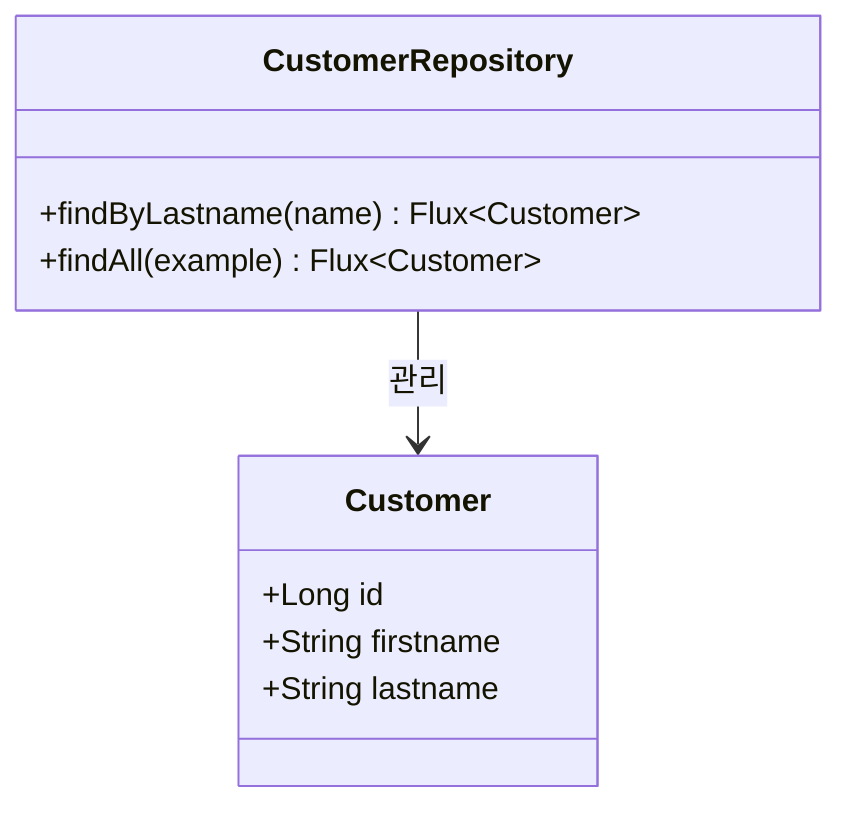

## 요청 처리 흐름

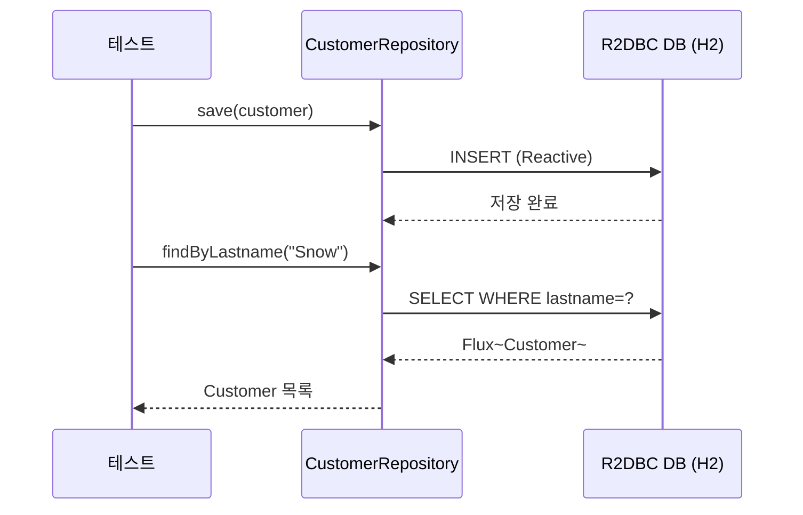
```

- [ ] **Step 2: r2dbc-coroutines/README.md — sequenceDiagram 추가**

```bash
find spring-data/r2dbc-coroutines/src/main -name "*.kt" | head -20
```

- [ ] **Step 3: r2dbc-webflux/README.md — flowchart + sequenceDiagram 추가**

```bash
find spring-data/r2dbc-webflux/src/main -name "*.kt" | head -20
```

- [ ] **Step 4: r2dbc-webflux-exposed/README.md — flowchart + classDiagram 추가**

```bash
find spring-data/r2dbc-webflux-exposed/src/main -name "*.kt" | head -20
```

- [ ] **Step 5: jpa-querydsl/README.md — classDiagram + sequenceDiagram 추가**

```bash
find spring-data/jpa-querydsl/src/main -name "*.kt" | head -30
```

```markdown
## 도메인 모델

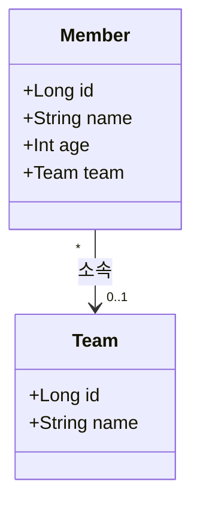

## 쿼리 처리 흐름

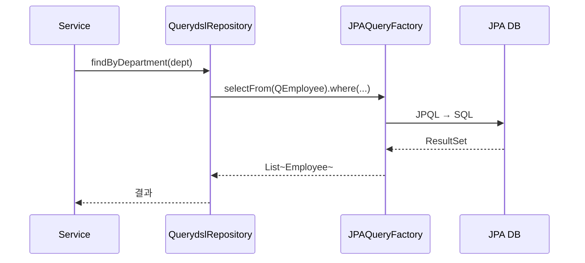
```

- [ ] **Step 6: mongodb-coroutines/README.md — classDiagram + sequenceDiagram 추가**

```bash
find spring-data/mongodb-coroutines/src/main -name "*.kt" | head -20
```

- [ ] **Step 7: mongodb-transactions/README.md — sequenceDiagram 추가**

```bash
find spring-data/mongodb-transactions/src/main -name "*.kt" | head -20
```

- [ ] **Step 8: elasticsearch/README.md — sequenceDiagram 추가**

```bash
find spring-data/elasticsearch/src/main -name "*.kt" | head -20
```

```markdown
## 인덱싱 및 검색 흐름

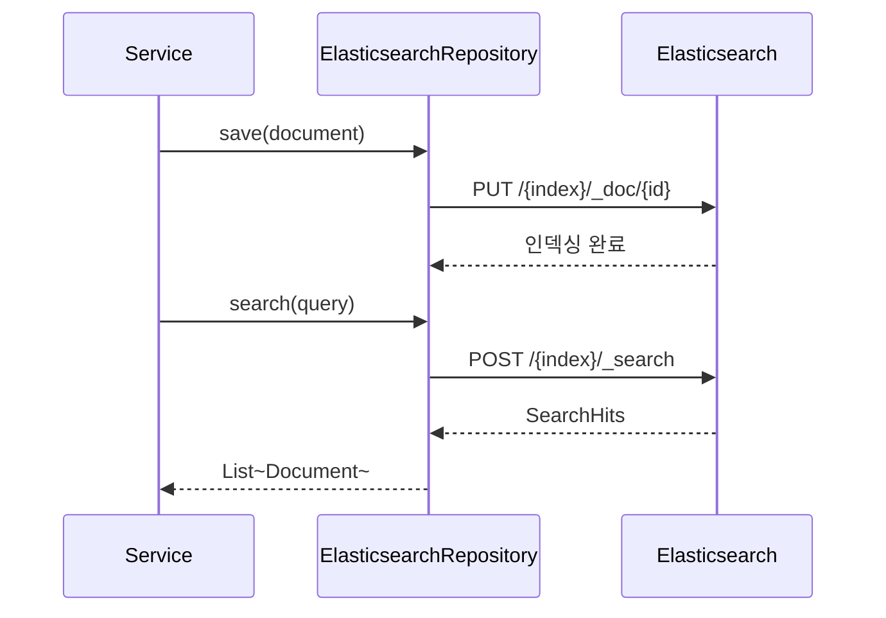
```

- [ ] **Step 9: elasticsearch-webflux/README.md — sequenceDiagram 추가**

- [ ] **Step 10: redis-examples/README.md — flowchart 추가**

```bash
find spring-data/redis-examples/src/main -name "*.kt" | head -20
```

---

## Task 4: Agent-4 — messaging/, observability/, ratelimit/, gateway/, spring-cloud/ (11개)

**담당 README:**
- `messaging/kafka/README.md`
- `messaging/kafka-reply/README.md`
- `observability/micrometer-observation/README.md`
- `observability/micrometer-tracing-coroutines/README.md`
- `ratelimit/README.md`
- `ratelimit/bucket4j-caffeine-web/README.md`
- `ratelimit/bucket4j-redis/README.md`
- `ratelimit/bucker4j-bluetape4k-webflux/README.md`
- `gateway/README.md`
- `gateway/api-gateway/README.md`
- `spring-cloud/gateway-example/README.md`

- [ ] **Step 1: messaging/kafka/README.md — flowchart + sequenceDiagram 추가**

```bash
find messaging/kafka/src/main -name "*.kt" | head -20
```

```markdown
## 아키텍처 흐름

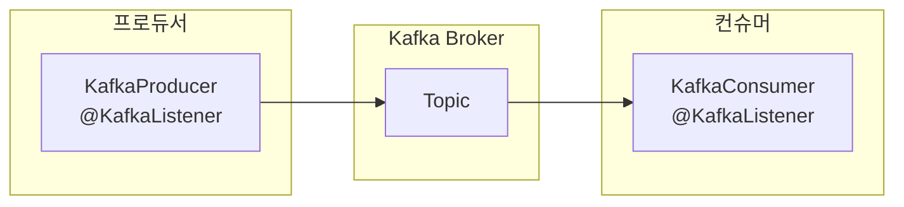

## 메시지 처리 흐름

```mermaid
sequenceDiagram
    participant P as Producer
    participant K as Kafka
    participant C as Consumer

    P->>K: send(topic, message)
    K-->>P: RecordMetadata
    K->>C: poll() → ConsumerRecord
    C->>C: 메시지 처리
```
```

- [ ] **Step 2: messaging/kafka-reply/README.md — sequenceDiagram 추가**

```bash
find messaging/kafka-reply/src/main -name "*.kt" | head -20
```

```markdown
## Request-Reply 패턴

```mermaid
sequenceDiagram
    participant C as Client
    participant P as ReplyingKafkaTemplate
    participant K as Kafka
    participant S as KafkaListener (서버)

    C->>P: sendAndReceive(request)
    P->>K: 요청 토픽 발행
    K->>S: 메시지 수신
    S->>K: 응답 토픽 발행
    K-->>P: 응답 수신
    P-->>C: ConsumerRecord (응답)
```
```

- [ ] **Step 3: observability/micrometer-observation/README.md — flowchart 추가**

```bash
find observability/micrometer-observation/src/main -name "*.kt" | head -20
```

```markdown
## 관찰 가능성 흐름

```mermaid
flowchart LR
    subgraph App["애플리케이션"]
        OA["@Observed\n서비스/메서드"]
        OBS["ObservationRegistry"]
    end
    subgraph Backend["백엔드"]
        MR["Micrometer\n(Metrics)"]
        ZP["Zipkin/Jaeger\n(Tracing)"]
        LOG["Structured Logging"]
    end
    OA -->|계측| OBS
    OBS --> MR & ZP & LOG
```
```

- [ ] **Step 4: observability/micrometer-tracing-coroutines/README.md — sequenceDiagram 추가**

- [ ] **Step 5: ratelimit/README.md — flowchart (서브모듈 개요) 추가**

```markdown
## 모듈 구성

```mermaid
flowchart LR
    subgraph ratelimit["Rate Limiting 모듈"]
        CCW["bucket4j-caffeine-web\n(Caffeine 로컬 캐시)"]
        BR["bucket4j-redis\n(Redis 분산 캐시)"]
        BW["bucker4j-bluetape4k-webflux\n(WebFlux + bluetape4k)"]
    end
    B4J["Bucket4j 라이브러리"] --> CCW & BR & BW
```
```

- [ ] **Step 6: ratelimit/bucket4j-caffeine-web/README.md — flowchart 추가**

```bash
find ratelimit/bucket4j-caffeine-web/src/main -name "*.kt" | head -20
```

```markdown
## Rate Limiting 흐름

```mermaid
flowchart LR
    C["클라이언트"] --> F["RateLimitFilter"]
    F --> BK{"Bucket\n토큰 확인"}
    BK -->|토큰 있음| Svc["서비스 처리"]
    BK -->|토큰 없음| R429["429 Too Many Requests"]
    Svc --> C
    BK -->|소비| BC["Caffeine\nBucket 저장소"]
```
```

- [ ] **Step 7: ratelimit/bucket4j-redis/README.md — flowchart 추가**

- [ ] **Step 8: ratelimit/bucker4j-bluetape4k-webflux/README.md — flowchart 추가**

- [ ] **Step 9: gateway/README.md — flowchart (서브모듈 개요) 추가**

- [ ] **Step 10: gateway/api-gateway/README.md — flowchart 추가**

```bash
find gateway/api-gateway/src/main -name "*.kt" | head -20
```

```markdown
## Gateway 라우팅 흐름

```mermaid
flowchart LR
    C["클라이언트"] --> GW["API Gateway"]
    GW -->|/customers/**| CS["Customers 서비스"]
    GW -->|/orders/**| OS["Orders 서비스"]
    GW -->|필터| Auth["인증 필터"]
    GW -->|필터| LB["로드밸런서"]
```
```

- [ ] **Step 11: spring-cloud/gateway-example/README.md — flowchart 추가**

---

## Task 5: Agent-5 — vertx/, redis/, virtualthreads/, kotlin/ (12개)

**담당 README:**
- `vertx/README.md`
- `vertx/coroutines/README.md`
- `vertx/vertx-sqlclient/README.md`
- `vertx/vertx-webclient/README.md`
- `redis/cluster-demo/README.md`
- `redis/redisson-examples/README.md`
- `virtualthreads/spring-mvc-tomcat/README.md`
- `virtualthreads/spring-webflux/README.md`
- `virtualthreads/rules/README.md`
- `kotlin/coroutines/README.md`
- `kotlin/design-patterns/README.md`
- `kotlin/workshop/README.md`

- [ ] **Step 1: vertx/README.md — flowchart (서브모듈 개요) 추가**

```markdown
## 모듈 구성

```mermaid
flowchart LR
    subgraph vertx["Vert.x 모듈"]
        VC["coroutines\n(코루틴 + Vert.x)"]
        VS["vertx-sqlclient\n(반응형 SQL)"]
        VW["vertx-webclient\n(HTTP 클라이언트)"]
    end
    VX["Vert.x 코어"] --> VC & VS & VW
```
```

- [ ] **Step 2: vertx/coroutines/README.md — flowchart + sequenceDiagram 추가**

```bash
find vertx/coroutines/src/main -name "*.kt" | head -20
```

- [ ] **Step 3: vertx/vertx-sqlclient/README.md — sequenceDiagram 추가**

```bash
find vertx/vertx-sqlclient/src/main -name "*.kt" | head -20
```

```markdown
## SQL 쿼리 흐름

```mermaid
sequenceDiagram
    participant V as Verticle
    participant SC as SqlClient
    participant DB as 데이터베이스

    V->>SC: preparedQuery(sql).execute(params)
    SC->>DB: 비동기 쿼리 실행
    DB-->>SC: RowSet
    SC-->>V: Future~RowSet~
    V->>V: 코루틴 await()
```
```

- [ ] **Step 4: vertx/vertx-webclient/README.md — sequenceDiagram 추가**

- [ ] **Step 5: redis/cluster-demo/README.md — flowchart 추가**

```bash
find redis/cluster-demo/src/main -name "*.kt" | head -20
```

```markdown
## Redis Cluster 토폴로지

```mermaid
flowchart LR
    App["애플리케이션"] --> RC["RedissonClient"]
    subgraph Cluster["Redis Cluster"]
        M1["마스터 1\n(슬롯 0-5460)"]
        M2["마스터 2\n(슬롯 5461-10922)"]
        M3["마스터 3\n(슬롯 10923-16383)"]
        S1["슬레이브 1"]
        S2["슬레이브 2"]
        S3["슬레이브 3"]
    end
    RC --> M1 & M2 & M3
    M1 --> S1
    M2 --> S2
    M3 --> S3
```
```

- [ ] **Step 6: redis/redisson-examples/README.md — flowchart 추가**

```bash
find redis/redisson-examples/src/main -name "*.kt" | head -20
```

- [ ] **Step 7: virtualthreads/spring-mvc-tomcat/README.md — flowchart 추가**

```bash
find virtualthreads/spring-mvc-tomcat/src/main -name "*.kt" | head -20
```

```markdown
## Virtual Thread 처리 흐름

```mermaid
flowchart LR
    C["클라이언트"] --> Tomcat["Tomcat (VT 모드)"]
    Tomcat -->|요청마다 VT 생성| VT["Virtual Thread"]
    VT --> Ctrl["Controller"]
    Ctrl --> Svc["Service (블로킹 허용)"]
    Svc --> DB["데이터베이스"]
    DB -->> Svc --> Ctrl --> VT --> C
```
```

- [ ] **Step 8: virtualthreads/spring-webflux/README.md — flowchart 추가**

- [ ] **Step 9: virtualthreads/rules/README.md — flowchart 추가**

- [ ] **Step 10: kotlin/coroutines/README.md — flowchart + sequenceDiagram 추가**

```bash
find kotlin/coroutines/src -name "*.kt" | head -20
```

```markdown
## 코루틴 구조

```mermaid
flowchart LR
    subgraph CS["CoroutineScope"]
        L["launch { }"]
        A["async { }"]
        F["flow { }"]
    end
    subgraph D["Dispatcher"]
        IO["Dispatchers.IO"]
        DEF["Dispatchers.Default"]
        MAIN["Dispatchers.Main"]
    end
    L & A --> D
    F -->|collect| CS
```
```

- [ ] **Step 11: kotlin/design-patterns/README.md — classDiagram 추가**

```bash
find kotlin/design-patterns/src/main -maxdepth 4 -name "*.kt" | head -30
```

```markdown
## 패턴 분류

```mermaid
flowchart LR
    subgraph 생성["생성 패턴"]
        SG["Singleton"]
        BD["Builder"]
        AF["Abstract Factory"]
    end
    subgraph 행동["행동 패턴"]
        LL["Lazy Loading"]
    end
```
```

- [ ] **Step 12: kotlin/workshop/README.md — flowchart 추가**

---

## Task 6: Agent-6 — gatling/, json/, aws/, docker/ (8개)

**담당 README:**
- `gatling/gradle-plugin-demo/README.md`
- `gatling/virtualthread-simulation/README.md`
- `json/jackson-examples/README.md`
- `json/jsonview-examples/README.md`
- `aws/README.md`
- `aws/s3-spring-cloud/README.md`
- `docker/compose-demo/README.md`
- `docker/compose-plugin-demo/README.md`

- [ ] **Step 1: gatling/gradle-plugin-demo/README.md — flowchart 추가**

```bash
find gatling/gradle-plugin-demo/src -name "*.scala" -o -name "*.kt" | head -20
```

```markdown
## 시뮬레이션 흐름

```mermaid
flowchart LR
    subgraph Gatling["Gatling 시뮬레이션"]
        SC["Scenario 정의"]
        INJ["Injection Profile\n(rampUsers, constantUsersPerSec)"]
        ASS["Assertion\n(percentile, mean)"]
    end
    SC --> INJ --> Target["타겟 서버"]
    Target --> ASS
    ASS --> RPT["HTML 리포트"]
```
```

- [ ] **Step 2: gatling/virtualthread-simulation/README.md — flowchart 추가**

- [ ] **Step 3: json/jackson-examples/README.md — flowchart 추가**

```bash
find json/jackson-examples/src -name "*.kt" | head -20
```

```markdown
## Jackson 직렬화 흐름

```mermaid
flowchart LR
    subgraph Kotlin["Kotlin 객체"]
        DC["Data Class"]
    end
    subgraph Jackson["Jackson 처리"]
        OM["ObjectMapper"]
        SER["직렬화 (serialization)"]
        DESER["역직렬화 (deserialization)"]
    end
    DC -->|writeValueAsString| SER --> JSON["JSON 문자열"]
    JSON -->|readValue| DESER --> DC
    OM --> SER & DESER
```
```

- [ ] **Step 4: json/jsonview-examples/README.md — classDiagram + flowchart 추가**

```bash
find json/jsonview-examples/src -name "*.kt" | head -20
```

- [ ] **Step 5: aws/README.md — flowchart (서브모듈 개요) 추가**

- [ ] **Step 6: aws/s3-spring-cloud/README.md — sequenceDiagram 추가**

```bash
find aws/s3-spring-cloud/src/main -name "*.kt" | head -20
```

```markdown
## S3 파일 처리 흐름

```mermaid
sequenceDiagram
    participant C as 클라이언트
    participant Ctrl as Controller
    participant S3 as S3 (Spring Cloud AWS)
    participant Bucket as S3 버킷

    C->>Ctrl: POST /files (multipart)
    Ctrl->>S3: upload(key, inputStream)
    S3->>Bucket: PutObject
    Bucket-->>S3: ETag
    S3-->>Ctrl: 업로드 완료
    Ctrl-->>C: 파일 URL

    C->>Ctrl: GET /files/{key}
    Ctrl->>S3: download(key)
    S3->>Bucket: GetObject
    Bucket-->>S3: InputStream
    S3-->>Ctrl: Resource
    Ctrl-->>C: 파일 스트림
```
```

- [ ] **Step 7: docker/compose-demo/README.md — flowchart 추가**

```bash
cat docker/compose-demo/docker-compose.yml 2>/dev/null | head -50
```

```markdown
## 컨테이너 구성

```mermaid
flowchart LR
    subgraph Docker["Docker Compose"]
        App["Spring Boot App"]
        DB["MariaDB"]
        Cache["Redis"]
    end
    App --> DB & Cache
```
```

- [ ] **Step 8: docker/compose-plugin-demo/README.md — flowchart 추가**

---

## Task 7: Agent-7 — quarkus/, reactive/, io/, mapping/, shared/, 루트 (8개)

**담당 README:**
- `quarkus/README.md`
- `quarkus/hibernate-reactive-panache/README.md`
- `quarkus/rest-coroutine/README.md`
- `reactive/mutiny/README.md`
- `io/okio-examples/README.md`
- `mapping/mapstruct/README.md`
- `shared/README.md`
- `README.md` (루트)

- [ ] **Step 1: quarkus/README.md — flowchart (서브모듈 개요) 추가**

```markdown
## 모듈 구성

```mermaid
flowchart LR
    subgraph quarkus["Quarkus 모듈 (빌드 비활성)"]
        HRP["hibernate-reactive-panache\n(Hibernate Reactive + Panache)"]
        RC["rest-coroutine\n(REST + Kotlin 코루틴)"]
    end
    QK["Quarkus 프레임워크"] --> HRP & RC
```
```

- [ ] **Step 2: quarkus/hibernate-reactive-panache/README.md — sequenceDiagram + classDiagram 추가**

```bash
find quarkus/hibernate-reactive-panache/src/main -name "*.kt" 2>/dev/null | head -20
```

- [ ] **Step 3: quarkus/rest-coroutine/README.md — sequenceDiagram 추가**

```bash
find quarkus/rest-coroutine/src/main -name "*.kt" 2>/dev/null | head -20
```

- [ ] **Step 4: reactive/mutiny/README.md — flowchart 추가**

```bash
find reactive/mutiny/src -name "*.kt" | head -20
```

```markdown
## Mutiny 반응형 스트림

```mermaid
flowchart LR
    subgraph Uni["Uni (0..1 항목)"]
        U1["Uni.createFrom()"]
        U2["subscribe().with()"]
    end
    subgraph Multi["Multi (0..N 항목)"]
        M1["Multi.createFrom()"]
        M2["subscribe().with()"]
    end
    U1 -->|변환| U2
    M1 -->|스트림 처리| M2
    Uni & Multi --> BK["백프레셔 처리"]
```
```

- [ ] **Step 5: io/okio-examples/README.md — flowchart 추가**

```bash
find io/okio-examples/src -name "*.kt" | head -20
```

```markdown
## Okio I/O 흐름

```mermaid
flowchart LR
    subgraph Okio["Okio"]
        SRC["Source\n(읽기)"]
        SINK["Sink\n(쓰기)"]
        BUF["Buffer"]
    end
    File["파일/네트워크"] --> SRC --> BUF --> SINK --> Output["출력"]
```
```

- [ ] **Step 6: mapping/mapstruct/README.md — classDiagram 추가**

```bash
find mapping/mapstruct/src/main -name "*.kt" | head -20
```

```markdown
## 매핑 구조

```mermaid
classDiagram
    class SourceEntity {
        +Long id
        +String name
        +String internalField
    }
    class TargetDTO {
        +Long id
        +String name
    }
    class EntityMapper {
        +toDto(entity) TargetDTO
        +toEntity(dto) SourceEntity
    }
    EntityMapper --> SourceEntity : 변환 소스
    EntityMapper --> TargetDTO : 변환 대상
```
```

- [ ] **Step 7: shared/README.md — flowchart 추가 (개요 섹션 보강 포함)**

```bash
cat shared/README.md
find shared/src -name "*.kt" | head -20
```

shared/README.md가 5줄 이하인 경우 개요 섹션 보강 후 다이어그램 추가.

- [ ] **Step 8: README.md (루트) — flowchart 추가**

```markdown
## 프로젝트 구성

```mermaid
flowchart LR
    subgraph Core["핵심 모듈"]
        EX["exposed/\n(ORM 예제)"]
        SB["spring-boot/\n(Spring Boot 기능)"]
        SD["spring-data/\n(데이터 접근)"]
    end
    subgraph Infra["인프라/메시징"]
        MSG["messaging/\n(Kafka)"]
        RD["redis/\n(캐시)"]
        GW["gateway/\n(API Gateway)"]
    end
    subgraph Observability["관찰 가능성"]
        OB["observability/\n(Micrometer)"]
        RL["ratelimit/\n(Bucket4j)"]
    end
    subgraph Alt["대안 기술"]
        VX["vertx/"]
        QK["quarkus/"]
        RE["reactive/"]
    end
    SH["shared/\n(공통 유틸)"] --> Core & Infra
```
```

---

## 검증 체크리스트

각 에이전트 작업 완료 후 확인:

- [ ] 모든 담당 README에 최소 1개 이상의 Mermaid 다이어그램이 추가됐는가?
- [ ] 기존 README 내용이 보존됐는가? (삭제·덮어쓰기 없음)
- [ ] Mermaid 코드 블록이 올바른 backtick(```) 문법으로 작성됐는가?
- [ ] 레이블이 한국어로 작성됐는가?
- [ ] 다이어그램이 제목/소개 직후에 삽입됐는가?
- [ ] 노드 수가 4~15개 범위인가?
