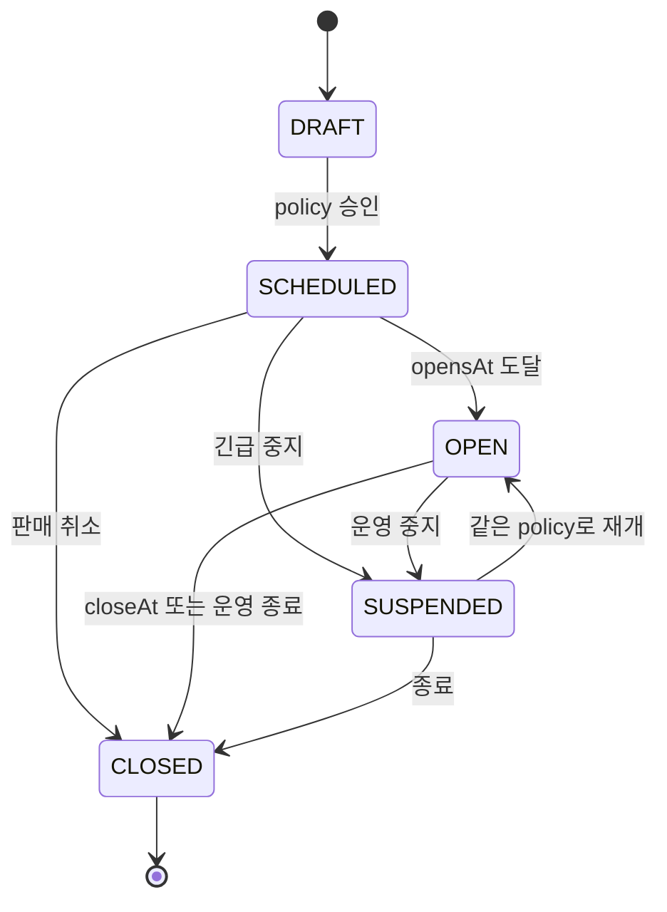
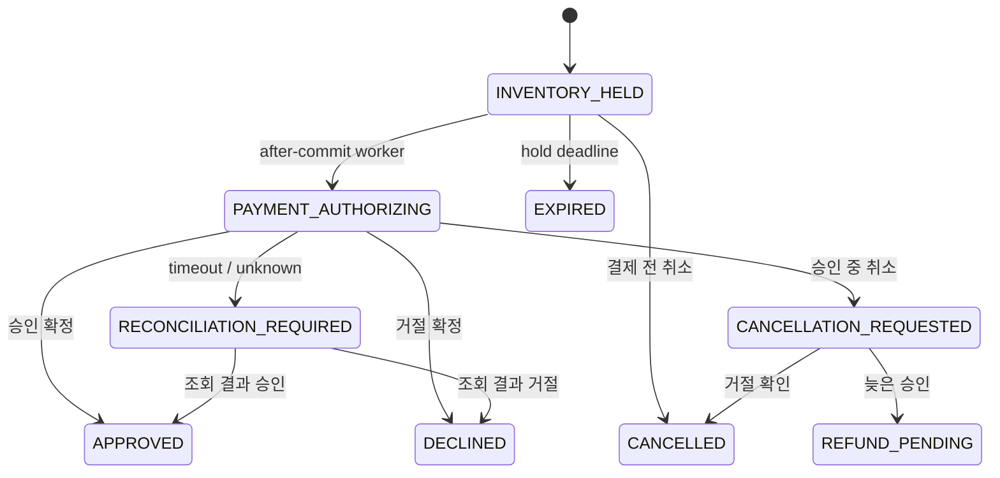
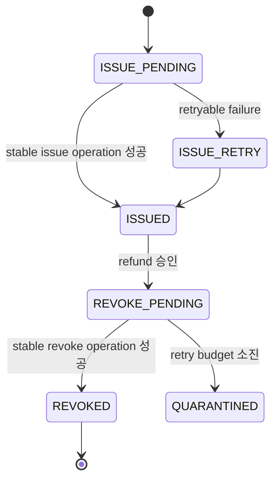
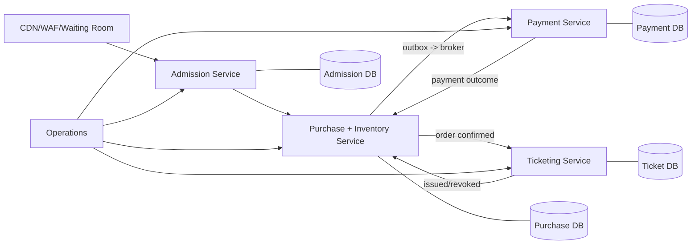

# Concert Ticket Flash Sale 상세 설계

## 1. 문서 상태

- 대상 이슈: [bluetape4k-workshop#521](https://github.com/bluetape4k/bluetape4k-workshop/issues/521)
- 관련 재사용 이슈: [bluetape4k-projects#1065](https://github.com/bluetape4k/bluetape4k-projects/issues/1065)
- 대상 저장소: `bluetape4k-workshop`
- 대상 모듈: `commerce/concert-ticket-flash-sale`
- 런타임: Java 25
- 프레임워크: Spring Boot 4 MVC
- 영속성: Exposed JDBC + PostgreSQL
- 보조 저장소: Lettuce + Redis
- 상태: 사용자 검토용 상세 설계

이 문서는 티켓 오픈 직후의 고경합 상황에서 초과 판매, 중복 결제, 결제 결과 불명확,
취소·환불 경쟁, Redis 유실, worker 재시작을 안전하게 처리하는 Spring Boot 기준 예제를
정의한다. 목표는 코드를 보여주는 데 그치지 않고, 한국의 Spring Boot 서비스 팀이
프로덕션 설계의 출발점으로 사용할 수 있는 모범 구조와 운영 판단 기준을 제공하는 것이다.

## 2. 승인된 결정

1. Spring Boot 구현만 제공한다. Ktor 구현과 프레임워크 간 parity fixture는 범위에서 제외한다.
2. 하나의 실행 JAR로 배포하는 Spring Modulith 기반 모듈러 모놀리스로 구현한다.
3. PostgreSQL만 판매·구매·재고·결제 확정 상태의 최종 권위가 된다.
4. Redis는 대기열 가속, rate limit, IP/user in-flight lease에만 사용한다.
5. Bluetape4k ecosystem을 먼저 검색하고 최대한 재사용한다.
6. 기존 workshop 관례대로 Kotlin source를 사용하되 module-local Java toolchain, Kotlin JVM
   target, test/runtime을 Java 25로 고정한다. preview feature는 사용하지 않으며 blocking 경계는
   virtual thread를 사용한다.
7. 실제 PG 대신 결정적인 fake payment provider와 주입 가능한 `Clock`을 사용한다.
8. README에는 현재 모듈러 모놀리스와 마이크로서비스 전환 구조를 모두 설명한다.
9. README에는 상태 전이, 정상 구매, timeout 복구를 쉽게 이해할 수 있는 Diagram을 제공한다.
10. 다중 Redis key lease의 범용화는 #1065로 추적하되, 이 예제 작업에서 upstream 기능을
    구현하거나 출시된 것으로 가정하지 않는다.

## 3. 문제와 성공 조건

### 3.1 해결할 문제

티켓 판매는 짧은 시간에 동일 재고, 동일 사용자, 동일 IP로 요청이 집중된다. 단순한
`SELECT` 후 `UPDATE`, Redis lock, HTTP retry만으로는 다음 문제가 발생한다.

- 여러 노드가 동일한 잔여 수량을 보고 동시에 hold를 만든다.
- 사용자의 반복 클릭과 응답 유실 재시도가 서로 다른 결제 요청을 만든다.
- Redis IP key는 만들어졌지만 user key 생성이 실패해 판정이 흔들린다.
- 결제 provider가 승인했지만 응답이 timeout되어 재고를 조기 해제하거나 중복 결제한다.
- 취소 요청과 늦은 결제 승인이 교차해 환불되지 않은 주문 또는 잘못 복구된 재고가 생긴다.
- outbox 중복 전달이 티켓을 두 번 발급하거나 두 번 환불한다.
- forwarded header를 무조건 신뢰해 공격자가 IP 제한을 우회한다.

### 3.2 성공 조건

- `opensAt` 이전 요청은 attempt, hold, idempotency, outbox row를 하나도 만들지 않는다.
- `heldQuantity + soldQuantity <= totalQuantity`가 모든 경쟁과 장애에서 유지된다.
- 동일 사용자 또는 동일 IP의 동시 요청은 하나의 활성 purchase attempt만 남긴다.
- Redis key가 삭제되거나 HMAC key가 회전해도 PostgreSQL USER/IP identity guard가 같은
  principal을 하나의 활성 purchase attempt로 제한한다.
- 같은 `Idempotency-Key`와 같은 요청은 같은 결과를 재생한다.
- 같은 key를 다른 요청에 사용하면 안정적인 `409` problem을 반환한다.
- 결제 timeout은 성공이나 실패로 추측하지 않고 durable reconciliation 상태로 전환한다.
- Redis key 유실, worker 재시작, outbox 중복 전달 후에도 PostgreSQL 상태로 수렴한다.
- raw IP, raw user ID, 결제 세부값을 로그, metric label, SSE payload에 노출하지 않는다.
- 사용자는 README만으로 정상 흐름, 실패 복구, 운영 절차, 마이크로서비스 전환 비용을
  이해할 수 있다.

## 4. 범위와 비목표

### 4.1 포함 범위

- 판매 lifecycle과 versioned sale policy
- 등급별 일반석 수량
- PostgreSQL 기반 waiting room과 admission
- IP/user Redis multi-key in-flight lease
- HTTP idempotency
- inventory hold, payment authorization, order, ticket issuance
- 취소, 환불, ticket revoke, 재고 복구
- payment timeout과 reconciliation worker
- transactional outbox와 중복 전달 대응
- 고객 상태 조회, SSE, 운영자 projection과 제한된 복구 명령
- PostgreSQL/Redis Testcontainers 기반 결정적 fixture
- 로컬 고객·운영자 데모 UI
- 모듈러 모놀리스에서 마이크로서비스로 전환하는 가이드

### 4.2 비목표

- 지정 좌석과 좌석 배치 UI
- 실제 결제 gateway, 카드 정보, PCI 범위
- CAPTCHA, WAF vendor, fraud score, bot fingerprinting
- dynamic pricing
- 범용 ticketing engine, 범용 saga framework, 범용 distributed transaction
- Redis를 최종 구매 ledger나 fencing authority로 사용하는 설계
- #1065의 upstream library 구현
- 여러 언어 또는 여러 서버 프레임워크 구현

## 5. 현재 근거와 차용 범위

| 근거 | 차용할 부분 | 그대로 복제하지 않는 부분 |
|---|---|---|
| `commerce/reservation-control-plane` | PostgreSQL 권위, row lock, waitlist, leader sweep, Redis advisory 경계 | 단일 resource hold 모델 |
| `commerce/promotion-voucher-campaign` | Java 25, virtual thread, Exposed audit, Spring Modulith publication, idempotency replay, operator runbook | voucher review와 Bloom filter 도메인 |
| `operations/job-console-*` | snapshot-first SSE, bounded fanout, deterministic failure fixture, worker lease recovery | Ktor adapter와 job checkpoint 모델 |
| `bluetape4k-projects/infra/lettuce` | `RedisScript`, `RedisScriptRunner`, Lettuce lifecycle, token/TTL ownership 교훈 | 단일-key lock이나 semaphore를 구매 lock으로 오용 |
| Wiki Ticket 연구 | sale lifecycle, 이중 in-flight filter, timeout reconciliation, trusted proxy 경계 | Spring/Ktor/FastAPI/Gin 동시 구현 |

## 6. 선택한 아키텍처

### 6.1 대안 비교

| 대안 | 장점 | 단점 | 결정 |
|---|---|---|---|
| Controller-Service-Repository 단일 계층 | 가장 짧고 익숙함 | 도메인 소유권과 추출 경계 불명확 | 거부 |
| Spring Modulith 모듈러 모놀리스 | 단일 트랜잭션의 명확성, 한 번의 배포, 추출 가능한 경계 | 모듈 API와 의존 규칙을 의식적으로 관리해야 함 | 채택 |
| 초기 마이크로서비스 | 독립 확장과 팀 소유권 | 분산 트랜잭션이 핵심 학습을 가리고 실행 비용이 큼 | 가이드로만 제공 |

### 6.2 실행 구조

```text
Browser / WebTestClient
        |
Spring MVC on Java 25 virtual threads
        |
Request identity -> sale gate -> admission proof -> idempotency
        |
Redis rate limit + atomic IP/user lease
        |
PostgreSQL transaction
  buyer guard -> inventory row lock -> hold/attempt -> outbox
        |
after-commit workers
  payment -> reconciliation -> ticket -> notification
        |
snapshot REST + bounded SSE + operator projection
```

하나의 Spring Boot 애플리케이션, 하나의 PostgreSQL, 하나의 Redis를 사용한다. Redis가
결정한 결과만으로 재고나 주문을 변경하는 경로는 존재하지 않는다. 외부 효과는 PostgreSQL
commit 이후에만 시작한다.

## 7. Spring Modulith 업무 모듈

패키지 root는 `io.bluetape4k.workshop.commerce.ticket`이다.

| 모듈 | 책임 | 소유 데이터 |
|---|---|---|
| `salecontrol` | sale lifecycle, policy version, opensAt/closeAt, suspend/close | sale, policy version |
| `admission` | waiting room, 순번, admission grant, route rate limit | waiting room entry, admission grant |
| `purchase` | idempotency, buyer guard, inventory, hold, purchase attempt, order | buyer state, inventory, attempt, order, idempotency |
| `payment` | fake authorization, timeout, provider correlation, refund, reconciliation claim | payment operation |
| `ticketing` | ticket issue/revoke 외부 효과와 duplicate suppression | effect operation/receipt |
| `operations` | safe projection, SSE, audit, bounded manual recovery | audit |

각 모듈은 기본 package를 내부 구현으로 두고 `api` named interface만 공개한다. 다른 모듈의
Repository, Exposed Table, internal service를 직접 참조하지 않는다. Spring Modulith
`ApplicationModules.verify()`와 ArchUnit 성격의 검증으로 이 규칙을 고정한다.

의존 방향은 command/event API로 제어한다.

- `purchase.api`는 `StartPurchase`, `CancelAttempt`, `ApplyPaymentOutcome`,
  `ApplyTicketOutcome` command, `AuthorizationRequested`/`TicketEffectRequested` event와
  owner-scoped query만 공개한다.
- `payment`와 `ticketing`은 `purchase.api` event를 소비하고 결과를 `Apply*Outcome` command로
  purchase API에 돌려준다. 따라서 compile-time 의존성은 payment/ticketing -> purchase 한
  방향뿐이며 purchase는 payment/ticketing type이나 bean을 참조하지 않는다.
- `payment.api`와 `ticketing.api`는 operations용 read projection만 공개하고 provider adapter는
  module internal로 둔다. consumer는 다른 모듈 table을 직접 갱신하지 않는다.
- in-process publication과 handler transaction은 분리되며, 각 handler는 stable event ID와
  consumer receipt를 먼저 확인한다.
- `operations`는 각 모듈의 query/command API만 사용하고 repository/table을 참조하지 않는다.

허용 dependency graph는 `admission -> salecontrol`, `purchase -> salecontrol, admission`,
`payment/ticketing -> purchase`, `operations -> 각 *.api`다. `admission.api.ConsumeGrant`는 outer
purchase transaction에 `MANDATORY`로 참여하고 admission table의 single-use 상태만 조건부
갱신한다. operations의 operator orchestration도 domain `*.api` command와 audit insert를 같은
Spring transaction에 묶되 업무 모듈은 operations를 역참조하지 않는다.

## 8. 데이터 모델과 소유권

### 8.1 주요 테이블

| 테이블 | 핵심 역할 |
|---|---|
| `ticket_sales` | sale lifecycle과 현재 활성 policy version |
| `ticket_sale_policy_versions` | 불변 versioned 경제 규칙 |
| `ticket_inventory` | grade별 total/held/sold |
| `ticket_waiting_room_entries` | durable FIFO 대기 순번 |
| `ticket_admission_grants` | buyer, policy, expiry, one-time nonce에 결합된 hold 시작 권한 |
| `ticket_identity_subjects` | raw identifier를 저장하지 않는 안정적인 USER/IP 내부 식별자 |
| `ticket_identity_aliases` | HMAC key version별 digest를 안정적인 identity subject에 연결 |
| `ticket_active_identity_guards` | sale별 USER/IP active attempt의 PostgreSQL 권위 |
| `ticket_buyer_sale_states` | 사용자별 누적 구매 제한과 정책 snapshot |
| `ticket_purchase_attempts` | hold와 checkout state machine |
| `ticket_orders` | 결제 확정 주문, 취소 정책 snapshot, ticket disposition |
| `ticket_payment_operations` | authorize/refund provider operation과 reconciliation claim |
| `ticket_tickets` | ticketing adapter가 반환한 issued/revoked projection |
| `ticket_effect_operations` | issue/refund/revoke 외부 효과별 stable operation ledger |
| `ticket_effect_receipts` | consumer + operation ID별 중복 효과 억제 |
| `ticket_http_idempotency` | canonical request fingerprint와 저장 응답 |
| Spring Modulith publication tables | transaction-coupled event publication |
| `ticket_audits` | 운영 명령과 보안 관련 상태 전이 |

### 8.2 핵심 불변식

```text
0 <= held_quantity
0 <= sold_quantity
held_quantity + sold_quantity <= total_quantity
```

- `(sale_id, grade)` inventory row가 수량 직렬화의 기준이다.
- `(kind, key_version, digest)` identity alias는 하나의 stable identity subject만 가리킨다.
- `(sale_id, identity_kind, identity_subject_id)` active guard는 USER/IP별 하나만 존재하며
  terminal이 아닌 attempt 하나만 가리킨다.
- user buyer state는 `(sale_id, user_identity_subject_id)`로 하나만 존재한다.
- terminal이 아닌 attempt는 생성 당시의 `policy_version`을 끝까지 사용한다.
- admission grant는 `(sale_id, nonce)`가 unique이고 buyer identity, policy version, expiry와
  결합되며 하나의 attempt만 소비한다.
- provider operation ID는 unique이고 order 하나에는 성공한 authorization 하나와 ticket
  disposition 하나만 연결된다.
- 같은 provider operation ID는 한 번만 상태에 반영된다.
- 외부 효과는 `(effect_kind, operation_id)`와 `(consumer_name, operation_id)` unique ledger로
  중복 실행을 억제한다.
- 환불 완료와 `(NEVER_ISSUED 증명 또는 ticket revoke 완료)`가 모두 확인되기 전에는 재고를
  복구하지 않는다.

PostgreSQL CHECK, UNIQUE/partial index, foreign key와 application state validation을 함께 사용한다.
H2는 이 불변식의 권위 있는 동시성 증명으로 사용하지 않는다.

필수 DDL 계약은 다음과 같다.

- `ticket_inventory`: PK `(sale_id, grade)`, quantity CHECK.
- `ticket_active_identity_guards`: PK `(sale_id, identity_kind, identity_subject_id)`,
  FK `active_attempt_id`, terminal 전이에서만 삭제.
- `ticket_http_idempotency`: UNIQUE
  `(principal_subject_id, http_method, canonical_route, resource_id, operation,
  idempotency_key_digest)`. raw key는 저장하지 않는다.
- `ticket_payment_operations`: UNIQUE `(provider, operation_id)`와 조회용
  `(status, next_reconcile_at, id)` index.
- `ticket_tickets`: UNIQUE `order_id`; `ticket_effect_operations`: UNIQUE
  `(effect_kind, operation_id)`; receipt: UNIQUE `(consumer_name, operation_id)`.
- waiting room은 `(sale_id, state, sequence, id)` index를 사용하고 동일 sale/user entry는
  하나만 허용한다. database sequence와 UUID가 canonical FIFO이며 `created_at`은 표시와
  관측에만 사용한다. grant claim은 `WHERE sale_id=? AND state=? ORDER BY sequence,id LIMIT 50
  FOR UPDATE SKIP LOCKED`이고 EXPLAIN에서 해당 index scan을 검증한다.
- 상태 column은 stable external code CHECK를 사용하고 모든 조건부 전이는 update-count 1을
  성공으로 간주한다. 0이면 stale command로 무효화한다.

## 9. 상태 모델

### 9.1 Sale lifecycle



- `OPEN` 여부는 browser 시간이 아니라 주입된 server `Clock`으로 판정한다.
- scheduler가 상태를 바꾸기 전에 요청이 도착해도 transaction이 `opensAt`을 직접 확인한다.
- `opensAt` 이전에는 idempotency를 포함한 durable row를 만들지 않는다.
- `OPEN` 이후 경제 규칙을 in-place로 수정하지 않는다.
- 긴급 변경은 actor, reason, effective time을 포함한 `SUSPENDED` 또는 `CLOSED` command다.
- `SUSPENDED`는 신규 waiting-room grant와 hold를 막지만 이미 시작된 payment, refund,
  revoke, reconciliation은 계속 처리한다.
- `SUSPENDED -> OPEN`은 `opensAt <= now < closeAt`이고 invariant 위반과 quarantine 급증이
  없을 때만 허용한다. 운영자는 backlog drain, DB/Redis health, guard disagreement를 확인한
  뒤 command ID와 reason을 남겨 재개한다.

### 9.2 Purchase attempt와 payment



timeout은 실패가 아니다. `RECONCILIATION_REQUIRED` 동안 hold와 buyer active-attempt guard를
유지한다. 새 결제를 만들거나 재고를 복구하지 않는다.

정상 `APPROVED`는 purchase-attempt terminal이고 USER/IP guard를 해제한다. 이후 고객 환불은
Order/Refund state machine `NONE -> REFUND_PENDING -> REFUNDED|REFUND_QUARANTINED`가 소유한다.
`REFUND_QUARANTINED -> REFUND_PENDING`은 같은 operation ID의 운영자 재시도다. 반면
`CANCELLATION_REQUESTED` 뒤 늦은 승인은 remediation attempt로 남아 `REFUNDED`까지 guard를
유지한다.

각 transition은 아래 원자성 계약을 따른다.

| transition | PostgreSQL delta와 outbox | guard 해제 |
|---|---|---|
| create hold | `held += quantity`, attempt 생성, authorize intent/outbox | 유지 |
| decline/expire before approval | `held -= quantity`, terminal event | USER/IP guard 삭제 |
| approve | `held -= quantity`, `sold += quantity`, order 생성, issue intent/outbox | USER/IP guard 삭제 |
| cancel while authorizing | attempt만 `CANCELLATION_REQUESTED`; provider 결과 조회 intent | 유지 |
| late approval | `held -= quantity`, `sold += quantity`, purchase-owned order `ticket_disposition=NEVER_ISSUED` + refund intent | 환불/restock까지 유지 |
| refund confirmed | refund receipt 기록, revoke 또는 never-issued 증거 확인 | 아직 유지 |
| refund + disposition confirmed | `sold -= quantity`, attempt `REFUNDED`, restock event | USER/IP guard 삭제 |

모든 행은 기대 선행 상태와 revision을 조건으로 갱신하며 transition transaction 안에서 필요한
outbox/event row를 함께 기록한다. 내부 command는 idempotency row를 생략할 수 있지만 전역
lock 부분 순서를 역행할 수 없다.

### 9.3 Ticket lifecycle



purchase-owned order의 `ticket_disposition`은 `PENDING|NEVER_ISSUED|ISSUED|REVOKED`다.
ticketing은 외부 issue/revoke 효과만 소유하고 `ApplyTicketOutcome`으로 disposition 변경을
요청한다. 결제가 환불되어도 `NEVER_ISSUED`가 durable하게 증명되거나 ticket revoke가 확정되지
않으면 inventory를 즉시 복구하지 않는다. 늦은 승인과 issue worker 경쟁은 같은 order/attempt
row revision 조건으로 직렬화한다.
`QUARANTINED`는 운영자가 원인을 확인하고 같은 operation ID로 재시도하는 안전한 정지점이다.

## 10. 구매 요청 처리

### 10.1 처리 순서

1. Spring Security의 authenticated `Principal`과 trusted client IP를 row 생성 없이 해석한다.
2. principal에 scope된 기존 idempotency row를 terminal/nonterminal 모두 조회한다. fingerprint가
   다르면 `409`, attempt가 연결된 `IN_PROGRESS`면 현재 snapshot `202`, `COMPLETED`면 저장 결과를
   replay한다.
3. sale 상태와 server `Clock`을 확인한다. 열리지 않았으면 row 생성 없이 거부한다.
4. admission grant의 buyer/policy/expiry/nonce를 preflight 검증한다.
5. route token bucket을 통과한 뒤 Redis IP/user lease를 원자적으로 획득한다.
6. 기존 idempotency row가 없을 때만 Redis 단계를 거쳐 PostgreSQL transaction에서 idempotency,
   USER/IP identity guard, inventory를 고정 순서로
   잠그고 grant를 `unused -> consumed(attemptId)`로 조건부 갱신한다.
7. 정책과 수량을 다시 확인하고 attempt/hold/outbox를 기록한다. grant update-count가 0이면
   전체 transaction을 rollback한다.
8. transaction commit 뒤 payment worker가 authorization을 시작한다.
9. HTTP는 `202 Accepted`와 attempt snapshot을 반환한다.
10. client는 REST snapshot 또는 SSE로 terminal 상태를 관찰한다.

### 10.2 Idempotency 계약

- scope는 `(authenticated principal subject, HTTP method, canonical route, sale/resource,
  operation, Idempotency-Key)`이다. 다른 principal은 같은 key로 저장 응답을 읽을 수 없다.
- DB에는 domain-separated HMAC `idempotency_key_digest`만 저장하며 raw key는 DB, audit, log,
  trace에 남기지 않는다.
- key는 ASCII 16..128자이고 request body의 closed-schema canonical JSON, path resource,
  operation을 SHA-256 fingerprint로 묶는다. JSON key 순서와 공백만 다른 요청은 동일하다.
- lifecycle은 `IN_PROGRESS -> COMPLETED`다. 같은 fingerprint의 동시 요청은 기존 attempt
  `202`를 반환하고 `Idempotent-Replayed: true`를 설정한다. 다른 fingerprint는 `409`다.
- 최초 요청끼리 UNIQUE insert가 경쟁하면 loser는 winner row를 다시 읽어 같은
  mismatch/`IN_PROGRESS`/`COMPLETED` 규칙으로 반환한다. sale/Redis 상태를 다시 판정하지 않는다.
- terminal response는 24시간, nonterminal row는 workflow terminal 후 24시간 보존한다.
  아직 진행 중인 row는 TTL만으로 삭제하지 않는다.
- cancel/refund도 별도 operation scope와 key를 사용한다.

### 10.3 PostgreSQL lock 부분 순서

모든 mutation은 다음 순서를 유지한다.

```text
idempotency record
  -> USER/IP identity guard (USER before IP; digest sort)
  -> buyer sale state
  -> inventory(saleId, grade)
  -> purchase attempt / order
  -> payment or ticket operation
```

worker candidate claim은 `FOR UPDATE SKIP LOCKED`의 짧은 transaction에서 ID와 fencing token만
얻고 끝낸다. 실제 domain mutation은 새 transaction에서 위 순서로 다시 잠근다. 여러 grade는
grade code 순서로 잠근다. cancellation/payment/refund가 operation row에서 시작해 역방향으로
lock을 얻는 구현은 금지한다.

결제 provider 호출, SSE write, Redis network call을 PostgreSQL transaction이나 row lock 안에서
수행하지 않는다. serialization/deadlock 재시도는 식별된 PostgreSQL SQLSTATE에만 제한하고,
동일 command ID를 유지한다.

## 11. Redis 경계

### 11.1 API rate limit과 in-flight lease 분리

- Bucket4j rate limit은 route별 과도한 호출을 `429`로 줄인다.
- multi-key lease는 동일 IP 또는 동일 user의 동시 approval workflow를 `409`로 막는다.
- 둘 다 구매 자격, admission, 재고 존재를 증명하지 않는다.

### 11.2 Multi-key lease

```text
ticket:{saleId}:inflight:ip:{redisSafeTag}
ticket:{saleId}:inflight:user:{redisSafeTag}
value = ownerToken + keyVersion
```

두 key는 shared Redis hash tag로 같은 slot에 배치한다. acquire, renew, compare-and-delete
release는 각각 한 Lua script로 실행한다. `RedisScript`와 `RedisScriptRunner`의
EVALSHA/NOSCRIPT fallback을 재사용한다.

- 이 lease는 DB transaction 전의 짧은 foreground admission lease다. DB의 USER/IP active
  guard가 commit되면 즉시 compare-and-delete하고, DB 실패도 best-effort release한다.
- `redisSafeTag`는 raw/durable identity digest와 분리한 domain-separated HMAC의 앞 128bit다.
  Redis key/value에 attempt ID, idempotency key/fingerprint, raw identifier를 넣지 않는다.
- `ownerToken`은 scope된 idempotency 입력과 current lease key로 만든 256bit HMAC-PRF다. 같은
  요청은 acquire 응답 유실 뒤 같은 token을 재생하고, 다른 요청은 예측할 수 없다. retry는
  retained lease read-key version별 token 후보를 만들고 Redis value의 `keyVersion`과 일치하는
  후보로 idempotent acquire한다. lease write key는 `max request deadline + TTL`인 7초보다 짧은
  간격으로 retire하지 않는다.
- 초기 검증값은 TTL 5초, command timeout 500ms, renew 2초다. foreground request deadline을
  넘겨 renew하지 않으며 `commandTimeout < renewInterval < TTL / 2`를 startup에서 검증한다.
- Redis ACL/TLS를 production 전제로 하고 command/key logging을 끈다. shutdown release는
  best effort이며 correctness는 PostgreSQL guard가 보장한다.

#1065가 출시되기 전에는 이 script와 좁은 adapter만 예제가 소유한다. 범용 lock/semaphore
API를 새로 만들지 않는다. #1065가 호환 가능한 released artifact로 제공되면 adapter
내부만 교체할 수 있어야 한다.

### 11.3 Redis 장애 정책

| 상황 | 새 purchase | 기존 workflow |
|---|---|---|
| Redis unavailable | `503 admission_temporarily_unavailable`로 fail closed | DB 기반 payment/reconciliation 지속 |
| key 유실/만료 | DB active attempt가 중복을 차단 | worker가 disagreement metric 기록 |
| acquire 응답 유실 | 같은 token으로 idempotent 검사 | 새 token 자동 재시도 금지 |
| DB commit 실패 뒤 lease 존재 | compare-and-delete best effort | 실패 시 TTL 만료 대기 |
| stale worker | renew/release 거부 | DB reconciliation으로 넘김 |

Redis 장애 때문에 기존 결제 결과를 버리거나 hold를 조기 해제하지 않는다.

### 11.4 Identity key rotation

authenticated user subject와 canonical IP는 raw 값으로 저장하지 않는다. 모든 active read key로
digest를 계산해 `ticket_identity_aliases`를 조회하고 하나의 stable identity subject로 합친다.
신규 alias는 current write version만 사용하며, 이전 alias로 찾은 subject에는 current alias를
같은 transaction에서 추가한다. 이전 read key는 최대 active workflow 수명 + idempotency 보존
기간인 25시간 이상 유지한다. 제거 전에는 모든 retained owner/order가 current alias로 조회됨을
증명하거나 identity 보존기간이 끝났음을 적은 signed retirement manifest가 필요하다. referenced
alias 또는 dormant owner coverage가 남으면 startup을 fail-fast한다. rotation 중 같은 사용자의
old/new digest 경쟁과 장기간 비활성 order 조회도 동일 identity subject로 수렴해야 한다.

## 12. Payment와 reconciliation

### 12.1 Fake provider

실제 provider 대신 다음 결과를 결정적으로 재현한다.

- immediate approved
- immediate declined
- timeout then approved
- timeout then declined
- duplicate callback
- refund failed once then succeeded
- permanent refund failure

fixture는 sleep 대신 fake `Clock`, barrier, 명시적 provider command를 사용한다. 테스트용
failure control은 test/demo profile에서만 활성화하고 일반 public request body에는 넣지 않는다.

시간 권위는 분리한다. sale/hold/payment 정책은 domain `Clock`, claim expiry와 ordering은
PostgreSQL server time, lease expiry는 Redis TTL이 권위다. DB fixture는 이미 만료된 claim seed를
사용하고 domain fixture는 fake `Clock`으로 결정적이다. Redis TTL만 짧은 TTL + bounded polling을
허용하는 timing-tolerant Testcontainers fixture로 분류하며 무제한 sleep을 사용하지 않는다.

### 12.2 Unknown result 규칙

- provider 호출 전에 `operation_id`, request fingerprint, expected attempt revision을 durable intent로
  commit한다. operation ID는 `effect kind + aggregate ID + aggregate revision`에서 결정적으로 만든다.
- 재시작 worker는 provider를 다시 authorize하기 전에 같은 operation ID로 status를 조회한다.
- authorize timeout 후 같은 provider operation을 새 ID로 재호출하지 않는다.
- stable operation ID로 provider status를 조회한다.
- 결과가 계속 unknown이면 `next_reconcile_at`, attempt count, claim lease를 갱신한다.
- Lettuce leader는 정상 시 scheduler tick 중복을 줄이는 advisory 최적화일 뿐이다. Redis leader
  backend가 없으면 각 노드의 bounded local single-flight tick이 계속되고 PostgreSQL claim
  fencing이 중복 처리를 막는다. 여러 claimant가 `(status, next_reconcile_at, id)` index를
  `FOR UPDATE SKIP LOCKED`로 batch claim한다. 기본 batch 50, run deadline 10초, claim TTL
  30초, renew 10초, provider timeout 5초, exponential backoff 1초..5분 + deterministic jitter다.
- 결과 반영 SQL은 `operation_id + claim_token + revision + nonterminal state`를 조건으로 한다.
  lease를 잃거나 늦게 도착한 worker는 update-count 0으로 거부되고 결과를 덮어쓰지 않는다.
- 20회 또는 24시간 뒤에도 unknown이면 inventory를 자동 해제하지 않고 operator-visible
  quarantine으로 둔다. oldest age 5분 warning/15분 critical, recovery drain rate가 유입률보다
  낮은 상태가 10분 지속되면 alert한다.
- worker 재시작은 PostgreSQL claim lease 만료 뒤 같은 operation ID에서 재개한다. fake provider도
  operation ID별 effect count 1을 강제한다.

provider 승인 후 응답 또는 DB 반영 전에 crash해도 lookup-first 재개가 승인 사실을 찾는다.
issue/refund/revoke adapter 역시 stable operation ID를 요구하며 `ticket_effect_operations`와
consumer receipt를 사용한다. “외부 효과 성공 -> DB checkpoint 전 crash -> 재전달”에서도 외부
effect count는 1이고 DB만 terminal 상태로 수렴한다.

### 12.3 취소와 환불

| 시점 | 처리 |
|---|---|
| `INVENTORY_HELD` | attempt 취소, hold 즉시 해제 |
| `PAYMENT_AUTHORIZING` | `CANCELLATION_REQUESTED`, 결과 확정 전 hold 유지 |
| 늦은 승인 | order를 환불 대상으로 기록하고 `NEVER_ISSUED` disposition을 원자적으로 기록 |
| 이미 `ISSUED` | refund 성공 후 revoke, 두 결과 확인 뒤 restock |
| refund unknown/failed | hold/sold 상태를 임의로 되돌리지 않고 reconciliation |

취소·환불 endpoint도 별도의 `Idempotency-Key`를 요구한다.

고객 snapshot은 요청 접수(`CANCELLATION_REQUESTED`, `REFUND_PENDING`)와 완료
(`CANCELLED`, `REFUNDED`)를 구분한다. late approval이면 자동 환불 중임을 표시하고, refund 또는
revoke 지연/격리 시 새 요청을 만들지 말고 같은 resource를 조회하라는 `nextAction`을 제공한다.
재고는 refund와 ticket disposition이 모두 확정된 뒤에만 다시 `available` projection에 나타난다.

## 13. HTTP와 SSE 계약

### 13.1 고객 API

production identity 경계는 `AuthenticatedBuyerResolver` port로 둔다. 이 예제는 실제 IdP/JWT
설정을 구현 범위에 넣지 않고 non-demo에서 resolver bean이 없으면 fail closed/startup failure로
처리한다. README의 production adapter 계약은 issuer/audience/algorithm allowlist, `exp`/`nbf`,
Unicode NFC subject normalization, JWKS rollover 실패 시 cached-valid-key 범위 밖 fail closed를
요구한다. request body나 임의 user header는 신뢰하지 않는다. `demo` profile에서는 server가
loopback에 bind된 경우에만 `X-Demo-User` resolver를 등록한다. admission/attempt/order의
조회·취소·환불은 모두 owner scope를 검증하며, 다른 사용자의 ID는 존재 여부를 숨기기 위해
`404`로 응답한다.

| Endpoint | 핵심 request | success contract |
|---|---|---|
| `GET /api/v1/sales/{saleId}` | public | sale status, policy version, grade availability, `serverTime` |
| `POST /api/v1/sales/{saleId}/waiting-room` | auth, `Idempotency-Key` | `201`/replay `200`, `Location`, entry ID, sequence, ETA range, minimum poll interval |
| `GET /api/v1/sales/{saleId}/admission` | auth | owner entry/grant, expiry, `nextPollAfter`; ETag/`304` 지원 |
| `POST /api/v1/sales/{saleId}/purchase-attempts` | auth, key, `{grade, quantity, grantNonce}` | `202`, `Location`, owner attempt snapshot |
| `GET /api/v1/purchase-attempts/{attemptId}` | auth owner | authoritative attempt snapshot |
| `POST /api/v1/purchase-attempts/{attemptId}/cancel` | auth owner, key | `202` 접수 또는 terminal replay |
| `POST /api/v1/orders/{orderId}/refund` | auth owner, key, `{reasonCode}` | `202` 접수 또는 terminal replay |
| `GET /api/v1/sales/{saleId}/events` | public | aggregate sale/inventory stream만 제공 |
| `GET /api/v1/purchase-attempts/{attemptId}/events` | auth owner | 해당 attempt/payment/ticket stream |

attempt snapshot은 `attemptId`, `saleId`, `grade`, `quantity`, public `status`, `terminal`,
`retryable`, `retryAt`, `nextAction`, `holdExpiresAt`, optional owner `orderId`, `updatedAt`,
`version`, link만 허용한다. provider detail, identity, 다른 buyer 정보는 포함하지 않는다.
closed request schema를 사용해 unknown/duplicate JSON field, polymorphic default typing을 거부한다.
header 8KiB, idempotency key 128자, path identifier 64자, body 16KiB, quantity 1..4를 startup
validated limit으로 두고 malformed Unicode/enum/number를 `400 invalid_request`로 처리한다.
Exposed query는 parameter binding만 사용한다.

waiting room은 sale/user별 한 entry를 멱등 반환하고 `(sequence, id)` FIFO를 유지한다.
grant batch는 50개로 제한하며 buyer identity, policy version, one-time nonce, 30초 expiry에 묶인다.
`SUSPENDED` 동안 순번은 보존하되 새 grant를 만들지 않고, 재개 시 기존 순서를 계속 사용한다.
매진이면 entry를 terminal `SOLD_OUT`으로 전환한다. ETA는 보장이 아닌 범위이며 최소 poll 1초,
권장 exponential backoff 1..10초 + jitter, `429 Retry-After`를 제공한다. strict IP 정책으로 NAT
사용자가 제한될 수 있으면 raw IP를 노출하지 않는 안내와 지원 correlation ID를 제공한다.

### 13.2 운영 API

운영 API bean/route는 `demo` profile이 아니면 등록하지 않는다. demo에서도 loopback bind와
loopback TCP peer, 32-byte 이상 무작위 operator secret을 모두 요구한다. secret은 constant-time
비교하고 누락·기본값·잘못된 길이는 startup failure다. route별 rate limit, `Cache-Control:
no-store`, customer credential 거부를 적용한다.

- sale schedule/suspend/resume/close
- reconciliation bounded run
- quarantined operation 조회와 같은 operation ID 재시도
- inventory invariant projection
- Redis/DB guard disagreement
- outbox backlog와 oldest age

모든 mutation은 authenticated operator, reason, command ID, before/after state, result, timestamp를
감사 row에 남긴다. secret, raw identifier, full digest는 남기지 않는다. 같은 command ID는 저장된
결과를 재생하며 감사 보존은 90일이다. bounded recovery는 최대 batch 50/run 10초이고 같은
operation ID만 재시도한다. 진행 중 run과 겹치면 `409 operator_command_in_progress`, 취소는 다음
claim 경계에서 멈추고 처리/skip/fail/quarantine 요약을 반환한다.
demo shared secret의 actor는 항상 `demo-shared-operator`이며 개인 책임 추적을 제공하지 않는다고
UI/README에 경고한다. production은 별도 authenticated operator principal/RBAC adapter가 필요하다.

README는 production에서 OAuth2/JWT, RBAC, CSRF/CORS, network policy, secret manager를
적용해야 하며 demo operator header를 외부에 노출하면 안 된다고 명시한다.

### 13.3 Stable problem catalog

| HTTP | code | retry |
|---|---|---|
| 409 | `idempotency_key_reused` | payload 수정 또는 새 key |
| 409 | `purchase_approval_in_progress` | 기존 attempt 조회 |
| 409 | `sale_not_started` | `retryAt=opensAt` 이후 |
| 409 | `sale_suspended` | 운영 재개 전 retry 금지 |
| 410 | `sale_closed` | retry 불가 |
| 409 | `inventory_exhausted` | 재고 snapshot 확인 |
| 410 | `admission_expired` | waiting room 재진입 |
| 429 | `rate_limit_exceeded` | `Retry-After` 준수 |
| 503 | `admission_temporarily_unavailable` | bounded retry |
| 503 | `purchase_authority_unavailable` | PostgreSQL 복구 후 retry |

내부 exception, SQL, Redis key, provider detail을 problem body에 노출하지 않는다.
모든 problem은 `code`, `status`, `retryable`, optional `retryAt`, `nextAction`, `correlationId`를
갖는다. `202`와 `RECONCILIATION_REQUIRED`는 오류가 아니라 정상 attempt representation이다.

### 13.4 SSE

- public sale stream과 authenticated owner attempt stream을 분리한다. cursor도 stream scope와
  principal에 결합해 다른 owner stream에 재사용할 수 없다.
- 연결 시 같은 consistent read boundary에서 authoritative snapshot과 numeric high-water
  sequence를 얻고, `highWater < event <= liveWatermark` catch-up 뒤 shared live fanout에 붙인다.
- sale별 하나의 shared broadcaster와 bounded subscriber queue를 사용한다. duplicate는 aggregate
  version으로 제거하고 audit/outbox의 monotonically increasing sequence를 event ID로 사용한다.
- cursor가 retention 밖이면 `reset`과 새 snapshot을 보낸다.
- replay를 보장할 수 없으면 polling link를 함께 제공한다.
- 초기 limit은 active sale 32, 전체 연결 512, subscriber queue 32, poll 500ms, replay 200 rows,
  payload 256KiB, write timeout 5초다. overflow/timeout은 연결을 닫고 polling link를 제공한다.
- public payload는 sale/grade/availability allowlist, owner payload는 위 attempt snapshot allowlist만
  사용한다.
- 모든 종료 경로에서 permit과 resource를 반환한다.

## 14. Trusted proxy와 개인정보 경계

1. TCP peer가 configured trusted proxy CIDR에 속할 때만 forwarded header를 사용한다.
   기본 trusted CIDR는 empty이고 `0.0.0.0/0`, `::/0`는 금지한다. demo에서 loopback 외 CIDR도
   startup failure다.
2. Spring의 자동 forwarded-header 변환은 끄고 애플리케이션 parser 하나만 사용한다.
3. `Forwarded`를 우선하며 둘 다 있으면 canonical client chain이 완전히 일치할 때만 허용한다.
   TCP peer에서 시작해 오른쪽에서 왼쪽으로 trusted hop을 제거하고 처음 만난 untrusted hop을
   client로 선택한다. peer가 untrusted면 모든 forwarded header를 무시한다.
4. obfuscated/unknown token, malformed IP, 빈 hop, 16개 초과 hop, header 8KiB 초과, 두 header
   충돌은 `400 invalid_forwarded_chain`으로 거부한다.
5. IPv4-mapped IPv6를 포함해 IPv4/IPv6를 canonical form으로 정규화한다.
6. IP와 user ID는 versioned HMAC secret으로 digest한다.
7. Redis key, metric, log, SSE에는 digest 전체도 노출하지 않고 필요한 경우 짧은 safe tag만
   사용한다.
8. key rotation 동안 active read version을 유지하고 version을 durable alias에 기록한다.
9. strict IP filter는 sale policy로 끌 수 있지만 user guard와 DB 주문 제한은 유지한다.
10. NAT 환경의 정상 사용자 차단 가능성을 README와 operator 화면에 명시한다.

데이터 보존 기본값은 waiting-room terminal 24시간, nonterminal idempotency/workflow terminal 후
24시간, sale aggregate event 7일, owner event 24시간, audit 90일, application log 7일이다.
만료 작업은 active workflow와 법적/운영 hold를 건드리지 않고 identity alias를 익명화한다.
README는 수집 목적, 보존 기간, NAT 제한과 삭제 한계를 설명한다. log, metric tag, problem,
SSE, audit/operator projection, Redis command trace는 explicit allowlist serializer를 거치며 raw
payment/identity와 full digest를 금지한다.

## 15. Java 25, virtual thread, bulkhead

Spring MVC request는 Java 25 virtual thread에서 실행한다. 하지만 virtual thread가
PostgreSQL connection이나 외부 provider capacity를 늘리지는 않는다.

| workload | 경계 |
|---|---|
| foreground purchase | DB permit 12, acquire 250ms |
| payment/reconciliation | worker DB permit 3, provider permit 8 |
| SSE maintenance | DB permit 2, sale/connection/queue limit |
| operator recovery | DB permit 1, batch 50/run 10초 |

권장 초기값은 테스트와 local run을 위한 예시일 뿐 production 정답으로 표현하지 않는다.
permit을 얻기 전에 JDBC connection을 점유하지 않는다. monitor 기반 synchronization을
피하고 명시적 concurrency primitive를 사용한다.

Hikari `maximumPoolSize=20`이고 `foreground(12) + worker(3) + SSE(2) + operator(1) <= 18`로
2개를 health/migration 여유로 남긴다. 합계가 pool-2를 넘거나 lane permit/timeout이 0 이하이면
startup을 실패시킨다. DB permit 실패는 고객 `503 purchase_authority_unavailable`, operator
`503 operator_capacity_exhausted`; worker는 claim하지 않고 다음 tick으로 미룬다. Redis와 provider도
별도 semaphore/deadline을 사용해 virtual thread 수가 downstream capacity를 확대하지 못하게 한다.

hot path budget은 replay: DB 1회/Redis 0회/250ms, 정상 purchase: DB preflight 최대 2회 + Redis
Lua 2회 + DB mutation transaction 1회/전체 2초, Redis 장애: Redis 1회 뒤 700ms 이내 fail closed다.
남은 deadline이 DB permit timeout + transaction timeout 750ms보다 짧으면 transaction에 진입하지
않는다. `(sale_id, grade)` 단일 row는 Phase 1의 의도된 병목이며 local reference workload에서
grade별 100 TPS, lock wait p95 100ms/p99 250ms, transaction p99 500ms, DB permit rejection 1%
미만을 검증하되 이 값은 production 용량 약속이 아니다.

모든 configuration은 `ignoreUnknownFields=false` typed properties로 읽는다. trusted CIDR,
current/read HMAC key ring, 최소 32-byte secret, hold deadline, provider/Redis timeout, lease
TTL/renew 관계, batch/deadline, Hikari/permit 합계, SSE limit가 모순이면 명시적 startup code로
fail-fast한다.

## 16. Ecosystem capability selection

| 책임 | 재사용 capability | 결정 |
|---|---|---|
| validation | `bluetape4k-core` `require*` | 채택 |
| ID | `bluetape4k-idgenerators` `Uuid` | 채택 |
| JSON | `bluetape4k-jackson3` | 채택 |
| logging | `bluetape4k-logging` `KLogging` | 채택 |
| metrics | `bluetape4k-micrometer` | 채택 |
| virtual thread | `bluetape4k-virtualthread-api`, `virtualthread-jdk25` | 채택 |
| Exposed model/repository | `bluetape4k-exposed-core/jdbc` | 채택 |
| Spring JDBC integration | `bluetape4k-exposed-spring-boot-jdbc` | 채택 |
| audit | `AuditableLongIdTable`, `UserContext`, `LongAuditableJdbcRepository` | 채택 |
| publication/outbox | `bluetape4k-exposed-spring-modulith` | 채택 |
| Redis | `bluetape4k-lettuce`, `RedisScriptRunner` | 채택 |
| rate limit | `bluetape4k-bucket4j` + Lettuce adapter | 채택 |
| leader worker | `bluetape4k-leader` core/micrometer/Lettuce | 채택 |
| DB/Redis fixture | `bluetape4k-testcontainers` | 채택 |
| concurrency test | `bluetape4k-junit5` `MultithreadingTester` | 채택 |
| assertions | `bluetape4k-assertions` | 채택 |
| multi-key lease | #1065 미출시 | application-owned adapter로 제한 |
| payment provider | 실제 provider unavailable | deterministic fake |
| generic retry | unknown payment에 부적합 | explicit reconciliation 사용 |

`bluetape4k-dependencies` BOM만 버전 권위로 사용한다. 개별 Bluetape BOM이나 module version을
추가하지 않는다.

재사용은 adapter seam으로 검증한다. Exposed transaction은 Spring transaction manager 안에서만
열고, leader는 scheduler tick 소유에만 쓰며 PostgreSQL claim fencing을 대체하지 않는다.
Bucket4j/Lettuce는 route token bucket, `RedisScriptRunner`는 application-owned multi-key Lua에만
연결한다. import/architecture test는 raw Lettuce/Exposed 접근을 각 adapter package 밖에서 금지하고,
capability가 없을 때는 deterministic fake 또는 fail-closed 정책만 허용한다.

### 16.1 Health, observability, audit

- liveness는 JVM이 응답 가능한지만 본다. Redis/PostgreSQL 장애로 process를 재시작하지 않는다.
- readiness는 migration과 PostgreSQL write authority를 필수로 본다. Redis가 down이면 전체
  readiness는 `DEGRADED`로 두고 public 조회·기존 payment/reconciliation은 유지하지만 신규
  waiting-room grant/purchase component는 `OUT_OF_SERVICE`다.
- leader 미보유는 정상이고, 만료되지 않는 claim 또는 oldest backlog SLO 위반은 degraded다.
- Redis leader backend 상실은 degraded이지만 DB-claim fallback으로 기존 reconciliation은 계속된다.
- graceful shutdown은 신규 admission/hold를 먼저 차단하고 SSE에 reconnect hint를 보낸 뒤
  새 claim을 중단한다. 진행 중 DB transaction을 deadline 내 종료하고 외부 호출 claim은
  release하거나 TTL로 넘긴다. 재기동 후 backlog oldest age와 drain rate를 확인한다.

metric 이름은 `ticket_sale_*` prefix와 `sale_state`, `operation`, `result`, `lane` 같은 bounded
label만 사용한다. sale/user/IP/attempt/order ID는 label에 넣지 않는다. correlation ID와 stable
operation ID의 short safe tag만 structured log에 기록하고 HTTP -> outbox -> worker -> provider
경계를 trace한다. 다음 local alert baseline을 fixture와 runbook에서 검증한다.

| signal | warning / critical |
|---|---|
| inventory invariant violation | 1건 즉시 critical |
| reconciliation/outbox oldest age | 5분 / 15분 |
| quarantine | 1건 warning, 10건 critical |
| DB pool wait p99 | 200ms / 500ms |
| Redis/DB guard disagreement | 1분 1건 / 5분 10건 |
| SSE drop ratio | 5분 1% / 5% |

모든 operator mutation audit는 §13.2 계약을 따르며 projection에는 allowlisted before/after state와
command result만 제공한다.

## 17. 마이크로서비스 전환 가이드

### 17.1 분리 순서

1. **ticketing/notification**: outbox 기반 비동기 경계라 가장 먼저 분리하기 쉽다.
2. **admission/waiting room**: 독립 확장 필요가 명확하고 구매 권위가 아니므로 다음 후보다.
3. **payment/reconciliation**: provider credential, 규제, 별도 SLO가 필요할 때 분리한다.
4. **purchase/inventory**: hold와 inventory를 같은 consistency boundary로 마지막까지 유지한다.

### 17.2 분리 조건

- 독립적인 확장 곡선과 SLO가 실제 측정에서 확인됨
- 서로 다른 팀과 배포 주기가 지속적으로 충돌함
- provider credential 또는 데이터 규제 경계를 분리해야 함
- 장애 격리 이익이 broker, 운영, eventual consistency 비용보다 큼

### 17.3 분리 후 구조



분리 시 현재의 in-process event는 versioned broker event로 바뀐다. 각 consumer는 stable
event ID로 멱등 처리한다. PostgreSQL transaction을 분산 transaction으로 바꾸지 않는다.
payment timeout과 ticket revoke는 saga compensation이 아니라 이미 정의된 durable state
machine과 reconciliation으로 관리한다.

### 17.4 분리하지 말아야 할 신호

- 코드가 커 보인다는 이유만으로 분리
- 같은 팀, 같은 SLO, 같은 데이터 transaction인데 배포물만 나누기
- hold와 inventory를 서로 다른 DB로 먼저 분리
- Redis lease를 service 간 exactly-once 보장으로 해석

## 18. 테스트 전략

### 18.1 테스트 층

1. pure state-machine unit tests
2. PostgreSQL Repository와 migration tests
3. Redis Lua lease integration tests
4. Spring Modulith dependency verification
5. live HTTP/SSE tests
6. hostile concurrency tests
7. worker restart와 failure fixture tests
8. browser demo smoke
9. V1-to-current migration/restart test; previous-binary compatibility는 첫 baseline 이후
10. 별도 opt-in stress test

### 18.2 결정적 failure matrix

| fixture | 기대 결과 |
|---|---|
| opensAt 1ns 전 | row 0, `sale_not_started` |
| opensAt 경계 동시 요청 | 같은 policy version |
| 같은 key 같은 payload | 같은 attempt/result |
| 같은 key 다른 payload | `idempotency_key_reused` |
| raw idempotency canary | DB/audit/log/trace에 raw key 0 |
| 같은 user 다른 key 경쟁 | 활성 attempt 하나 |
| 같은 IP 다른 user 경쟁 | 활성 approval 하나, 타 사용자 정보 비노출 |
| Redis key 삭제 뒤 같은 IP 다른 user | PostgreSQL IP guard가 두 번째 attempt 차단 |
| HMAC rotation 중 old/new user 경쟁 | 하나의 identity subject와 attempt로 수렴 |
| lease key rotation 중 acquire 응답 유실 | retained version token으로 같은 owner 수렴 |
| dormant owner key rotation | current alias로 order 조회, premature key retirement 거부 |
| 같은 admission grant 동시 소비 | update-count 1, attempt 하나 |
| inventory 마지막 수량 경쟁 | 한 winner, oversell 0 |
| Redis acquire 응답 유실 | 같은 token으로 수렴 |
| Redis key 강제 삭제 | DB guard가 두 번째 attempt 차단 |
| DB 실패 뒤 Redis lease | compare-delete 또는 TTL 복구 |
| payment timeout 후 승인 | reconciliation -> approved |
| payment timeout 중 취소 | cancellation requested -> refund |
| duplicate provider result | state change 한 번 |
| duplicate outbox | ticket/refund effect 한 번 |
| provider 성공 뒤 DB checkpoint 전 crash | lookup-first 재개, effect 한 번 |
| stale claim worker 늦은 응답 | fencing update 0, 최신 상태 보존 |
| cancellation/payment/refund 3-way 경쟁 | deadlock 수렴, lock 순서 위반 없음 |
| worker restart | claim lease 후 재개 |
| refund 성공, revoke 실패 | restock 보류와 quarantine |
| late approval와 issue worker 경쟁 | `NEVER_ISSUED` 또는 issued/revoked 한 경로만 존재 |
| untrusted forwarded header | TCP peer identity 사용 |
| 다단 proxy malformed/conflict chain | `invalid_forwarded_chain`, 우회 없음 |
| SSE cursor retention 초과 | reset + snapshot |
| snapshot/subscription 사이 terminal event | high-water catch-up으로 유실 0 |
| 다른 owner ID/cursor 접근 | `404`, 존재 여부와 payload 비노출 |
| oversized/duplicate/unknown JSON | stable `invalid_request` |
| redaction canary | log/metric/problem/SSE/audit/Redis trace에 raw/full digest 0 |
| production auth adapter 없음/invalid JWT | startup fail closed 또는 `401`, row 0 |
| wildcard trusted CIDR | startup fail-fast |

### 18.3 성능과 정확성 분리

동시성 fixture는 불변식 증명이고 throughput benchmark가 아니다. 별도의 opt-in stress task는
seed, container/host/JDK/CPU/RAM metadata, warm-up 10초, measurement 60초, 3회 반복과 raw
JSON/CSV를 CI artifact로 보존한다. 성공/거절/오류 분류, p50/p95/p99, DB pool/lock wait,
Redis latency, queue/backlog/permit high-water를 기록한다.

| workload | 입력 | pass/fail |
|---|---|---|
| same-grade contention | inventory 10,000, concurrency 200, 1-ticket request | oversell 0, effect duplicate 0, >=100 TPS, lock p99 <=250ms, tx p99 <=500ms, DB rejection <1% |
| waiting-room claim | 100k entries, grant batch 50 | HTTP DB query/request <=1, scanned/granted <=2, EXPLAIN index scan, grant lag p95 <=2초, pool <=18 |
| SSE fanout | 32 sales, sale별 connection 1 -> 전체 512로 증가 | steady-state poll query count <= activeSales x measurementIntervals + bounded catch-up queries이며 connection 증가로 poll QPS가 증가하지 않음; SSE drop <1%, disconnect 뒤 connection/permit 0 |
| timeout backlog recovery | 10k unknown operation, claimant 8, batch 50 | duplicate effect 0, oldest age 단조 감소, drain rate >=200 ops/s, run deadline/permit 위반 0 |

latency 기준은 지정된 local reference profile의 회귀 gate이지 production capacity 약속이 아니다.
환경 차이로 absolute latency gate를 적용할 수 없을 때도 oversell, duplicate, leak, capacity 상한은
필수 gate이고 latency는 report-only로 명시한다.

## 19. README와 Diagram

README는 English와 Korean locale을 동등하게 유지한다.

생성할 Diagram:

1. 모듈러 모놀리스 architecture
2. sale/purchase/payment/ticket 통합 state diagram
3. 정상 purchase sequence
4. timeout -> reconciliation -> late approval/refund sequence
5. Redis와 PostgreSQL authority boundary
6. 마이크로서비스 전환 architecture

Diagram은 저장소의 `bluetape-diagram` workflow와 validator를 사용해 source와 PNG를 함께
관리한다. README에는 각 그림 아래에 “무엇이 권위이고, 어떤 실패에서 어디로 복구되는가”를
평문으로 설명한다.

통합 state diagram 옆에는 내부 state -> 공개 snapshot state, terminal 여부, 사용자가 할 수
있는 행동, hold/sold 복구 시점의 대응표를 둔다. 문서 학습 순서는 사전 조건 -> 실행/seed ->
대기실 -> 구매 -> 중복 retry -> timeout reconciliation -> 취소/환불 -> 운영 점검이다. 각 단계는
curl과 demo UI 입력, 기대 HTTP/status/state, invariant query를 함께 제공하고 demo-only credential과
production 금지 경계를 눈에 띄게 분리한다.

README runbook은 다음을 포함한다.

- 시작, seed/reset, customer walkthrough
- 중복 클릭과 응답 유실 재시도
- Redis 중단, PostgreSQL 중단, worker restart
- timeout/late approval/refund
- invariant query
- outbox backlog와 quarantine
- SSE polling fallback
- trusted proxy와 production 보안 경계
- microservice extraction checklist

각 장애 runbook은 `탐지 signal -> 안전한 bounded command -> 금지 조치 -> 확인 query/metric ->
rollback/escalation` 순서를 따른다. 예를 들어 Redis 중단 시 신규 purchase만 차단하고 기존
payment를 취소하거나 DB guard를 삭제하지 않으며, 복구 뒤 Lua probe와 disagreement metric을
확인한다. PostgreSQL 중단 시 write를 우회하지 않고 복구/replication 상태를 확인한다. worker
restart는 같은 operation ID와 claim expiry를 확인하며 새 provider ID를 만들지 않는다.

demo UI smoke는 keyboard-only 조작, visible focus, 상태 변경 `aria-live`, 색상 외 text/icon 상태,
`prefers-reduced-motion`, 360px 화면, SSE 단절 시 polling 전환 안내를 검증한다.

## 20. 모듈과 저장소 등록

새 모듈은 `settings.gradle.kts` 자동 등록 규칙을 사용한다. 다음 surface를 같은 branch에서
갱신한다.

- root README module map
- repo `AGENTS.md` module map
- smoke/full workflow group
- container-backed Full Nightly
- stale example validation script
- Kover/Codecov artifact와 workflow summary `needs`
- `src/test/resources/junit-platform.properties`
- `src/test/resources/logback-test.xml`
- lesson 문서

Java 25는 새 모듈에만 격리하고 저장소 기본 Java 21을 변경하지 않는다.

## 21. 호환성과 migration

- 신규 모듈이므로 기존 runtime API binary compatibility 영향은 없다.
- schema는 versioned SQL migration으로 관리한다.
- 최초 baseline 전에는 fresh schema, V1-to-current forward migration, checksum drift, reapply no-op,
  concurrent startup serialization만 검증한다. 이전 boot JAR/current schema 호환 task는 첫 merged
  baseline부터 생성해 expand/contract release에서 적용한다.
- migration history는 version UNIQUE + checksum을 갖고 PostgreSQL advisory lock으로 단일 실행한다.
  DDL은 가능한 transaction 안에서 수행하고 additive-first를 기본으로 한다.
- state enum과 outbox payload에 stable external code와 schema version을 둔다.
- 이미 발행된 event 의미를 in-place로 바꾸지 않는다.
- #1065 채택은 application adapter 내부 교체로 제한하고 HTTP/DB contract를 바꾸지 않는다.
- 초기 예제는 single-version deployment만 지원한다. rolling version skew는 첫 baseline 이후
  compatibility matrix가 생기기 전까지 지원한다고 주장하지 않는다. migration 완료 전 readiness는
  false이고 application write traffic을 받지 않는다.

## 22. 주요 실패 모드와 완화

| 실패 모드 | 위험 | 완화 |
|---|---|---|
| oversell | 재무·신뢰 손실 | inventory row lock + DB CHECK + stress fixture |
| Redis partial ownership | 중복 approval | atomic Lua + DB active-attempt guard |
| payment commit unknown | 중복 결제 또는 무료 ticket | stable operation ID + reconciliation |
| cancellation/late approval race | 환불 누락 | cancellation requested state + late approval refund |
| refund 후 revoke 실패 | 재판매와 유효 ticket 공존 | revoke 전 restock 금지 + quarantine |
| worker 중복 실행 | effect 중복 | leader election + DB claim lease + idempotent operation |
| outbox duplicate | 중복 issue/refund | stable event/operation ID |
| virtual-thread fanout | DB pool 고갈 | workload bulkhead + bounded Hikari |
| forwarded header spoofing | IP 정책 우회 | trusted proxy CIDR + canonicalization |
| 관측성 PII 유출 | 보안·개인정보 사고 | HMAC digest + redaction fixture |
| 지나친 초기 서비스 분리 | 운영 복잡성 | modular monolith 우선 + 측정 기반 extraction |

## 23. 수용 기준 추적

| 요구사항 | 설계 위치 | 검증 |
|---|---|---|
| opensAt 전 row 없음 | 9, 10 | pre-open integration fixture |
| same user/IP 하나의 attempt | 8, 11 | Lua + PostgreSQL hostile concurrency |
| oversell 없음 | 8, 10 | PostgreSQL contention test |
| Redis key loss 수렴 | 11 | forced delete fixture |
| worker restart 수렴 | 12 | claim lease restart fixture |
| duplicate request 수렴 | 10, 13 | idempotency contract |
| payment timeout/refund | 9, 12 | fake provider matrix |
| duplicate outbox | 12, 18 | effect count assertion |
| Spring Boot only | 2, 6 | module surface check |
| Java 25 | 2, 15 | toolchain/task validation |
| Bluetape4k 최대 재사용 | 16 | capability selection and import audit |
| 쉬운 실전 설명 | 17, 19 | README/Diagram review |

## 24. 완료 정의

- Spring Boot 모듈 하나가 Java 25에서 빌드되고 실행된다.
- PostgreSQL과 Redis가 없는 단위 테스트, Testcontainers 통합 테스트가 역할별로 분리된다.
- 모든 failure matrix가 결정적으로 통과한다.
- `ApplicationModules.verify()`가 통과한다.
- module test, migration compatibility, opt-in stress, smoke/full workflow가 등록된다.
- detekt, diagnostics, `git diff --check`, stale validator, actionlint가 통과한다.
- English/Korean README, API contract, runbook, Diagram이 source와 일치한다.
- `bluetape4k-dependencies` BOM만 사용하고 Bluetape module version pin이 없다.
- spec/plan/review/lesson과 실제 구현 사이에 미해결 차이가 없다.
- P0/P1 review finding이 0이다.
- PR CI와 review가 통과한 뒤 별도 merge 승인을 기다린다.

## 25. 중단 조건

다음 상황에서는 구현을 확대하지 않고 설계 또는 계획으로 돌아간다.

- 출시되지 않은 Bluetape capability 없이는 구현할 수 있다고 판명된 경우
- PostgreSQL invariant와 Redis optimization의 권위 경계가 뒤집히는 경우
- Spring Modulith 의존성이 순환하는 경우
- 실제 provider 또는 production auth가 필요해지는 경우
- 일반석 범위를 넘어 지정 좌석이 요구되는 경우
- 마이크로서비스 구현이 예제 본체 범위로 들어오는 경우
