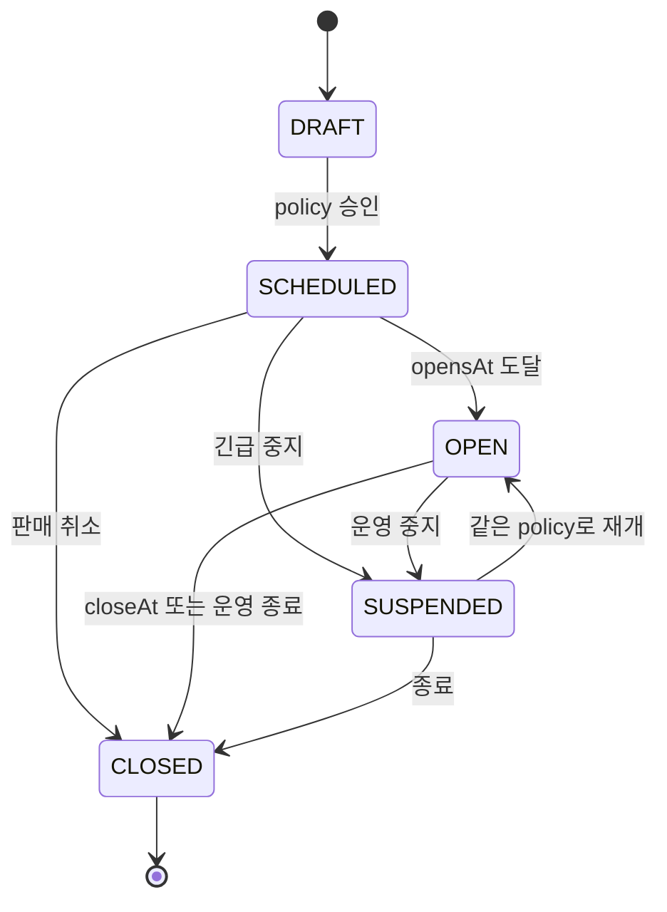
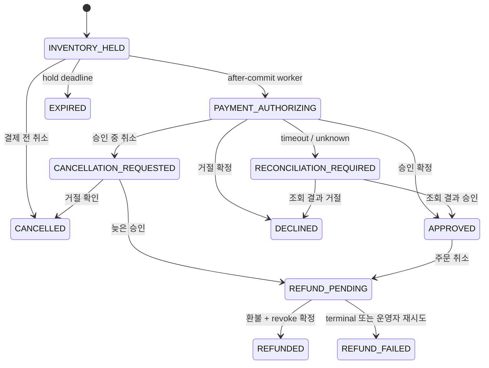
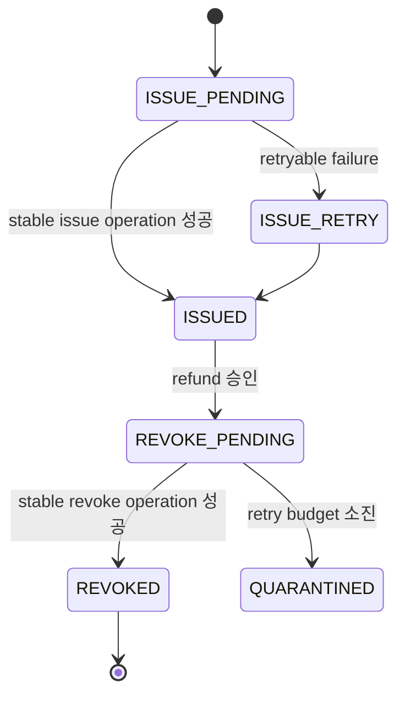
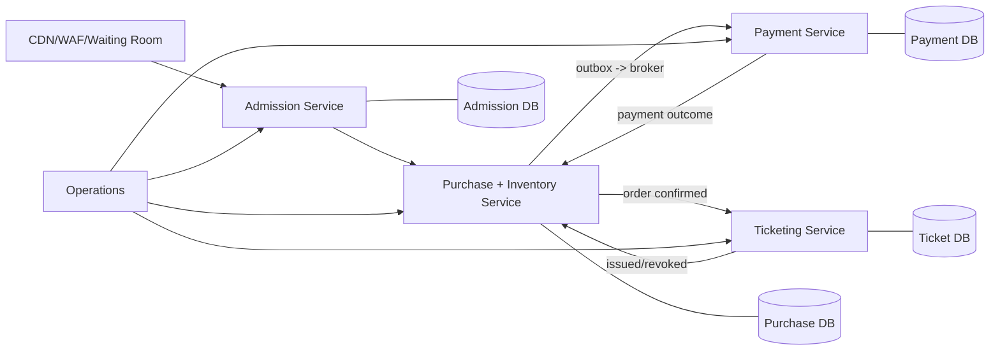

# Concert Ticket Flash Sale 상세 설계

## 1. 문서 상태

- 대상 이슈: [bluetape4k-workshop#521](https://github.com/bluetape4k/bluetape4k-workshop/issues/521)
- 관련 재사용 이슈: [bluetape4k-projects#1065](https://github.com/bluetape4k/bluetape4k-projects/issues/1065)
- 대상 저장소: `bluetape4k-workshop`
- 대상 모듈: `commerce/concert-ticket-flash-sale`
- 런타임: Java 25
- 프레임워크: Spring Boot 4 MVC
- 영속성: Exposed JDBC + PostgreSQL
- 보조 저장소: Lettuce + Redis
- 상태: 사용자 검토용 상세 설계

이 문서는 티켓 오픈 직후의 고경합 상황에서 초과 판매, 중복 결제, 결제 결과 불명확,
취소·환불 경쟁, Redis 유실, worker 재시작을 안전하게 처리하는 Spring Boot 기준 예제를
정의한다. 목표는 코드를 보여주는 데 그치지 않고, 한국의 Spring Boot 서비스 팀이
프로덕션 설계의 출발점으로 사용할 수 있는 모범 구조와 운영 판단 기준을 제공하는 것이다.

## 2. 승인된 결정

1. Spring Boot 구현만 제공한다. Ktor 구현과 프레임워크 간 parity fixture는 범위에서 제외한다.
2. 하나의 실행 JAR로 배포하는 Spring Modulith 기반 모듈러 모놀리스로 구현한다.
3. PostgreSQL만 판매·구매·재고·결제 확정 상태의 최종 권위가 된다.
4. Redis는 대기열 가속, rate limit, IP/user in-flight lease에만 사용한다.
5. Bluetape4k ecosystem을 먼저 검색하고 최대한 재사용한다.
6. 모든 신규 JVM 코드는 Java 25를 사용하고, blocking 경계는 virtual thread를 우선 검토한다.
7. 실제 PG 대신 결정적인 fake payment provider와 주입 가능한 `Clock`을 사용한다.
8. README에는 현재 모듈러 모놀리스와 마이크로서비스 전환 구조를 모두 설명한다.
9. README에는 상태 전이, 정상 구매, timeout 복구를 쉽게 이해할 수 있는 Diagram을 제공한다.
10. 다중 Redis key lease의 범용화는 #1065로 추적하되, 이 예제 작업에서 upstream 기능을
    구현하거나 출시된 것으로 가정하지 않는다.

## 3. 문제와 성공 조건

### 3.1 해결할 문제

티켓 판매는 짧은 시간에 동일 재고, 동일 사용자, 동일 IP로 요청이 집중된다. 단순한
`SELECT` 후 `UPDATE`, Redis lock, HTTP retry만으로는 다음 문제가 발생한다.

- 여러 노드가 동일한 잔여 수량을 보고 동시에 hold를 만든다.
- 사용자의 반복 클릭과 응답 유실 재시도가 서로 다른 결제 요청을 만든다.
- Redis IP key는 만들어졌지만 user key 생성이 실패해 판정이 흔들린다.
- 결제 provider가 승인했지만 응답이 timeout되어 재고를 조기 해제하거나 중복 결제한다.
- 취소 요청과 늦은 결제 승인이 교차해 환불되지 않은 주문 또는 잘못 복구된 재고가 생긴다.
- outbox 중복 전달이 티켓을 두 번 발급하거나 두 번 환불한다.
- forwarded header를 무조건 신뢰해 공격자가 IP 제한을 우회한다.

### 3.2 성공 조건

- `opensAt` 이전 요청은 attempt, hold, idempotency, outbox row를 하나도 만들지 않는다.
- `heldQuantity + soldQuantity <= totalQuantity`가 모든 경쟁과 장애에서 유지된다.
- 동일 사용자 또는 동일 IP의 동시 요청은 하나의 활성 purchase attempt만 남긴다.
- 같은 `Idempotency-Key`와 같은 요청은 같은 결과를 재생한다.
- 같은 key를 다른 요청에 사용하면 안정적인 `409` problem을 반환한다.
- 결제 timeout은 성공이나 실패로 추측하지 않고 durable reconciliation 상태로 전환한다.
- Redis key 유실, worker 재시작, outbox 중복 전달 후에도 PostgreSQL 상태로 수렴한다.
- raw IP, raw user ID, 결제 세부값을 로그, metric label, SSE payload에 노출하지 않는다.
- 사용자는 README만으로 정상 흐름, 실패 복구, 운영 절차, 마이크로서비스 전환 비용을
  이해할 수 있다.

## 4. 범위와 비목표

### 4.1 포함 범위

- 판매 lifecycle과 versioned sale policy
- 등급별 일반석 수량
- PostgreSQL 기반 waiting room과 admission
- IP/user Redis multi-key in-flight lease
- HTTP idempotency
- inventory hold, payment authorization, order, ticket issuance
- 취소, 환불, ticket revoke, 재고 복구
- payment timeout과 reconciliation worker
- transactional outbox와 중복 전달 대응
- 고객 상태 조회, SSE, 운영자 projection과 제한된 복구 명령
- PostgreSQL/Redis Testcontainers 기반 결정적 fixture
- 로컬 고객·운영자 데모 UI
- 모듈러 모놀리스에서 마이크로서비스로 전환하는 가이드

### 4.2 비목표

- 지정 좌석과 좌석 배치 UI
- 실제 결제 gateway, 카드 정보, PCI 범위
- CAPTCHA, WAF vendor, fraud score, bot fingerprinting
- dynamic pricing
- 범용 ticketing engine, 범용 saga framework, 범용 distributed transaction
- Redis를 최종 구매 ledger나 fencing authority로 사용하는 설계
- #1065의 upstream library 구현
- 여러 언어 또는 여러 서버 프레임워크 구현

## 5. 현재 근거와 차용 범위

| 근거 | 차용할 부분 | 그대로 복제하지 않는 부분 |
|---|---|---|
| `commerce/reservation-control-plane` | PostgreSQL 권위, row lock, waitlist, leader sweep, Redis advisory 경계 | 단일 resource hold 모델 |
| `commerce/promotion-voucher-campaign` | Java 25, virtual thread, Exposed audit, Spring Modulith publication, idempotency replay, operator runbook | voucher review와 Bloom filter 도메인 |
| `operations/job-console-*` | snapshot-first SSE, bounded fanout, deterministic failure fixture, worker lease recovery | Ktor adapter와 job checkpoint 모델 |
| `bluetape4k-projects/infra/lettuce` | `RedisScript`, `RedisScriptRunner`, Lettuce lifecycle, token/TTL ownership 교훈 | 단일-key lock이나 semaphore를 구매 lock으로 오용 |
| Wiki Ticket 연구 | sale lifecycle, 이중 in-flight filter, timeout reconciliation, trusted proxy 경계 | Spring/Ktor/FastAPI/Gin 동시 구현 |

## 6. 선택한 아키텍처

### 6.1 대안 비교

| 대안 | 장점 | 단점 | 결정 |
|---|---|---|---|
| Controller-Service-Repository 단일 계층 | 가장 짧고 익숙함 | 도메인 소유권과 추출 경계 불명확 | 거부 |
| Spring Modulith 모듈러 모놀리스 | 단일 트랜잭션의 명확성, 한 번의 배포, 추출 가능한 경계 | 모듈 API와 의존 규칙을 의식적으로 관리해야 함 | 채택 |
| 초기 마이크로서비스 | 독립 확장과 팀 소유권 | 분산 트랜잭션이 핵심 학습을 가리고 실행 비용이 큼 | 가이드로만 제공 |

### 6.2 실행 구조

```text
Browser / WebTestClient
        |
Spring MVC on Java 25 virtual threads
        |
Request identity -> sale gate -> admission proof -> idempotency
        |
Redis rate limit + atomic IP/user lease
        |
PostgreSQL transaction
  buyer guard -> inventory row lock -> hold/attempt -> outbox
        |
after-commit workers
  payment -> reconciliation -> ticket -> notification
        |
snapshot REST + bounded SSE + operator projection
```

하나의 Spring Boot 애플리케이션, 하나의 PostgreSQL, 하나의 Redis를 사용한다. Redis가
결정한 결과만으로 재고나 주문을 변경하는 경로는 존재하지 않는다. 외부 효과는 PostgreSQL
commit 이후에만 시작한다.

## 7. Spring Modulith 업무 모듈

패키지 root는 `io.bluetape4k.workshop.commerce.ticket`이다.

| 모듈 | 책임 | 소유 데이터 |
|---|---|---|
| `salecontrol` | sale lifecycle, policy version, opensAt/closeAt, suspend/close | sale, policy version |
| `admission` | waiting room, 순번, admission grant, route rate limit | waiting room entry, admission grant |
| `purchase` | idempotency, buyer guard, inventory, hold, purchase attempt, order | buyer state, inventory, attempt, order, idempotency |
| `payment` | fake authorization, timeout, provider correlation, refund, reconciliation claim | payment operation |
| `ticketing` | ticket issue, revoke, duplicate suppression | ticket |
| `operations` | safe projection, SSE, audit query, bounded manual recovery | 별도 write model 없음 |

각 모듈은 기본 package를 내부 구현으로 두고 `api` named interface만 공개한다. 다른 모듈의
Repository, Exposed Table, internal service를 직접 참조하지 않는다. Spring Modulith
`ApplicationModules.verify()`와 ArchUnit 성격의 검증으로 이 규칙을 고정한다.

의존 방향은 orchestration port로 제어한다.

- `purchase`가 필요한 payment/ticket 기능은 `purchase.api`의 좁은 port로 정의한다.
- `payment`와 `ticketing` adapter가 해당 port를 구현한다.
- provider 결과는 token과 stable operation ID를 포함한 command로 `purchase`에 반영한다.
- `operations`는 각 모듈의 query API만 사용한다.

## 8. 데이터 모델과 소유권

### 8.1 주요 테이블

| 테이블 | 핵심 역할 |
|---|---|
| `ticket_sales` | sale lifecycle과 현재 활성 policy version |
| `ticket_sale_policy_versions` | 불변 versioned 경제 규칙 |
| `ticket_inventory` | grade별 total/held/sold |
| `ticket_waiting_room_entries` | durable FIFO 대기 순번 |
| `ticket_admission_grants` | 짧은 수명의 hold 시작 권한 |
| `ticket_buyer_sale_states` | 사용자별 active attempt와 누적 구매 제한 |
| `ticket_purchase_attempts` | hold와 checkout state machine |
| `ticket_orders` | 결제 확정 주문과 취소 정책 snapshot |
| `ticket_payment_operations` | authorize/refund provider operation과 reconciliation claim |
| `ticket_tickets` | issue/revoke 상태 |
| `ticket_http_idempotency` | canonical request fingerprint와 저장 응답 |
| Spring Modulith publication tables | transaction-coupled event publication |
| `ticket_audits` | 운영 명령과 보안 관련 상태 전이 |

### 8.2 핵심 불변식

```text
0 <= held_quantity
0 <= sold_quantity
held_quantity + sold_quantity <= total_quantity
```

- `(sale_id, grade)` inventory row가 수량 직렬화의 기준이다.
- `(sale_id, buyer_digest)` buyer state는 하나만 존재한다.
- buyer state에는 동시에 하나의 `active_attempt_id`만 존재할 수 있다.
- terminal이 아닌 attempt는 생성 당시의 `policy_version`을 끝까지 사용한다.
- order 하나에는 성공한 authorization 하나와 ticket 하나만 연결된다.
- 같은 provider operation ID는 한 번만 상태에 반영된다.
- 환불 완료와 ticket revoke가 모두 확인되기 전에는 재고를 복구하지 않는다.

PostgreSQL CHECK, UNIQUE/partial index, foreign key와 application state validation을 함께 사용한다.
H2는 이 불변식의 권위 있는 동시성 증명으로 사용하지 않는다.

## 9. 상태 모델

### 9.1 Sale lifecycle



- `OPEN` 여부는 browser 시간이 아니라 주입된 server `Clock`으로 판정한다.
- scheduler가 상태를 바꾸기 전에 요청이 도착해도 transaction이 `opensAt`을 직접 확인한다.
- `opensAt` 이전에는 idempotency를 포함한 durable row를 만들지 않는다.
- `OPEN` 이후 경제 규칙을 in-place로 수정하지 않는다.
- 긴급 변경은 actor, reason, effective time을 포함한 `SUSPENDED` 또는 `CLOSED` command다.

### 9.2 Purchase attempt와 payment



timeout은 실패가 아니다. `RECONCILIATION_REQUIRED` 동안 hold와 buyer active-attempt guard를
유지한다. 새 결제를 만들거나 재고를 복구하지 않는다.

### 9.3 Ticket lifecycle



결제가 환불되어도 ticket revoke가 확정되지 않으면 inventory를 즉시 복구하지 않는다.
`QUARANTINED`는 운영자가 원인을 확인하고 같은 operation ID로 재시도하는 안전한 정지점이다.

## 10. 구매 요청 처리

### 10.1 처리 순서

1. 기존 idempotency terminal result가 있으면 read-only replay한다.
2. sale 상태와 server `Clock`을 확인한다. 열리지 않았으면 row 생성 없이 거부한다.
3. admission grant를 검증한다.
4. trusted client identity로 IP/user HMAC digest를 계산한다.
5. route token bucket을 통과한 뒤 Redis IP/user lease를 원자적으로 획득한다.
6. PostgreSQL transaction에서 idempotency, buyer state, inventory를 고정 순서로 잠근다.
7. 정책과 수량을 다시 확인하고 attempt/hold/outbox를 기록한다.
8. transaction commit 뒤 payment worker가 authorization을 시작한다.
9. HTTP는 `202 Accepted`와 attempt snapshot을 반환한다.
10. client는 REST snapshot 또는 SSE로 terminal 상태를 관찰한다.

### 10.2 PostgreSQL lock 순서

모든 mutation은 다음 순서를 유지한다.

```text
idempotency record
  -> buyer sale state
  -> inventory(saleId, grade)
  -> purchase attempt / order
  -> payment or ticket operation
```

결제 provider 호출, SSE write, Redis network call을 PostgreSQL transaction이나 row lock 안에서
수행하지 않는다. serialization/deadlock 재시도는 식별된 PostgreSQL SQLSTATE에만 제한하고,
동일 command ID를 유지한다.

## 11. Redis 경계

### 11.1 API rate limit과 in-flight lease 분리

- Bucket4j rate limit은 route별 과도한 호출을 `429`로 줄인다.
- multi-key lease는 동일 IP 또는 동일 user의 동시 approval workflow를 `409`로 막는다.
- 둘 다 구매 자격, admission, 재고 존재를 증명하지 않는다.

### 11.2 Multi-key lease

```text
ticket:{saleId}:inflight:ip:{ipDigest}
ticket:{saleId}:inflight:user:{userDigest}
value = ownerToken + attemptId + idempotencyDigest + keyVersion
```

두 key는 shared Redis hash tag로 같은 slot에 배치한다. acquire, renew, compare-and-delete
release는 각각 한 Lua script로 실행한다. `RedisScript`와 `RedisScriptRunner`의
EVALSHA/NOSCRIPT fallback을 재사용한다.

#1065가 출시되기 전에는 이 script와 좁은 adapter만 예제가 소유한다. 범용 lock/semaphore
API를 새로 만들지 않는다. #1065가 호환 가능한 released artifact로 제공되면 adapter
내부만 교체할 수 있어야 한다.

### 11.3 Redis 장애 정책

| 상황 | 새 purchase | 기존 workflow |
|---|---|---|
| Redis unavailable | `503 admission_temporarily_unavailable`로 fail closed | DB 기반 payment/reconciliation 지속 |
| key 유실/만료 | DB active attempt가 중복을 차단 | worker가 disagreement metric 기록 |
| acquire 응답 유실 | 같은 token으로 idempotent 검사 | 새 token 자동 재시도 금지 |
| DB commit 실패 뒤 lease 존재 | compare-and-delete best effort | 실패 시 TTL 만료 대기 |
| stale worker | renew/release 거부 | DB reconciliation으로 넘김 |

Redis 장애 때문에 기존 결제 결과를 버리거나 hold를 조기 해제하지 않는다.

## 12. Payment와 reconciliation

### 12.1 Fake provider

실제 provider 대신 다음 결과를 결정적으로 재현한다.

- immediate approved
- immediate declined
- timeout then approved
- timeout then declined
- duplicate callback
- refund failed once then succeeded
- permanent refund failure

fixture는 sleep 대신 fake `Clock`, barrier, 명시적 provider command를 사용한다. 테스트용
failure control은 test/demo profile에서만 활성화하고 일반 public request body에는 넣지 않는다.

### 12.2 Unknown result 규칙

- authorize timeout 후 같은 provider operation을 새 ID로 재호출하지 않는다.
- stable operation ID로 provider status를 조회한다.
- 결과가 계속 unknown이면 `next_reconcile_at`, attempt count, claim lease를 갱신한다.
- retry budget을 소진해도 inventory를 자동 해제하지 않고 operator-visible quarantine으로 둔다.
- worker 재시작은 PostgreSQL claim lease 만료 뒤 같은 operation ID에서 재개한다.

### 12.3 취소와 환불

| 시점 | 처리 |
|---|---|
| `INVENTORY_HELD` | attempt 취소, hold 즉시 해제 |
| `PAYMENT_AUTHORIZING` | `CANCELLATION_REQUESTED`, 결과 확정 전 hold 유지 |
| 늦은 승인 | order를 환불 대상으로 기록하고 ticket은 발급하지 않음 |
| 이미 `ISSUED` | refund 성공 후 revoke, 두 결과 확인 뒤 restock |
| refund unknown/failed | hold/sold 상태를 임의로 되돌리지 않고 reconciliation |

취소·환불 endpoint도 별도의 `Idempotency-Key`를 요구한다.

## 13. HTTP와 SSE 계약

### 13.1 고객 API

| Endpoint | 의미 |
|---|---|
| `GET /api/v1/sales/{saleId}` | 공개 sale/inventory projection |
| `POST /api/v1/sales/{saleId}/waiting-room` | 대기실 등록 |
| `GET /api/v1/sales/{saleId}/admission` | 순번, ETA, grant 상태 |
| `POST /api/v1/sales/{saleId}/purchase-attempts` | hold와 payment workflow 시작 |
| `GET /api/v1/purchase-attempts/{attemptId}` | authoritative attempt snapshot |
| `POST /api/v1/purchase-attempts/{attemptId}/cancel` | 승인 전/중 취소 |
| `POST /api/v1/orders/{orderId}/refund` | 승인 주문 환불 |
| `GET /api/v1/sales/{saleId}/events` | snapshot-first SSE |

### 13.2 운영 API

운영 API는 loopback demo profile과 명시적인 operator secret에서만 활성화한다.

- sale schedule/suspend/resume/close
- reconciliation bounded run
- quarantined operation 조회와 같은 operation ID 재시도
- inventory invariant projection
- Redis/DB guard disagreement
- outbox backlog와 oldest age

README는 production에서 OAuth2/JWT, RBAC, CSRF/CORS, network policy, secret manager를
적용해야 하며 demo operator header를 외부에 노출하면 안 된다고 명시한다.

### 13.3 Stable problem catalog

| HTTP | code | retry |
|---|---|---|
| 409 | `idempotency_key_reused` | payload 수정 또는 새 key |
| 409 | `purchase_approval_in_progress` | 기존 attempt 조회 |
| 409 | `sale_not_open` | opensAt 이후 |
| 409 | `inventory_exhausted` | 재고 snapshot 확인 |
| 410 | `admission_expired` | waiting room 재진입 |
| 429 | `rate_limit_exceeded` | `Retry-After` 준수 |
| 503 | `admission_temporarily_unavailable` | bounded retry |
| 503 | `purchase_authority_unavailable` | PostgreSQL 복구 후 retry |
| 202 | `reconciliation_required` | 같은 attempt 조회 |

내부 exception, SQL, Redis key, provider detail을 problem body에 노출하지 않는다.

### 13.4 SSE

- 연결 즉시 authoritative snapshot을 보낸다.
- audit/outbox 기반의 monotonic event ID를 사용한다.
- cursor가 retention 밖이면 `reset`과 새 snapshot을 보낸다.
- replay를 보장할 수 없으면 polling link를 함께 제공한다.
- slow consumer queue, payload, write timeout, 동시 연결을 제한한다.
- 모든 종료 경로에서 permit과 resource를 반환한다.

## 14. Trusted proxy와 개인정보 경계

1. TCP peer가 configured trusted proxy CIDR에 속할 때만 forwarded header를 사용한다.
2. 그 외 요청의 `Forwarded`와 `X-Forwarded-For`는 무시한다.
3. IPv4/IPv6를 canonical form으로 정규화한다.
4. IP와 user ID는 versioned HMAC secret으로 digest한다.
5. Redis key, metric, log, SSE에는 digest 전체도 노출하지 않고 필요한 경우 짧은 safe tag만
   사용한다.
6. key rotation 동안 active read version을 유지하고 version을 durable row에 기록한다.
7. strict IP filter는 sale policy로 끌 수 있지만 user guard와 DB 주문 제한은 유지한다.
8. NAT 환경의 정상 사용자 차단 가능성을 README와 operator 화면에 명시한다.

## 15. Java 25, virtual thread, bulkhead

Spring MVC request는 Java 25 virtual thread에서 실행한다. 하지만 virtual thread가
PostgreSQL connection이나 외부 provider capacity를 늘리지는 않는다.

| workload | 경계 |
|---|---|
| foreground purchase | bounded DB permit + Hikari pool |
| payment/reconciliation | 별도 worker permit |
| SSE maintenance | 별도 permit과 queue |
| operator recovery | foreground와 분리된 작은 permit |

권장 초기값은 테스트와 local run을 위한 예시일 뿐 production 정답으로 표현하지 않는다.
permit을 얻기 전에 JDBC connection을 점유하지 않는다. monitor 기반 synchronization을
피하고 명시적 concurrency primitive를 사용한다.

## 16. Ecosystem capability selection

| 책임 | 재사용 capability | 결정 |
|---|---|---|
| validation | `bluetape4k-core` `require*` | 채택 |
| ID | `bluetape4k-idgenerators` `Uuid` | 채택 |
| JSON | `bluetape4k-jackson3` | 채택 |
| logging | `bluetape4k-logging` `KLogging` | 채택 |
| metrics | `bluetape4k-micrometer` | 채택 |
| virtual thread | `bluetape4k-virtualthread-api`, `virtualthread-jdk25` | 채택 |
| Exposed model/repository | `bluetape4k-exposed-core/jdbc` | 채택 |
| Spring JDBC integration | `bluetape4k-exposed-spring-boot-jdbc` | 채택 |
| audit | `AuditableLongIdTable`, `UserContext`, `LongAuditableJdbcRepository` | 채택 |
| publication/outbox | `bluetape4k-exposed-spring-modulith` | 채택 |
| Redis | `bluetape4k-lettuce`, `RedisScriptRunner` | 채택 |
| rate limit | `bluetape4k-bucket4j` + Lettuce adapter | 채택 |
| leader worker | `bluetape4k-leader` core/micrometer/Lettuce | 채택 |
| DB/Redis fixture | `bluetape4k-testcontainers` | 채택 |
| concurrency test | `bluetape4k-junit5` `MultithreadingTester` | 채택 |
| assertions | `bluetape4k-assertions` | 채택 |
| multi-key lease | #1065 미출시 | application-owned adapter로 제한 |
| payment provider | 실제 provider unavailable | deterministic fake |
| generic retry | unknown payment에 부적합 | explicit reconciliation 사용 |

`bluetape4k-dependencies` BOM만 버전 권위로 사용한다. 개별 Bluetape BOM이나 module version을
추가하지 않는다.

## 17. 마이크로서비스 전환 가이드

### 17.1 분리 순서

1. **ticketing/notification**: outbox 기반 비동기 경계라 가장 먼저 분리하기 쉽다.
2. **admission/waiting room**: 독립 확장 필요가 명확하고 구매 권위가 아니므로 다음 후보다.
3. **payment/reconciliation**: provider credential, 규제, 별도 SLO가 필요할 때 분리한다.
4. **purchase/inventory**: hold와 inventory를 같은 consistency boundary로 마지막까지 유지한다.

### 17.2 분리 조건

- 독립적인 확장 곡선과 SLO가 실제 측정에서 확인됨
- 서로 다른 팀과 배포 주기가 지속적으로 충돌함
- provider credential 또는 데이터 규제 경계를 분리해야 함
- 장애 격리 이익이 broker, 운영, eventual consistency 비용보다 큼

### 17.3 분리 후 구조



분리 시 현재의 in-process event는 versioned broker event로 바뀐다. 각 consumer는 stable
event ID로 멱등 처리한다. PostgreSQL transaction을 분산 transaction으로 바꾸지 않는다.
payment timeout과 ticket revoke는 saga compensation이 아니라 이미 정의된 durable state
machine과 reconciliation으로 관리한다.

### 17.4 분리하지 말아야 할 신호

- 코드가 커 보인다는 이유만으로 분리
- 같은 팀, 같은 SLO, 같은 데이터 transaction인데 배포물만 나누기
- hold와 inventory를 서로 다른 DB로 먼저 분리
- Redis lease를 service 간 exactly-once 보장으로 해석

## 18. 테스트 전략

### 18.1 테스트 층

1. pure state-machine unit tests
2. PostgreSQL Repository와 migration tests
3. Redis Lua lease integration tests
4. Spring Modulith dependency verification
5. live HTTP/SSE tests
6. hostile concurrency tests
7. worker restart와 failure fixture tests
8. browser demo smoke
9. migration compatibility test
10. 별도 opt-in stress test

### 18.2 결정적 failure matrix

| fixture | 기대 결과 |
|---|---|
| opensAt 1ns 전 | row 0, `sale_not_open` |
| opensAt 경계 동시 요청 | 같은 policy version |
| 같은 key 같은 payload | 같은 attempt/result |
| 같은 key 다른 payload | `idempotency_key_reused` |
| 같은 user 다른 key 경쟁 | 활성 attempt 하나 |
| 같은 IP 다른 user 경쟁 | 활성 approval 하나, 타 사용자 정보 비노출 |
| inventory 마지막 수량 경쟁 | 한 winner, oversell 0 |
| Redis acquire 응답 유실 | 같은 token으로 수렴 |
| Redis key 강제 삭제 | DB guard가 두 번째 attempt 차단 |
| DB 실패 뒤 Redis lease | compare-delete 또는 TTL 복구 |
| payment timeout 후 승인 | reconciliation -> approved |
| payment timeout 중 취소 | cancellation requested -> refund |
| duplicate provider result | state change 한 번 |
| duplicate outbox | ticket/refund effect 한 번 |
| worker restart | claim lease 후 재개 |
| refund 성공, revoke 실패 | restock 보류와 quarantine |
| untrusted forwarded header | TCP peer identity 사용 |
| SSE cursor retention 초과 | reset + snapshot |

### 18.3 성능과 정확성 분리

동시성 fixture는 불변식 증명이고 throughput benchmark가 아니다. 별도의 opt-in stress task는
요청 수, concurrency, 환경, raw 결과, 성공/거절/오류, p50/p95/p99, DB pool wait,
Redis latency를 기록한다. 로컬 수치를 production capacity 약속으로 표현하지 않는다.

## 19. README와 Diagram

README는 English와 Korean locale을 동등하게 유지한다.

생성할 Diagram:

1. 모듈러 모놀리스 architecture
2. sale/purchase/payment/ticket 통합 state diagram
3. 정상 purchase sequence
4. timeout -> reconciliation -> late approval/refund sequence
5. Redis와 PostgreSQL authority boundary
6. 마이크로서비스 전환 architecture

Diagram은 저장소의 `bluetape-diagram` workflow와 validator를 사용해 source와 PNG를 함께
관리한다. README에는 각 그림 아래에 “무엇이 권위이고, 어떤 실패에서 어디로 복구되는가”를
평문으로 설명한다.

README runbook은 다음을 포함한다.

- 시작, seed/reset, customer walkthrough
- 중복 클릭과 응답 유실 재시도
- Redis 중단, PostgreSQL 중단, worker restart
- timeout/late approval/refund
- invariant query
- outbox backlog와 quarantine
- SSE polling fallback
- trusted proxy와 production 보안 경계
- microservice extraction checklist

## 20. 모듈과 저장소 등록

새 모듈은 `settings.gradle.kts` 자동 등록 규칙을 사용한다. 다음 surface를 같은 branch에서
갱신한다.

- root README module map
- repo `AGENTS.md` module map
- smoke/full workflow group
- container-backed Full Nightly
- stale example validation script
- Kover/Codecov artifact와 workflow summary `needs`
- `src/test/resources/junit-platform.properties`
- `src/test/resources/logback-test.xml`
- lesson 문서

Java 25는 새 모듈에만 격리하고 저장소 기본 Java 21을 변경하지 않는다.

## 21. 호환성과 migration

- 신규 모듈이므로 기존 runtime API binary compatibility 영향은 없다.
- schema는 versioned SQL migration으로 관리한다.
- migration compatibility task는 이전 boot JAR와 현재 schema의 read/start 경계를 검증한다.
- state enum과 outbox payload에 stable external code와 schema version을 둔다.
- 이미 발행된 event 의미를 in-place로 바꾸지 않는다.
- #1065 채택은 application adapter 내부 교체로 제한하고 HTTP/DB contract를 바꾸지 않는다.

## 22. 주요 실패 모드와 완화

| 실패 모드 | 위험 | 완화 |
|---|---|---|
| oversell | 재무·신뢰 손실 | inventory row lock + DB CHECK + stress fixture |
| Redis partial ownership | 중복 approval | atomic Lua + DB active-attempt guard |
| payment commit unknown | 중복 결제 또는 무료 ticket | stable operation ID + reconciliation |
| cancellation/late approval race | 환불 누락 | cancellation requested state + late approval refund |
| refund 후 revoke 실패 | 재판매와 유효 ticket 공존 | revoke 전 restock 금지 + quarantine |
| worker 중복 실행 | effect 중복 | leader election + DB claim lease + idempotent operation |
| outbox duplicate | 중복 issue/refund | stable event/operation ID |
| virtual-thread fanout | DB pool 고갈 | workload bulkhead + bounded Hikari |
| forwarded header spoofing | IP 정책 우회 | trusted proxy CIDR + canonicalization |
| 관측성 PII 유출 | 보안·개인정보 사고 | HMAC digest + redaction fixture |
| 지나친 초기 서비스 분리 | 운영 복잡성 | modular monolith 우선 + 측정 기반 extraction |

## 23. 수용 기준 추적

| 요구사항 | 설계 위치 | 검증 |
|---|---|---|
| opensAt 전 row 없음 | 9, 10 | pre-open integration fixture |
| same user/IP 하나의 attempt | 8, 11 | Lua + PostgreSQL hostile concurrency |
| oversell 없음 | 8, 10 | PostgreSQL contention test |
| Redis key loss 수렴 | 11 | forced delete fixture |
| worker restart 수렴 | 12 | claim lease restart fixture |
| duplicate request 수렴 | 10, 13 | idempotency contract |
| payment timeout/refund | 9, 12 | fake provider matrix |
| duplicate outbox | 12, 18 | effect count assertion |
| Spring Boot only | 2, 6 | module surface check |
| Java 25 | 2, 15 | toolchain/task validation |
| Bluetape4k 최대 재사용 | 16 | capability selection and import audit |
| 쉬운 실전 설명 | 17, 19 | README/Diagram review |

## 24. 완료 정의

- Spring Boot 모듈 하나가 Java 25에서 빌드되고 실행된다.
- PostgreSQL과 Redis가 없는 단위 테스트, Testcontainers 통합 테스트가 역할별로 분리된다.
- 모든 failure matrix가 결정적으로 통과한다.
- `ApplicationModules.verify()`가 통과한다.
- module test, migration compatibility, opt-in stress, smoke/full workflow가 등록된다.
- detekt, diagnostics, `git diff --check`, stale validator, actionlint가 통과한다.
- English/Korean README, API contract, runbook, Diagram이 source와 일치한다.
- `bluetape4k-dependencies` BOM만 사용하고 Bluetape module version pin이 없다.
- spec/plan/review/lesson과 실제 구현 사이에 미해결 차이가 없다.
- P0/P1 review finding이 0이다.
- PR CI와 review가 통과한 뒤 별도 merge 승인을 기다린다.

## 25. 중단 조건

다음 상황에서는 구현을 확대하지 않고 설계 또는 계획으로 돌아간다.

- 출시되지 않은 Bluetape capability 없이는 구현할 수 있다고 판명된 경우
- PostgreSQL invariant와 Redis optimization의 권위 경계가 뒤집히는 경우
- Spring Modulith 의존성이 순환하는 경우
- 실제 provider 또는 production auth가 필요해지는 경우
- 일반석 범위를 넘어 지정 좌석이 요구되는 경우
- 마이크로서비스 구현이 예제 본체 범위로 들어오는 경우
