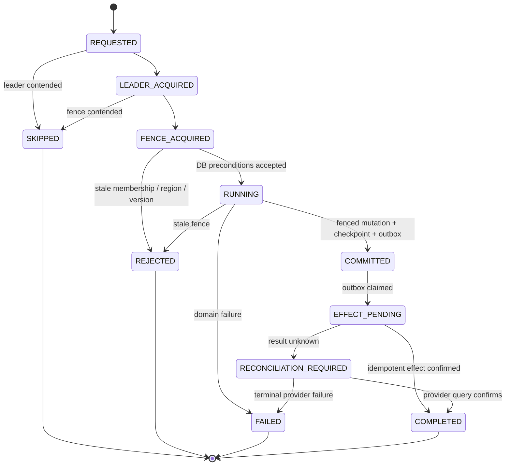

# Leader Job Safety Lab 상세 설계

## 1. 문서 상태

- 대상 이슈: [bluetape4k-workshop#548](https://github.com/bluetape4k/bluetape4k-workshop/issues/548)
- 재사용 기능 이슈: [bluetape4k-projects#1068](https://github.com/bluetape4k/bluetape4k-projects/issues/1068)
- 대상 저장소: `bluetape4k-workshop`
- 대상 모듈: `leader/job-safety-lab`
- 런타임: Java 25
- 프레임워크: Spring Boot 4 MVC
- 영속성: JetBrains Exposed JDBC + `bluetape4k-exposed-jdbc` + PostgreSQL
- 조정 계층: `bluetape4k-leader-redis-lettuce` + `bluetape4k-lettuce` + Redis
- 상태: 사용자 검토용 상세 설계

이 예제는 leader election을 도입한 뒤에도 남는 운영 장애를 실행 가능한 형태로 설명한다.
핵심 목표는 leader가 한 명이라는 사실과 업무 결과가 안전하다는 사실을 구분하고, 오래 멈춘
worker, 다른 종류의 job, tenant 변경, region partition, 혼합 버전 배포, 외부 효과까지 포함한
프로덕션 수준의 최소 안전 계약을 제시하는 것이다.

## 2. 승인된 결정

1. Spring Boot 구현만 제공한다. Ktor 또는 다른 서버 프레임워크 구현은 만들지 않는다.
2. 하나의 실행 JAR인 모듈러 모놀리스로 구현하고, 마이크로서비스 적용은 README의 가이드와
   Diagram으로 설명한다.
3. 신규 JVM 예제이므로 Java toolchain과 Kotlin JVM target을 Java 25로 고정한다.
4. leader election과 lease lifecycle은 `bluetape4k-leader-redis-lettuce`를 사용한다.
5. 현재 leader Lettuce 구현의 owner token은 순서 비교가 불가능하므로 fencing token으로
   재해석하지 않는다.
6. 예제 내부에 Redis Lua 기반 `JobFencingLease`를 구현하되 `FencingLeasePort` 뒤에 숨긴다.
   재사용 가능한 upstream 기능은 #1068에서 `bluetape4k-lettuce` 기능으로 추적한다.
7. PostgreSQL만 checkpoint, 실행 완료, resource 최신 fence, rollout marker, outbox의 최종
   권위가 된다.
8. 모든 DB 작업은 JetBrains Exposed와 `bluetape4k-exposed-jdbc`를 사용한다. 모든 구체
   repository는 `ExposedJdbcRepository` 계약을 구현하며 raw SQL을 사용하지 않는다.
9. Redis Lua는 lease와 monotonic counter의 원자성이 필요한 제한된 Redis 경계에서만 사용한다.
10. 결제, 이메일, webhook처럼 fencing token을 직접 소비할 수 없는 외부 효과는 stable
    operation ID, transactional outbox, idempotent consumer, reconciliation으로 보호한다.
11. README와 README.ko.md는 동일한 기술 계약, architecture/failure/state Diagram, 실행 명령,
    운영 한계, 마이크로서비스 전환 가이드를 제공한다.

## 3. 문제와 성공 조건

### 3.1 해결할 문제

일반적인 leader lease는 동시에 실행할 후보를 줄이지만 다음 상황까지 막지는 못한다.

- `daily-summary`와 `backfill-summary`가 서로 다른 lock 이름으로 같은 월별 요약을 갱신한다.
- node A가 lease를 얻은 뒤 오래 멈추고, lease를 승계한 node B가 완료한 다음 A가 다시 쓴다.
- scheduler가 읽은 tenant 목록과 실제 실행 시점의 tenant membership이 달라진다.
- region 간 Redis 연결이 끊기거나 서로 다른 Redis authority를 사용해 양쪽이 leader라고 판단한다.
- 구버전 worker와 신버전 worker가 같은 payload와 checkpoint를 다르게 해석한다.
- payment, email, webhook provider가 fencing token 비교 기능을 제공하지 않는다.

### 3.2 성공 조건

- 서로 다른 job이라도 동일한 업무 resource를 갱신하면 같은 conflict key를 사용한다.
- 새 ownership generation은 이전 generation보다 큰 fencing token을 받는다.
- lease를 잃은 stale worker의 PostgreSQL 조건부 갱신은 update count `0`으로 거부된다.
- renew는 기존 fence를 유지하고, stale owner의 renew/release는 새 owner에게 영향을 주지 않는다.
- tenant membership revision과 write-home region epoch가 맞지 않는 실행은 DB에서 거부된다.
- rollout compatibility marker보다 오래된 worker는 checkpoint나 result를 쓰지 못한다.
- 외부 효과는 같은 operation ID로 재시도되고, 불명확한 결과는 조회·조정 후 수렴한다.
- 각 시나리오는 unsafe baseline과 가장 작은 containment를 나란히 보여준다.
- 기본 테스트는 wall-clock sleep, 실제 network partition, 다중 JVM에 의존하지 않고 결정적으로
  실행된다.
- PostgreSQL/Redis 실제 동작은 별도 opt-in integration task에서 검증한다.
- 문서가 mutual exclusion, failover, replay safety, fencing, durable completion을 별개 보장으로
  설명한다.

## 4. 범위와 비목표

### 4.1 포함 범위

- Spring Boot MVC API와 Java 25 virtual-thread 실행기
- Redis leader election과 application-owned fencing lease
- Exposed 기반 execution, checkpoint, protected resource, tenant assignment, rollout marker, outbox
- cross-job collision, lease overrun, dynamic tenant, region partition, mixed version, non-fenceable effect
- unsafe/safe 실행 모드와 시간순 event timeline
- deterministic in-memory adapters와 PostgreSQL/Redis Testcontainers integration fixture
- English/Korean README, architecture/state/failure sequence Diagram, runbook
- 모듈 등록, smoke/full workflow, stale-check, lesson 문서

### 4.2 비목표

- 새로운 leader-election provider 또는 범용 scheduler framework
- `bluetape4k-lettuce` #1068의 upstream 구현이나 출시
- Redis history rollback 뒤에도 유지되는 전역 monotonicity 주장
- 여러 region의 독립 Redis counter를 하나의 순서로 합치는 기능
- distributed transaction 또는 exactly-once 외부 효과 주장
- 실제 payment/email/webhook provider 연동
- Kubernetes network partition이나 다중 프로세스를 기본 테스트에서 재현하는 기능

## 5. 현재 근거와 재사용 범위

| 근거 | 재사용할 부분 | 재사용하지 않을 부분 |
|---|---|---|
| `leader/tenant-scheduler` | tenant-scoped 명명, deterministic scenario, bounded timeline | in-memory leader만으로 업무 안전을 설명하는 방식 |
| `leader/backend-comparison-lab` | backend capability와 failure boundary를 구분하는 설명 | 모든 backend를 하나의 fencing 계약으로 추상화 |
| `commerce/concert-ticket-flash-sale` | Java 25, Spring Boot, Exposed repository adapter, PostgreSQL 권위, Redis Lua port, deterministic fake | 티켓 도메인과 Spring Modulith 업무 모듈 수 |
| `operations/job-console-core` | checkpoint, lease recovery, outbox, bounded projection | Ktor adapter와 범용 job console API |
| `bluetape4k-leader-redis-lettuce` | Redis leader acquire/renew/release와 auto-extend | opaque owner token을 fencing token으로 사용 |
| `bluetape4k-lettuce` | `RedisScript`, `RedisScriptRunner`, Lettuce lifecycle | feature #1068이 이미 제공된 것으로 가정 |
| `bluetape4k-exposed-jdbc` | `ExposedJdbcRepository`, `SimpleExposedJdbcRepository`, transaction helper | JDBC connection과 raw SQL 직접 사용 |

## 6. 대안과 선택

### 6.1 fencing token 권위

| 대안 | 장점 | 단점 | 결정 |
|---|---|---|---|
| Redis Lua counter + PostgreSQL 검증 | leader Redis 경계와 함께 이해하기 쉽고 acquire가 원자적 | Redis counter history 유실 시 epoch 복구 필요 | 채택 |
| PostgreSQL sequence | durable ordering이 단순하고 Redis rollback과 분리됨 | leader lease와 fence 발급 경계가 갈라져 예제 핵심이 흐려짐 | 거부 |
| DB execution generation만 사용 | 구현이 짧고 DB 권위가 강함 | 실제 fencing lease와 stale lease overrun을 보여주지 못함 | 거부 |

### 6.2 배포 구조

| 대안 | 장점 | 단점 | 결정 |
|---|---|---|---|
| 단일 계층 demo class | 코드가 짧음 | Redis, DB, 외부 효과의 권위 경계를 숨김 | 거부 |
| Port/adapter 기반 Spring Boot 모듈러 모놀리스 | 한 프로세스에서 실행 가능하고 추출 경계가 명확함 | 파일 수가 늘어남 | 채택 |
| 초기 마이크로서비스 | 서비스별 독립 배포를 바로 보여줌 | 분산 배포가 failure-boundary 학습을 압도함 | 가이드로 제공 |

## 7. 아키텍처

패키지 root는 `io.bluetape4k.workshop.leader.jobsafety`다.

```text
Spring MVC lab API / scheduled trigger
                  |
            JobRunCoordinator
        +---------+----------+
        |                    |
LeaderElectionPort      FencingLeasePort
bluetape4k-leader       local Redis Lua adapter
        |                    |
        +---------+----------+
                  |
       FencedJobExecutionService
                  |
      PostgreSQL / Exposed transaction
  assignment + rollout marker + resource fence
  checkpoint + execution result + outbox
                  |
          OutboxEffectWorker
                  |
      Idempotent fake external provider
```

### 7.1 구성 요소

| 구성 요소 | 책임 | 의존성 |
|---|---|---|
| `JobSafetyController` | scenario reset/run/query API | application service만 참조 |
| `JobRunCoordinator` | leader lease와 fencing lease 획득 순서, 실행 lifecycle | 두 port와 execution service |
| `FencedJobExecutionService` | DB precondition 확인, fenced mutation, checkpoint/outbox 원자 기록 | repository ports |
| `RedisLeaderElectionAdapter` | `bluetape4k-leader-redis-lettuce` 호출과 결과 매핑 | leader library |
| `RedisJobFencingLeaseAdapter` | Lua acquire/renew/release, owner/fence 분리 | `RedisScriptRunner` |
| `Exposed*Repository` | PostgreSQL 권위와 조건부 갱신 | `ExposedJdbcRepository` |
| `OutboxEffectWorker` | stable operation ID delivery와 reconciliation | outbox repository, provider port |
| `Deterministic*Adapter` | logical clock과 scripted failure로 기본 테스트 실행 | 외부 backend 없음 |

### 7.2 실행 순서

1. trigger는 job name, tenant, business resource, membership revision, region epoch,
   execution contract version을 포함한 `JobRunRequest`를 만든다.
2. coordinator가 job 실행용 leader lease를 얻는다. 실패하면 실행하지 않는다.
3. 실제로 변경할 business resource의 conflict key로 fencing lease를 얻는다. job 이름이 달라도
   resource가 같으면 동일한 key를 사용한다.
4. transaction 시작 후 tenant assignment, region epoch, rollout marker를 다시 검증한다.
5. protected resource를 `incomingFence > lastAcceptedFence` 조건으로 갱신한다.
6. 같은 transaction에서 execution result, checkpoint, outbox를 기록한다.
7. commit 뒤 외부 효과 worker가 stable operation ID로 provider를 호출한다.
8. 응답이 불명확하면 결과를 추측하지 않고 `RECONCILIATION_REQUIRED`로 남긴다.
9. coordinator는 owner identity와 fence가 모두 맞을 때만 fencing lease를 renew/release한다.

leader lease는 실행 후보를 줄이고 failover를 제공한다. fencing lease는 ownership generation을
순서화한다. PostgreSQL은 stale generation을 거절하고 완료를 내구성 있게 기록한다. outbox와
idempotency는 fencing을 이해하지 못하는 외부 시스템을 보호한다. 어느 하나도 나머지를 대체하지
않는다.

## 8. 도메인 모델과 타입 안전성

동일한 원시 타입끼리 혼동하지 않도록 다음 value object를 사용한다.

- `LeaderOwnerId`: leader backend의 opaque owner identity
- `FencingOwnerId`: fencing lease의 opaque owner identity
- `FencingToken`: 양수 `Long` 기반의 순서 비교 가능한 generation
- `ConflictKey`: 실제로 보호할 business resource 식별자
- `MembershipRevision`: tenant assignment revision
- `RegionEpoch`: write-home region generation
- `ExecutionContractVersion`: payload/checkpoint 호환 버전
- `OperationId`: 외부 효과의 stable idempotency key

owner ID와 fencing token은 직렬화 형식과 Kotlin 타입을 분리한다. log와 metric에는 owner token,
Redis key 전체값, payload를 기록하지 않는다. public durable type에는 English KDoc과 직접 테스트를
제공한다.

## 9. Redis fencing lease 계약

### 9.1 key layout

```text
job-fence:{resourceTag}:lease
job-fence:{resourceTag}:counter
job-fence:{namespaceTag}:epoch
```

두 key는 Redis Cluster에서 같은 hash slot을 사용한다. `resourceTag`는 검증된 conflict key에서
결정적으로 파생한다. lease value에는 owner identity와 발급된 fence를 함께 저장한다.

### 9.2 Lua 동작

- `acquire`: active lease가 없으면 counter를 증가시키고 lease를 `SET PX`한다.
- 같은 owner의 ambiguous retry: active lease가 유지되는 동안 기존 fence를 반환한다.
- 다른 owner의 acquire: `Contended`를 반환한다.
- `renew`: owner와 fence가 모두 일치할 때 TTL만 연장하고 새 fence를 만들지 않는다.
- `release`: owner와 fence가 모두 일치할 때 lease만 삭제한다. counter는 삭제하지 않는다.
- 모든 결과는 `Acquired`, `AlreadyOwned`, `Contended`, `OwnershipLost`, `BackendFailure`의
  명시적 sealed result로 매핑한다.

Lua source와 result parsing은 `RedisScript`/`RedisScriptRunner`를 사용한다. Redis script 외의
DB 또는 application 로직에서 raw command 문자열을 만들지 않는다.

### 9.3 counter history 유실

monotonicity는 해당 resource counter history가 보존되는 동안만 보장한다. replica promotion의
acknowledged-write loss, snapshot rollback, counter 삭제, restore는 fence를 되돌릴 수 있다.
예제는 이를 자동 복구했다고 주장하지 않는다.

- PostgreSQL의 active namespace epoch와 Redis epoch marker가 일치하지 않으면 acquire를
  시작하지 않는다.
- 기존 PostgreSQL resource가 있는데 Redis counter가 없거나 새 fence가 DB의
  `lastAcceptedFence`를 넘지 못하면 history loss로 판정한다.
- 아직 DB resource가 없는 새 conflict key만 현재 namespace epoch에서 counter `1`로 bootstrap할
  수 있다.
- health 상태를 `FENCE_HISTORY_UNSAFE`로 전환하고 신규 실행을 fail closed한다.
- 운영자가 새 namespace epoch를 발급하고 PostgreSQL resource의 허용 epoch를 먼저 올린다.
- 이전 epoch의 fence는 값이 더 크더라도 거부한다.
- runbook에 탐지 신호, 정지 순서, epoch rollover, 검증 명령을 기록한다.

## 10. PostgreSQL 모델과 Exposed 경계

### 10.1 주요 테이블

| 테이블 | 핵심 역할 |
|---|---|
| `job_safety_tenant_assignments` | tenant 활성 여부, membership revision, write-home region/epoch |
| `job_safety_rollout_markers` | job별 최소 writer contract와 checkpoint schema version |
| `job_safety_resources` | conflict key별 latest epoch/fence와 business summary |
| `job_safety_executions` | run lifecycle, owner, fence, contract version, rejection reason |
| `job_safety_checkpoints` | job/tenant/resource별 마지막 durable progress |
| `job_safety_outbox` | 외부 효과 operation ID, payload reference, delivery/reconciliation 상태 |
| `job_safety_effect_receipts` | provider/consumer별 operation 중복 억제와 최종 결과 |

### 10.2 repository 규칙

- 모든 concrete repository는 module-local `JobSafetyExposedJdbcRepository`를 상속한다.
- 이 base adapter는 `ExposedJdbcRepository`를 `SimpleExposedJdbcRepository`에 위임한다.
- 조회·삽입·조건부 갱신·fixture seed·reset은 Exposed DAO 또는 DSL로만 작성한다.
- JDBC `Connection`, `PreparedStatement`, `exec`, 문자열 SQL, Spring `JdbcTemplate`을 사용하지
  않는다.
- transaction orchestration은 하나의 `JobSafetyJdbcExecutor` 경계가 담당한다.
- 외부 Redis/provider 호출은 DB transaction과 row lock 안에서 실행하지 않는다.
- 테스트 schema와 seed도 `SchemaUtils`와 Exposed DSL을 사용한다.

### 10.3 fenced mutation

protected resource 갱신 성공 조건은 다음과 같다.

```text
assignment.active
AND request.membershipRevision == assignment.membershipRevision
AND request.region == assignment.writeHomeRegion
AND request.regionEpoch == assignment.regionEpoch
AND request.contractVersion >= rollout.minimumWriterVersion
AND request.namespaceEpoch == resource.namespaceEpoch
AND request.fence > resource.lastAcceptedFence
```

Exposed `update`의 `where` 절에 위 조건을 표현하고 update count `1`만 성공으로 처리한다.
`0`이면 현재 authority를 다시 조회해 `STALE_FENCE`, `STALE_MEMBERSHIP`, `WRONG_REGION`,
`INCOMPATIBLE_VERSION`, `STALE_NAMESPACE` 중 하나의 안정적인 거부 결과를 만든다. resource 갱신,
checkpoint, execution result, outbox insert는 같은 transaction에서 commit된다.

mixed-version rollout은 다음 순서를 고정한다.

1. 신버전이 구버전 checkpoint를 읽고 쓰는 expand-compatible code로 먼저 배포된다.
2. 모든 active worker가 신버전 reader임을 확인한 뒤 checkpoint schema marker를 올린다.
3. 마지막으로 `minimumWriterVersion`을 올려 구버전 writer를 차단한다.
4. rollback은 새 schema를 읽을 수 있는 직전 compatible version까지만 허용한다. marker를 먼저
   낮추거나 checkpoint를 in-place downgrade하지 않는다.

## 11. 실행 상태 모델



`COMMITTED`는 PostgreSQL 업무 결과가 내구성 있게 완료됐다는 뜻이지 외부 효과까지 끝났다는
뜻이 아니다. `COMPLETED`는 해당 예제 operation의 provider receipt까지 확인된 상태다.

## 12. 시나리오별 unsafe baseline과 containment

| 시나리오 | Unsafe baseline | 최소 containment |
|---|---|---|
| Cross-job collision | job 이름별 lock만 사용해 같은 summary를 동시에 갱신 | job name이 아니라 `ConflictKey(tenant, period, summaryType)`로 fence 공유 |
| Lease overrun | lease를 잃은 A가 B 완료 뒤 결과를 덮어씀 | DB가 `incomingFence > lastAcceptedFence`일 때만 갱신 |
| Dynamic tenant | 오래된 tenant snapshot으로 삭제/이전된 tenant 실행 | transaction에서 membership revision과 active 상태 재검증 |
| Region partition | 각 region의 Redis가 독립 leader/fence를 발급 | PostgreSQL write-home region epoch 검증; non-home region fail closed |
| Mixed-version rollout | v1 worker가 v2 checkpoint를 잘못 해석하거나 덮어씀 | DB rollout marker의 minimum writer/checkpoint schema 조건 |
| Non-fenceable effect | timeout 후 새 provider request를 만들어 중복 결제/메일 | stable operation ID + outbox + provider idempotency + reconciliation |

각 scenario API는 같은 초기 상태에서 `UNSAFE`와 `SAFE` 모드를 실행해 timeline과 최종 resource를
비교한다. unsafe mode는 교육용 adapter로 격리하고 production service에서 활성화할 수 없도록
Spring profile과 package boundary를 분리한다.

## 13. 오류 처리와 관측성

- contention은 오류가 아니라 `SKIPPED` outcome과 low-cardinality metric으로 기록한다.
- stale fence, membership, region, version 거부는 서로 다른 stable reason code로 기록한다.
- Redis unavailable은 DB write로 우회하지 않고 신규 실행을 fail closed한다.
- DB transaction failure 뒤 fencing lease release는 best effort로 수행하되 다음 ownership
  generation이 TTL 뒤 승계할 수 있다.
- coroutine cancellation을 넓게 잡지 않으며 blocking Lettuce/Exposed 호출은 Java 25 virtual
  thread 경계에서 실행한다.
- operational component는 Bluetape `KLogging`을 사용하고 lifecycle, 외부 I/O 실패, terminal
  failure를 기록한다.
- metric label에는 scenario, outcome, reason, job kind만 사용한다. tenant ID, owner token,
  conflict key, operation ID는 tag로 사용하지 않는다.
- timeline은 bounded row 수를 유지하고 초과 row 수를 별도로 센다.

## 14. Spring Boot API와 실행 방식

교육용 API는 production-safe 기본 모드에서 `SAFE`만 허용한다.

| Method | Path | 역할 |
|---|---|---|
| `POST` | `/api/job-safety/scenarios/{scenario}/reset` | 결정적 fixture 초기화 |
| `POST` | `/api/job-safety/scenarios/{scenario}/runs` | SAFE scenario 실행 |
| `GET` | `/api/job-safety/scenarios/{scenario}` | resource, execution, timeline snapshot |
| `POST` | `/api/job-safety/effects/reconcile` | pending 외부 효과 조정 |

`lab-unsafe` profile과 `job-safety.lab.unsafe-enabled=true`가 함께 설정된 경우에만 별도 unsafe
endpoint를 노출하며, 이 profile은 test/demo 실행에서만 사용한다. production profile은 해당
bean을 만들 수 없도록 configuration test로 고정한다. Spring Security는 reset/reconcile과 unsafe
실행을 `ROLE_JOB_SAFETY_OPERATOR`, 일반 snapshot 조회를 authenticated principal에 제한한다.
request DTO는 scenario가 허용하는 closed set만 받고 Bean Validation과 Bluetape validation
helper를 적용한다. controller는 repository나 Redis client를 직접 참조하지 않는다.

## 15. 테스트 전략

### 15.1 기본 결정적 테스트

- fake logical clock과 scripted lease adapter로 sleep 없이 lease expiry/overrun을 재현한다.
- 두 job과 하나의 conflict key로 cross-job collision의 unsafe/safe 결과를 비교한다.
- fence `41`의 stale write가 fence `42` 뒤 update count `0`으로 거부되는 port contract를 검증한다.
- membership revision, region epoch, rollout marker 각각의 거부 reason을 검증한다.
- ambiguous provider response가 새 operation ID를 만들지 않고 reconciliation으로 수렴하는지
  검증한다.
- owner/fence 타입 혼용이 API에서 불가능하고 renew가 fence를 바꾸지 않는지 검증한다.
- 모든 assertion은 `bluetape4k-assertions`를 사용한다.

### 15.2 opt-in integration 테스트

- PostgreSQL Testcontainers로 실제 Exposed conditional update와 transaction rollback을 검증한다.
- Redis Testcontainers로 Lua acquire/retry/renew/release, `SCRIPT FLUSH` fallback, same-slot key를
  검증한다.
- 두 backend를 함께 사용해 lease overrun의 stale writer가 PostgreSQL에서 거부되는지 검증한다.
- integration task는 `integration` tag를 포함하고 기본 `test`에서는 제외한다.
- 실제 multi-process/partition fixture가 필요하면 별도 `stress` task로 두고 CI nightly에서만
  실행한다.
- 모든 container test는 `TestMutexService`로 직렬화한다.

### 15.3 문서와 등록 검증

- README/README.ko의 heading, command, scenario, link, Diagram parity를 테스트한다.
- Mermaid source에서 state, edge, unsafe/safe label을 검증하고 렌더링된 PNG를 사람이 확인한다.
- `./gradlew projects`, module test/integration task, detekt, stale-check, workflow syntax을 검증한다.

## 16. 마이크로서비스 전환 가이드

코드는 모듈러 모놀리스로 유지하되 README에서는 다음 추출 경계를 제시한다.

```text
Scheduler Service
  leader acquire + trigger
          |
          v
Execution Service ---- PostgreSQL authority
  fence validation       checkpoint/result/outbox
          |
          v
Effect Worker ---- idempotent provider
          |
          v
Reconciler ---- provider query + durable receipt
```

- Scheduler는 업무 완료를 소유하지 않고 trigger와 leader lease만 담당한다.
- Execution Service가 conflict key, fencing validation, checkpoint, outbox를 한 transaction으로
  소유한다.
- Effect Worker는 outbox message의 stable operation ID를 그대로 provider idempotency key로
  사용한다.
- 서비스 간 전달은 at-least-once로 간주하며 consumer receipt를 둔다.
- tenant assignment, region epoch, rollout marker는 Execution Service의 DB authority에서
  검증한다.
- DB를 서비스별로 분리하면 fencing compare와 protected mutation이 같은 authority 안에
  남도록 resource ownership을 함께 이동해야 한다.

## 17. 호환성과 마이그레이션

- 기존 leader workshop 모듈과 public API를 변경하지 않는 신규 consumer module이다.
- `bluetape4k-dependencies` BOM만 사용하고 개별 Bluetape BOM이나 명시적 버전을 추가하지 않는다.
- #1068 출시 전에는 local `RedisJobFencingLeaseAdapter`를 사용한다.
- #1068 채택 시 `FencingLeasePort` contract test를 새 adapter에 재사용하고 application/domain
  코드는 변경하지 않는다.
- 향후 leader library가 first-class fence를 노출하더라도 기존 opaque `LeaderLockHandle.token`의
  의미를 변경하지 않는다.

## 18. 모듈 등록과 문서

- `settings.gradle.kts`의 leader 자동 등록 결과를 `./gradlew projects`로 확인한다.
- root `README.md`/`README.ko.md` module matrix와 실행 명령을 추가한다.
- container-backed advanced module이므로 일반 smoke가 아니라 full/nightly workflow에 등록한다.
- stale-check, workflow summary `needs`, Kover/Codecov artifact 적용 여부를 현재 repository 구조에
  맞게 확인한다.
- module README에는 architecture, execution state, lease-overrun failure sequence,
  microservice extraction Diagram을 제공한다.
- `leader/tenant-scheduler`, `leader/backend-comparison-lab`, blog PR #249, upstream #1068을 링크한다.

## 19. 실패 모드와 복구

1. **Redis leader lease 유실**: 실행 후보 자격을 잃는다. 진행 중 DB write는 fence 검증을 통과할
   때만 commit된다.
2. **stale worker 재개**: 더 큰 fence가 이미 반영됐다면 DB update count `0`으로 종료한다.
3. **Redis counter history 유실**: 신규 acquire를 중지하고 namespace epoch rollover 전까지
   fail closed한다.
4. **DB commit 전 프로세스 종료**: resource/checkpoint/outbox가 모두 rollback되고 다음 owner가
   재시도한다.
5. **DB commit 후 응답 유실**: execution ID와 checkpoint를 다시 읽어 완료 결과를 replay한다.
6. **외부 provider 응답 불명확**: 같은 operation ID로 상태를 조회하고 확정 전에는 새 효과를
   만들지 않는다.
7. **tenant 이동 중 실행**: 오래된 membership revision 또는 region epoch를 DB가 거부한다.
8. **혼합 버전 worker**: minimum writer version보다 낮으면 실행 시작 전에 거부하고 marker를
   downgrade하지 않는다.

## 20. 인수 조건

- issue #548의 여섯 시나리오가 모두 unsafe baseline과 containment를 실행 가능하게 제공한다.
- 실제 실행 경로가 `bluetape4k-leader-redis-lettuce`를 leader election에 사용한다.
- local Redis Lua fencing lease가 monotonic acquire, same-owner retry, token-preserving renew,
  stale-safe release를 구현한다.
- stale fence, membership, region, rollout version이 PostgreSQL Exposed 조건부 갱신에서 거부된다.
- 모든 DB repository가 `ExposedJdbcRepository`를 사용하고 raw SQL/JDBC/JdbcTemplate이 없다.
- checkpoint, execution result, protected mutation, outbox가 하나의 transaction에서 기록된다.
- non-fenceable external effect가 stable operation ID, outbox, idempotent fake, reconciliation으로
  수렴한다.
- 기본 테스트가 결정적이고 integration/stress test가 opt-in으로 분리된다.
- Java 25, Spring Boot 4, PostgreSQL, Redis, Bluetape BOM 규칙이 build와 문서에서 일치한다.
- README locale parity, Diagram, runbook, microservice guide, production limitation이 검증된다.
- module registration, full/nightly workflow, stale-check와 lesson 문서가 함께 완료된다.

## 21. Definition of Done

- 승인된 spec과 implementation plan의 모든 인수 조건이 test 또는 문서 증거와 연결된다.
- targeted test, opt-in integration test, detekt, `git diff --check`, module registration 검증이
  통과한다.
- README의 API 이름, state, command, Diagram이 실제 source와 일치한다.
- 코드·spec·plan review에서 P0=0, P1=0이다.
- public GitHub artifact는 English, 사용자 협업 spec/plan/lesson은 Korean 정책을 지킨다.
- PR은 issue #548을 연결하고 exact head CI가 통과한 뒤 별도 merge 승인을 기다린다.
- 승인된 rebase merge 후 develop을 sync하고 feature worktree를 항상 제거한다.

## 22. 명세 자체 검토

사용자 요청에 따라 별도 agent를 사용하지 않고 동일한 근거를 여섯 관점에서 독립적으로 다시
읽은 뒤 main-session에서 중복과 우선순위를 통합했다.

| 관점 | 최초 발견 | 반영 결과 | 최종 상태 |
|---|---|---|---|
| Performance | leader와 fence 획득으로 Redis round trip이 늘고 resource hot key가 생길 수 있음 | DB transaction 밖에서 수행하고 conflict key 단위 직렬화·opt-in stress 증거를 명시 | P0=0, P1=0 |
| Stability | counter 유실을 단순 문서 경고만으로는 탐지하기 어려움 | Redis/DB namespace epoch, missing counter, stale fence fail-closed 조건 추가 | P0=0, P1=0 |
| Security | unsafe scenario endpoint가 profile 하나로만 보호됨 | profile+명시 property 이중 gate, production bean 부재 test, operator authorization 추가 | P0=0, P1=0 |
| Operator/Ops | mixed-version marker의 변경 순서와 rollback 경계가 불명확함 | expand-compatible deploy, schema marker, minimum writer 순서와 rollback 금지 조건 추가 | P0=0, P1=0 |
| Developer/API | leader owner token과 fencing token 혼용 위험 | 별도 value object와 port, upstream 교체 경계, `ExposedJdbcRepository` 규칙 고정 | P0=0, P1=0 |
| User/caller | `COMMITTED`와 외부 효과 완료를 같은 완료로 오해할 수 있음 | 상태 모델에서 `COMMITTED`, `EFFECT_PENDING`, `COMPLETED`를 분리 | P0=0, P1=0 |

통합 검토 결과 placeholder, 상충하는 authority, 구현되지 않은 upstream 기능 가정은 없다.
여섯 issue scenario, failure mode, acceptance criterion, testability, compatibility, 운영 복구가 한
implementation plan으로 추적 가능한 범위에 있다. 최종 심각도는 P0=0, P1=0이며 남겨 둔 P2/P3
finding은 없다.
