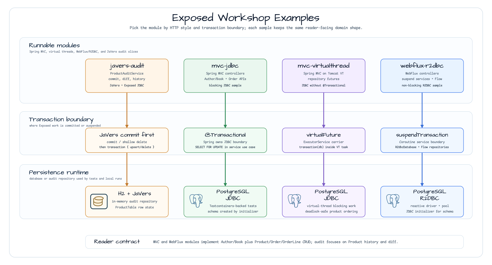

# Exposed Examples

[English](README.md) | 한국어

## 예제 시나리오

이 예제는 **Exposed Examples** 모듈을 실행 가능한 Exposed 데이터 접근 예제로 보여줍니다. 개발자가 먼저 확인할 경로인 모듈 설정, 샘플 또는 테스트 실행, 반복적인 인프라 코드를 줄이는 라이브러리 또는 프레임워크 API 사용 방식을 중심으로 설명합니다.

## 아키텍처 다이어그램



모듈은 샘플 진입점 또는 테스트 픽스처, bluetape4k 확장 계층, 예제가 사용하는 런타임 의존성으로 구성됩니다. README와 코드를 비교할 때는 `io.bluetape4k.workshop.exposed` 패키지 아래의 구현을 기준으로 삼습니다.


## 흐름 다이어그램

1. `Exposed Examples` 예제에 필요한 로컬 런타임을 준비합니다.
2. 예제 시나리오를 담당하는 애플리케이션, 컨트롤러, 서비스 또는 테스트 픽스처를 실행합니다.
3. 반복적인 인프라 처리는 bluetape4k 유틸리티 또는 Spring/Kotlin 통합 기능에 위임합니다.
4. 샘플 출력, HTTP 응답, 저장소 상태, metric, trace 또는 테스트 기대값으로 결과를 검증합니다.


## 시퀀스 다이어그램

핵심 시퀀스는 호출자 또는 테스트 픽스처 -> 워크샵 어댑터 -> bluetape4k 헬퍼/API -> 외부 런타임 또는 인메모리 백엔드 -> 검증/응답 순서입니다. 전용 시퀀스 이미지가 있는 모듈은 아래 이미지가 상호작용 순서를 보여주며, 없는 경우 소스 테스트가 실행 가능한 시퀀스의 기준입니다.


Spring Boot와 [JetBrains Exposed](https://github.com/JetBrains/Exposed) ORM을 사용하는 운영 스타일 예제입니다.

## 하위 모듈

| 모듈 | 스택 | 트랜잭션 전략 |
|--------|-------|-------------|
| [mvc-jdbc](./mvc-jdbc/) | Spring MVC + Exposed JDBC | `@Transactional` (Spring declarative) |
| [mvc-virtualthread](./mvc-virtualthread/) | Spring MVC + Virtual Threads + Exposed JDBC | `virtualFuture(executor){ transaction(db){} }` |
| [webflux-r2dbc](./webflux-r2dbc/) | WebFlux + Coroutines + Exposed R2DBC | `suspendTransaction(db=db){ }` |

## 도메인

세 모듈은 모두 같은 Author/Book/Product/Order 도메인을 전체 CRUD와 함께 구현합니다. 또한 lock ordering과 재고 차감을 보여주는 동시 `placeOrder` use case를 포함합니다.

```
Author ──< Book
Product
Order ──< OrderLine ──> Product
```

## 보여주는 핵심 패턴

- **mvc-jdbc**: Spring declarative `@Transactional`, SELECT FOR UPDATE, rollback verification
- **mvc-virtualthread**: `virtualFuture` VT executor pattern, `ExecutionException` unwrapping, no `@Transactional`
- **webflux-r2dbc**: `Flow<T>` repositories, `suspendTransaction{}`, concurrent order test with coroutines
