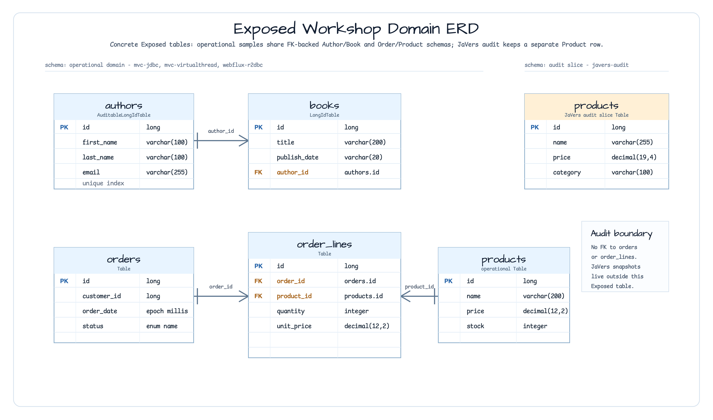

# Exposed Examples

[English](README.md) | 한국어

## 모듈 가이드

**Exposed Examples** 그룹은 이 워크샵에서 사용하는 데이터 접근 방식을
비교합니다. Spring MVC + Exposed JDBC, 같은 JDBC 모델을 Java virtual
thread로 실행하는 방식, WebFlux + Exposed R2DBC, 그리고 JaVers audit
예제를 나란히 두어 먼저 볼 모듈을 고르기 쉽게 합니다.

## 아키텍처


각 모듈은 비슷한 도메인 구조를 유지하므로 트랜잭션 스타일을 비교하기
쉽습니다. JDBC 모듈은 blocking transaction 안에서 row locking과 재고
차감을 보여주고, WebFlux 모듈은 같은 use case를 `suspendTransaction`
안에서 처리합니다. `javers-audit`는 Exposed 테이블 주변의 객체 history와
diff에 집중합니다.

## 모듈

| 모듈 | 스택 | 트랜잭션 경계 | 먼저 볼 내용 |
|---|---|---|---|
| [javers-audit](./javers-audit/) | JaVers + Exposed JDBC + H2 | `javers.commit(...)` 후 `transaction { ... }` | Product audit history, latest snapshot, diff, shallow delete |
| [mvc-jdbc](./mvc-jdbc/) | Spring MVC + Exposed JDBC + PostgreSQL | Spring `@Transactional` | Blocking CRUD, `SELECT FOR UPDATE`, rollback behavior |
| [mvc-virtualthread](./mvc-virtualthread/) | Spring MVC + virtual threads + Exposed JDBC + PostgreSQL | `virtualFuture(executor) { transaction(db) { ... } }` | `@Transactional` 없이 virtual thread에서 blocking Exposed 작업 실행 |
| [webflux-r2dbc](./webflux-r2dbc/) | WebFlux + coroutines + Exposed R2DBC + PostgreSQL | `suspendTransaction(db = db) { ... }` | Suspend service, `Flow` repository, non-blocking order placement |

## 도메인

MVC와 WebFlux 모듈은 Author/Book/Product/Order 도메인에 대한 CRUD
endpoint와 concurrent `placeOrder` use case를 구현합니다. 이 use case는
product-id lock ordering과 stock deduction을 보여줍니다. Audit 모듈은
JaVers snapshot contract를 명확히 보여주기 위해 Product 도메인으로 범위를
좁힙니다.



```
Author ──< Book
Product
Order ──< OrderLine ──> Product
```

## 보여주는 핵심 패턴

- **Audit before persistence**: `javers-audit`는 Product 변경을 기록한 뒤 Exposed row를 upsert/delete합니다.
- **Spring-managed JDBC transactions**: `mvc-jdbc`는 service layer의 `@Transactional`로 unit of work를 관리합니다.
- **Virtual-thread JDBC isolation**: `mvc-virtualthread`는 `virtualFuture` task와 명시적 `transaction(db)` block 안에서 Exposed JDBC 작업을 실행합니다.
- **Coroutine R2DBC transactions**: `webflux-r2dbc`는 suspend service를 `suspendTransaction`으로 감싸고 repository 결과를 `Flow`로 제공합니다.
