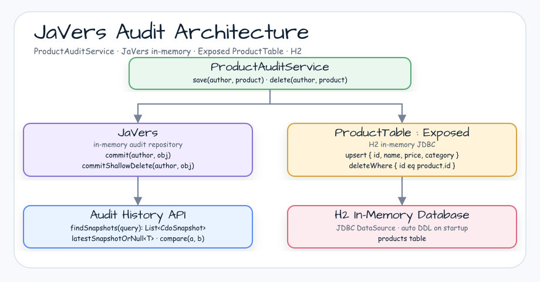
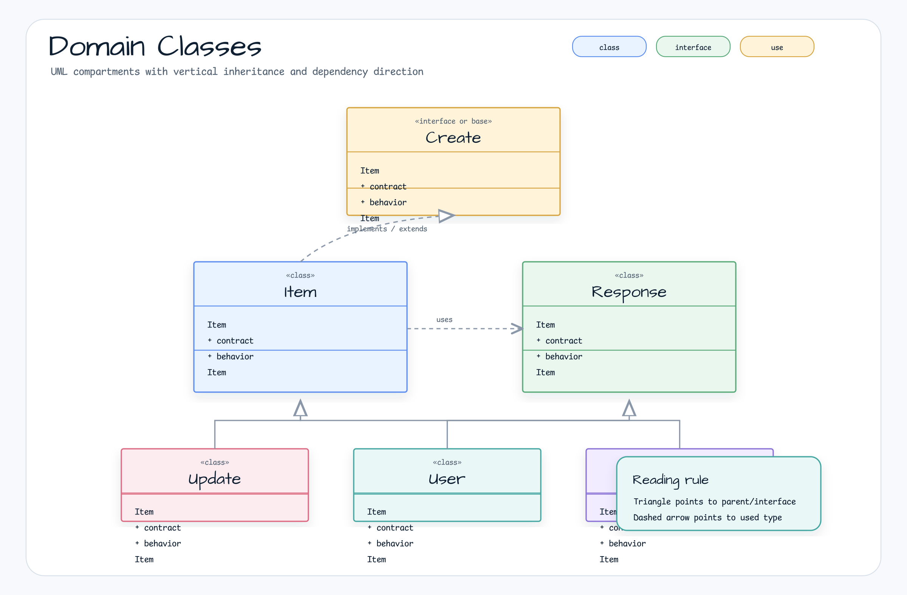
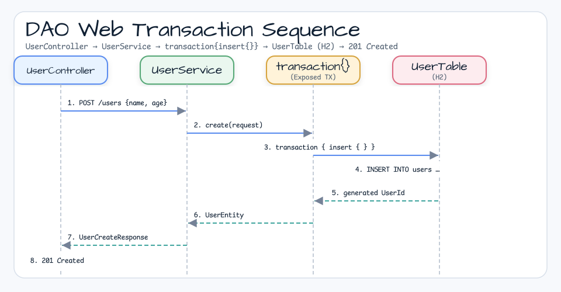

# Exposed Examples

[한국어](README.ko.md) | English

## Example Scenario

This example exercises **Exposed Examples** as a runnable Exposed data access workshop slice. It focuses on the path a developer would inspect first: configure the module, run the sample or tests, and observe the library or framework APIs that remove repetitive infrastructure code.

## Architecture Diagram

The module is organized around the sample entry point or test fixture, the bluetape4k extension layer, and the runtime dependency used by the example. Keep the package under `io.bluetape4k.workshop.exposed` as the source of truth when comparing this README with the code.



## Flow Diagram

1. Prepare the local runtime required by `Exposed Examples`.
2. Execute the application, controller, service, or test fixture that owns the example scenario.
3. Delegate repetitive infrastructure work to bluetape4k utilities or Spring/Kotlin integrations.
4. Assert the visible result through the sample output, HTTP response, repository state, metric, trace, or test expectation.



## Sequence Diagram

The core sequence is: caller or test fixture -> workshop adapter -> bluetape4k helper/API -> external runtime or in-memory backend -> assertion/response. When this module has a dedicated sequence asset, the image below shows that interaction order; otherwise the source tests are the authoritative executable sequence.



Production-style examples using [JetBrains Exposed](https://github.com/JetBrains/Exposed) ORM with Spring Boot.

## Submodules

| Module | Stack | TX Strategy |
|--------|-------|-------------|
| [mvc-jdbc](./mvc-jdbc/) | Spring MVC + Exposed JDBC | `@Transactional` (Spring declarative) |
| [mvc-virtualthread](./mvc-virtualthread/) | Spring MVC + Virtual Threads + Exposed JDBC | `virtualFuture(executor){ transaction(db){} }` |
| [webflux-r2dbc](./webflux-r2dbc/) | WebFlux + Coroutines + Exposed R2DBC | `suspendTransaction(db=db){ }` |

## Domain

All three modules implement the same Author/Book/Product/Order domain with full CRUD and a
concurrent `placeOrder` use case that demonstrates lock ordering and stock deduction.

```
Author ──< Book
Product
Order ──< OrderLine ──> Product
```

## Key Patterns Demonstrated

- **mvc-jdbc**: Spring declarative `@Transactional`, SELECT FOR UPDATE, rollback verification
- **mvc-virtualthread**: `virtualFuture` VT executor pattern, `ExecutionException` unwrapping, no `@Transactional`
- **webflux-r2dbc**: `Flow<T>` repositories, `suspendTransaction{}`, concurrent order test with coroutines
