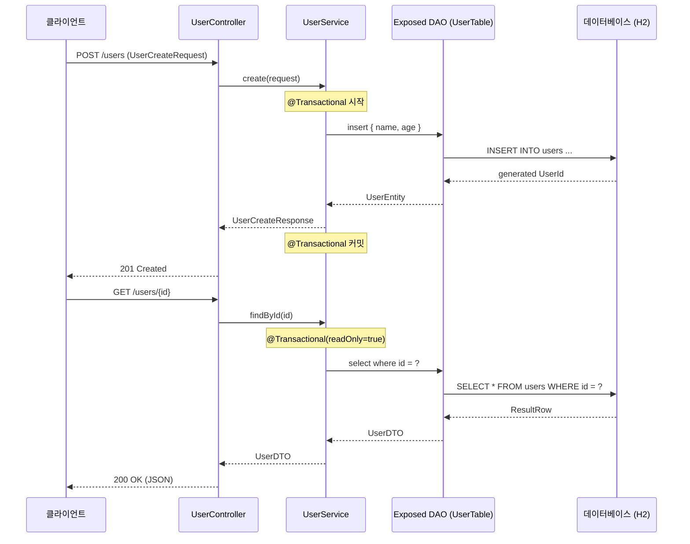
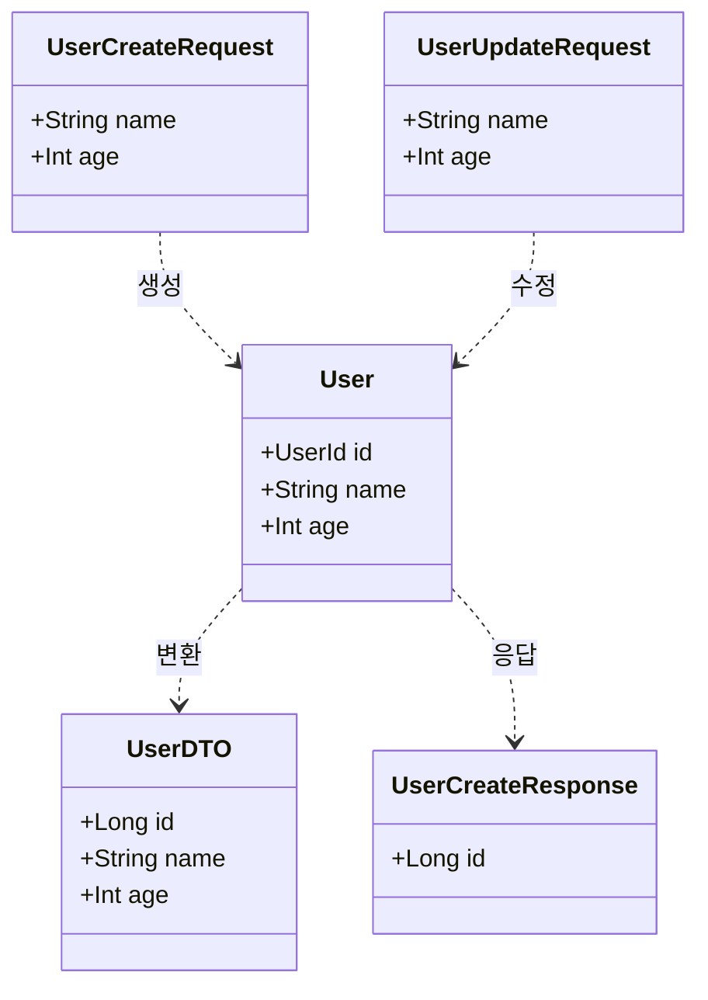

# Exposed Dao Web Transaction Example

This Spring Boot 3 based project uses Exposed for CRUD (Create, Read, Update, Delete) operations.

## 트랜잭션 처리 흐름



## 도메인 모델



- [UserEntity.kt](src/main/kotlin/domain/UserEntity.kt): Describes our database schema. If you need to modify the
  structure, please take care to
  understand the existing design first.
- [UserService.kt](src/main/kotlin/service/UserService.kt): Handles CRUD operations for user domains. This class
  determines transaction boundaries via @Transactional,
  fetches data via Exposed DSL, and handles Domain objects.
- [UserController.kt](src/main/kotlin/controller/UserController.kt): Defines various endpoints that handles CRUD and
  calls UserService to process requests.
- [SchemaInitializer.kt](src/main/kotlin/support/SchemaInitialize.kt): Initialize the Database Schema when application
  is run because the sample project uses h2.
- [SpringApplication.kt](src/main/kotlin/SpringApplication.kt): Define Beans and import Configuration class. Import
  ExposedAutoConfiguration in this file.

## Running

To run the sample, execute the following command in a repository's root directory:

```bash
./gradlew bootRun
```
