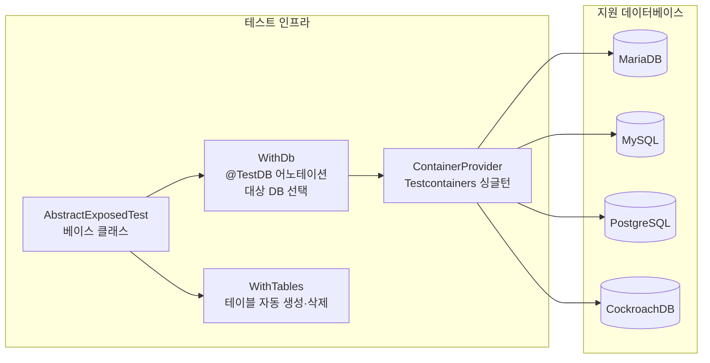
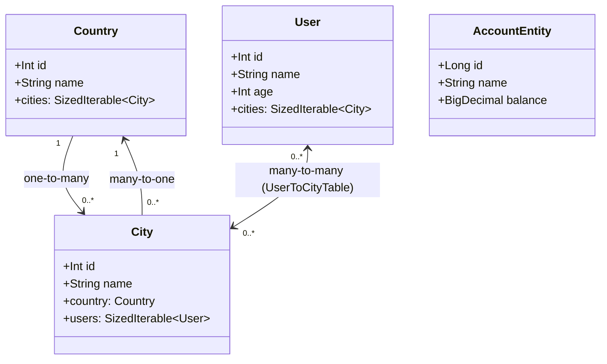

# Exposed Domain

JetBrains [Exposed](https://github.com/JetBrains/Exposed) ORM의 다양한 매핑 패턴과 SQL DSL 기능을 검증하는 테스트 모듈입니다.
실제 DB(MariaDB, MySQL, PostgreSQL, CockroachDB)를 Testcontainers로 구동하여 통합 테스트를 수행합니다.

## 테스트 인프라 구조

## 도메인 모델 (엔티티 관계)

## 테스트 인프라

| 클래스 | 역할 |
|---|---|
| `AbstractExposedTest` | 모든 테스트의 베이스 클래스 |
| `ContainerProvider` | Testcontainers 기반 DB 컨테이너 싱글턴 관리 |
| `WithDb` | `@TestDB` 어노테이션으로 대상 DB 선택 |
| `WithTables` | 테스트 전/후 테이블 생성·삭제 자동 처리 |

## 예제 범주

### 연관관계 매핑 (`mapping/associations/`)
- **One-to-One**: `CoupleTest`, `CavalierHorseTest`, `MapIdOneToOneTest`, `UnidirectionalOneToOneTest`
- **One-to-Many**: `OneToManyMappingTest`, `FamilySchemaTest`, `OrderSchemaTest`, `BatchSchemaTest`
- **Many-to-One**: `ManyToOneTest`
- **Many-to-Many**: `ManyToManyMappingTest`, `BankSchemaTest`
- **Join Table**: `JoinTableTest`

### 상속 전략 (`mapping/inheritance/`)
- `TablePerClassInheritanceTest` — 클래스별 테이블(Table-per-Class) 전략

### 트리 구조 / CTE (`mapping/tree/`)
- `CteTest` — CTE(Common Table Expression)를 이용한 재귀 계층 쿼리
- `TreeNodeTest` — 트리 노드 CRUD

### 커스텀 ID (`mapping/customId/`)
- `CustomIdTest` — UUID, Snowflake 등 애플리케이션 생성 ID
- `EmailColumn`, `SsnColumn` — 커스텀 컬럼 타입 정의 및 암복호화

### 컬럼 타입
- `BlobColumnTypeTest`, `ArrayColumnTypeTest`, `BooleanColumnTypeTest`
- `DateTimeLiteralTest`, `DoubleColumnTypeTest`, `CharColumnTypeTest`
- `ColumnWithTransformTest` — 저장 시 값 변환 컬럼

### SQL DSL / DDL / DML
- `DDLTest`, `DMLTestData`, `ConditionsTest`, `ArithmeticTest`
- `AdjustQueryTest`, `AliasesTest`, `DistinctOnTest`, `SubqueryTest`
- `CountTest`, `DeleteTest`, `CteTest`

### JSON 컬럼
- `AbstractExposedJsonTest` — JSON 컬럼 저장·조회

### 연결 관리
- `ConnectionPoolTest`, `ConnectionTimeoutTest`, `ConnectionExceptionTest`

### 스키마 마이그레이션
- `DatabaseMigrationTest`, `CreateMissingTablesAndColumnsTest`

## 참고

- [Exposed Wiki](https://github.com/JetBrains/Exposed/wiki)
- [Bluetape4k Exposed 모듈](https://github.com/bluetape4k/bluetape4k-projects)
