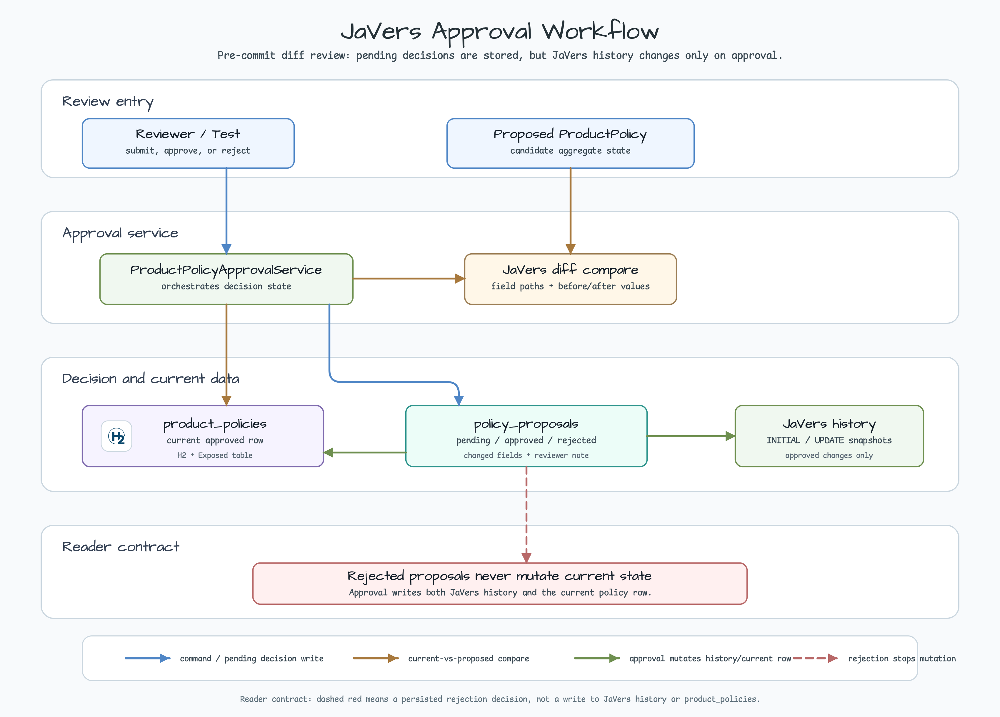
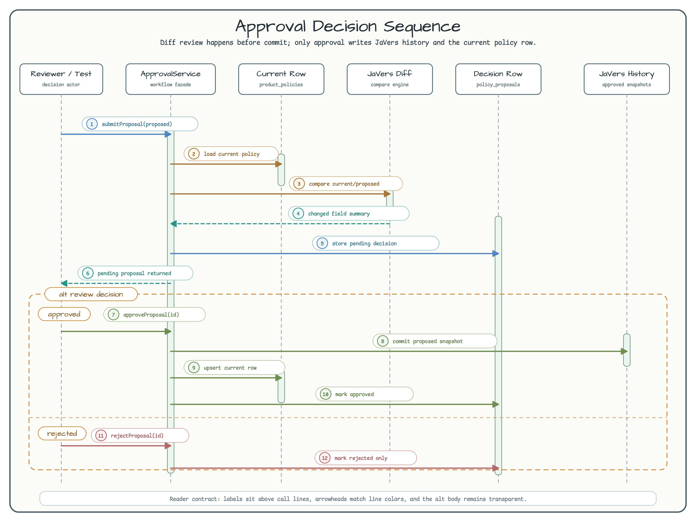

# exposed/javers-approval-workflow

[한국어](README.ko.md) | English

This module shows a pre-commit JaVers review workflow. Instead of committing
every changed aggregate immediately, it compares the current `ProductPolicy`
against a proposed revision, stores a review decision, and commits the proposed
state only after approval.

Use it when a domain change needs a reviewer to see exactly what will change
before the current Exposed row and JaVers audit history are updated.



## Runtime Flow



## What This Module Shows

| Operation | Source-backed behavior |
|---|---|
| `publishInitial(author, policy)` | Commits the first approved `ProductPolicy` snapshot to JaVers and upserts the Exposed current row |
| `submitProposal(requester, proposed)` | Loads the current row, compares current vs proposed with JaVers, and stores a pending proposal with changed-field summaries |
| `approveProposal(reviewer, proposalId, reason)` | Commits the proposed aggregate to JaVers, updates the current row, and marks the proposal approved |
| `rejectProposal(reviewer, proposalId, reason)` | Records the rejection reason without changing the current row or adding a JaVers snapshot |
| `getHistory(policyId, limit = 100)` | Pushes a `1..100` query limit and returns approved JaVers snapshots newest-first |

## Approval Workflow vs Append-Only Audit

| Audit style | When JaVers commits | What rejected changes become |
|---|---|---|
| Append-only audit (`exposed/javers-audit`) | Every save operation commits the aggregate state | Not modeled; the saved state is already audit history |
| Approval workflow (this module) | Only initial publish and approved proposals commit aggregate state | Durable proposal decisions in `PolicyProposalTable`, not JaVers snapshots |
| Redis-backed audit (`exposed/javers-persistence-audit`) | Commits are persisted to Redis-backed JaVers repository | Persistence concern, not approval-gate behavior |

## Bounded History Contract

`getHistory(policyId, limit)` accepts `1..100`; the one-argument JVM overload
uses 100. It applies `QueryBuilder.limit` before JaVers returns snapshots and
does not sort or truncate the materialized list. Approved snapshots are
newest-first, matching the 2.0.0 consumer contract. This is a behavioral
migration from the former oldest-first example.

Rejected proposals still add no snapshot. An empty history can mean either an
unknown policy or one without an approved commit, so it is not an existence
check. `CdoSnapshot` contains policy fields; callers that expose history through
an HTTP/API boundary must add authorization and redaction.

## Domain Schema

`ProductPolicyTable` stores the current approved aggregate state. `PolicyProposalTable`
stores review decisions, proposed fields, and reader-facing diff summaries. The
JaVers repository remains in-memory because this example teaches approval order,
not external audit persistence.

| Table | Responsibility |
|---|---|
| `product_policies` | Current approved `ProductPolicy` row |
| `policy_proposals` | Pending/approved/rejected review decisions and proposed state |
| JaVers in-memory repository | Approved aggregate snapshots queried by `getHistory(policyId)` |

## Usage

```kotlin
val javers = JaversBuilder.javers().build()
val service = ProductPolicyApprovalService(javers)

val current = ProductPolicy(
    id = 100L,
    title = "Standard Support Policy",
    status = PolicyStatus.ACTIVE,
    pricing = PricingPolicy("USD", BigDecimal("99.00"), BigDecimal("500.00")),
    owner = "platform-team",
)

service.publishInitial("alice", current)

val proposed = current.copy(
    title = "Enterprise Support Policy",
    pricing = current.pricing.copy(amount = BigDecimal("129.00")),
)

val proposal = service.submitProposal("bob", proposed)
proposal.changedFields.map { it.path } // ["pricing.amount", "title"]

service.approveProposal("carol", proposal.id, "Pricing reviewed")
val approvedHistory = service.getHistory(100L, limit = 10)
```

## Tests

```bash
./gradlew :exposed-javers-approval-workflow:test
```

The test suite covers scalar and nested value-object diffs, bounded newest-first
history, JVM overloads, invalid limits, approval updating the current row and
JaVers history, and rejection leaving both unchanged.
