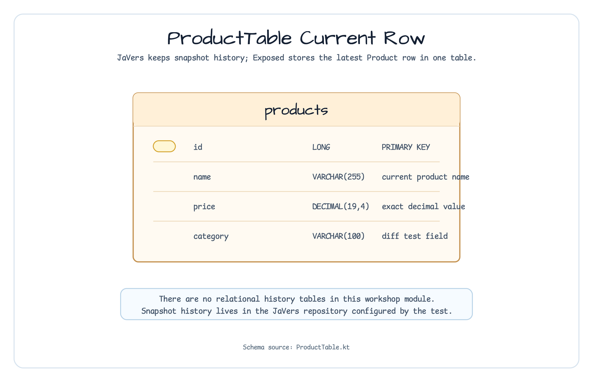

# exposed/javers-audit

[English](README.md) | 한국어

이 모듈은 Exposed 모델에 audit boundary를 붙이는 가장 작은 형태를 보여줍니다.
같은 immutable `Product` 값을 JaVers에는 history와 diff 조회용으로 commit하고,
Exposed JDBC에는 `ProductTable`의 현재 row만 저장합니다.

웹 컨트롤러, 이벤트 발행, 외부 JaVers repository를 붙이기 전에 write 순서와
저장소 책임 분리를 먼저 확인할 때 적합합니다.


## 런타임 흐름


## 이 모듈에서 확인할 내용

| Operation | 소스 기준 동작 |
|---|---|
| `save(author, product)` | author를 검증하고, product를 JaVers에 commit한 뒤 Exposed JDBC로 최신 row를 upsert |
| `delete(author, product)` | `commitShallowDelete`로 JaVers terminal snapshot을 남긴 뒤 Exposed row 삭제 |
| `getHistory(productId)` | instance id로 JaVers snapshot을 조회하고 오래된 순서로 반환 |
| `getLatestSnapshot(productId)` | bluetape4k `latestSnapshotOrNull<Product>()`로 현재 audit state 조회 |
| `diff(old, new)` | JaVers나 DB에 쓰지 않고 두 immutable value를 비교 |

## Product Schema

`ProductTable`은 저장소 경계를 쉽게 확인할 수 있도록 작게 유지합니다.
이 모듈에서 JaVers history는 관계형 테이블로 모델링하지 않습니다.



| Column | Type | Notes |
|---|---|---|
| `id` | `long` | Primary key이자 JaVers entity id |
| `name` | `varchar(255)` | 현재 product name |
| `price` | `decimal(19,4)` | Floating-point rounding 없는 decimal storage |
| `category` | `varchar(100)` | Diff 테스트에서 사용하는 분류 값 |

## 사용 예

```kotlin
val javers = JaversBuilder.javers().build()
val service = ProductAuditService(javers)

val product = Product(1L, "Widget", BigDecimal("9.99"), "Tools")
service.save("alice", product)

val updated = Product(product.id, product.name, BigDecimal("12.99"), product.category)
service.save("alice", updated)

val history = service.getHistory(1L)
val diff = service.diff(product, updated)
val latest = service.getLatestSnapshot(1L)

service.delete("alice", updated)
```

## 테스트

```bash
./gradlew :exposed-javers-audit:test
```

테스트는 initial/update/terminal snapshot, latest snapshot 조회, price/category
diff, 변경 없는 값의 no-diff case를 검증합니다.
