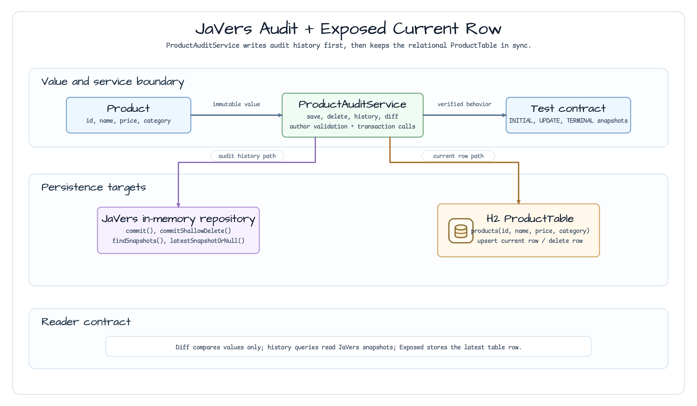
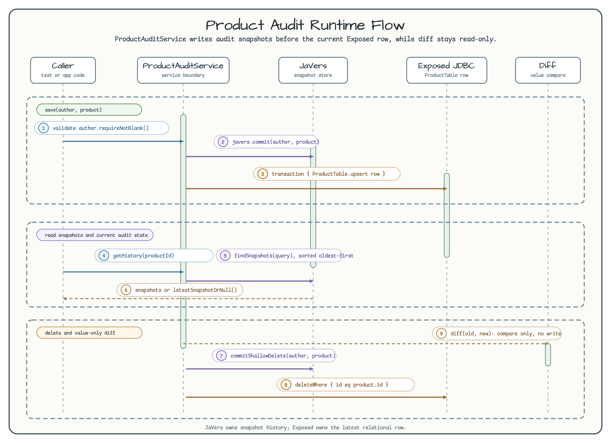

# exposed/javers-audit

[English](README.md) | 한국어

이 모듈은 작은 audit boundary를 보여줍니다. 같은 immutable `Product` 값을
JaVers에는 이력과 diff 조회용으로 commit하고, Exposed에는 현재 row를
`ProductTable`에 저장합니다.



## 런타임 흐름



## 이 모듈에서 확인할 내용

| Operation | 소스 기준 동작 |
|---|---|
| `save(author, product)` | author를 검증하고, product를 JaVers에 commit한 뒤 Exposed JDBC로 현재 row를 upsert |
| `delete(author, product)` | `commitShallowDelete`로 JaVers terminal snapshot을 남긴 뒤 Exposed row 삭제 |
| `getHistory(productId)` | instance id로 JaVers snapshot을 조회하고 오래된 순서로 반환 |
| `getLatestSnapshot(productId)` | bluetape4k `latestSnapshotOrNull<Product>()`로 현재 audit state 조회 |
| `diff(old, new)` | JaVers나 DB에 쓰지 않고 두 value를 비교 |

## Product Schema

`ProductTable`은 audit 동작을 쉽게 확인할 수 있도록 작게 유지합니다.

| Column | Type | Notes |
|---|---|---|
| `id` | `long` | Primary key이자 JaVers entity id |
| `name` | `varchar(255)` | 현재 product name |
| `price` | `decimal(19,4)` | Floating-point rounding 없는 decimal storage |
| `category` | `varchar(100)` | Diff 테스트에서 사용하는 분류 값 |

## 사용 예

```kotlin
val javers = JaversBuilder.javers().build()
val service = ProductAuditService(javers)

val product = Product(1L, "Widget", BigDecimal("9.99"), "Tools")
service.save("alice", product)

val updated = product.copy(price = BigDecimal("12.99"))
service.save("alice", updated)

val history = service.getHistory(1L)
val diff = service.diff(product, updated)
val latest = service.getLatestSnapshot(1L)

service.delete("alice", updated)
```

## 테스트

```bash
./gradlew :exposed-javers-audit:test
```

테스트는 initial/update/terminal snapshot, latest snapshot 조회, price/category
diff, 변경 없는 값의 no-diff case를 검증합니다.
