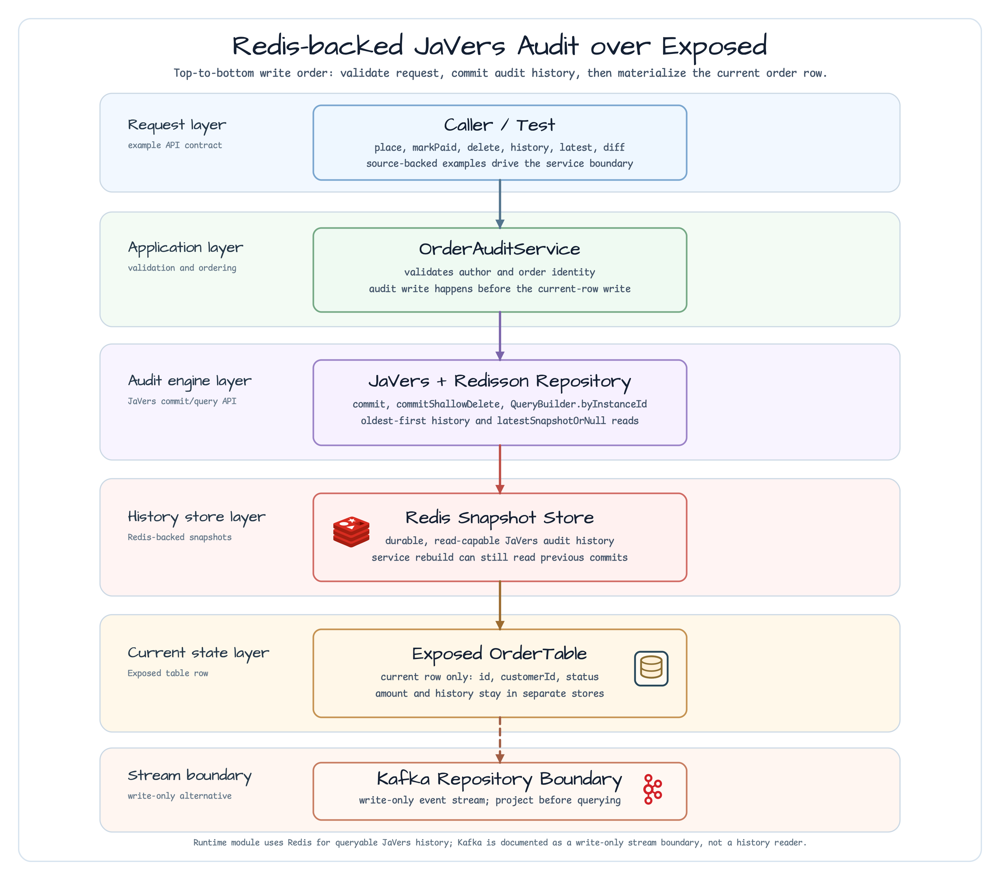
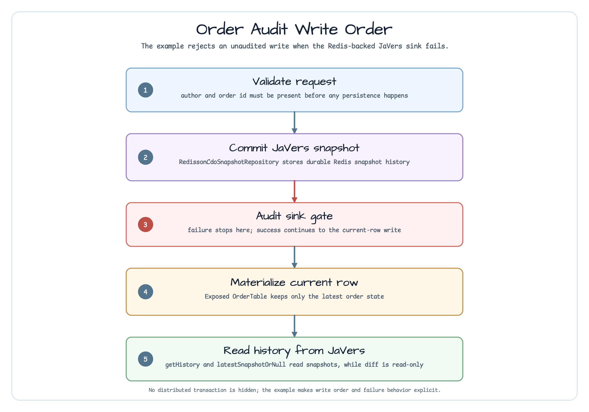

# exposed/javers-persistence-audit

[한국어](README.ko.md) | English

This module extends the small `exposed/javers-audit` boundary with a durable
JaVers repository. Exposed JDBC still owns only the current `OrderTable` row,
while Redis stores queryable JaVers snapshots through `RedissonCdoSnapshotRepository`.
An exact-instance adapter limits the Redis range and snapshot decoding before
the result reaches the service.

Use it when learners need to see what changes after moving from in-memory
JaVers history to an external audit store, without adding web controllers or a
distributed transaction.



## Runtime Flow



## What This Module Shows

| Operation | Source-backed behavior |
|---|---|
| `place(author, order)` | Validates the author, commits the initial JaVers snapshot to Redis, then upserts the current Exposed row |
| `markPaid(author, orderId)` | Reads the current row, commits an updated JaVers snapshot, then materializes the paid row |
| `delete(author, orderId)` | Records a terminal JaVers snapshot with `commitShallowDelete`, then deletes the current row |
| `getHistory(orderId, limit = 100)` | Pushes a `1..100` limit into the instance query and returns bounded snapshots newest-first |
| `getLatestSnapshot(orderId)` | Uses bluetape4k `latestSnapshotOrNull<Order>()` to read the latest snapshot |
| `diff(old, new)` | Compares two immutable orders without writing to JaVers or Exposed |

## Persistence Choices

| Backend | Best fit | Read behavior |
|---|---|---|
| In-memory JaVers | First audit-boundary lesson in `exposed/javers-audit` | History is lost when the service is rebuilt |
| Redis / Redisson | This module's durable audit history path | Exact-instance history reads only the requested tail range and decodes it newest-first |
| Kafka JaVers repository | Event-stream fan-out and downstream projections | Write-only stream; project events into Redis, Exposed, or another read model before querying history |

The module intentionally implements the Redis path because it can both persist
and read JaVers snapshots. Kafka is documented as a write-only audit stream
boundary so learners do not assume it can answer `getHistory()` by itself.

## Bounded History Contract

`getHistory(orderId, limit)` accepts `1..100`; the one-argument JVM overload
uses 100. The service passes the limit to `QueryBuilder.limit` and does not sort
or truncate an already materialized result. Results follow the JaVers 2.0.0
consumer contract: newest-first. This intentionally changes the former
oldest-first workshop behavior, so callers that used `first()` as the initial
snapshot must migrate to `last()` or request an explicit presentation order.

For the filter-free exact-instance query, `BoundedRedissonCdoSnapshotRepository`
reads `range(-limit, -1)` from the existing snapshot list and decodes only that
range. Queries with skip, aggregate, author/date/version, commit, property, or
snapshot-type filters fall back to the upstream repository to preserve their
semantics.

An empty result can mean either an unknown order or an order with no audit
commit; determine existence from the materialized store. `CdoSnapshot` contains
domain fields, so an HTTP/API caller must enforce authorization and redaction
before exposing it.

## Order Schema

`OrderTable` stores the materialized current row. JaVers history is not modeled
as relational tables in this module.

| Column | Type | Notes |
|---|---|---|
| `id` | `varchar(64)` | Primary key and JaVers entity id |
| `customer_id` | `varchar(64)` | Customer reference used by the example aggregate |
| `status` | `varchar(16)` | `PLACED` or `PAID` lifecycle state |
| `total_amount` | `decimal(19,4)` | Decimal storage, no floating-point rounding |

## Usage

```kotlin
val service = RedisOrderAuditFactory.create("workshop-orders", redisson)

val order = Order(
    id = "order-100",
    customerId = "customer-100",
    status = OrderStatus.PLACED,
    totalAmount = BigDecimal("19.99"),
)

service.place("alice", order)
val paid = service.markPaid("alice", order.id)

val history = service.getHistory(order.id, limit = 2)
val latest = service.getLatestSnapshot(order.id)
val diff = service.diff(order, paid)

service.delete("alice", order.id)
```

## Failure Boundary

The service commits the JaVers snapshot before writing the current Exposed row.
If the Redis-backed audit sink fails, the exception is propagated and the
example does not accept an unaudited current-row write. This is a clear workshop
contract, not a replacement for a cross-store distributed transaction.

## Tests

```bash
./gradlew :exposed-javers-persistence-audit:test
```

The test suite covers Redis-backed history survival after service rebuild,
bounded decode counts, newest-first ordering, fallback query semantics, JVM
overloads, terminal delete snapshots, and audit sink failure propagation.
