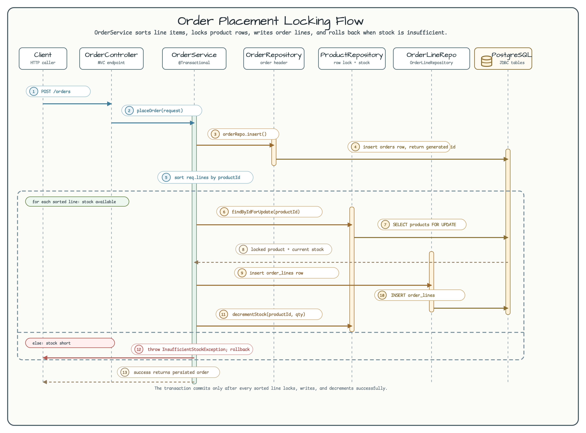
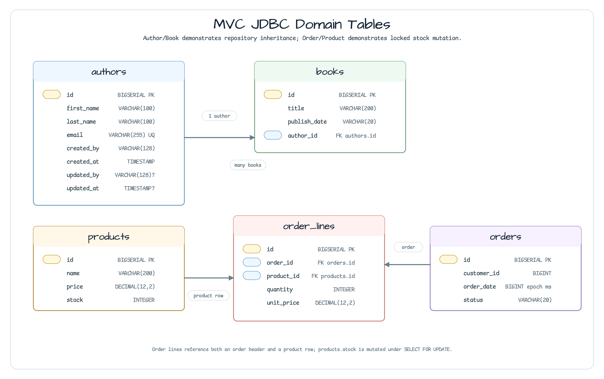

# exposed/mvc-jdbc

[English](README.md) | 한국어

`exposed/mvc-jdbc`는 Spring MVC 위에서 JetBrains Exposed JDBC를 blocking 방식으로
사용하는 예제입니다. 단순 Author/Book CRUD에는 bluetape4k repository 상속을 쓰고,
재고 락과 롤백이 중요한 주문 처리에는 명시적인 Exposed SQL을 사용합니다.

## 아키텍처


이 모듈의 HTTP 계층은 얇게 유지됩니다. Controller는 Spring service에 위임하고,
service가 transaction boundary를 정의하며, repository가 Exposed table 접근을
담당합니다. 샘플 설정과 Testcontainers 기반 테스트 모두 PostgreSQL을 런타임
데이터베이스로 사용합니다.

| 영역 | 구현 | 독자가 확인할 계약 |
|---|---|---|
| Author/Book CRUD | `AuthorRepository`, `BookRepository` | `LongAuditableJdbcRepository`와 `LongJdbcRepository`가 CRUD, paging, count, exists, delete, batch helper를 상속으로 제공합니다. |
| Book cursor pagination | `BookRepository.findCursorPage`, `GET /api/v1/books/cursor` | Exposed 2.0.0 primary-key keyset pagination이 `pageSize + 1` 행을 읽고 `nextCursor`/`hasNext`를 반환하며 token 인코딩·서명·범위는 호출자 책임으로 남깁니다. 기존 offset `findPage` ABI도 유지합니다. |
| Author audit column | `AuthorTable : AuditableLongIdTable` | `id`, primary key, audit column을 예제에서 반복 선언하지 않고 bluetape4k table base가 제공합니다. |
| Author별 Book 조회 | `BookRepository.findByAuthorId` | 직접 `selectAll()`을 쓰지 않고 `findBy({ BookTable.authorId eq EntityID(...) })`를 사용합니다. |
| 주문 생성 | `OrderService.placeOrder` | 주문 header를 만들고, line을 `productId`로 정렬한 뒤, product row를 잠그고, order line 삽입과 stock 감소를 한 transaction에서 처리합니다. |
| 재고 부족 | `InsufficientStockException` | 재고가 부족하면 transaction이 중단되어 부분 order line과 stock 변경이 rollback됩니다. |

## 주문 처리 시퀀스



`placeOrder()`는 row lock을 잡기 전에 요청 line을 `productId` 기준으로 정렬합니다.
각 상품은 `ProductRepository.findByIdForUpdate()`로 읽으며, 이 경로가 Exposed의
`forUpdate()` query를 실행합니다. Service는 locked row의 재고가 충분할 때만 order
line을 쓰고 stock을 감소시킵니다.

## 스키마



| Table | 주요 column | 역할 |
|---|---|---|
| `authors` | `id`, `first_name`, `last_name`, `email`, audit columns | `AuditableLongIdTable` 기반 audited CRUD 예제입니다. |
| `books` | `id`, `title`, `publish_date`, `author_id` | `authors`로 typed FK를 갖는 non-audited CRUD 예제입니다. |
| `products` | `id`, `name`, `price`, `stock` | 주문 처리 중 row lock을 잡는 상품 재고 테이블입니다. |
| `orders` | `id`, `customer_id`, `order_date`, `status` | 정렬된 order line을 처리하기 전에 생성하는 주문 header입니다. |
| `order_lines` | `id`, `order_id`, `product_id`, `quantity`, `unit_price` | locked product row의 재고가 충분할 때만 삽입되는 주문 line입니다. |

## 주요 코드 경로

| 파일 | 확인할 내용 |
|---|---|
| `author/schema/AuthorTable.kt` | bluetape4k audited table inheritance. |
| `author/repository/AuthorRepository.kt` | 상속된 CRUD 위에 최소 구현만 둔 repository. |
| `author/repository/BookRepository.kt` | typed author 조회를 위한 `findBy` predicate 사용. |
| `author/repository/BookRepository.kt` | Exposed 2.0.0 keyset extension으로 위임하는 `findCursorPage`. |
| `author/controller/BookController.kt` | cursor endpoint의 `pageSize`, `cursor`, 모든 `SortOrder` 방향 parameter. |
| `order/service/OrderService.kt` | `@Transactional`, lock ordering, stock check, rollback trigger, cancel-row check. |
| `order/repository/ProductRepository.kt` | `forUpdate()`와 stock 감소 update expression. |
| `config/DatabaseInitializer.kt` | 실행 가능한 예제를 위한 schema 생성과 seed data. |

## 실행

```bash
docker run -p 5432:5432 -e POSTGRES_PASSWORD=postgres postgres:15

./gradlew :exposed-mvc-jdbc:bootRun
# http://localhost:8080/swagger-ui/index.html
```

## 테스트

```bash
./gradlew :exposed-mvc-jdbc:test
```

테스트는 `PostgreSQLServer.Launcher`로 PostgreSQL을 시작하고 Author, Book, sparse ID
mutation boundary를 포함한 cursor pagination, Product, Order, rollback, concurrent
stock-conflict 시나리오를 검증합니다. Cursor endpoint는 workshop 전용으로 raw
primary-key cursor를 노출하므로, 운영 호출자는 같은 sort/filter/tenant 계약에 맞춰
인코딩·서명·만료·범위 검증을 추가해야 합니다.

## Cursor Pagination

```text
GET /api/v1/books/cursor?pageSize=2&cursor=3&sortOrder=ASC
```

`BookRepository.findCursorPage`는 Exposed 2.0.0의 primary-key keyset predicate와
`pageSize + 1` sentinel 행을 사용합니다. count query 없이 bounded select 한 번을
실행하므로 cursor 앞의 insert/delete가 offset drift를 만들지 않습니다. `hasNext`가
`false`이면 `nextCursor`는 `null`이고, 다음 요청에서도 같은 sort와 predicate를
재사용해야 합니다. `SortOrder.ASC`, `DESC`와 null placement 네 가지 변형을 지원하며,
잘못된 page size는 upstream `1..10000` guard에서 거부합니다.
