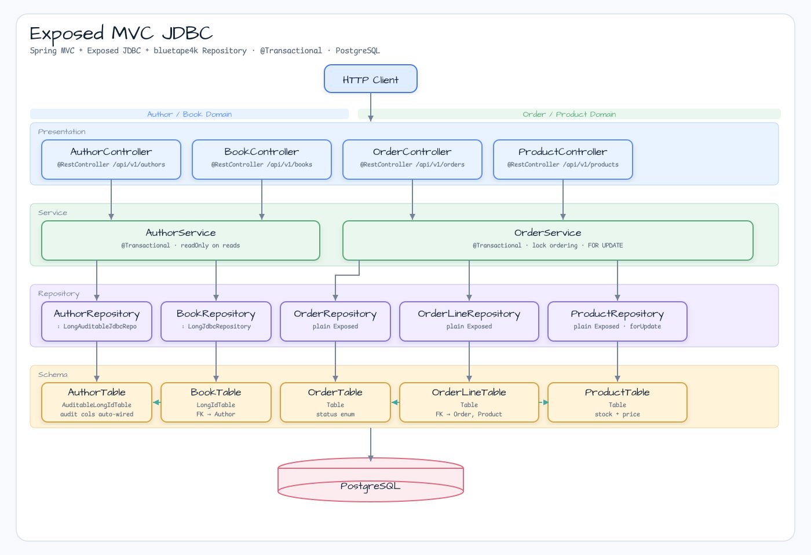
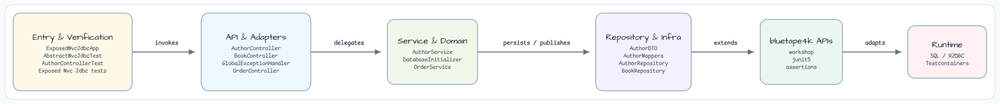

# exposed-mvc-jdbc

[English](README.md) | 한국어

## 예제 시나리오

이 예제는 **exposed-mvc-jdbc**를 실행 가능한 Exposed 데이터 접근 워크숍 조각으로 다룹니다. 개발자가 가장 먼저 확인하는 경로인 모듈 설정, 샘플 또는 테스트 실행, 반복적인 인프라 코드를 줄여 주는 라이브러리와 프레임워크 API 관찰에 초점을 둡니다.

## 흐름 다이어그램

1. `exposed-mvc-jdbc`에 필요한 로컬 런타임을 준비합니다.
2. 예제 시나리오를 담당하는 애플리케이션, 컨트롤러, 서비스 또는 테스트 픽스처를 실행합니다.
3. 반복적인 인프라 작업을 bluetape4k 유틸리티 또는 Spring/Kotlin 통합 기능에 위임합니다.
4. 샘플 출력, HTTP 응답, 저장소 상태, 메트릭, 트레이스 또는 테스트 기대값으로 보이는 결과를 검증합니다.

## 시퀀스 다이어그램

핵심 시퀀스는 호출자 또는 테스트 픽스처 -> 워크숍 어댑터 -> bluetape4k 헬퍼/API -> 외부 런타임 또는 인메모리 백엔드 -> 검증/응답 순서입니다. 전용 시퀀스 이미지가 있는 모듈은 아래 이미지가 상호작용 순서를 보여 주며, 없는 경우 소스 테스트가 실행 가능한 시퀀스의 기준입니다.

Spring MVC + JetBrains Exposed JDBC 예제입니다. **bluetape4k-exposed**의 table base class와 repository interface를 사용해 type-safe하고 boilerplate 없는 데이터 접근을 구성합니다.

## 아키텍처





## 도메인 모델

```
AuthorTable (AuditableLongIdTable)        BookTable (LongIdTable)
┌──────────────────────────────┐          ┌──────────────────────────────┐
│ id          BIGSERIAL PK     │◄─────────│ id          BIGSERIAL PK     │
│ first_name  VARCHAR(100)     │          │ title       VARCHAR(200)      │
│ last_name   VARCHAR(100)     │          │ publish_date VARCHAR(20)      │
│ email       VARCHAR(255) UQ  │          │ author_id   FK → authors.id  │
│ created_by  VARCHAR(128)     │          └──────────────────────────────┘
│ created_at  TIMESTAMP        │
│ updated_by  VARCHAR(128)?    │
│ updated_at  TIMESTAMP?       │
└──────────────────────────────┘
```

## 사용한 bluetape4k 기능

| 기능 | 모듈 / Artifact | 코드 참조 | 이점 |
|---------|-------------------|----------------|---------|
| `AuditableLongIdTable` | `bluetape4k-exposed-core` | `AuthorTable.kt` | Audit column(`createdAt`, `createdBy`, `updatedAt`, `updatedBy`) 자동 연결 |
| `LongAuditableJdbcRepository` | `bluetape4k-exposed-jdbc` | `AuthorRepository.kt` | `findAll()`, `findById()`, `findPage()`, `count()`, `existsById()`, `deleteById()`, `batchInsert()`, `auditedUpdateById()` 모두 상속 |
| `LongJdbcRepository` | `bluetape4k-exposed-jdbc` | `BookRepository.kt` | Non-audited table에도 동일한 CRUD 상속 제공 |
| `findBy(vararg filters)` | `bluetape4k-exposed-jdbc` | `BookRepository.findByAuthorId` | Type-safe predicate query — 직접 `selectAll().where {}` 작성 불필요 |
| `KLogging` | `bluetape4k-logging` | 모든 서비스/config 클래스 | 지연 lambda logging |
| `PostgreSQLServer.Launcher` | `bluetape4k-testcontainers` | `AbstractMvcJdbcTest` | Singleton TC container |

## 적용 전 / 적용 후

### Table definition

```kotlin
// ❌ Before — manual id + primaryKey + no audit
object AuthorTable : Table("authors") {
    val id = long("id").autoIncrement()
    override val primaryKey = PrimaryKey(id)
}

// ✅ After — bluetape4k AuditableLongIdTable
object AuthorTable : AuditableLongIdTable("authors") {
    // id, primaryKey, createdAt, createdBy, updatedAt, updatedBy are inherited
}
```

### Repository

```kotlin
// ❌ Before — 35 lines of boilerplate CRUD
class AuthorRepository {
    fun findAll() = AuthorTable.selectAll().map { it.toAuthorDTO() }
    fun findById(id: Long) = AuthorTable.selectAll().where { AuthorTable.id eq id }.singleOrNull()?.toAuthorDTO()
    fun deleteById(id: Long) { AuthorTable.deleteWhere { AuthorTable.id eq id } }
    // no findPage(), no batchInsert()
}

// ✅ After — declare intent only
class AuthorRepository : LongAuditableJdbcRepository<AuthorDTO, AuthorTable> {
    override val table = AuthorTable
    override fun extractId(entity: AuthorDTO) = entity.id
    override fun ResultRow.toEntity() = toAuthorDTO()
    // All CRUD + pagination + batch + audited-update inherited
}
```

## 핵심 패턴

- **Declarative TX**: 조회 메서드에는 `@Transactional(readOnly = true)`, 변경 메서드에는 `@Transactional`을 둡니다.
- **SELECT FOR UPDATE**: TOCTOU 방지를 위해 `ProductTable.selectAll().where{...}.forUpdate()`를 사용합니다.
- **Stock check**: `require()`가 아니라 `if (stock < quantity) throw InsufficientStockException(productId)`를 사용합니다.
- **cancelOrder rows check**: `val rows = update{...}; if (rows == 0) throw NoSuchElementException(...)`.
- **Lock ordering**: deadlock 방지를 위해 순회 전에 `req.lines.sortedBy { it.productId }`로 정렬합니다.

## 실행

```bash
# Requires PostgreSQL — use Docker:
docker run -p 5432:5432 -e POSTGRES_PASSWORD=postgres postgres:15

./gradlew :exposed-mvc-jdbc:bootRun
# http://localhost:8080/swagger-ui/index.html
```

## 테스트

```bash
./gradlew :exposed-mvc-jdbc:test
# Testcontainers PostgreSQL launched automatically
```

| 테스트 클래스 | 범위 |
|-----------|---------|
| `AuthorControllerTest` | Author + Book CRUD |
| `ProductControllerTest` | Product CRUD |
| `OrderControllerTest` | Order place, cancel, 404 cases |
| `PlaceOrderRollbackTest` | 3-table rollback on stock failure |
| `ConcurrentPlaceOrderTest` | N=10 threads, stock=1 → exactly 1 success, 9 conflicts |
