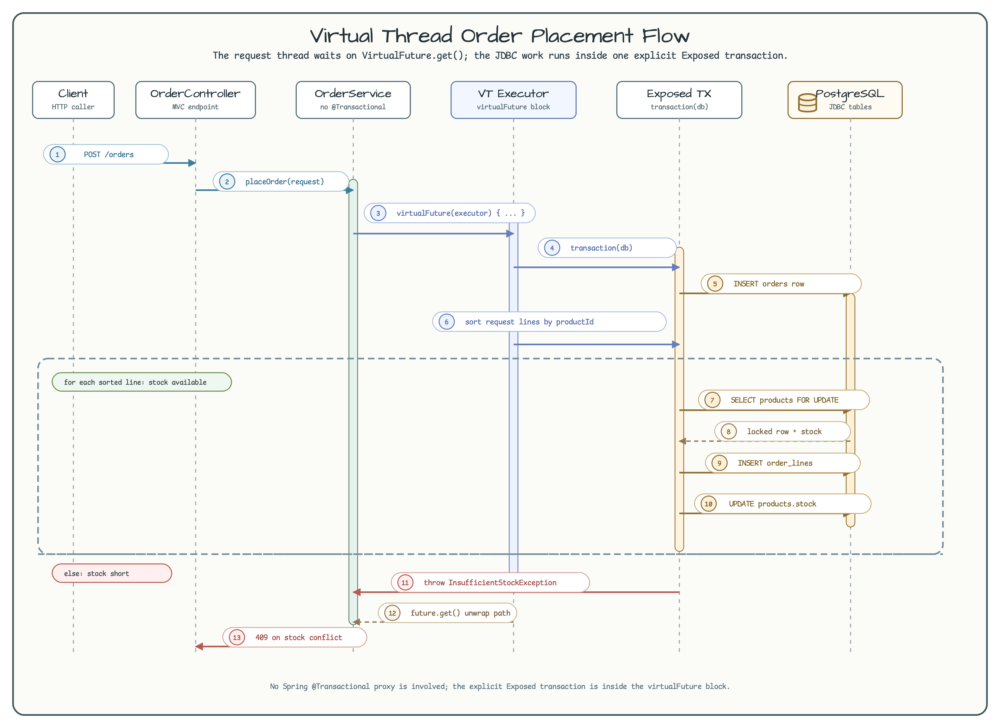
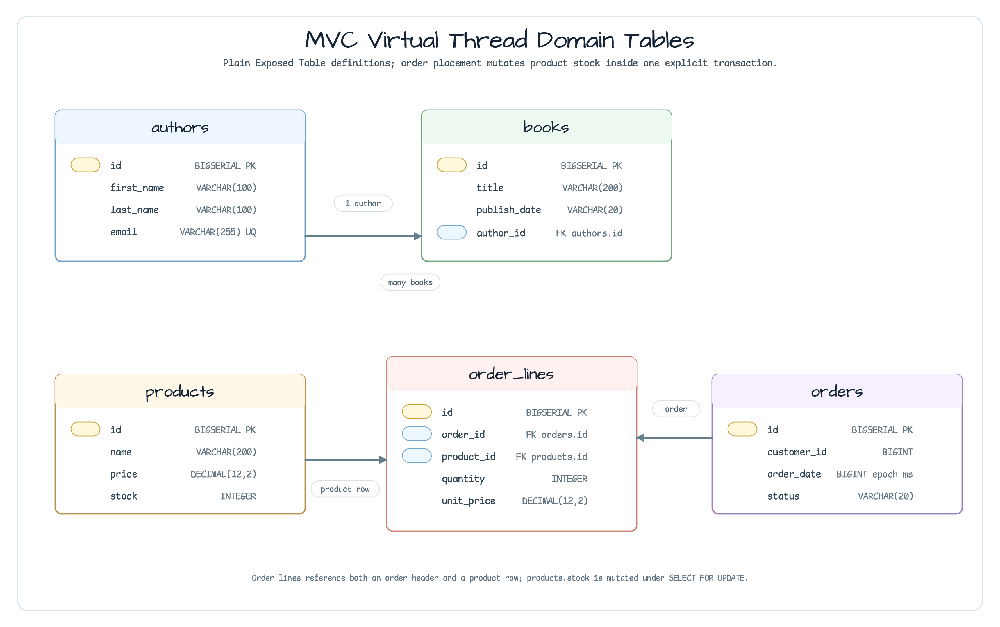

# exposed/mvc-virtualthread

[한국어](README.ko.md) | English

`exposed/mvc-virtualthread` is a Spring MVC + Exposed JDBC example that runs blocking database work on Java virtual threads.

The important constraint is that this module does not use Spring `@Transactional`. Tomcat, services, and repositories share an `ExecutorService` created with `Executors.newVirtualThreadPerTaskExecutor()`, and database work is wrapped explicitly with `virtualFuture(executor) { transaction(db) { ... } }`.

## Architecture


| Area | Implementation | Reader contract |
|---|---|---|
| MVC request execution | `TomcatConfig` assigns the shared executor to Tomcat's protocol handler. | Blocking MVC handlers can run without tying each request to a platform thread. |
| Executor lifecycle | `virtualThreadExecutor()` creates a per-task virtual-thread executor and registers it with `ShutdownQueue`. | The module owns one shared VT executor and shuts it down consistently. |
| Repository calls | `AuthorRepository`, `BookRepository`, `ProductRepository`, `OrderRepository`, and `OrderLineRepository` return `VirtualFuture<T>`. | Simple CRUD methods open their own `transaction(db)` inside a virtual-thread task. |
| Order placement | `OrderService.placeOrder()` owns the full order transaction. | Stock locking, order-line writes, and stock decrement happen in one explicit transaction. |
| Error handling | `GlobalExceptionHandler` unwraps `ExecutionException` and `CompletionException`. | Exceptions thrown inside `Future.get()` still become meaningful HTTP responses. |

## Order Placement Flow



`OrderService.placeOrder()` submits one `virtualFuture` task and opens one Exposed transaction inside it. The service sorts request lines by `productId`, locks each product row with `SELECT ... FOR UPDATE`, writes order lines, and decrements `products.stock`.

If stock is not available, the service throws `InsufficientStockException` from inside the transaction. `Future.get()` wraps that failure, and `GlobalExceptionHandler` unwraps it so the MVC layer returns a stock-conflict response instead of leaking a generic execution error.

## Schema



| Table | Purpose |
|---|---|
| `authors`, `books` | Author/book CRUD uses plain Exposed `Table` definitions and repository-level transactions. |
| `products` | Product stock is the concurrency-sensitive value guarded by row locks. |
| `orders`, `order_lines` | Order placement writes the header and line rows in the same transaction that decrements stock. |

## Key Code Paths

| File | What to inspect |
|---|---|
| `config/TomcatConfig.kt` | Shared virtual-thread executor and Tomcat protocol-handler customization. |
| `config/DatabaseInitializer.kt` | Schema creation and seed data executed through the VT executor. |
| `repository/*Repository.kt` | `VirtualFuture<T>` repository methods with explicit `transaction(db)` blocks. |
| `service/OrderService.kt` | Stock locking, rollback behavior, and `Future.get()` boundary. |
| `config/GlobalExceptionHandler.kt` | Unwrapping of virtual-future failures for MVC responses. |
| `domain/*Table.kt` | Plain Exposed table definitions used by the ERD. |

## Running

The application expects PostgreSQL at `jdbc:postgresql://localhost:5432/exposedmvcvt` with `postgres/postgres`.

```bash
./gradlew :exposed-mvc-virtualthread:bootRun
# http://localhost:8081/swagger-ui/index.html
```

## Tests

```bash
./gradlew :exposed-mvc-virtualthread:test
```

| Test class | Coverage |
|---|---|
| `AuthorControllerTest` | Author and book CRUD endpoints. |
| `ProductControllerTest` | Product CRUD endpoints. |
| `OrderControllerTest` | Order placement, cancellation, 404, and stock-conflict cases. |
| `PlaceOrderRollbackTest` | Rollback when stock is insufficient. |
| `ConcurrentPlaceOrderTest` | Concurrent virtual-thread requests where only one request can consume the last stock item. |
