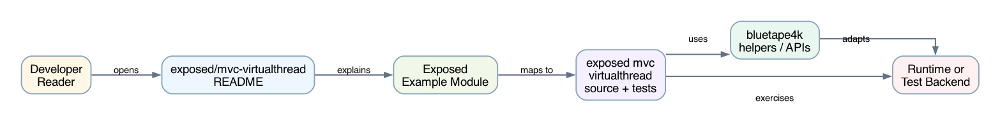
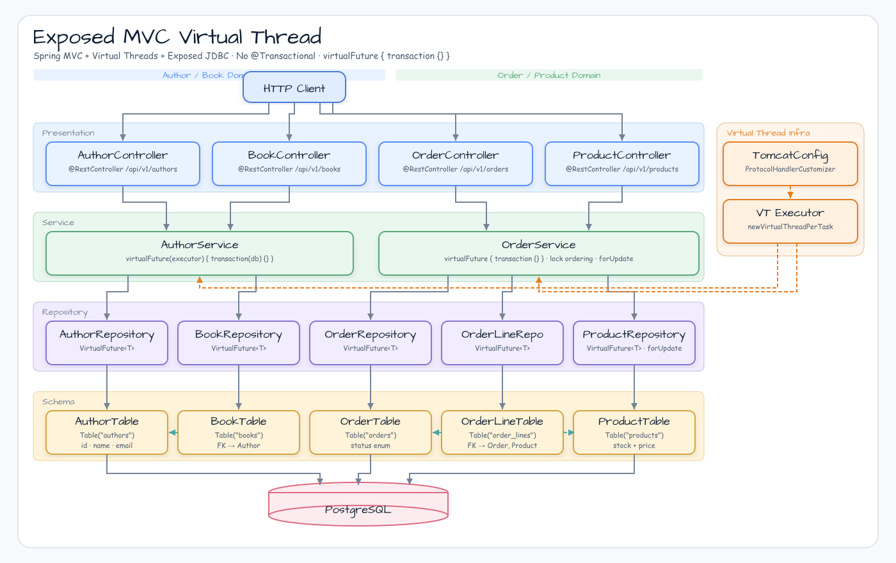

# exposed/mvc-virtualthread

[한국어](README.ko.md) | English

## Example Scenario

This example exercises **exposed/mvc-virtualthread** as a runnable Exposed data access workshop slice. It focuses on the path a developer would inspect first: configure the module, run the sample or tests, and observe the library or framework APIs that remove repetitive infrastructure code.

## Flow Diagram

1. Prepare the local runtime required by `exposed-mvc-virtualthread`.
2. Execute the application, controller, service, or test fixture that owns the example scenario.
3. Delegate repetitive infrastructure work to bluetape4k utilities or Spring/Kotlin integrations.
4. Assert the visible result through the sample output, HTTP response, repository state, metric, trace, or test expectation.

## Sequence Diagram

The core sequence is: caller or test fixture -> workshop adapter -> bluetape4k helper/API -> external runtime or in-memory backend -> assertion/response. When this module has a dedicated sequence asset, the image below shows that interaction order; otherwise the source tests are the authoritative executable sequence.

Spring MVC + Virtual Threads + Exposed JDBC — **no `@Transactional`**.

## Architecture





## Used bluetape4k Features

| Feature | Artifact | Code location | Benefit |
|---------|----------|---------------|---------|
| `KLogging` | `bluetape4k-logging` | Every service class | Lazy lambda logging |
| `virtualFuture(executor) { }` | `bluetape4k-virtualthread-api` | `AuthorService.kt`, `OrderService.kt` | Submits blocking JDBC work to VT executor — no coroutine/reactor needed |
| `ShutdownQueue.register(executor)` | `bluetape4k-virtualthread-api` | `TomcatConfig.kt` | Graceful shutdown of VT executor without manual lifecycle management |
| `bluetape4k-virtualthread-jdk21` | `bluetape4k-virtualthread-jdk21` | runtime classpath | JDK 21 virtual thread provider |
| `Fakers.faker` | `bluetape4k-junit5` | Test base classes | Deterministic fake data generation |
| `shouldBeEqualTo` matchers | `bluetape4k-assertions` | All test classes | Readable Kotlin-idiomatic assertions |
| `PostgreSQLServer.Launcher.postgres` | `bluetape4k-testcontainers` | `AbstractMvcVirtualthreadTest` | Singleton Testcontainers PostgreSQL — no `@Testcontainers` boilerplate |

## bluetape4k Before / After

### Virtual Thread DB execution

```kotlin
// Before — @Transactional with potential pinning risk under virtual threads
@Service
class AuthorService(private val repo: AuthorRepository) {
    @Transactional
    fun save(dto: AuthorDTO): AuthorDTO {
        return repo.insert(dto)      // synchronized monitor → pins the carrier thread
    }
}

// After — bluetape4k virtualFuture: explicit VT submission, no @Transactional
@Service
class AuthorService(
    private val repo: AuthorRepository,
    private val executor: ExecutorService,
) {
    fun save(dto: AuthorDTO): AuthorDTO =
        virtualFuture(executor) {
            transaction(db) { repo.insert(dto) }
        }.get()
}
```

### Executor lifecycle management

```kotlin
// Before — manual PreDestroy or ApplicationListener
@Bean
fun virtualThreadExecutor(): ExecutorService {
    val exec = Executors.newVirtualThreadPerTaskExecutor()
    // Remember to shut it down somewhere...
    return exec
}

// After — bluetape4k ShutdownQueue: zero-boilerplate graceful shutdown
@Bean
fun virtualThreadExecutor(): ExecutorService {
    val exec = Executors.newVirtualThreadPerTaskExecutor()
    ShutdownQueue.register(exec)   // automatically called on JVM shutdown
    return exec
}
```

## Key Patterns

- **VT Executor bean**: `@Bean fun virtualThreadExecutor(): ExecutorService` in `TomcatConfig` + `TomcatProtocolHandlerCustomizer`.
- **TX pattern**: `virtualFuture(executor) { transaction(db) { ... } }.get()` — NOT `@Transactional`.
- **Exception unwrapping**: `GlobalExceptionHandler` handles `ExecutionException`/`CompletionException` wrapping from `Future.get()`.
- **`@Transactional` free**: verified via `rg "@Transactional" src/main/` → 0 results.

## Running

```bash
./gradlew :exposed-mvc-virtualthread:bootRun
# http://localhost:8081/swagger-ui/index.html
```

## Tests

```bash
./gradlew :exposed-mvc-virtualthread:test
```

| Test Class | Coverage |
|-----------|---------|
| `AuthorControllerTest` | Author + Book CRUD |
| `ProductControllerTest` | Product CRUD |
| `OrderControllerTest` | Order place, cancel, 404/409 cases |
| `PlaceOrderRollbackTest` | Rollback on stock failure |
| `ConcurrentPlaceOrderTest` | N=10 VT threads, stock=1 → 1 success, 9 conflicts (409) |
