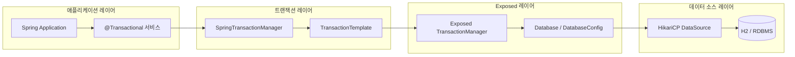
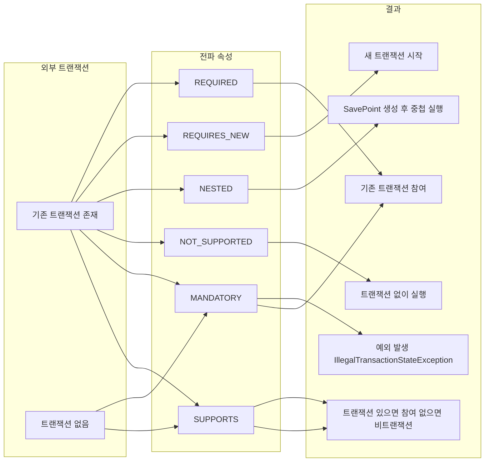

# Exposed + Spring Transaction

JetBrains Exposed ORM과 Spring Transaction을 통합하는 예제 모듈.
`SpringTransactionManager`를 통해 `@Transactional` 선언적 트랜잭션, 코루틴 트랜잭션, DAO 엔티티 관리, JdbcTemplate 혼용을 검증한다.

## 아키텍처 흐름

## 트랜잭션 전파 방식

## 주요 기능

- **SpringTransactionManager 통합**: Exposed `TransactionManager`를 Spring `PlatformTransactionManager`로 위임하여 `@Transactional` 선언적 트랜잭션 지원
- **다중 DataSource 지원**: 두 개 이상의 `SpringTransactionManager` 인스턴스를 동시에 사용하는 중첩 트랜잭션 시나리오 지원
- **트랜잭션 전파 6종 검증**: `REQUIRED`, `REQUIRES_NEW`, `NESTED`, `NOT_SUPPORTED`, `MANDATORY`, `SUPPORTS` 동작 확인
- **코루틴 트랜잭션**: `newSuspendedTransaction` / `suspendedTransactionAsync`를 사용한 코루틴 환경 트랜잭션 처리
- **DAO 엔티티 관리**: `UUIDEntity` 기반 Customer/Order 연관관계(Many-to-One) CRUD를 Spring 트랜잭션 컨텍스트에서 수행
- **JdbcTemplate 혼용**: Spring `JdbcTemplate`과 Exposed SQL DSL을 동일 트랜잭션 안에서 함께 사용
- **DataSource 프록시 호환**: `LazyConnectionDataSourceProxy`, `TransactionAwareDataSourceProxy`와의 커밋/롤백 동작 검증
- **Spring Boot AutoConfigure**: `exposed-spring-boot4-starter`의 자동 설정으로 `SpringTransactionManager`, `DatabaseInitializer` 빈 자동 등록 및 `DatabaseConfig` 커스터마이징 지원
- **트랜잭션 타임아웃 전파**: 외부 트랜잭션 타임아웃이 내부 중첩 트랜잭션에 올바르게 전파되는지 검증

## 테스트 구성

| 테스트 클래스 | 위치 | 설명 |
|---|---|---|
| `SpringTransactionManagerTest` | `spring/transaction` | `SpringTransactionManager` 단위 테스트. 커밋/롤백, 중첩 트랜잭션, 전파 속성 6종, DataSource 프록시 호환성, 타임아웃 전파를 Mock DataSource/Connection으로 검증 |
| `SpringCoroutineTest` | `spring/transaction` | `newSuspendedTransaction` + `suspendedTransactionAsync`를 사용한 코루틴 병렬 트랜잭션 검증. `@Transactional @Commit`과 함께 반복 실행 |
| `SpringTransactionEntityTest` | `spring/transaction` | `UUIDEntity` 기반 Customer-Order 도메인에서 `@Transactional` 서비스로 엔티티 생성/조회/연관관계 접근 검증 |
| `ExposedAutoConfigurationTest` | `spring/boot/autoconfigure` | Spring Boot AutoConfigure로 `SpringTransactionManager`, `DatabaseInitializer` 빈 자동 등록 및 `DatabaseConfig` 커스터마이징 검증 |
| `ExposedAutoConfigurationTestAutoGenerateDDL` | `spring/boot/autoconfigure` | `spring.exposed.generate-ddl=true` 설정 시 DDL 자동 생성 동작 검증 |
| `DatabaseInitializerTest` | `spring/boot` | `DatabaseInitializer`가 애플리케이션 시작 시 스키마를 올바르게 초기화하는지 검증 |
| `JdbcTemplateTest` | `spring/jdbc_template` | Spring `JdbcTemplate`과 Exposed SQL DSL을 동일 트랜잭션에서 혼용하는 네 가지 시나리오 검증 |
| `EntityUpdateTest` | `spring/transaction` | Spring 트랜잭션 컨텍스트에서 엔티티 업데이트 및 더티 체킹 동작 검증 |
| `ExposedTransactionManagerTest` | `spring/transaction` | Exposed 자체 `TransactionManager`와 Spring 트랜잭션 통합 동작 검증 |
| `SpringMultiContainerTransactionTest` | `spring/transaction` | 복수 데이터베이스 컨테이너 환경에서의 트랜잭션 격리 검증 |
| `SpringTransactionSingleConnectionTest` | `spring/transaction` | 단일 커넥션 재사용 시나리오 트랜잭션 동작 검증 |

## 참고

- [Exposed Spring Transaction — JetBrains 공식 문서](https://jetbrains.github.io/Exposed/spring-transaction.html)
- [exposed-spring-boot-starter GitHub](https://github.com/JetBrains/Exposed/tree/main/exposed-spring-boot-starter)
- [Spring PlatformTransactionManager](https://docs.spring.io/spring-framework/docs/current/javadoc-api/org/springframework/transaction/PlatformTransactionManager.html)
- [Spring 트랜잭션 전파 속성](https://docs.spring.io/spring-framework/reference/data-access/transaction/declarative/tx-propagation.html)
- [Exposed 코루틴 트랜잭션](https://jetbrains.github.io/Exposed/transactions.html#coroutine-transactions)
